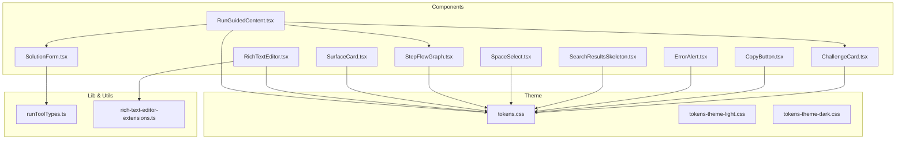
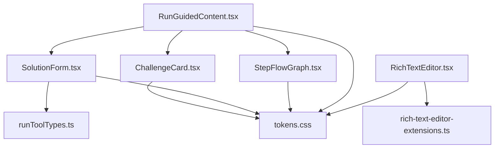
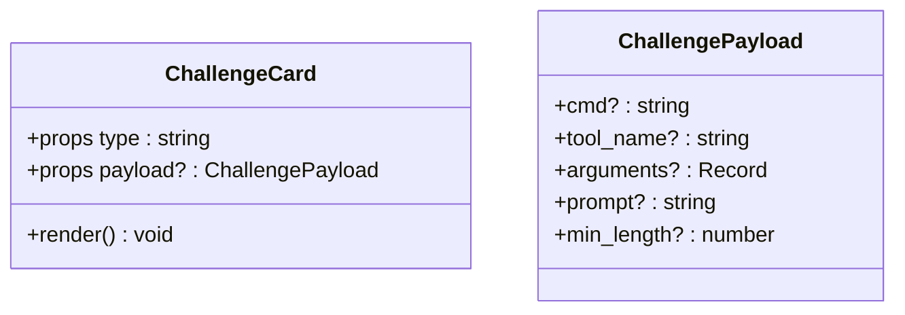
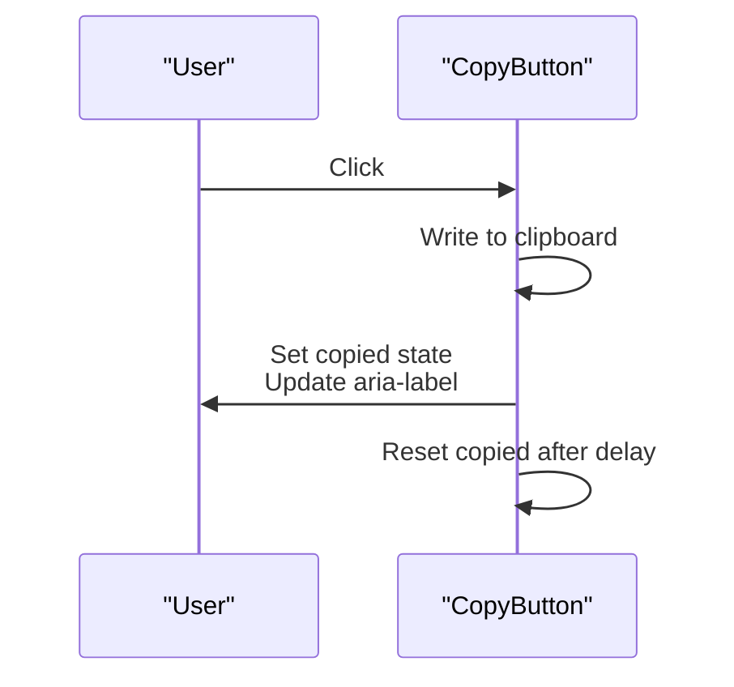
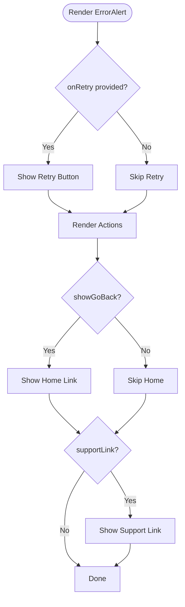
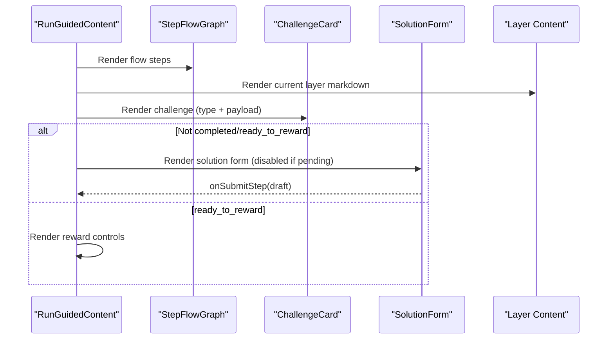
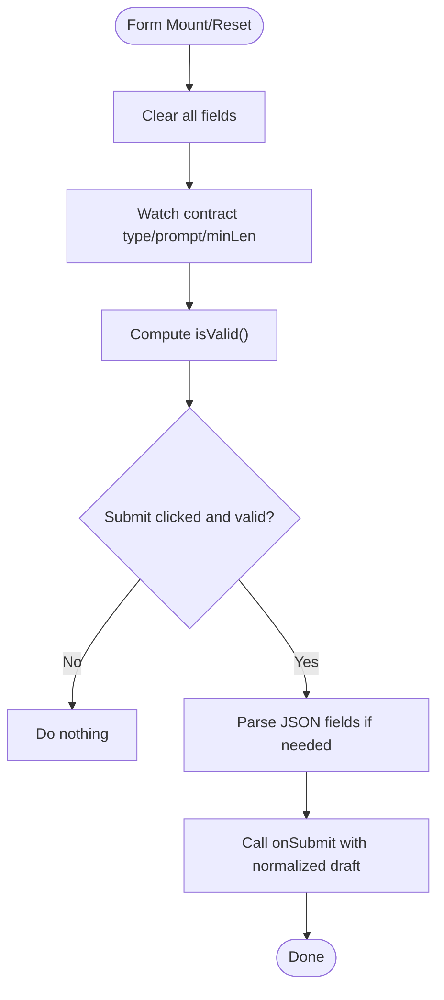
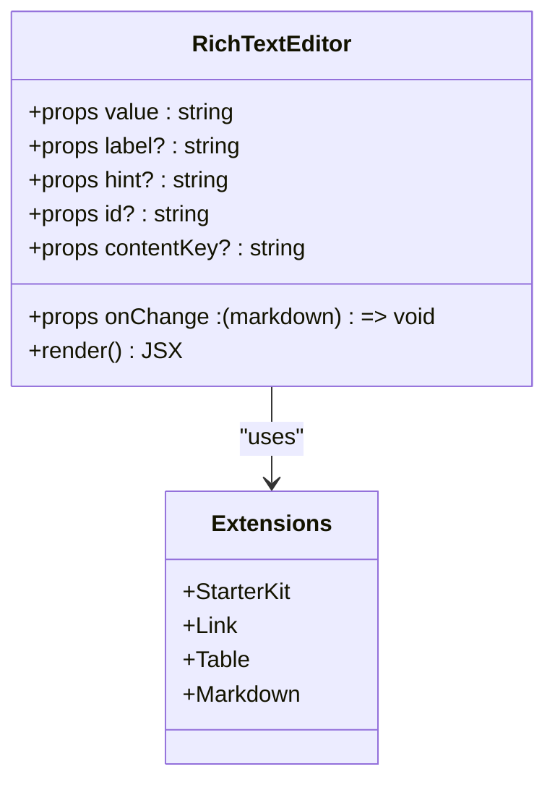
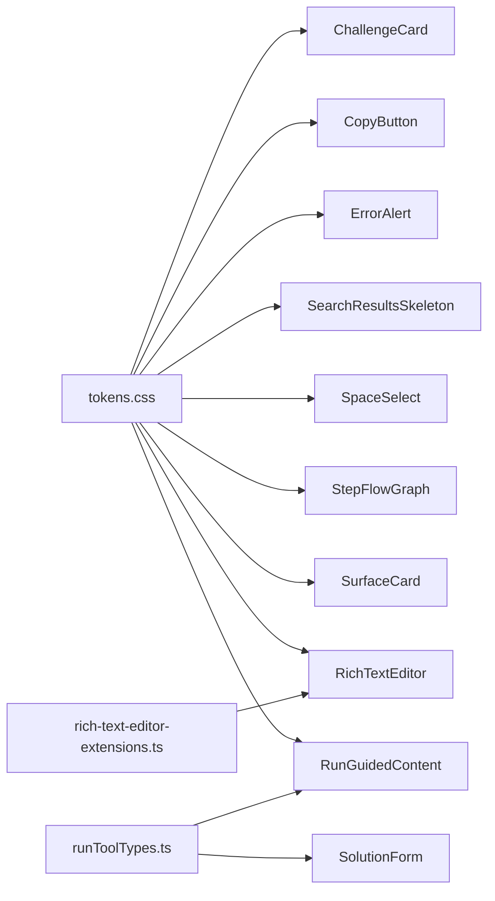

# UI Components

<cite>
**Referenced Files in This Document**
- [ChallengeCard.tsx](file://src/ui/components/ChallengeCard.tsx)
- [CopyButton.tsx](file://src/ui/components/CopyButton.tsx)
- [ErrorAlert.tsx](file://src/ui/components/ErrorAlert.tsx)
- [RunGuidedContent.tsx](file://src/ui/components/run/RunGuidedContent.tsx)
- [SolutionForm.tsx](file://src/ui/components/run/SolutionForm.tsx)
- [SearchResultsSkeleton.tsx](file://src/ui/components/SearchResultsSkeleton.tsx)
- [SpaceSelect.tsx](file://src/ui/components/SpaceSelect.tsx)
- [StepFlowGraph.tsx](file://src/ui/components/StepFlowGraph.tsx)
- [SurfaceCard.tsx](file://src/ui/components/SurfaceCard.tsx)
- [RichTextEditor.tsx](file://src/ui/components/RichTextEditor.tsx)
- [runToolTypes.ts](file://src/ui/lib/runToolTypes.ts)
- [rich-text-editor-extensions.ts](file://src/ui/utils/rich-text-editor-extensions.ts)
- [tokens.css](file://src/ui/theme/tokens.css)
- [tokens-theme-light.css](file://src/ui/theme/tokens-theme-light.css)
- [tokens-theme-dark.css](file://src/ui/theme/tokens-theme-dark.css)
</cite>

## Table of Contents
1. [Introduction](#introduction)
2. [Project Structure](#project-structure)
3. [Core Components](#core-components)
4. [Architecture Overview](#architecture-overview)
5. [Detailed Component Analysis](#detailed-component-analysis)
6. [Dependency Analysis](#dependency-analysis)
7. [Performance Considerations](#performance-considerations)
8. [Troubleshooting Guide](#troubleshooting-guide)
9. [Conclusion](#conclusion)
10. [Appendices](#appendices)

## Introduction
This document describes the KAIROS MCP UI component library and its reusable building blocks used across the run experience and authoring workflows. It focuses on the following components: ChallengeCard, CopyButton, ErrorAlert, RunGuidedContent, SolutionForm, SearchResultsSkeleton, SpaceSelect, StepFlowGraph, SurfaceCard, and RichTextEditor. For each component, we explain props, events, styling approaches, usage patterns, composition, state management, and integration with application state. Accessibility, responsiveness, customization, and best practices for extending components are also covered.

## Project Structure
The UI components live under src/ui/components and are organized by feature and domain:
- Domain-specific run components under src/ui/components/run
- Shared UI primitives under src/ui/components
- Theming and design tokens under src/ui/theme
- Editor utilities under src/ui/utils
- Types for run tooling under src/ui/lib

**Diagram sources**
- [ChallengeCard.tsx:1-60](file://src/ui/components/ChallengeCard.tsx#L1-L60)
- [CopyButton.tsx:1-39](file://src/ui/components/CopyButton.tsx#L1-L39)
- [ErrorAlert.tsx:1-71](file://src/ui/components/ErrorAlert.tsx#L1-L71)
- [RunGuidedContent.tsx:1-276](file://src/ui/components/run/RunGuidedContent.tsx#L1-L276)
- [SolutionForm.tsx:1-316](file://src/ui/components/run/SolutionForm.tsx#L1-L316)
- [SearchResultsSkeleton.tsx:1-24](file://src/ui/components/SearchResultsSkeleton.tsx#L1-L24)
- [SpaceSelect.tsx:1-67](file://src/ui/components/SpaceSelect.tsx#L1-L67)
- [StepFlowGraph.tsx:1-41](file://src/ui/components/StepFlowGraph.tsx#L1-L41)
- [SurfaceCard.tsx:1-26](file://src/ui/components/SurfaceCard.tsx#L1-L26)
- [RichTextEditor.tsx:1-266](file://src/ui/components/RichTextEditor.tsx#L1-L266)
- [runToolTypes.ts:1-10](file://src/ui/lib/runToolTypes.ts#L1-L10)
- [rich-text-editor-extensions.ts:1-28](file://src/ui/utils/rich-text-editor-extensions.ts#L1-L28)
- [tokens.css:1-12](file://src/ui/theme/tokens.css#L1-L12)
- [tokens-theme-light.css:1-47](file://src/ui/theme/tokens-theme-light.css#L1-L47)
- [tokens-theme-dark.css:1-47](file://src/ui/theme/tokens-theme-dark.css#L1-L47)

**Section sources**
- [ChallengeCard.tsx:1-60](file://src/ui/components/ChallengeCard.tsx#L1-L60)
- [CopyButton.tsx:1-39](file://src/ui/components/CopyButton.tsx#L1-L39)
- [ErrorAlert.tsx:1-71](file://src/ui/components/ErrorAlert.tsx#L1-L71)
- [RunGuidedContent.tsx:1-276](file://src/ui/components/run/RunGuidedContent.tsx#L1-L276)
- [SolutionForm.tsx:1-316](file://src/ui/components/run/SolutionForm.tsx#L1-L316)
- [SearchResultsSkeleton.tsx:1-24](file://src/ui/components/SearchResultsSkeleton.tsx#L1-L24)
- [SpaceSelect.tsx:1-67](file://src/ui/components/SpaceSelect.tsx#L1-L67)
- [StepFlowGraph.tsx:1-41](file://src/ui/components/StepFlowGraph.tsx#L1-L41)
- [SurfaceCard.tsx:1-26](file://src/ui/components/SurfaceCard.tsx#L1-L26)
- [RichTextEditor.tsx:1-266](file://src/ui/components/RichTextEditor.tsx#L1-L266)
- [runToolTypes.ts:1-10](file://src/ui/lib/runToolTypes.ts#L1-L10)
- [rich-text-editor-extensions.ts:1-28](file://src/ui/utils/rich-text-editor-extensions.ts#L1-L28)
- [tokens.css:1-12](file://src/ui/theme/tokens.css#L1-L12)
- [tokens-theme-light.css:1-47](file://src/ui/theme/tokens-theme-light.css#L1-L47)
- [tokens-theme-dark.css:1-47](file://src/ui/theme/tokens-theme-dark.css#L1-L47)

## Core Components
This section summarizes the primary components and their responsibilities.

- ChallengeCard: Renders a challenge card with type badges and payload details (e.g., command, tool, expected arguments, prompt, min length).
- CopyButton: Provides a single-button action to copy text to the clipboard with accessible labeling and feedback.
- ErrorAlert: Displays error messages with optional next action, retry callback, navigation links, and support link.
- RunGuidedContent: Orchestrates the guided run experience, including progress flow, current layer content, challenge presentation, solution form, reward collection, and history.
- SolutionForm: Collects and validates user-submittable run solutions per challenge type (shell, tensor, mcp, user_input, comment).
- SearchResultsSkeleton: Lightweight skeleton loader for search results list.
- SpaceSelect: Select control for spaces with optional “all spaces” option and type badges.
- StepFlowGraph: Visual step flow graph for run progression.
- SurfaceCard: Generic container card with title/subtitle and children.
- RichTextEditor: Markdown-safe editor built on Tiptap with a constrained toolbar and table support.

**Section sources**
- [ChallengeCard.tsx:16-60](file://src/ui/components/ChallengeCard.tsx#L16-L60)
- [CopyButton.tsx:4-39](file://src/ui/components/CopyButton.tsx#L4-L39)
- [ErrorAlert.tsx:4-71](file://src/ui/components/ErrorAlert.tsx#L4-L71)
- [RunGuidedContent.tsx:10-276](file://src/ui/components/run/RunGuidedContent.tsx#L10-L276)
- [SolutionForm.tsx:13-316](file://src/ui/components/run/SolutionForm.tsx#L13-L316)
- [SearchResultsSkeleton.tsx:5-24](file://src/ui/components/SearchResultsSkeleton.tsx#L5-L24)
- [SpaceSelect.tsx:4-67](file://src/ui/components/SpaceSelect.tsx#L4-L67)
- [StepFlowGraph.tsx:1-41](file://src/ui/components/StepFlowGraph.tsx#L1-L41)
- [SurfaceCard.tsx:3-26](file://src/ui/components/SurfaceCard.tsx#L3-L26)
- [RichTextEditor.tsx:200-266](file://src/ui/components/RichTextEditor.tsx#L200-L266)

## Architecture Overview
The components integrate with:
- Application state via hooks and typed run tooling (runToolTypes.ts)
- Theming via design tokens (CSS variables) applied consistently across components
- Internationalization via react-i18next
- Editor stack via Tiptap with curated extensions

**Diagram sources**
- [RunGuidedContent.tsx:1-276](file://src/ui/components/run/RunGuidedContent.tsx#L1-L276)
- [SolutionForm.tsx:1-316](file://src/ui/components/run/SolutionForm.tsx#L1-L316)
- [ChallengeCard.tsx:1-60](file://src/ui/components/ChallengeCard.tsx#L1-L60)
- [StepFlowGraph.tsx:1-41](file://src/ui/components/StepFlowGraph.tsx#L1-L41)
- [runToolTypes.ts:1-10](file://src/ui/lib/runToolTypes.ts#L1-L10)
- [RichTextEditor.tsx:1-266](file://src/ui/components/RichTextEditor.tsx#L1-L266)
- [rich-text-editor-extensions.ts:1-28](file://src/ui/utils/rich-text-editor-extensions.ts#L1-L28)
- [tokens.css:1-12](file://src/ui/theme/tokens.css#L1-L12)

## Detailed Component Analysis

### ChallengeCard
- Purpose: Display challenge metadata and payload in a consistent card layout.
- Props:
  - type: string (maps to label and badge class)
  - payload?: ChallengePayload (optional fields include cmd, tool_name, arguments, prompt, min_length)
- Events: None
- Styling: Uses CSS variables for colors, borders, radii, and badge colors keyed by type.
- Composition: Consumed by RunGuidedContent to render the current challenge.
- Accessibility: Uses semantic headings and monospace blocks for code-like content.
- Extensibility: Add new types via CHALLENGE_TYPE_LABEL and TYPE_BADGE_CLASS mappings.

**Diagram sources**
- [ChallengeCard.tsx:16-60](file://src/ui/components/ChallengeCard.tsx#L16-L60)

**Section sources**
- [ChallengeCard.tsx:1-60](file://src/ui/components/ChallengeCard.tsx#L1-L60)

### CopyButton
- Purpose: One-click copy-to-clipboard with accessible labeling and transient feedback.
- Props:
  - value: string (text to copy)
  - label: string (accessible label)
  - className?: string
- Events: None (uses onClick handler internally)
- State: Internal copied flag toggled after successful write.
- Accessibility: aria-label reflects current state; title provides tooltip.
- Best practices: Provide concise, unambiguous label; keep value short-lived if sensitive.

**Diagram sources**
- [CopyButton.tsx:13-39](file://src/ui/components/CopyButton.tsx#L13-L39)

**Section sources**
- [CopyButton.tsx:1-39](file://src/ui/components/CopyButton.tsx#L1-L39)

### ErrorAlert
- Purpose: Present errors with optional next action, retry callback, navigation, and support link.
- Props:
  - message: string
  - nextAction?: string
  - onRetry?: () => void
  - showGoBack?: boolean
  - supportLink?: string
- Events: onRetry callback invoked on button click.
- Accessibility: Alert role and readable labels; keyboard focus styles.
- Composition: Used across pages for consistent error UX.

**Diagram sources**
- [ErrorAlert.tsx:17-71](file://src/ui/components/ErrorAlert.tsx#L17-L71)

**Section sources**
- [ErrorAlert.tsx:1-71](file://src/ui/components/ErrorAlert.tsx#L1-L71)

### RunGuidedContent
- Purpose: Orchestrate the guided run experience, including progress, layer content, challenge, solution input, reward, and history.
- Props:
  - run: RunSession
  - rewardOutcome: "success" | "failure"
  - setRewardOutcome: (v: "success" | "failure") => void
  - rewardFeedback: string
  - setRewardFeedback: (v: string) => void
  - copyStatus: string | null
  - onCopy: (text: string) => void
  - onSubmitStep: (draft: Omit<RunSolutionSubmission, "nonce" | "proof_hash" | "previousProofHash">) => void
  - onReward: () => void
  - isForwardStepPending: boolean
  - isForwardStartPending: boolean
  - isRewardPending: boolean
- State: Derived from run session and local reward state.
- Composition: Composes StepFlowGraph, ChallengeCard, SolutionForm, and renders server messages/history.
- Integration: Uses runToolTypes for submission shape and runContractToChallengeCard for challenge rendering.

**Diagram sources**
- [RunGuidedContent.tsx:43-276](file://src/ui/components/run/RunGuidedContent.tsx#L43-L276)
- [SolutionForm.tsx:13-316](file://src/ui/components/run/SolutionForm.tsx#L13-L316)
- [ChallengeCard.tsx:25-60](file://src/ui/components/ChallengeCard.tsx#L25-L60)
- [StepFlowGraph.tsx:1-41](file://src/ui/components/StepFlowGraph.tsx#L1-L41)
- [runToolTypes.ts:4-6](file://src/ui/lib/runToolTypes.ts#L4-L6)

**Section sources**
- [RunGuidedContent.tsx:1-276](file://src/ui/components/run/RunGuidedContent.tsx#L1-L276)
- [runToolTypes.ts:1-10](file://src/ui/lib/runToolTypes.ts#L1-L10)

### SolutionForm
- Purpose: Collect and validate run solutions per challenge type.
- Props:
  - contract: RunContract
  - disabled?: boolean
  - onSubmit: (draft: DraftSolution) => void
- State: Local form state per challenge type (exitCode, stdout/stderr, tensor value, mcp args/result, user_input confirmation, comment).
- Validation: Type-specific validity checks; JSON parsing with error handling.
- Submission: Emits a normalized draft to parent via onSubmit.

**Diagram sources**
- [SolutionForm.tsx:56-131](file://src/ui/components/run/SolutionForm.tsx#L56-L131)
- [runToolTypes.ts:4-6](file://src/ui/lib/runToolTypes.ts#L4-L6)

**Section sources**
- [SolutionForm.tsx:1-316](file://src/ui/components/run/SolutionForm.tsx#L1-L316)
- [runToolTypes.ts:1-10](file://src/ui/lib/runToolTypes.ts#L1-L10)

### SearchResultsSkeleton
- Purpose: Provide lightweight skeleton placeholders during search load to avoid layout shift.
- Props: None
- Styling: Uses animated pulse backgrounds and minimal structure.

**Section sources**
- [SearchResultsSkeleton.tsx:1-24](file://src/ui/components/SearchResultsSkeleton.tsx#L1-L24)

### SpaceSelect
- Purpose: Select a space with optional “all spaces” option and type badges.
- Props:
  - id: string
  - spaces: SpaceInfo[] | undefined
  - value: string
  - onChange: (spaceIdOrEmpty: string) => void
  - includeAllOption?: boolean
  - disabled?: boolean
  - aria-describedby?: string
- Rendering: Maps SpaceInfo to option elements; optional first option for “all”.

**Section sources**
- [SpaceSelect.tsx:4-67](file://src/ui/components/SpaceSelect.tsx#L4-L67)

### StepFlowGraph
- Purpose: Visualize run flow with labeled nodes and current step emphasis.
- Props:
  - steps: { label: string }[]
  - currentIndex?: number
- Rendering: Builds nodes array including Start and Attest; highlights current step.

**Section sources**
- [StepFlowGraph.tsx:1-41](file://src/ui/components/StepFlowGraph.tsx#L1-L41)

### SurfaceCard
- Purpose: Generic card container with title, optional subtitle, and children.
- Props:
  - title: string
  - subtitle?: string
  - children: ReactNode
  - className?: string
- Styling: Consistent surface elevation and padding.

**Section sources**
- [SurfaceCard.tsx:3-26](file://src/ui/components/SurfaceCard.tsx#L3-L26)

### RichTextEditor
- Purpose: Markdown-safe editor for protocol authoring with a constrained toolbar and table support.
- Props:
  - value: string (markdown)
  - onChange: (markdown: string) => void
  - label?: string
  - hint?: string
  - id?: string
  - contentKey?: string (forces remount when changed)
- Internals:
  - Uses @tiptap/react with createRichTextEditorExtensions
  - Editor content synced via refs to avoid stale closures
  - Custom CSS class applied to editor content
- Accessibility: Proper labels, roles, and keyboard navigation via Tiptap.

**Diagram sources**
- [RichTextEditor.tsx:200-266](file://src/ui/components/RichTextEditor.tsx#L200-L266)
- [rich-text-editor-extensions.ts:8-27](file://src/ui/utils/rich-text-editor-extensions.ts#L8-L27)

**Section sources**
- [RichTextEditor.tsx:1-266](file://src/ui/components/RichTextEditor.tsx#L1-L266)
- [rich-text-editor-extensions.ts:1-28](file://src/ui/utils/rich-text-editor-extensions.ts#L1-L28)

## Dependency Analysis
- Theming: All components rely on CSS variables from tokens.css and theme overrides.
- Internationalization: Components use react-i18next for labels and messages.
- Editor stack: RichTextEditor depends on Tiptap and custom extensions.
- Run tooling: SolutionForm and RunGuidedContent depend on runToolTypes for shapes and submission.

**Diagram sources**
- [tokens.css:1-12](file://src/ui/theme/tokens.css#L1-L12)
- [ChallengeCard.tsx:1-60](file://src/ui/components/ChallengeCard.tsx#L1-L60)
- [CopyButton.tsx:1-39](file://src/ui/components/CopyButton.tsx#L1-L39)
- [ErrorAlert.tsx:1-71](file://src/ui/components/ErrorAlert.tsx#L1-L71)
- [SearchResultsSkeleton.tsx:1-24](file://src/ui/components/SearchResultsSkeleton.tsx#L1-L24)
- [SpaceSelect.tsx:1-67](file://src/ui/components/SpaceSelect.tsx#L1-L67)
- [StepFlowGraph.tsx:1-41](file://src/ui/components/StepFlowGraph.tsx#L1-L41)
- [SurfaceCard.tsx:1-26](file://src/ui/components/SurfaceCard.tsx#L1-L26)
- [RichTextEditor.tsx:1-266](file://src/ui/components/RichTextEditor.tsx#L1-L266)
- [RunGuidedContent.tsx:1-276](file://src/ui/components/run/RunGuidedContent.tsx#L1-L276)
- [SolutionForm.tsx:1-316](file://src/ui/components/run/SolutionForm.tsx#L1-L316)
- [runToolTypes.ts:1-10](file://src/ui/lib/runToolTypes.ts#L1-L10)
- [rich-text-editor-extensions.ts:1-28](file://src/ui/utils/rich-text-editor-extensions.ts#L1-L28)

**Section sources**
- [tokens.css:1-12](file://src/ui/theme/tokens.css#L1-L12)
- [runToolTypes.ts:1-10](file://src/ui/lib/runToolTypes.ts#L1-L10)
- [rich-text-editor-extensions.ts:1-28](file://src/ui/utils/rich-text-editor-extensions.ts#L1-L28)

## Performance Considerations
- Avoid unnecessary re-renders by passing memoized callbacks and stable prop references.
- For RichTextEditor, use contentKey to force remounts only when content changes externally.
- Defer heavy computations inside effects; keep derived state minimal.
- Use Skeleton loaders (SearchResultsSkeleton) to maintain perceived performance during async operations.

## Troubleshooting Guide
- Clipboard failures: CopyButton silently ignores errors; ensure HTTPS context and user gesture requirements are met.
- Form validation errors: SolutionForm displays caught errors; verify JSON inputs conform to expected shapes.
- Editor not updating: Ensure contentKey changes when replacing content externally; confirm value !== last emitted markdown to trigger updates.
- Accessibility: Verify aria-labels and roles; ensure focus styles are visible and keyboard operable.

**Section sources**
- [CopyButton.tsx:17-25](file://src/ui/components/CopyButton.tsx#L17-L25)
- [SolutionForm.tsx:128-131](file://src/ui/components/run/SolutionForm.tsx#L128-L131)
- [RichTextEditor.tsx:235-249](file://src/ui/components/RichTextEditor.tsx#L235-L249)

## Conclusion
The KAIROS MCP UI component library provides a cohesive set of primitives for run orchestration and content authoring. Components are designed with consistent theming, accessibility, and internationalization in mind. They integrate cleanly with application state and tooling types, enabling predictable composition and extensibility.

## Appendices

### Styling and Theming
- Design tokens define semantic color variables and spacing; components consume these via CSS variables.
- Themes switch via html[data-theme="dark"] or defaults; ensure proper theme initialization.

**Section sources**
- [tokens.css:1-12](file://src/ui/theme/tokens.css#L1-L12)
- [tokens-theme-light.css:1-47](file://src/ui/theme/tokens-theme-light.css#L1-L47)
- [tokens-theme-dark.css:1-47](file://src/ui/theme/tokens-theme-dark.css#L1-L47)

### Prop Validation and TypeScript
- runToolTypes.ts centralizes run contract and submission types for compile-time safety.
- Components accept strongly typed props; ensure consumers pass validated data.

**Section sources**
- [runToolTypes.ts:1-10](file://src/ui/lib/runToolTypes.ts#L1-L10)