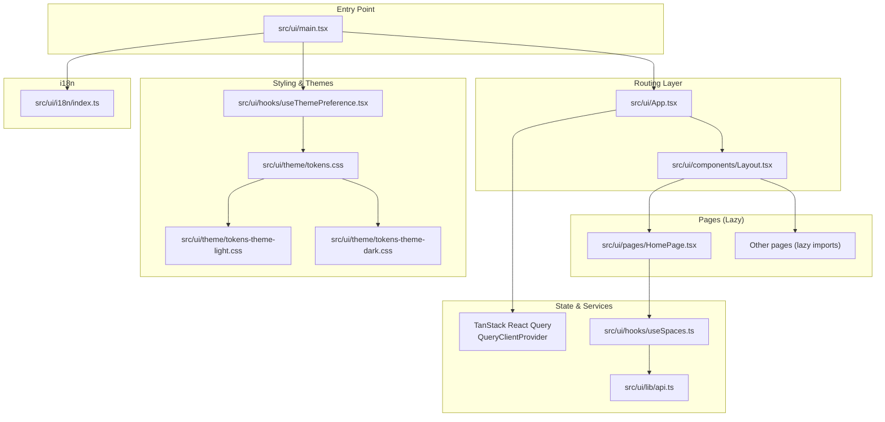
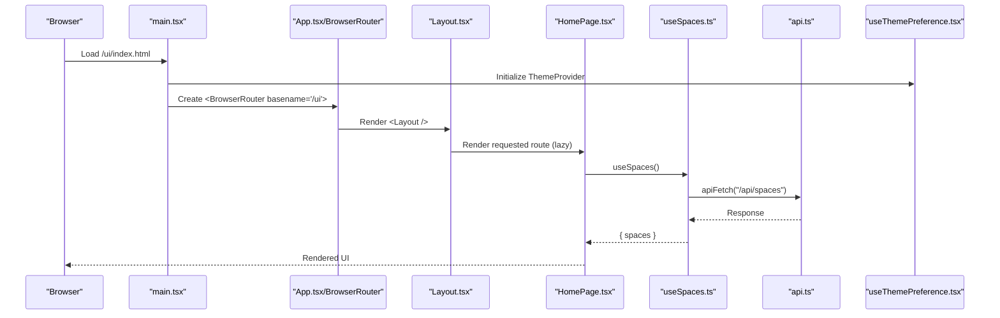
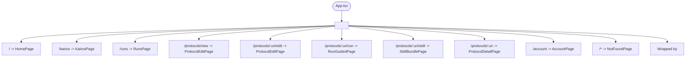
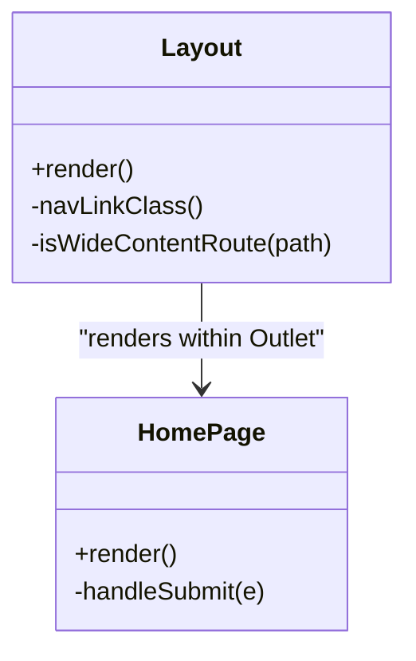
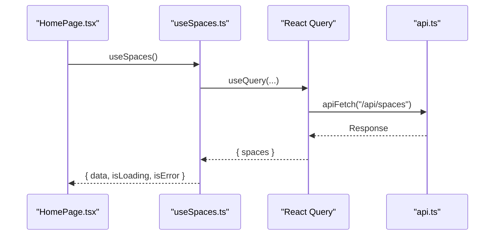
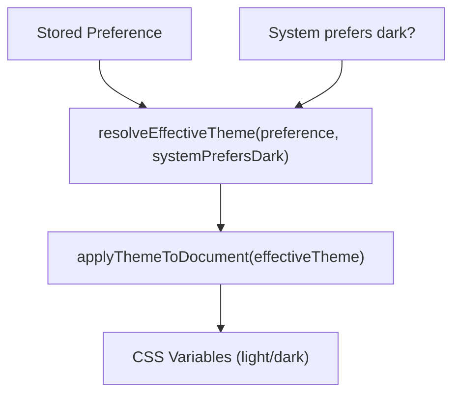
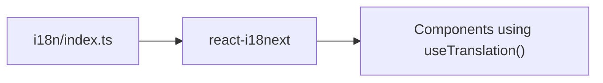
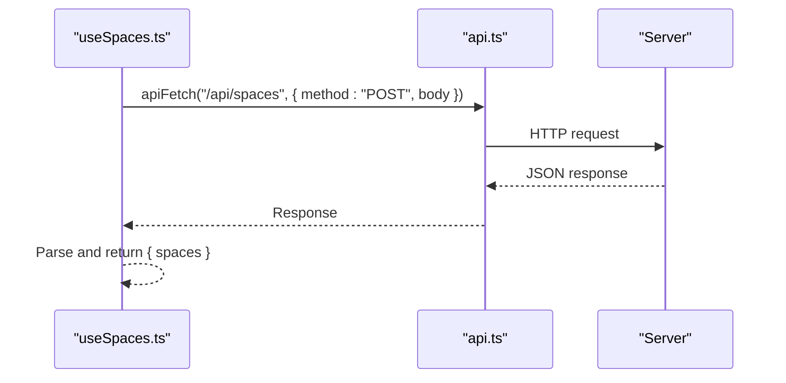
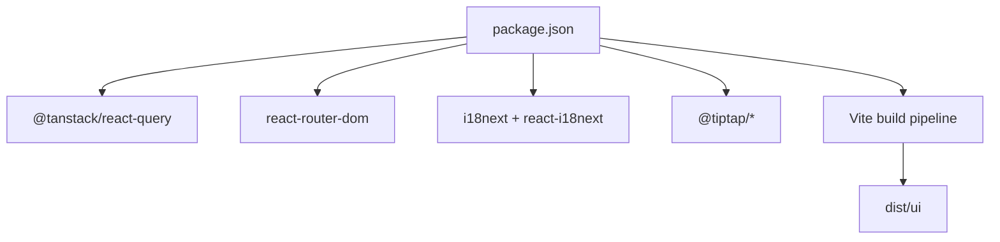

# Web Application

<cite>
**Referenced Files in This Document**
- [src/ui/main.tsx](file://src/ui/main.tsx)
- [src/ui/App.tsx](file://src/ui/App.tsx)
- [src/ui/components/Layout.tsx](file://src/ui/components/Layout.tsx)
- [src/ui/pages/HomePage.tsx](file://src/ui/pages/HomePage.tsx)
- [vite.config.ts](file://vite.config.ts)
- [src/ui/hooks/useThemePreference.tsx](file://src/ui/hooks/useThemePreference.tsx)
- [src/ui/i18n/index.ts](file://src/ui/i18n/index.ts)
- [src/ui/theme/tokens.css](file://src/ui/theme/tokens.css)
- [src/ui/theme/tokens-theme-light.css](file://src/ui/theme/tokens-theme-light.css)
- [src/ui/theme/tokens-theme-dark.css](file://src/ui/theme/tokens-theme-dark.css)
- [src/ui/components/SpaceSelect.tsx](file://src/ui/components/SpaceSelect.tsx)
- [src/ui/hooks/useSpaces.ts](file://src/ui/hooks/useSpaces.ts)
- [src/ui/lib/api.ts](file://src/ui/lib/api.ts)
- [src/ui/utils/browse-adapters.ts](file://src/ui/utils/browse-adapters.ts)
- [package.json](file://package.json)
</cite>

## Table of Contents
1. [Introduction](#introduction)
2. [Project Structure](#project-structure)
3. [Core Components](#core-components)
4. [Architecture Overview](#architecture-overview)
5. [Detailed Component Analysis](#detailed-component-analysis)
6. [Dependency Analysis](#dependency-analysis)
7. [Performance Considerations](#performance-considerations)
8. [Troubleshooting Guide](#troubleshooting-guide)
9. [Conclusion](#conclusion)
10. [Appendices](#appendices)

## Introduction
This document describes the KAIROS MCP React web application’s architecture and runtime behavior. It focuses on route-level code splitting, component hierarchy, state management patterns, routing with lazy-loaded pages, layout and navigation, theming, internationalization, component composition, responsive design, accessibility, the application entry point, browser router configuration, and performance optimizations. It also outlines integration patterns with backend services via a dedicated API client.

## Project Structure
The frontend is a Vite-built React application located under src/ui. The build targets a static site served under /ui by the backend. Routing is handled by React Router DOM with route-level code splitting. Theming and design tokens are centralized, and internationalization is powered by i18next. State management for remote data leverages TanStack React Query.



**Diagram sources**
- [src/ui/main.tsx:1-20](file://src/ui/main.tsx#L1-L20)
- [src/ui/App.tsx:1-133](file://src/ui/App.tsx#L1-L133)
- [src/ui/components/Layout.tsx:1-109](file://src/ui/components/Layout.tsx#L1-L109)
- [src/ui/pages/HomePage.tsx:1-132](file://src/ui/pages/HomePage.tsx#L1-L132)
- [src/ui/lib/api.ts:1-14](file://src/ui/lib/api.ts#L1-L14)
- [src/ui/hooks/useSpaces.ts:1-48](file://src/ui/hooks/useSpaces.ts#L1-L48)
- [src/ui/theme/tokens.css:1-12](file://src/ui/theme/tokens.css#L1-L12)
- [src/ui/theme/tokens-theme-light.css:1-47](file://src/ui/theme/tokens-theme-light.css#L1-L47)
- [src/ui/theme/tokens-theme-dark.css:1-47](file://src/ui/theme/tokens-theme-dark.css#L1-L47)
- [src/ui/hooks/useThemePreference.tsx:1-149](file://src/ui/hooks/useThemePreference.tsx#L1-L149)
- [src/ui/i18n/index.ts:1-13](file://src/ui/i18n/index.ts#L1-L13)

**Section sources**
- [src/ui/main.tsx:1-20](file://src/ui/main.tsx#L1-L20)
- [src/ui/App.tsx:1-133](file://src/ui/App.tsx#L1-L133)
- [vite.config.ts:1-44](file://vite.config.ts#L1-L44)

## Core Components
- Application entry point initializes React root, React Query, theme provider, and i18n.
- App wraps routes in a browser router with basename configured for /ui.
- Route-level code splitting ensures each page is lazy-loaded.
- Layout composes sidebar navigation, main content area, and skip link for accessibility.
- HomePage demonstrates search, navigation, and usage of useSpaces hook.
- ThemePreference manages theme selection, persistence, and system preference detection.
- i18n initializes English resources and integrates with React.
- Design tokens define color, spacing, and typography variables for light/dark themes.
- SpaceSelect and SpaceTypeBadge provide accessible UI for space selection and badges.
- useSpaces encapsulates fetching spaces via the API client.

**Section sources**
- [src/ui/main.tsx:1-20](file://src/ui/main.tsx#L1-L20)
- [src/ui/App.tsx:1-133](file://src/ui/App.tsx#L1-L133)
- [src/ui/components/Layout.tsx:1-109](file://src/ui/components/Layout.tsx#L1-L109)
- [src/ui/pages/HomePage.tsx:1-132](file://src/ui/pages/HomePage.tsx#L1-L132)
- [src/ui/hooks/useThemePreference.tsx:1-149](file://src/ui/hooks/useThemePreference.tsx#L1-L149)
- [src/ui/i18n/index.ts:1-13](file://src/ui/i18n/index.ts#L1-L13)
- [src/ui/theme/tokens.css:1-12](file://src/ui/theme/tokens.css#L1-L12)
- [src/ui/theme/tokens-theme-light.css:1-47](file://src/ui/theme/tokens-theme-light.css#L1-L47)
- [src/ui/theme/tokens-theme-dark.css:1-47](file://src/ui/theme/tokens-theme-dark.css#L1-L47)
- [src/ui/components/SpaceSelect.tsx:1-67](file://src/ui/components/SpaceSelect.tsx#L1-L67)
- [src/ui/hooks/useSpaces.ts:1-48](file://src/ui/hooks/useSpaces.ts#L1-L48)
- [src/ui/lib/api.ts:1-14](file://src/ui/lib/api.ts#L1-L14)

## Architecture Overview
The UI is a single-page application built with React and Vite. Routing is handled by React Router DOM with route-level code splitting. Data fetching uses TanStack React Query with a custom apiFetch wrapper. Theming is controlled via a theme preference hook and CSS custom properties. Internationalization is initialized at startup. The build emits assets under /ui with a strict CSP policy requiring inlined images to be emitted as assets.



**Diagram sources**
- [src/ui/main.tsx:1-20](file://src/ui/main.tsx#L1-L20)
- [src/ui/App.tsx:126-133](file://src/ui/App.tsx#L126-L133)
- [src/ui/components/Layout.tsx:11-109](file://src/ui/components/Layout.tsx#L11-L109)
- [src/ui/pages/HomePage.tsx:10-132](file://src/ui/pages/HomePage.tsx#L10-L132)
- [src/ui/hooks/useSpaces.ts:40-47](file://src/ui/hooks/useSpaces.ts#L40-L47)
- [src/ui/lib/api.ts:3-13](file://src/ui/lib/api.ts#L3-L13)
- [src/ui/hooks/useThemePreference.tsx:137-149](file://src/ui/hooks/useThemePreference.tsx#L137-L149)

## Detailed Component Analysis

### Routing and Navigation
- BrowserRouter is configured with basename "/ui".
- Route tree defines nested routes under Layout, including index, kairos, runs, protocols, account, and a catch-all not-found route.
- Each page is lazy-loaded using React.lazy and rendered inside Suspense with a fallback spinner.
- Layout computes main content width based on route path and provides a skip link and navigation links.



**Diagram sources**
- [src/ui/App.tsx:37-124](file://src/ui/App.tsx#L37-L124)
- [src/ui/components/Layout.tsx:11-109](file://src/ui/components/Layout.tsx#L11-L109)

**Section sources**
- [src/ui/App.tsx:1-133](file://src/ui/App.tsx#L1-L133)
- [src/ui/components/Layout.tsx:1-109](file://src/ui/components/Layout.tsx#L1-L109)

### Layout and Navigation
- Sidebar navigation uses NavLink with active state styling and keyboard accessibility.
- Main content area dynamically adjusts max width depending on route (wide vs narrow).
- Skip link improves keyboard accessibility by jumping to the main content.



**Diagram sources**
- [src/ui/components/Layout.tsx:11-109](file://src/ui/components/Layout.tsx#L11-L109)
- [src/ui/pages/HomePage.tsx:10-132](file://src/ui/pages/HomePage.tsx#L10-L132)

**Section sources**
- [src/ui/components/Layout.tsx:1-109](file://src/ui/components/Layout.tsx#L1-L109)
- [src/ui/pages/HomePage.tsx:1-132](file://src/ui/pages/HomePage.tsx#L1-L132)

### State Management Patterns
- Remote data is managed with TanStack React Query. The useSpaces hook encapsulates fetching spaces from /api/spaces with caching and invalidation-friendly query keys.
- apiFetch centralizes HTTP behavior, including content-type and credential handling.



**Diagram sources**
- [src/ui/pages/HomePage.tsx:10-132](file://src/ui/pages/HomePage.tsx#L10-L132)
- [src/ui/hooks/useSpaces.ts:40-47](file://src/ui/hooks/useSpaces.ts#L40-L47)
- [src/ui/lib/api.ts:3-13](file://src/ui/lib/api.ts#L3-L13)

**Section sources**
- [src/ui/hooks/useSpaces.ts:1-48](file://src/ui/hooks/useSpaces.ts#L1-L48)
- [src/ui/lib/api.ts:1-14](file://src/ui/lib/api.ts#L1-L14)

### Theming Capabilities
- ThemePreference supports explicit light/dark choices and system preference mode.
- Effective theme is derived from preference and system dark mode detection.
- Theme is applied to documentElement attributes and color-scheme property.
- Design tokens are defined in CSS custom properties and imported conditionally for light/dark themes.



**Diagram sources**
- [src/ui/hooks/useThemePreference.tsx:26-60](file://src/ui/hooks/useThemePreference.tsx#L26-L60)
- [src/ui/theme/tokens.css:1-12](file://src/ui/theme/tokens.css#L1-L12)
- [src/ui/theme/tokens-theme-light.css:5-47](file://src/ui/theme/tokens-theme-light.css#L5-L47)
- [src/ui/theme/tokens-theme-dark.css:5-47](file://src/ui/theme/tokens-theme-dark.css#L5-L47)

**Section sources**
- [src/ui/hooks/useThemePreference.tsx:1-149](file://src/ui/hooks/useThemePreference.tsx#L1-L149)
- [src/ui/theme/tokens.css:1-12](file://src/ui/theme/tokens.css#L1-L12)
- [src/ui/theme/tokens-theme-light.css:1-47](file://src/ui/theme/tokens-theme-light.css#L1-L47)
- [src/ui/theme/tokens-theme-dark.css:1-47](file://src/ui/theme/tokens-theme-dark.css#L1-L47)

### Internationalization Support
- i18n is initialized with English resources and React integration.
- Components use useTranslation to render localized strings.



**Diagram sources**
- [src/ui/i18n/index.ts:1-13](file://src/ui/i18n/index.ts#L1-L13)

**Section sources**
- [src/ui/i18n/index.ts:1-13](file://src/ui/i18n/index.ts#L1-L13)
- [src/ui/pages/HomePage.tsx:10-132](file://src/ui/pages/HomePage.tsx#L10-L132)

### Component Composition Patterns
- Layout composes navigation and main content area.
- SpaceSelect renders a native select with accessible labeling and optional “all spaces” option.
- SpaceTypeBadge displays semantic badges based on space type with localized labels.
- HomePage composes SurfaceCard, SpaceSelect, and links to present a cohesive UX.

```mermaid
classDiagram
class SpaceSelect {
+props : SpaceSelectProps
+render()
}
class SpaceTypeBadge {
+props : { type }
+render()
}
class HomePage {
+render()
}
HomePage --> SpaceSelect : "uses"
SpaceSelect --> SpaceTypeBadge : "uses"
```

**Diagram sources**
- [src/ui/components/SpaceSelect.tsx:22-67](file://src/ui/components/SpaceSelect.tsx#L22-L67)
- [src/ui/pages/HomePage.tsx:10-132](file://src/ui/pages/HomePage.tsx#L10-L132)

**Section sources**
- [src/ui/components/SpaceSelect.tsx:1-67](file://src/ui/components/SpaceSelect.tsx#L1-L67)
- [src/ui/pages/HomePage.tsx:1-132](file://src/ui/pages/HomePage.tsx#L1-L132)

### Responsive Design Principles
- Layout uses CSS custom properties for spacing and typography.
- Main content max-width adapts based on route (wide for protocols/runs, narrow otherwise).
- Grid layouts adapt columns based on screen size (e.g., two-column on small screens, three-column on larger).
- Inputs and buttons maintain minimum touch targets and focus styles.

**Section sources**
- [src/ui/components/Layout.tsx:23-25](file://src/ui/components/Layout.tsx#L23-L25)
- [src/ui/pages/HomePage.tsx:66-91](file://src/ui/pages/HomePage.tsx#L66-L91)

### Accessibility Features
- Skip link to jump to main content.
- Proper labels and aria-describedby for form controls.
- Focus management with outline styles and focus-visible utilities.
- Semantic headings and landmarks.

**Section sources**
- [src/ui/components/Layout.tsx:31-33](file://src/ui/components/Layout.tsx#L31-L33)
- [src/ui/pages/HomePage.tsx:30-63](file://src/ui/pages/HomePage.tsx#L30-L63)

### Backend Integration Patterns
- apiFetch constructs absolute URLs when needed and standardizes headers and credentials.
- useSpaces posts to /api/spaces with include_adapter_titles option.
- browse-adapters utilities flatten and deduplicate adapters across spaces for browsing.



**Diagram sources**
- [src/ui/hooks/useSpaces.ts:24-38](file://src/ui/hooks/useSpaces.ts#L24-L38)
- [src/ui/lib/api.ts:3-13](file://src/ui/lib/api.ts#L3-L13)

**Section sources**
- [src/ui/lib/api.ts:1-14](file://src/ui/lib/api.ts#L1-L14)
- [src/ui/hooks/useSpaces.ts:1-48](file://src/ui/hooks/useSpaces.ts#L1-L48)
- [src/ui/utils/browse-adapters.ts:1-63](file://src/ui/utils/browse-adapters.ts#L1-L63)

## Dependency Analysis
- Runtime dependencies include React, React Router DOM, TanStack React Query, i18next, tiptap, and others.
- Build-time dependencies include Vite, @vitejs/plugin-react, Tailwind PostCSS, TypeScript, and testing frameworks.
- The UI build is configured to output under dist/ui with base "/ui/" and strict asset inlining policy to satisfy CSP.



**Diagram sources**
- [package.json:117-149](file://package.json#L117-L149)
- [vite.config.ts:10-44](file://vite.config.ts#L10-L44)

**Section sources**
- [package.json:117-149](file://package.json#L117-L149)
- [vite.config.ts:1-44](file://vite.config.ts#L1-L44)

## Performance Considerations
- Route-level code splitting keeps initial bundle small; each page is lazy-loaded.
- Vite build config enables code splitting groups for React, tiptap, and vendor libraries.
- assetsInlineLimit is set to 0 to emit assets under /ui/assets/* to satisfy CSP img-src 'self'.
- chunkSizeWarningLimit is tuned to detect oversized chunks early.
- React Query caching reduces redundant network requests.

Recommendations:
- Monitor chunk sizes and split further if needed.
- Consider preloading critical resources for frequently visited routes.
- Keep theme and i18n initialization minimal and avoid unnecessary re-renders.

**Section sources**
- [src/ui/App.tsx:5-26](file://src/ui/App.tsx#L5-L26)
- [vite.config.ts:20-42](file://vite.config.ts#L20-L42)
- [src/ui/main.tsx:9-19](file://src/ui/main.tsx#L9-L19)

## Troubleshooting Guide
Common issues and resolutions:
- Theme not applying: Verify data-theme attribute on documentElement and color-scheme property. Confirm theme preference storage and media query listeners.
- i18n strings not rendering: Ensure i18n initialization runs before components using useTranslation.
- API errors: Check apiFetch behavior and network tab; confirm credentials and Content-Type headers.
- Route not found: Confirm route definitions and basename alignment with backend serving path.
- CSP violations for images: Assets must be emitted under /ui/assets/* due to CSP img-src 'self'.

**Section sources**
- [src/ui/hooks/useThemePreference.tsx:53-60](file://src/ui/hooks/useThemePreference.tsx#L53-L60)
- [src/ui/i18n/index.ts:5-12](file://src/ui/i18n/index.ts#L5-L12)
- [src/ui/lib/api.ts:3-13](file://src/ui/lib/api.ts#L3-L13)
- [src/ui/App.tsx:128-131](file://src/ui/App.tsx#L128-L131)
- [vite.config.ts:21-22](file://vite.config.ts#L21-L22)

## Conclusion
The KAIROS MCP React web application employs modern frontend practices: route-level code splitting, centralized theming with design tokens, robust internationalization, and reactive state management with TanStack Query. The layout and navigation emphasize accessibility and responsive design. The build pipeline aligns with CSP requirements and performance goals, while integration with backend services is streamlined via a focused API client.

## Appendices

### Example Usage References
- Lazy route definition and Suspense fallback: [src/ui/App.tsx:5-34](file://src/ui/App.tsx#L5-L34)
- BrowserRouter with basename: [src/ui/App.tsx:128-131](file://src/ui/App.tsx#L128-L131)
- Layout navigation and main area sizing: [src/ui/components/Layout.tsx:58-104](file://src/ui/components/Layout.tsx#L58-L104)
- HomePage search and navigation: [src/ui/pages/HomePage.tsx:15-20](file://src/ui/pages/HomePage.tsx#L15-L20)
- Theme preference hooks and application: [src/ui/hooks/useThemePreference.tsx:137-149](file://src/ui/hooks/useThemePreference.tsx#L137-L149)
- i18n initialization: [src/ui/i18n/index.ts:5-12](file://src/ui/i18n/index.ts#L5-L12)
- Design tokens import: [src/ui/theme/tokens.css:9-11](file://src/ui/theme/tokens.css#L9-L11)
- SpaceSelect and SpaceTypeBadge: [src/ui/components/SpaceSelect.tsx:22-67](file://src/ui/components/SpaceSelect.tsx#L22-L67)
- useSpaces hook and apiFetch: [src/ui/hooks/useSpaces.ts:40-47](file://src/ui/hooks/useSpaces.ts#L40-L47), [src/ui/lib/api.ts:3-13](file://src/ui/lib/api.ts#L3-L13)
- Vite build configuration: [vite.config.ts:10-44](file://vite.config.ts#L10-L44)