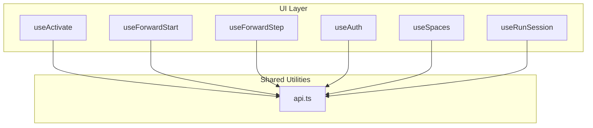
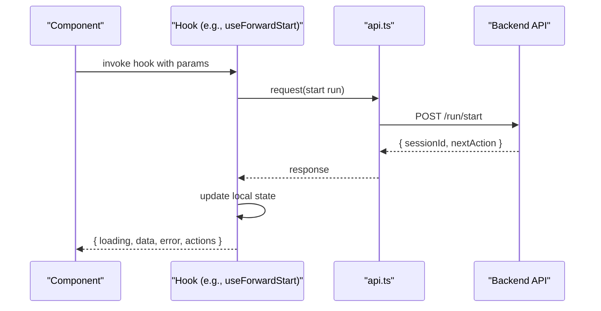
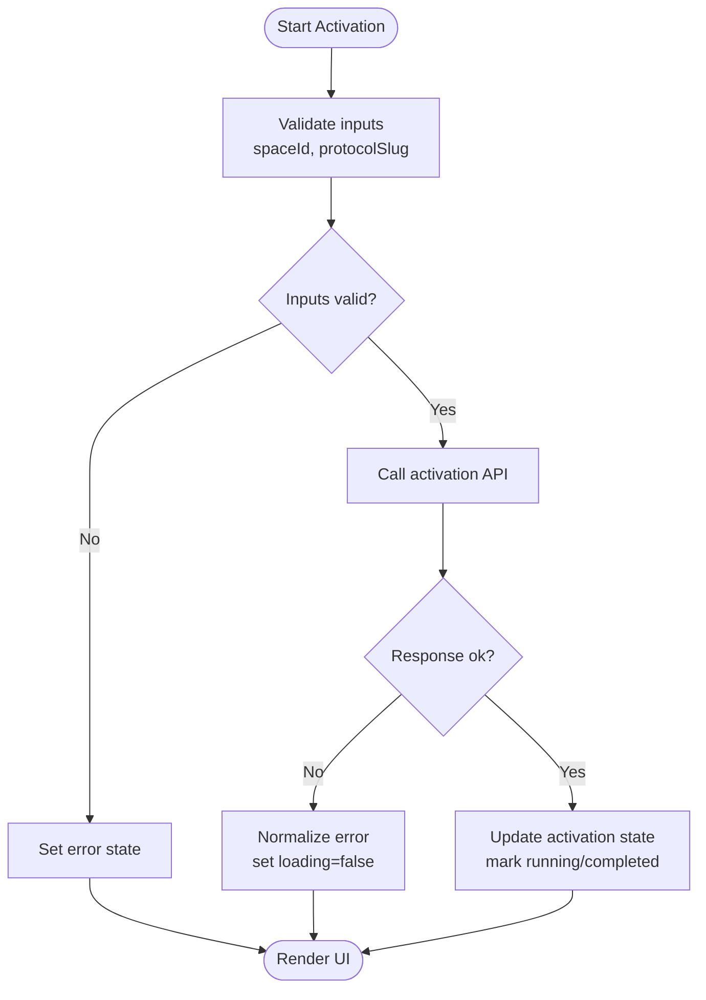
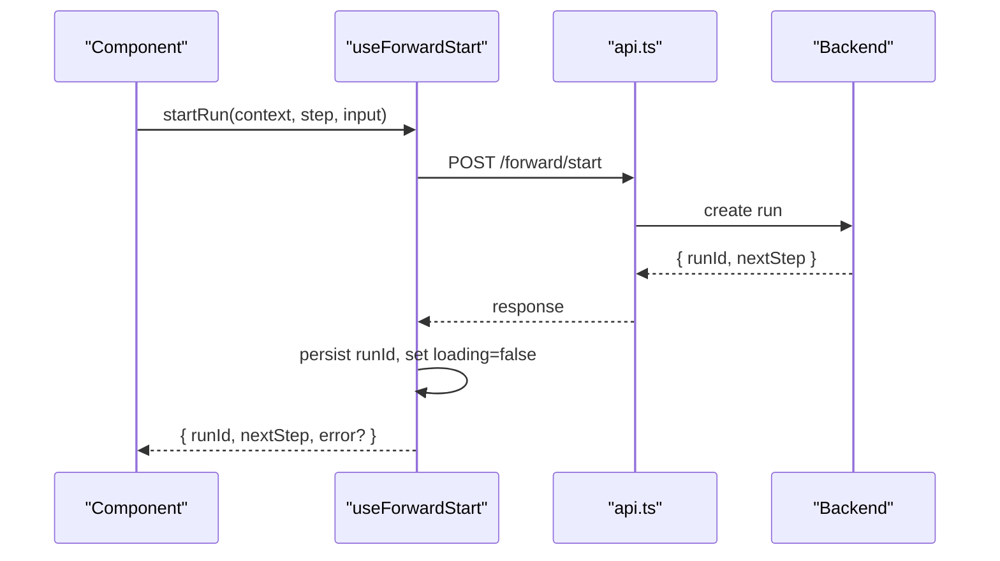
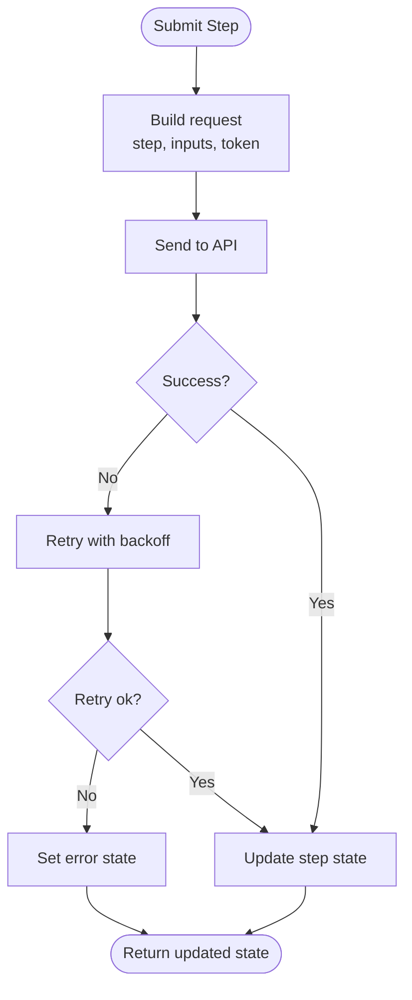
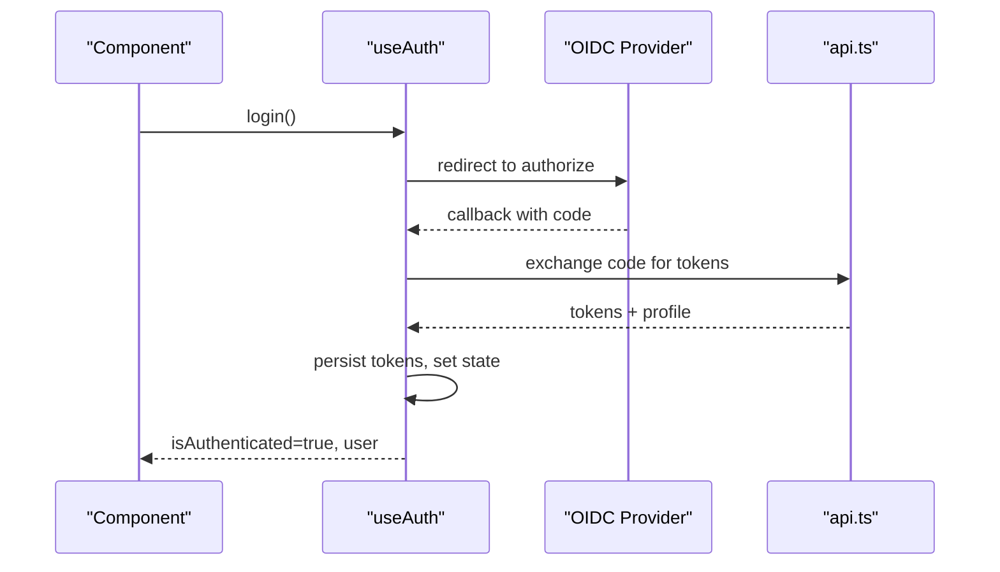
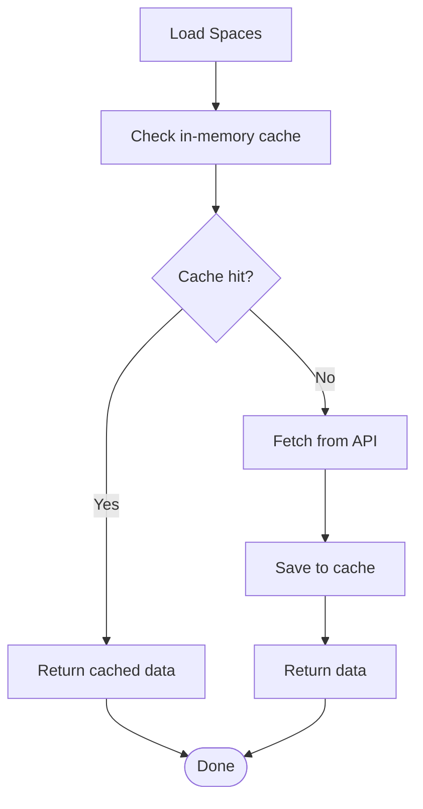
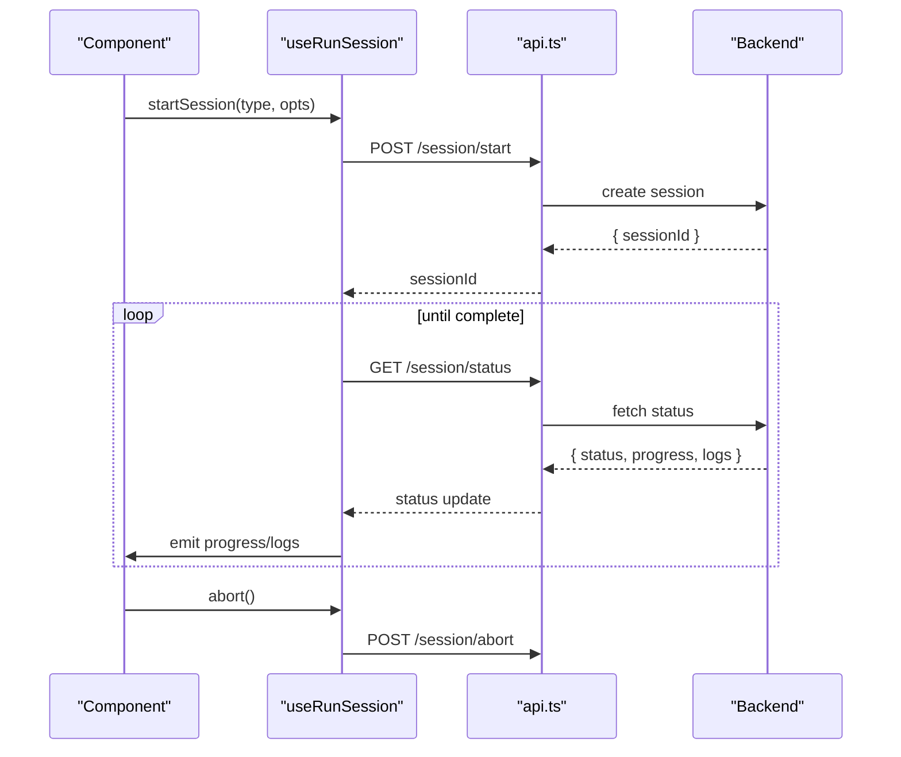
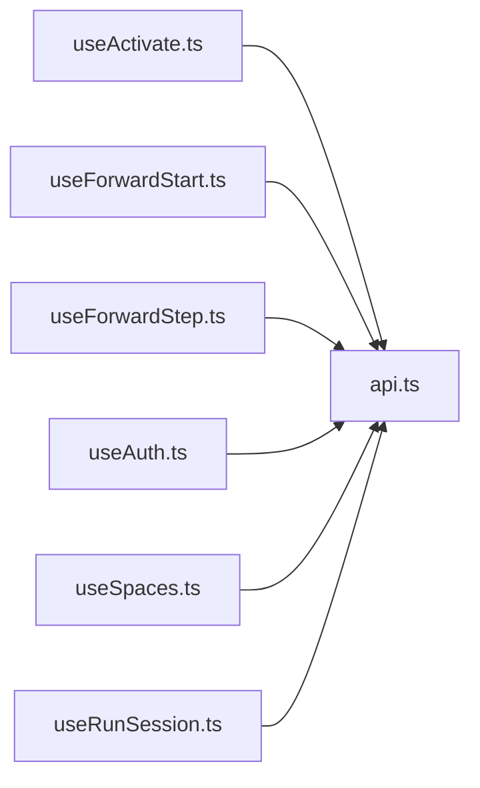

# Custom Hooks and State Management

<cite>
**Referenced Files in This Document**
- [useActivate.ts](file://src/ui/hooks/useActivate.ts)
- [useForwardStart.ts](file://src/ui/hooks/useForwardStart.ts)
- [useForwardStep.ts](file://src/ui/hooks/useForwardStep.ts)
- [useAuth.ts](file://src/ui/hooks/useAuth.ts)
- [useSpaces.ts](file://src/ui/hooks/useSpaces.ts)
- [useRunSession.ts](file://src/ui/hooks/useRunSession.ts)
- [api.ts](file://src/ui/lib/api.ts)
</cite>

## Table of Contents
1. [Introduction](#introduction)
2. [Project Structure](#project-structure)
3. [Core Components](#core-components)
4. [Architecture Overview](#architecture-overview)
5. [Detailed Component Analysis](#detailed-component-analysis)
6. [Dependency Analysis](#dependency-analysis)
7. [Performance Considerations](#performance-considerations)
8. [Troubleshooting Guide](#troubleshooting-guide)
9. [Conclusion](#conclusion)

## Introduction
This document explains the custom React hooks used for state management and workflow orchestration in the UI layer. It focuses on:
- Hook interfaces, parameters, return values, and side effects
- State synchronization patterns and caching strategies
- Error handling within hooks
- Practical usage and composition patterns
- Integration with backend APIs and real-time updates
- Performance optimization techniques and memory management considerations

The hooks covered are:
- useActivate
- useForwardStart
- useForwardStep
- useAuth
- useSpaces
- useRunSession

These hooks encapsulate API interactions, local state, and lifecycle concerns to provide a consistent developer experience across components.

## Project Structure
The hooks live under src/ui/hooks and rely on a shared HTTP client abstraction in src/ui/lib/api.ts. The following diagram shows how the hooks relate to each other and to the API layer.

**Diagram sources**
- [useActivate.ts](file://src/ui/hooks/useActivate.ts)
- [useForwardStart.ts](file://src/ui/hooks/useForwardStart.ts)
- [useForwardStep.ts](file://src/ui/hooks/useForwardStep.ts)
- [useAuth.ts](file://src/ui/hooks/useAuth.ts)
- [useSpaces.ts](file://src/ui/hooks/useSpaces.ts)
- [useRunSession.ts](file://src/ui/hooks/useRunSession.ts)
- [api.ts](file://src/ui/lib/api.ts)

**Section sources**
- [useActivate.ts](file://src/ui/hooks/useActivate.ts)
- [useForwardStart.ts](file://src/ui/hooks/useForwardStart.ts)
- [useForwardStep.ts](file://src/ui/hooks/useForwardStep.ts)
- [useAuth.ts](file://src/ui/hooks/useAuth.ts)
- [useSpaces.ts](file://src/ui/hooks/useSpaces.ts)
- [useRunSession.ts](file://src/ui/hooks/useRunSession.ts)
- [api.ts](file://src/ui/lib/api.ts)

## Core Components
Below is a high-level overview of each hook’s purpose and responsibilities.

- useActivate
  - Purpose: Start or resume an activation flow for a given protocol/space.
  - Typical inputs: space identifier, protocol slug, optional initial payload.
  - Returns: activation status, current step, actions (start, continue), error/state flags.
  - Side effects: initiates activation via API, manages session state, may subscribe to progress events.

- useForwardStart
  - Purpose: Begin a forward execution run from a specific step or entry point.
  - Typical inputs: run context, starting step, input data.
  - Returns: run state, next action guidance, errors.
  - Side effects: creates a run session, emits first call, sets up streaming/progress if applicable.

- useForwardStep
  - Purpose: Advance through subsequent steps in a forward run.
  - Typical inputs: current step, user-provided inputs, continuation tokens.
  - Returns: updated step result, next step info, loading/error states.
  - Side effects: calls next-step API, updates local state, handles retries/backoff.

- useAuth
  - Purpose: Provide authentication state and helpers (login, logout, token refresh).
  - Typical inputs: provider configuration, redirect URLs.
  - Returns: authenticated flag, user profile, login/logout functions, error state.
  - Side effects: manages OIDC flows, persists tokens securely, listens for auth changes.

- useSpaces
  - Purpose: Fetch and manage spaces (collections of protocols/adapters).
  - Typical inputs: filters, pagination, search terms.
  - Returns: list of spaces, loading/error states, actions (create, update, delete).
  - Side effects: caches results, invalidates cache on mutations, syncs with server.

- useRunSession
  - Purpose: Manage long-running sessions (e.g., training, tuning, export).
  - Typical inputs: session type, parameters.
  - Returns: session status, progress, logs, abort function.
  - Side effects: polls or subscribes to updates, cleans up listeners on unmount.

**Section sources**
- [useActivate.ts](file://src/ui/hooks/useActivate.ts)
- [useForwardStart.ts](file://src/ui/hooks/useForwardStart.ts)
- [useForwardStep.ts](file://src/ui/hooks/useForwardStep.ts)
- [useAuth.ts](file://src/ui/hooks/useAuth.ts)
- [useSpaces.ts](file://src/ui/hooks/useSpaces.ts)
- [useRunSession.ts](file://src/ui/hooks/useRunSession.ts)

## Architecture Overview
The hooks follow a consistent pattern:
- Encapsulate imperative API calls behind declarative state
- Centralize error handling and retry logic
- Use a shared HTTP client for consistency and testability
- Expose stable interfaces for components to consume

**Diagram sources**
- [useForwardStart.ts](file://src/ui/hooks/useForwardStart.ts)
- [api.ts](file://src/ui/lib/api.ts)

## Detailed Component Analysis

### useActivate
- Responsibilities
  - Initialize activation for a protocol within a space
  - Track activation lifecycle (pending, running, completed, failed)
  - Surface actionable controls (start, continue, cancel)
- Interface highlights
  - Parameters: spaceId, protocolSlug, optional initialPayload
  - Returns: activationState, startActivation(), continueActivation(), reset()
  - Errors: network, validation, server-side failures
- Side effects
  - Calls activation endpoints
  - Manages internal timers/retries
  - May integrate with real-time updates for progress
- Composition
  - Often composed with useSpaces to validate space existence
  - Can be wrapped with useRunSession for long-running activations

**Diagram sources**
- [useActivate.ts](file://src/ui/hooks/useActivate.ts)
- [api.ts](file://src/ui/lib/api.ts)

**Section sources**
- [useActivate.ts](file://src/ui/hooks/useActivate.ts)
- [api.ts](file://src/ui/lib/api.ts)

### useForwardStart
- Responsibilities
  - Create a new forward run and prepare the first step
  - Provide immediate feedback on success/failure
- Interface highlights
  - Parameters: runContext, startingStep, inputData
  - Returns: runState, startRun(), resetRun()
  - Errors: input validation, server errors
- Side effects
  - Creates a run session
  - Sets up polling or event subscription for progress
  - Cleans up subscriptions on unmount

**Diagram sources**
- [useForwardStart.ts](file://src/ui/hooks/useForwardStart.ts)
- [api.ts](file://src/ui/lib/api.ts)

**Section sources**
- [useForwardStart.ts](file://src/ui/hooks/useForwardStart.ts)
- [api.ts](file://src/ui/lib/api.ts)

### useForwardStep
- Responsibilities
  - Advance to the next step using current inputs and continuation tokens
  - Maintain step history and current step focus
- Interface highlights
  - Parameters: currentStep, userInput, continuationToken
  - Returns: stepResult, nextStepInfo, isLoading, error
  - Actions: submitStep(), retryStep(), cancelStep()
- Side effects
  - Calls next-step endpoint
  - Handles backoff and transient errors
  - Updates local cache for faster navigation

**Diagram sources**
- [useForwardStep.ts](file://src/ui/hooks/useForwardStep.ts)
- [api.ts](file://src/ui/lib/api.ts)

**Section sources**
- [useForwardStep.ts](file://src/ui/hooks/useForwardStep.ts)
- [api.ts](file://src/ui/lib/api.ts)

### useAuth
- Responsibilities
  - Manage authentication state and lifecycle
  - Provide login/logout and token refresh utilities
- Interface highlights
  - Parameters: provider config, redirect URL
  - Returns: isAuthenticated, user, login(), logout(), refresh()
  - Errors: auth failures, expired tokens
- Side effects
  - Redirects to OIDC provider
  - Stores tokens securely
  - Listens for auth changes and updates global state

**Diagram sources**
- [useAuth.ts](file://src/ui/hooks/useAuth.ts)
- [api.ts](file://src/ui/lib/api.ts)

**Section sources**
- [useAuth.ts](file://src/ui/hooks/useAuth.ts)
- [api.ts](file://src/ui/lib/api.ts)

### useSpaces
- Responsibilities
  - Fetch, filter, and mutate spaces
  - Cache responses and invalidate on writes
- Interface highlights
  - Parameters: filters, pagination, search
  - Returns: spaces[], loading, error, actions (create, update, delete)
  - Side effects: GET/POST/PUT/DELETE to spaces endpoints; cache invalidation
- Caching strategy
  - In-memory cache keyed by query shape
  - Stale-while-revalidate pattern for improved UX

**Diagram sources**
- [useSpaces.ts](file://src/ui/hooks/useSpaces.ts)
- [api.ts](file://src/ui/lib/api.ts)

**Section sources**
- [useSpaces.ts](file://src/ui/hooks/useSpaces.ts)
- [api.ts](file://src/ui/lib/api.ts)

### useRunSession
- Responsibilities
  - Orchestrate long-running operations (training, tuning, export)
  - Provide progress, logs, and cancellation
- Interface highlights
  - Parameters: sessionType, options
  - Returns: status, progress, logs, abort()
  - Side effects: polling or event subscription, cleanup on unmount
- Real-time updates
  - Uses periodic polling or SSE/WebSocket where available
  - Debounces frequent updates to avoid excessive re-renders

**Diagram sources**
- [useRunSession.ts](file://src/ui/hooks/useRunSession.ts)
- [api.ts](file://src/ui/lib/api.ts)

**Section sources**
- [useRunSession.ts](file://src/ui/hooks/useRunSession.ts)
- [api.ts](file://src/ui/lib/api.ts)

## Dependency Analysis
The hooks depend on a shared HTTP client that centralizes headers, base URLs, error normalization, and retry policies. This reduces duplication and ensures consistent behavior across features.

**Diagram sources**
- [useActivate.ts](file://src/ui/hooks/useActivate.ts)
- [useForwardStart.ts](file://src/ui/hooks/useForwardStart.ts)
- [useForwardStep.ts](file://src/ui/hooks/useForwardStep.ts)
- [useAuth.ts](file://src/ui/hooks/useAuth.ts)
- [useSpaces.ts](file://src/ui/hooks/useSpaces.ts)
- [useRunSession.ts](file://src/ui/hooks/useRunSession.ts)
- [api.ts](file://src/ui/lib/api.ts)

**Section sources**
- [api.ts](file://src/ui/lib/api.ts)

## Performance Considerations
- Minimize re-renders
  - Memoize derived values and callbacks
  - Batch state updates when possible
- Efficient polling
  - Use exponential backoff for retries
  - Debounce frequent updates in long-running sessions
- Caching
  - Prefer stale-while-revalidate for read-heavy data (spaces)
  - Invalidate caches on mutations to keep UI consistent
- Memory management
  - Clean up timers, intervals, and event listeners on unmount
  - Avoid retaining large payloads in local state; stream or paginate when feasible
- Network efficiency
  - Deduplicate concurrent requests for identical queries
  - Use conditional headers and etags if supported by the backend

[No sources needed since this section provides general guidance]

## Troubleshooting Guide
Common issues and resolutions:
- Authentication failures
  - Ensure tokens are refreshed before expiration
  - Verify OIDC redirect URLs and scopes
- Network errors
  - Implement retry with backoff
  - Normalize server errors into user-friendly messages
- Long-running sessions
  - Monitor timeouts and abort handlers
  - Persist session IDs to recover after reloads
- State inconsistencies
  - Invalidate caches on write operations
  - Add optimistic updates with rollback on failure

**Section sources**
- [useAuth.ts](file://src/ui/hooks/useAuth.ts)
- [useSpaces.ts](file://src/ui/hooks/useSpaces.ts)
- [useRunSession.ts](file://src/ui/hooks/useRunSession.ts)

## Conclusion
These hooks provide a cohesive, reusable foundation for managing complex workflows in the UI. By centralizing API interactions, error handling, and state synchronization, they enable components to remain simple and focused on presentation. Adopting the recommended performance and memory practices will further improve responsiveness and reliability.

[No sources needed since this section summarizes without analyzing specific files]