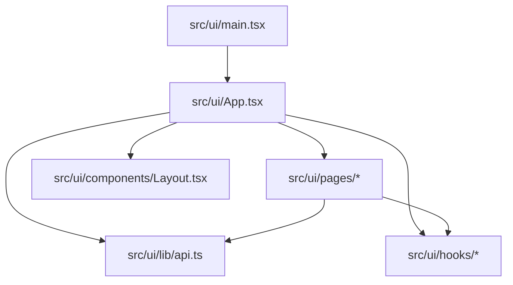
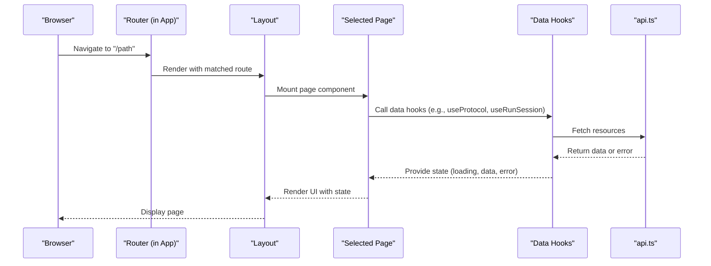
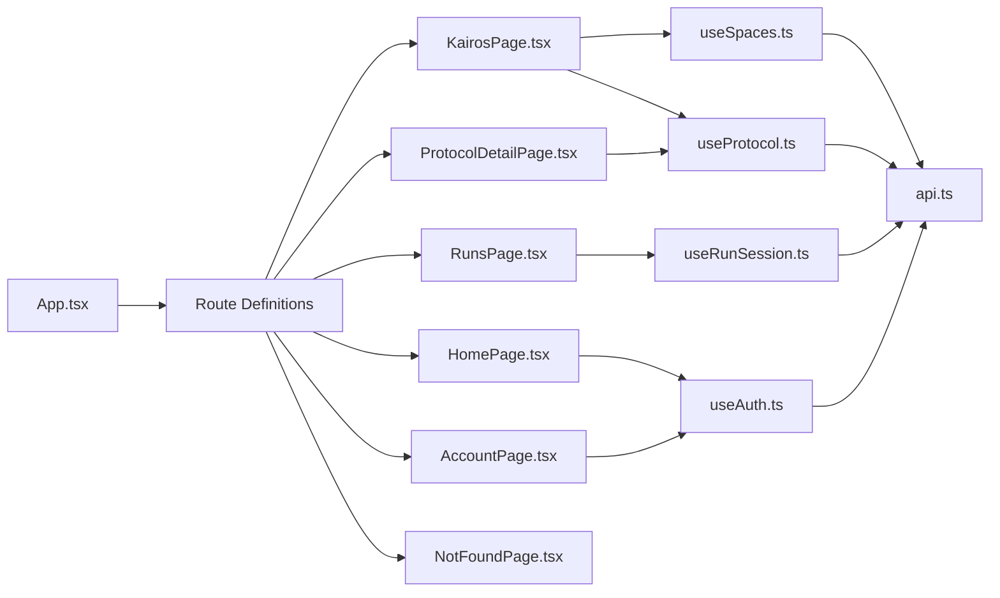

# Pages and Routing System

<cite>
**Referenced Files in This Document**
- [App.tsx](file://src/ui/App.tsx)
- [main.tsx](file://src/ui/main.tsx)
- [HomePage.tsx](file://src/ui/pages/HomePage.tsx)
- [KairosPage.tsx](file://src/ui/pages/KairosPage.tsx)
- [ProtocolDetailPage.tsx](file://src/ui/pages/ProtocolDetailPage.tsx)
- [RunsPage.tsx](file://src/ui/pages/RunsPage.tsx)
- [AccountPage.tsx](file://src/ui/pages/AccountPage.tsx)
- [NotFoundPage.tsx](file://src/ui/pages/NotFoundPage.tsx)
- [Layout.tsx](file://src/ui/components/Layout.tsx)
- [api.ts](file://src/ui/lib/api.ts)
- [useAuth.ts](file://src/ui/hooks/useAuth.ts)
- [useSpaces.ts](file://src/ui/hooks/useSpaces.ts)
- [useProtocol.ts](file://src/ui/hooks/useProtocol.ts)
- [useRunSession.ts](file://src/ui/hooks/useRunSession.ts)
</cite>

## Table of Contents
1. [Introduction](#introduction)
2. [Project Structure](#project-structure)
3. [Core Components](#core-components)
4. [Architecture Overview](#architecture-overview)
5. [Detailed Component Analysis](#detailed-component-analysis)
6. [Dependency Analysis](#dependency-analysis)
7. [Performance Considerations](#performance-considerations)
8. [Troubleshooting Guide](#troubleshooting-guide)
9. [Conclusion](#conclusion)
10. [Appendices](#appendices)

## Introduction
This document explains the client-side page routing system and page components for the UI application. It covers routing configuration, navigation patterns, URL parameter handling, page-specific functionality, data fetching strategies, state persistence, integration with API endpoints, and consistent UX patterns for loading states, error handling, and user feedback. The goal is to help developers understand how pages are organized and routed, and how to create new pages and custom routes safely and consistently.

## Project Structure
The UI codebase is organized under src/ui. Key areas:
- Entry point and app bootstrap
- Page definitions and route configuration
- Shared layout and common UI components
- Data access layer (API client)
- Reusable hooks for authentication, spaces, protocols, and runs

**Diagram sources**
- [main.tsx](file://src/ui/main.tsx)
- [App.tsx](file://src/ui/App.tsx)
- [HomePage.tsx](file://src/ui/pages/HomePage.tsx)
- [KairosPage.tsx](file://src/ui/pages/KairosPage.tsx)
- [ProtocolDetailPage.tsx](file://src/ui/pages/ProtocolDetailPage.tsx)
- [RunsPage.tsx](file://src/ui/pages/RunsPage.tsx)
- [AccountPage.tsx](file://src/ui/pages/AccountPage.tsx)
- [NotFoundPage.tsx](file://src/ui/pages/NotFoundPage.tsx)
- [Layout.tsx](file://src/ui/components/Layout.tsx)
- [api.ts](file://src/ui/lib/api.ts)
- [useAuth.ts](file://src/ui/hooks/useAuth.ts)
- [useSpaces.ts](file://src/ui/hooks/useSpaces.ts)
- [useProtocol.ts](file://src/ui/hooks/useProtocol.ts)
- [useRunSession.ts](file://src/ui/hooks/useRunSession.ts)

**Section sources**
- [main.tsx](file://src/ui/main.tsx)
- [App.tsx](file://src/ui/App.tsx)

## Core Components
- App: Bootstraps the router, sets up global providers, and defines top-level routes.
- Layout: Provides shared chrome (header, sidebar, content area), theme context, and navigation shell.
- Pages:
  - HomePage: Landing view with quick actions and links to key flows.
  - KairosPage: Central hub for protocol discovery and browsing.
  - ProtocolDetailPage: Displays details for a specific protocol by slug or id.
  - RunsPage: Lists and manages run sessions.
  - AccountPage: Shows current user profile and settings.
  - NotFoundPage: Handles unmatched routes.
- Data Access:
  - api.ts: Centralized HTTP client wrapper for API calls.
  - useAuth.ts: Authentication state and helpers.
  - useSpaces.ts: Fetches and caches spaces.
  - useProtocol.ts: Fetches protocol metadata and content.
  - useRunSession.ts: Manages run session lifecycle and state.

Key responsibilities:
- Routing: Declarative route definitions and nested layouts.
- Navigation: Programmatic and declarative navigation between pages.
- Parameters: Reading path params and query strings for dynamic content.
- Data Fetching: Using hooks to fetch and cache data; handling loading and errors.
- State Persistence: Persisting minimal UI state (e.g., theme preference) via local storage.

**Section sources**
- [App.tsx](file://src/ui/App.tsx)
- [Layout.tsx](file://src/ui/components/Layout.tsx)
- [HomePage.tsx](file://src/ui/pages/HomePage.tsx)
- [KairosPage.tsx](file://src/ui/pages/KairosPage.tsx)
- [ProtocolDetailPage.tsx](file://src/ui/pages/ProtocolDetailPage.tsx)
- [RunsPage.tsx](file://src/ui/pages/RunsPage.tsx)
- [AccountPage.tsx](file://src/ui/pages/AccountPage.tsx)
- [NotFoundPage.tsx](file://src/ui/pages/NotFoundPage.tsx)
- [api.ts](file://src/ui/lib/api.ts)
- [useAuth.ts](file://src/ui/hooks/useAuth.ts)
- [useSpaces.ts](file://src/ui/hooks/useSpaces.ts)
- [useProtocol.ts](file://src/ui/hooks/useProtocol.ts)
- [useRunSession.ts](file://src/ui/hooks/useRunSession.ts)

## Architecture Overview
High-level flow from browser navigation to rendered page:

**Diagram sources**
- [App.tsx](file://src/ui/App.tsx)
- [Layout.tsx](file://src/ui/components/Layout.tsx)
- [ProtocolDetailPage.tsx](file://src/ui/pages/ProtocolDetailPage.tsx)
- [RunsPage.tsx](file://src/ui/pages/RunsPage.tsx)
- [api.ts](file://src/ui/lib/api.ts)
- [useProtocol.ts](file://src/ui/hooks/useProtocol.ts)
- [useRunSession.ts](file://src/ui/hooks/useRunSession.ts)

## Detailed Component Analysis

### Routing Configuration and Navigation Patterns
- Route registration occurs in the app entry where routes are declared for each page.
- Layout wraps all pages to provide consistent chrome and navigation.
- Navigation uses both declarative links and programmatic navigation APIs provided by the router.
- Nested routes may be used to group related pages (for example, protocol detail and edit).

Best practices:
- Keep route paths stable and descriptive.
- Use path parameters for resource identifiers (e.g., protocol slug).
- Use query parameters for filters and pagination.
- Redirect unauthenticated users to login when necessary.

**Section sources**
- [App.tsx](file://src/ui/App.tsx)
- [Layout.tsx](file://src/ui/components/Layout.tsx)

### HomePage
Purpose:
- Entry point with quick actions and links to major features.
- Presents high-level summaries and shortcuts to protocols and runs.

Navigation:
- Links to KairosPage, RunsPage, and other sections.
- May include deep links to specific protocols or runs using path parameters.

Data and state:
- Minimal data fetching; primarily navigational.
- Uses auth hook to show personalized actions if available.

Loading and errors:
- Lightweight; typically no heavy async work.
- Errors surfaced via global error boundary or inline alerts.

**Section sources**
- [HomePage.tsx](file://src/ui/pages/HomePage.tsx)
- [useAuth.ts](file://src/ui/hooks/useAuth.ts)

### KairosPage
Purpose:
- Central hub for discovering and browsing protocols.
- Supports filtering by space and search terms.

URL parameters:
- Query parameters for filters (space, search).
- Optional sorting and pagination via query string.

Data fetching:
- Uses useSpaces and useProtocol hooks to load lists and filter results.
- Implements debounced search and caching to reduce network requests.

User feedback:
- Skeleton loaders while fetching.
- Inline error messages and retry options.

**Section sources**
- [KairosPage.tsx](file://src/ui/pages/KairosPage.tsx)
- [useSpaces.ts](file://src/ui/hooks/useSpaces.ts)
- [useProtocol.ts](file://src/ui/hooks/useProtocol.ts)
- [api.ts](file://src/ui/lib/api.ts)

### ProtocolDetailPage
Purpose:
- Displays detailed information about a single protocol identified by a slug or id.

URL parameters:
- Path parameter for protocol identifier (e.g., /protocols/:slug).
- Optional query parameters for version or section anchors.

Data fetching:
- Uses useProtocol hook to fetch protocol metadata and content.
- Handles 404 gracefully by redirecting to NotFoundPage.

State persistence:
- May persist last viewed protocol in local storage for quick return.

Loading and errors:
- Loading skeleton for protocol content.
- Error state with retry action and helpful messaging.

**Section sources**
- [ProtocolDetailPage.tsx](file://src/ui/pages/ProtocolDetailPage.tsx)
- [useProtocol.ts](file://src/ui/hooks/useProtocol.ts)
- [api.ts](file://src/ui/lib/api.ts)

### RunsPage
Purpose:
- Lists run sessions with status, timestamps, and actions.
- Supports filtering by status and searching by name/id.

URL parameters:
- Query parameters for filters (status, search).
- Pagination via page and per_page.

Data fetching:
- Uses useRunSession hook to fetch runs and manage session state.
- Polling or real-time updates may be implemented depending on backend support.

User feedback:
- Status badges and inline actions (start, stop, delete).
- Confirmation dialogs for destructive actions.

**Section sources**
- [RunsPage.tsx](file://src/ui/pages/RunsPage.tsx)
- [useRunSession.ts](file://src/ui/hooks/useRunSession.ts)
- [api.ts](file://src/ui/lib/api.ts)

### AccountPage
Purpose:
- Displays current user profile and preferences.
- Allows updating display name and theme preference.

Authentication:
- Uses useAuth hook to read and refresh user info.
- Enforces authentication before rendering sensitive data.

State persistence:
- Persists theme preference locally.
- Syncs changes with backend when applicable.

Loading and errors:
- Loading indicator while fetching profile.
- Error alerts with retry option.

**Section sources**
- [AccountPage.tsx](file://src/ui/pages/AccountPage.tsx)
- [useAuth.ts](file://src/ui/hooks/useAuth.ts)

### NotFoundPage
Purpose:
- Handles unmatched routes and provides guidance to navigate back.

Behavior:
- Renders friendly message and link to HomePage.
- Logs navigation anomalies for debugging.

**Section sources**
- [NotFoundPage.tsx](file://src/ui/pages/NotFoundPage.tsx)

## Dependency Analysis
Relationships between pages, hooks, and API layer:

**Diagram sources**
- [App.tsx](file://src/ui/App.tsx)
- [HomePage.tsx](file://src/ui/pages/HomePage.tsx)
- [KairosPage.tsx](file://src/ui/pages/KairosPage.tsx)
- [ProtocolDetailPage.tsx](file://src/ui/pages/ProtocolDetailPage.tsx)
- [RunsPage.tsx](file://src/ui/pages/RunsPage.tsx)
- [AccountPage.tsx](file://src/ui/pages/AccountPage.tsx)
- [NotFoundPage.tsx](file://src/ui/pages/NotFoundPage.tsx)
- [useAuth.ts](file://src/ui/hooks/useAuth.ts)
- [useSpaces.ts](file://src/ui/hooks/useSpaces.ts)
- [useProtocol.ts](file://src/ui/hooks/useProtocol.ts)
- [useRunSession.ts](file://src/ui/hooks/useRunSession.ts)
- [api.ts](file://src/ui/lib/api.ts)

**Section sources**
- [App.tsx](file://src/ui/App.tsx)
- [api.ts](file://src/ui/lib/api.ts)

## Performance Considerations
- Prefer lazy-loading page components to reduce initial bundle size.
- Cache frequently accessed data (spaces, protocols) using hooks and in-memory stores.
- Debounce search inputs and implement server-side filtering when possible.
- Use pagination and virtualization for large lists (runs, protocols).
- Avoid unnecessary re-renders by memoizing derived data and stabilizing props.
- Implement optimistic updates for non-critical actions to improve perceived performance.

[No sources needed since this section provides general guidance]

## Troubleshooting Guide
Common issues and resolutions:
- 404 on deep links: Ensure route parameters match expected patterns and that redirects are configured for legacy URLs.
- Missing data on first render: Verify hooks are invoked at the top level and that loading states are handled.
- Auth failures: Check token refresh logic and ensure protected routes redirect appropriately.
- Network errors: Surface errors via inline alerts and provide retry actions; log request payloads for diagnostics.
- Stale cache: Invalidate caches when underlying data changes (e.g., after creating a run or updating a protocol).

Operational tips:
- Add logging around API calls and navigation events.
- Use global error boundaries to catch unexpected exceptions.
- Validate URL parameters early and present clear user feedback for invalid inputs.

**Section sources**
- [api.ts](file://src/ui/lib/api.ts)
- [useAuth.ts](file://src/ui/hooks/useAuth.ts)
- [useProtocol.ts](file://src/ui/hooks/useProtocol.ts)
- [useRunSession.ts](file://src/ui/hooks/useRunSession.ts)

## Conclusion
The routing and page system is built around a clear separation of concerns: routing configuration in the app, shared layout for consistent chrome, focused page components, and reusable hooks for data and auth. Following the patterns outlined here will help you add new pages and routes efficiently while maintaining consistent UX and robust error handling.

[No sources needed since this section summarizes without analyzing specific files]

## Appendices

### Creating a New Page and Custom Route
Steps:
1. Create a new page component under src/ui/pages.
2. Define route(s) in the app’s route configuration.
3. If the page needs data, create or reuse hooks (e.g., useXxx) that call api.ts.
4. Integrate with Layout for consistent navigation and theming.
5. Handle loading, error, and empty states consistently.
6. Add tests for navigation and data fetching behavior.

Example patterns:
- Path parameters: /resources/:id
- Query parameters: /runs?status=active&page=1&per_page=20
- Protected routes: Redirect to login if not authenticated

**Section sources**
- [App.tsx](file://src/ui/App.tsx)
- [api.ts](file://src/ui/lib/api.ts)
- [useAuth.ts](file://src/ui/hooks/useAuth.ts)

### URL Parameter Handling Reference
- Path parameters: Read via router context; validate presence and format.
- Query parameters: Parse and normalize; apply defaults for missing values.
- Redirects: Normalize legacy URLs and preserve query strings.

**Section sources**
- [ProtocolDetailPage.tsx](file://src/ui/pages/ProtocolDetailPage.tsx)
- [RunsPage.tsx](file://src/ui/pages/RunsPage.tsx)
- [KairosPage.tsx](file://src/ui/pages/KairosPage.tsx)

### API Integration Examples
- Fetch list: GET /api/spaces, GET /api/runs
- Fetch detail: GET /api/protocols/:slug
- Mutations: POST/PUT/DELETE as needed
- Error handling: Map HTTP statuses to user-friendly messages

**Section sources**
- [api.ts](file://src/ui/lib/api.ts)
- [useSpaces.ts](file://src/ui/hooks/useSpaces.ts)
- [useProtocol.ts](file://src/ui/hooks/useProtocol.ts)
- [useRunSession.ts](file://src/ui/hooks/useRunSession.ts)