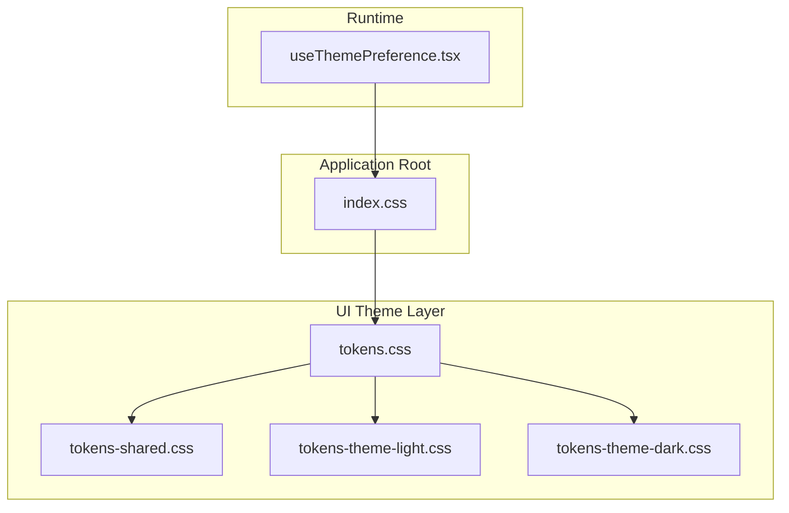
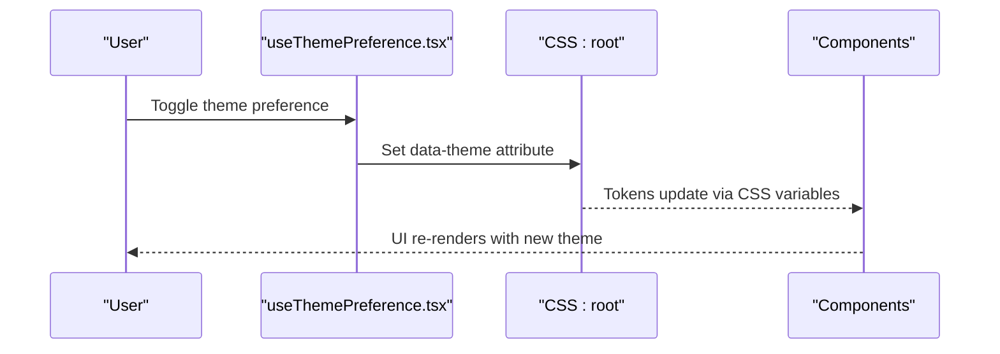
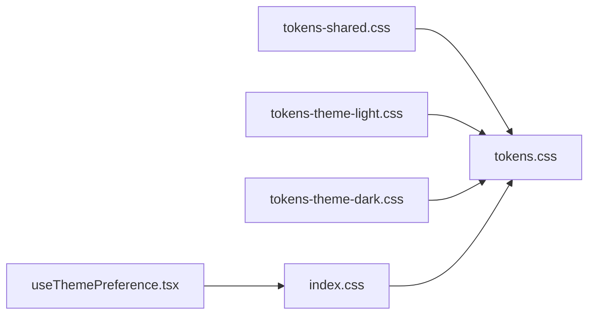

# Theming and Customization

<cite>
**Referenced Files in This Document**
- [tokens.css](file://src/ui/theme/tokens.css)
- [tokens-shared.css](file://src/ui/theme/tokens-shared.css)
- [tokens-theme-light.css](file://src/ui/theme/tokens-theme-light.css)
- [tokens-theme-dark.css](file://src/ui/theme/tokens-theme-dark.css)
- [useThemePreference.tsx](file://src/ui/hooks/useThemePreference.tsx)
- [index.css](file://src/ui/index.css)
</cite>

## Table of Contents
1. [Introduction](#introduction)
2. [Project Structure](#project-structure)
3. [Core Components](#core-components)
4. [Architecture Overview](#architecture-overview)
5. [Detailed Component Analysis](#detailed-component-analysis)
6. [Dependency Analysis](#dependency-analysis)
7. [Performance Considerations](#performance-considerations)
8. [Troubleshooting Guide](#troubleshooting-guide)
9. [Conclusion](#conclusion)
10. [Appendices](#appendices)

## Introduction
This document explains the theming system and UI customization capabilities, including CSS custom properties (tokens), theme switching mechanisms, color palette management, light and dark themes, shared tokens, responsive breakpoints, creating custom themes, overriding default styles, build-time processing, runtime switching, accessibility considerations, and cross-browser compatibility.

## Project Structure
The theming system is organized under src/ui/theme with dedicated token files for shared values, light theme, and dark theme. A global stylesheet wires tokens into the application root, and a React hook manages user preference persistence and runtime switching.

[No sources needed since this diagram shows conceptual workflow, not actual code structure]

## Core Components
- CSS custom properties (tokens): Centralized design tokens for colors, spacing, typography, shadows, and other visual scales.
- Shared tokens: Values reused across themes to maintain consistency.
- Light and dark themes: Theme-specific overrides applied via CSS media queries or data attributes.
- Runtime theme switcher: A hook that persists user preference and toggles the active theme at runtime.
- Global stylesheet: Wires tokens into the application root and applies base styles.

Key responsibilities:
- Define tokens in a single source of truth.
- Provide consistent defaults and theme variants.
- Persist and apply user preferences without layout shifts.
- Ensure accessible contrast and keyboard/screen reader behavior.

[No sources needed since this section provides general guidance]

## Architecture Overview
The theming architecture separates concerns between tokens, theme variants, and runtime logic:

- Tokens layer: Defines semantic names and values.
- Theme layer: Provides light/dark variants by overriding tokens.
- Application layer: Consumes tokens via CSS variables; uses a hook to toggle themes at runtime.

[No sources needed since this diagram shows conceptual workflow, not actual code structure]

## Detailed Component Analysis

### CSS Tokens System
- Purpose: Centralize design decisions using semantic variable names.
- Organization:
  - Shared tokens: Common values used by both themes.
  - Theme tokens: Light and dark overrides.
  - Base tokens: Defaults and fallbacks.
- Usage: Components reference tokens instead of hard-coded values.

Best practices:
- Use semantic names (e.g., color-text-primary).
- Group related tokens (colors, spacing, typography).
- Keep theme-specific overrides minimal and explicit.

[No sources needed since this section provides general guidance]

### Theme Switching Mechanisms
- Data attribute approach: Apply a data-theme attribute on the document root to switch between light and dark themes.
- Media query approach: Respect system preference using prefers-color-scheme.
- Persistence: Store user choice in local storage and apply on load.

Runtime flow:
- On app start, read persisted preference or system preference.
- Apply the appropriate data attribute to the root element.
- Components automatically reflect changes through CSS variables.

Accessibility:
- Ensure sufficient contrast in both themes.
- Avoid relying solely on color to convey meaning.
- Test with screen readers and keyboard navigation.

[No sources needed since this section provides general guidance]

### Color Palette Management
- Semantic naming: Prefer descriptive names over literal color names.
- Token hierarchy: Base palette -> semantic tokens -> component tokens.
- Consistency: Reuse tokens across components to maintain brand coherence.

Extending palettes:
- Add new tokens to shared tokens.
- Provide theme-specific values for light and dark modes.
- Update components to consume new tokens.

[No sources needed since this section provides general guidance]

### Light and Dark Theme Implementations
- Shared tokens define neutral values (e.g., spacing, radii).
- Theme tokens override color-related variables for each mode.
- Fallbacks ensure graceful degradation if a token is missing.

Implementation tips:
- Keep theme files small and focused.
- Use CSS nesting or grouping to reduce duplication.
- Validate contrast ratios for readability.

[No sources needed since this section provides general guidance]

### Responsive Breakpoints
- Define breakpoints consistently in tokens or a dedicated configuration.
- Use tokens in media queries to keep spacing and sizing coherent.
- Test layouts across devices and orientations.

[No sources needed since this section provides general guidance]

### Creating Custom Themes
Steps:
- Create a new theme file that overrides only the necessary tokens.
- Register the theme with the runtime switcher.
- Provide a way for users to select the theme.
- Verify contrast and accessibility.

Override strategies:
- Override color tokens for brand alignment.
- Adjust spacing or typography tokens for different contexts.
- Maintain shared tokens to preserve layout stability.

[No sources needed since this section provides general guidance]

### Overriding Default Styles
- Prefer token overrides rather than ad-hoc CSS rules.
- If necessary, use scoped overrides with clear specificity.
- Document exceptions and rationale.

[No sources needed since this section provides general guidance]

### Build-Time Theme Processing
- Preprocess tokens into final CSS during build.
- Minify and bundle theme assets for performance.
- Optionally generate theme manifests for runtime selection.

[No sources needed since this section provides general guidance]

### Runtime Theme Switching
- Hook reads persisted preference and applies data attribute.
- CSS variables update instantly without reload.
- Debounce or batch updates if multiple toggles occur rapidly.

[No sources needed since this section provides general guidance]

### Accessibility Considerations
- Contrast: Ensure WCAG AA minimum contrast for text and interactive elements.
- Focus indicators: Visible focus states in all themes.
- Motion: Respect reduced motion preferences.
- Testing: Use automated contrast checks and manual audits.

[No sources needed since this section provides general guidance]

### Cross-Browser Compatibility
- CSS variables support: Polyfill or fallbacks for older browsers.
- Data attributes: Widely supported; verify edge cases.
- Media queries: Use standard syntax and test across browsers.

[No sources needed since this section provides general guidance]

## Dependency Analysis
Conceptual dependency relationships among theme assets and runtime logic:

[No sources needed since this diagram shows conceptual workflow, not actual code structure]

## Performance Considerations
- Minimize token count to reduce CSS size.
- Avoid heavy computations in runtime theme switching.
- Use CSS containment where appropriate to limit repaint areas.
- Defer non-critical theme-dependent styles if possible.

[No sources needed since this section provides general guidance]

## Troubleshooting Guide
Common issues and resolutions:
- Colors not updating: Ensure the data attribute is set on the correct root element and tokens are referenced correctly.
- Flash of wrong theme: Initialize theme before first paint using inline script or server-side rendering.
- Low contrast: Audit tokens and adjust theme overrides to meet contrast requirements.
- Layout shifts: Keep token dimensions stable across themes.

[No sources needed since this section provides general guidance]

## Conclusion
A robust theming system relies on well-structured tokens, clear separation of shared and theme-specific values, and a simple runtime mechanism to apply user preferences. By following semantic naming, maintaining accessibility, and keeping overrides minimal, teams can deliver consistent, customizable experiences across light and dark modes and beyond.

[No sources needed since this section summarizes without analyzing specific files]

## Appendices

### Example: Adding a New Color Scheme
- Define new tokens in shared tokens.
- Provide light and dark overrides in respective theme files.
- Register the scheme in the runtime switcher.
- Add a UI control to select the scheme.
- Validate accessibility and responsiveness.

### Example: Customizing Component Appearance
- Identify tokens consumed by the component.
- Override tokens at the component scope or globally.
- Test across themes and breakpoints.
- Document the customization path for future maintainers.

[No sources needed since this section provides general guidance]