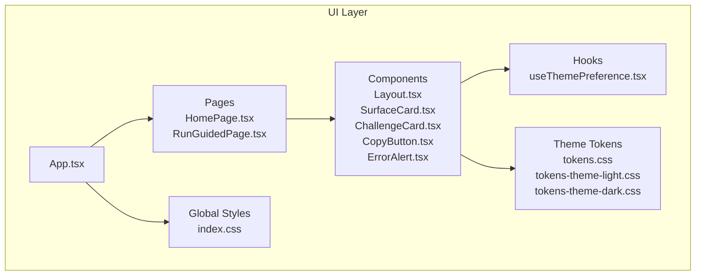
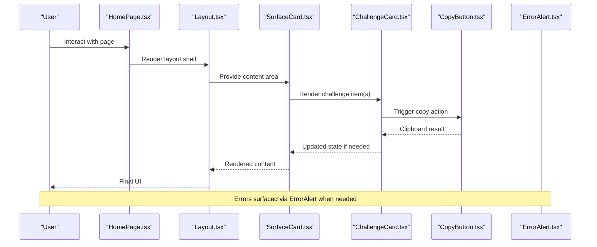
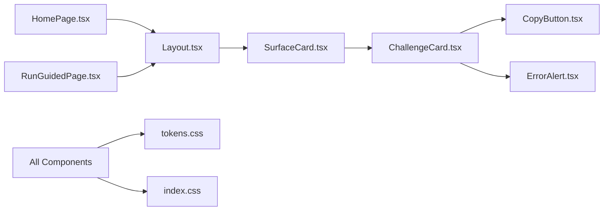

# UI Components and Architecture

<cite>
**Referenced Files in This Document**
- [Layout.tsx](file://src/ui/components/Layout.tsx)
- [SurfaceCard.tsx](file://src/ui/components/SurfaceCard.tsx)
- [ChallengeCard.tsx](file://src/ui/components/ChallengeCard.tsx)
- [CopyButton.tsx](file://src/ui/components/CopyButton.tsx)
- [ErrorAlert.tsx](file://src/ui/components/ErrorAlert.tsx)
- [App.tsx](file://src/ui/App.tsx)
- [HomePage.tsx](file://src/ui/pages/HomePage.tsx)
- [RunGuidedPage.tsx](file://src/ui/pages/RunGuidedPage.tsx)
- [tokens.css](file://src/ui/theme/tokens.css)
- [tokens-theme-light.css](file://src/ui/theme/tokens-theme-light.css)
- [tokens-theme-dark.css](file://src/ui/theme/tokens-theme-dark.css)
- [index.css](file://src/ui/index.css)
- [useThemePreference.tsx](file://src/ui/hooks/useThemePreference.tsx)
- [CopyButton.test.tsx](file://tests/ui/CopyButton.test.tsx)
- [ErrorAlert.test.tsx](file://tests/ui/ErrorAlert.test.tsx)
- [Layout.test.tsx](file://tests/ui/Layout.test.tsx)
</cite>

## Table of Contents
1. [Introduction](#introduction)
2. [Project Structure](#project-structure)
3. [Core Components](#core-components)
4. [Architecture Overview](#architecture-overview)
5. [Detailed Component Analysis](#detailed-component-analysis)
6. [Dependency Analysis](#dependency-analysis)
7. [Performance Considerations](#performance-considerations)
8. [Troubleshooting Guide](#troubleshooting-guide)
9. [Conclusion](#conclusion)
10. [Appendices](#appendices)

## Introduction
This document describes the React-based UI component architecture with a focus on core presentational components: Layout, SurfaceCard, ChallengeCard, CopyButton, and ErrorAlert. It explains how these components compose together, their prop interfaces, event handling patterns, state management approaches, data flow between parent and child components, styling strategies (including CSS modules and theme tokens), responsive design considerations, testing strategies, and accessibility compliance.

## Project Structure
The UI layer is organized under src/ui with clear separation of concerns:
- components: reusable presentational components
- hooks: composable logic for data fetching, auth, protocol, runs, and theming
- pages: route-level views that compose components and hooks
- theme: shared design tokens and theme variants
- public: static assets
- utils: helper utilities used by components and hooks

**Diagram sources**
- [App.tsx](file://src/ui/App.tsx)
- [HomePage.tsx](file://src/ui/pages/HomePage.tsx)
- [RunGuidedPage.tsx](file://src/ui/pages/RunGuidedPage.tsx)
- [Layout.tsx](file://src/ui/components/Layout.tsx)
- [SurfaceCard.tsx](file://src/ui/components/SurfaceCard.tsx)
- [ChallengeCard.tsx](file://src/ui/components/ChallengeCard.tsx)
- [CopyButton.tsx](file://src/ui/components/CopyButton.tsx)
- [ErrorAlert.tsx](file://src/ui/components/ErrorAlert.tsx)
- [useThemePreference.tsx](file://src/ui/hooks/useThemePreference.tsx)
- [tokens.css](file://src/ui/theme/tokens.css)
- [tokens-theme-light.css](file://src/ui/theme/tokens-theme-light.css)
- [tokens-theme-dark.css](file://src/ui/theme/tokens-theme-dark.css)
- [index.css](file://src/ui/index.css)

**Section sources**
- [App.tsx](file://src/ui/App.tsx)
- [HomePage.tsx](file://src/ui/pages/HomePage.tsx)
- [RunGuidedPage.tsx](file://src/ui/pages/RunGuidedPage.tsx)
- [Layout.tsx](file://src/ui/components/Layout.tsx)
- [SurfaceCard.tsx](file://src/ui/components/SurfaceCard.tsx)
- [ChallengeCard.tsx](file://src/ui/components/ChallengeCard.tsx)
- [CopyButton.tsx](file://src/ui/components/CopyButton.tsx)
- [ErrorAlert.tsx](file://src/ui/components/ErrorAlert.tsx)
- [useThemePreference.tsx](file://src/ui/hooks/useThemePreference.tsx)
- [tokens.css](file://src/ui/theme/tokens.css)
- [tokens-theme-light.css](file://src/ui/theme/tokens-theme-light.css)
- [tokens-theme-dark.css](file://src/ui/theme/tokens-theme-dark.css)
- [index.css](file://src/ui/index.css)

## Core Components
This section summarizes the responsibilities and composition patterns of the core components:
- Layout: Provides page chrome, navigation shell, and consistent spacing; wraps content sections and integrates global styles and theme context.
- SurfaceCard: A generic card container with surface elevation, padding, and optional header/footer slots; used to group related content.
- ChallengeCard: Displays challenge metadata and actions; composed within cards or lists; may include status indicators and call-to-action buttons.
- CopyButton: Small utility button that copies text to clipboard; provides feedback via tooltip or inline message.
- ErrorAlert: Accessible alert banner for displaying errors or warnings; supports dismissibility and variant styling.

These components are primarily presentational and receive behavior from parent components or hooks. They rely on shared theme tokens and global styles for consistency.

**Section sources**
- [Layout.tsx](file://src/ui/components/Layout.tsx)
- [SurfaceCard.tsx](file://src/ui/components/SurfaceCard.tsx)
- [ChallengeCard.tsx](file://src/ui/components/ChallengeCard.tsx)
- [CopyButton.tsx](file://src/ui/components/CopyButton.tsx)
- [ErrorAlert.tsx](file://src/ui/components/ErrorAlert.tsx)

## Architecture Overview
The UI follows a layered approach:
- Pages orchestrate user flows and compose components.
- Components render UI based on props and local state when needed.
- Hooks encapsulate side effects and shared logic (e.g., theme preference).
- Theme tokens define colors, typography, spacing, and breakpoints.

**Diagram sources**
- [HomePage.tsx](file://src/ui/pages/HomePage.tsx)
- [Layout.tsx](file://src/ui/components/Layout.tsx)
- [SurfaceCard.tsx](file://src/ui/components/SurfaceCard.tsx)
- [ChallengeCard.tsx](file://src/ui/components/ChallengeCard.tsx)
- [CopyButton.tsx](file://src/ui/components/CopyButton.tsx)
- [ErrorAlert.tsx](file://src/ui/components/ErrorAlert.tsx)

## Detailed Component Analysis

### Layout
Responsibilities:
- Provides consistent page structure and spacing.
- Integrates global styles and theme tokens.
- May host navigation, breadcrumbs, or top-level controls.
- Wraps child content and ensures responsive behavior.

Composition patterns:
- Accepts children and optional header/footer slots.
- Delegates theme application to theme tokens and global CSS.

Event handling:
- Typically forwards events to children or orchestrates higher-level flows.

State management:
- Minimal local state; relies on parent-provided state and hooks.

Accessibility:
- Uses semantic HTML landmarks and roles where appropriate.
- Ensures keyboard navigability for interactive elements.

Styling:
- Leverages CSS variables from theme tokens for colors, spacing, and typography.
- Applies responsive rules via media queries defined in tokens or global styles.

Usage example references:
- See usage in page files that wrap content with Layout.

**Section sources**
- [Layout.tsx](file://src/ui/components/Layout.tsx)
- [HomePage.tsx](file://src/ui/pages/HomePage.tsx)
- [RunGuidedPage.tsx](file://src/ui/pages/RunGuidedPage.tsx)
- [tokens.css](file://src/ui/theme/tokens.css)
- [tokens-theme-light.css](file://src/ui/theme/tokens-theme-light.css)
- [tokens-theme-dark.css](file://src/ui/theme/tokens-theme-dark.css)
- [index.css](file://src/ui/index.css)

### SurfaceCard
Responsibilities:
- Generic container for grouping related content.
- Provides consistent padding, borders, and subtle elevation.
- Supports optional header and footer regions.

Prop interface highlights:
- Title or header slot
- Children content
- Optional actions or meta information
- Variant props for visual emphasis

Composition patterns:
- Used by pages to organize sections and by ChallengeCard to frame challenge details.

Event handling:
- Forwards click handlers to internal buttons or links.

State management:
- Stateless; controlled by parent.

Accessibility:
- Uses role="region" or similar semantics depending on context.
- Ensures headings and labels are properly associated.

Styling:
- Uses theme tokens for background, border, shadow, and spacing.

Usage example references:
- See usage in pages and other components that need a card container.

**Section sources**
- [SurfaceCard.tsx](file://src/ui/components/SurfaceCard.tsx)
- [ChallengeCard.tsx](file://src/ui/components/ChallengeCard.tsx)
- [tokens.css](file://src/ui/theme/tokens.css)

### ChallengeCard
Responsibilities:
- Displays challenge metadata such as title, description, status, and actions.
- Composes smaller components like CopyButton and may integrate with ErrorAlert for error states.

Prop interface highlights:
- Challenge data object (title, description, status, etc.)
- Action callbacks (e.g., onCopy, onRun)
- Optional variant flags (e.g., selected, disabled)

Composition patterns:
- Wraps content in SurfaceCard for consistent presentation.
- Embeds CopyButton for copying identifiers or commands.
- Renders ErrorAlert when an error occurs during operations.

Event handling:
- Handles user interactions and delegates to parent-provided callbacks.

State management:
- Local ephemeral state for UI feedback (e.g., copied confirmation).

Accessibility:
- Uses descriptive aria-labels and roles for interactive elements.
- Ensures focus management for actions.

Styling:
- Applies theme tokens for status colors and typography hierarchy.

Usage example references:
- See usage in pages that list or detail challenges.

**Section sources**
- [ChallengeCard.tsx](file://src/ui/components/ChallengeCard.tsx)
- [SurfaceCard.tsx](file://src/ui/components/SurfaceCard.tsx)
- [CopyButton.tsx](file://src/ui/components/CopyButton.tsx)
- [ErrorAlert.tsx](file://src/ui/components/ErrorAlert.tsx)
- [tokens.css](file://src/ui/theme/tokens.css)

### CopyButton
Responsibilities:
- Copies provided text to the clipboard.
- Provides immediate user feedback (e.g., tooltip or inline message).

Prop interface highlights:
- Text to copy
- Optional label or aria-label
- Optional success/error callback

Event handling:
- On click, invokes clipboard API and updates local feedback state.

State management:
- Local state for feedback (copied, error).

Accessibility:
- Semantic button element with proper aria attributes.
- Announces results to screen readers via live regions or aria-live.

Styling:
- Uses theme tokens for iconography and hover/focus states.

Usage example references:
- See usage inside ChallengeCard or other components needing copy functionality.

**Section sources**
- [CopyButton.tsx](file://src/ui/components/CopyButton.tsx)
- [ChallengeCard.tsx](file://src/ui/components/ChallengeCard.tsx)
- [tokens.css](file://src/ui/theme/tokens.css)

### ErrorAlert
Responsibilities:
- Displays error or warning messages to users.
- Supports dismissal and variant styling (error vs. warning).

Prop interface highlights:
- Message text or node
- Dismiss handler
- Variant (error/warning)
- Optional id for aria-describedby linkage

Event handling:
- Dismiss button triggers parent-provided handler.

State management:
- Controlled by parent; may manage internal visibility briefly for animations.

Accessibility:
- Uses role="alert" or role="status" appropriately.
- Ensures focus management and announcements for dynamic updates.

Styling:
- Uses theme tokens for color and spacing; adapts to light/dark themes.

Usage example references:
- See usage in components that handle async operations or validation errors.

**Section sources**
- [ErrorAlert.tsx](file://src/ui/components/ErrorAlert.tsx)
- [tokens.css](file://src/ui/theme/tokens.css)
- [tokens-theme-light.css](file://src/ui/theme/tokens-theme-light.css)
- [tokens-theme-dark.css](file://src/ui/theme/tokens-theme-dark.css)

## Dependency Analysis
Component relationships and dependencies:
- Pages depend on Layout and compose multiple components.
- ChallengeCard depends on SurfaceCard and CopyButton.
- ErrorAlert is used across components to report issues.
- All components consume theme tokens and global styles.

**Diagram sources**
- [HomePage.tsx](file://src/ui/pages/HomePage.tsx)
- [RunGuidedPage.tsx](file://src/ui/pages/RunGuidedPage.tsx)
- [Layout.tsx](file://src/ui/components/Layout.tsx)
- [SurfaceCard.tsx](file://src/ui/components/SurfaceCard.tsx)
- [ChallengeCard.tsx](file://src/ui/components/ChallengeCard.tsx)
- [CopyButton.tsx](file://src/ui/components/CopyButton.tsx)
- [ErrorAlert.tsx](file://src/ui/components/ErrorAlert.tsx)
- [tokens.css](file://src/ui/theme/tokens.css)
- [index.css](file://src/ui/index.css)

**Section sources**
- [HomePage.tsx](file://src/ui/pages/HomePage.tsx)
- [RunGuidedPage.tsx](file://src/ui/pages/RunGuidedPage.tsx)
- [Layout.tsx](file://src/ui/components/Layout.tsx)
- [SurfaceCard.tsx](file://src/ui/components/SurfaceCard.tsx)
- [ChallengeCard.tsx](file://src/ui/components/ChallengeCard.tsx)
- [CopyButton.tsx](file://src/ui/components/CopyButton.tsx)
- [ErrorAlert.tsx](file://src/ui/components/ErrorAlert.tsx)
- [tokens.css](file://src/ui/theme/tokens.css)
- [index.css](file://src/ui/index.css)

## Performance Considerations
- Prefer memoization for expensive computations passed as props to components.
- Avoid unnecessary re-renders by keeping component state minimal and colocated.
- Use stable references for callbacks to prevent child re-renders.
- Lazy-load heavy components or pages when feasible.
- Keep theme token usage centralized to reduce style recalculations.

[No sources needed since this section provides general guidance]

## Troubleshooting Guide
Common issues and resolutions:
- Clipboard permission denied: Ensure user interaction context and fallback messaging.
- Theme mismatch: Verify theme tokens are applied and CSS variables are available.
- Accessibility regressions: Confirm roles, labels, and focus management are correct.
- Event propagation problems: Check parent-child event handling boundaries.

Testing references:
- Unit tests for CopyButton and ErrorAlert validate behavior and accessibility.
- Layout tests ensure structural integrity and rendering.

**Section sources**
- [CopyButton.test.tsx](file://tests/ui/CopyButton.test.tsx)
- [ErrorAlert.test.tsx](file://tests/ui/ErrorAlert.test.tsx)
- [Layout.test.tsx](file://tests/ui/Layout.test.tsx)

## Conclusion
The UI component architecture emphasizes composability, clear prop interfaces, and consistent styling through theme tokens. Presentational components remain focused on rendering and simple interactions, while hooks and pages manage state and side effects. The design supports responsive layouts, accessible experiences, and maintainable code through modular organization and targeted testing.

[No sources needed since this section summarizes without analyzing specific files]

## Appendices

### Styling Approaches and Responsive Design
- Theme tokens define colors, typography, spacing, and breakpoints.
- Global styles provide base resets and cross-cutting rules.
- Components use CSS variables for adaptability across light/dark themes.
- Responsive behavior is achieved via media queries in tokens and global styles.

**Section sources**
- [tokens.css](file://src/ui/theme/tokens.css)
- [tokens-theme-light.css](file://src/ui/theme/tokens-theme-light.css)
- [tokens-theme-dark.css](file://src/ui/theme/tokens-theme-dark.css)
- [index.css](file://src/ui/index.css)

### Accessibility Compliance Requirements
- Use semantic HTML elements and roles.
- Provide descriptive labels and aria attributes.
- Ensure keyboard navigability and visible focus indicators.
- Announce dynamic changes using aria-live regions where appropriate.
- Test with screen readers and automated accessibility tools.

**Section sources**
- [CopyButton.tsx](file://src/ui/components/CopyButton.tsx)
- [ErrorAlert.tsx](file://src/ui/components/ErrorAlert.tsx)
- [Layout.tsx](file://src/ui/components/Layout.tsx)

### Testing Strategies
- Unit tests verify component behavior, event handling, and edge cases.
- Snapshot tests can be used sparingly for stable structures.
- Integration tests cover multi-component flows and state transitions.
- Accessibility tests ensure compliance with standards.

**Section sources**
- [CopyButton.test.tsx](file://tests/ui/CopyButton.test.tsx)
- [ErrorAlert.test.tsx](file://tests/ui/ErrorAlert.test.tsx)
- [Layout.test.tsx](file://tests/ui/Layout.test.tsx)