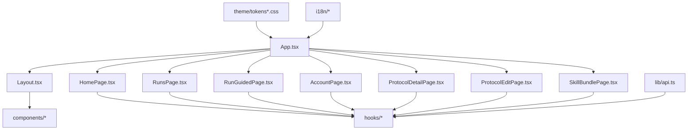
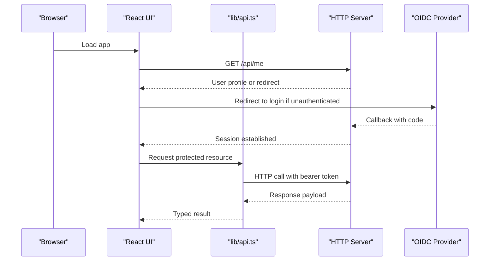
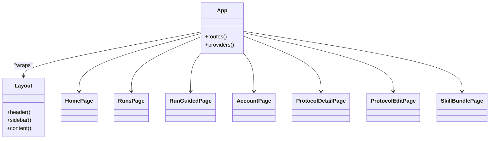
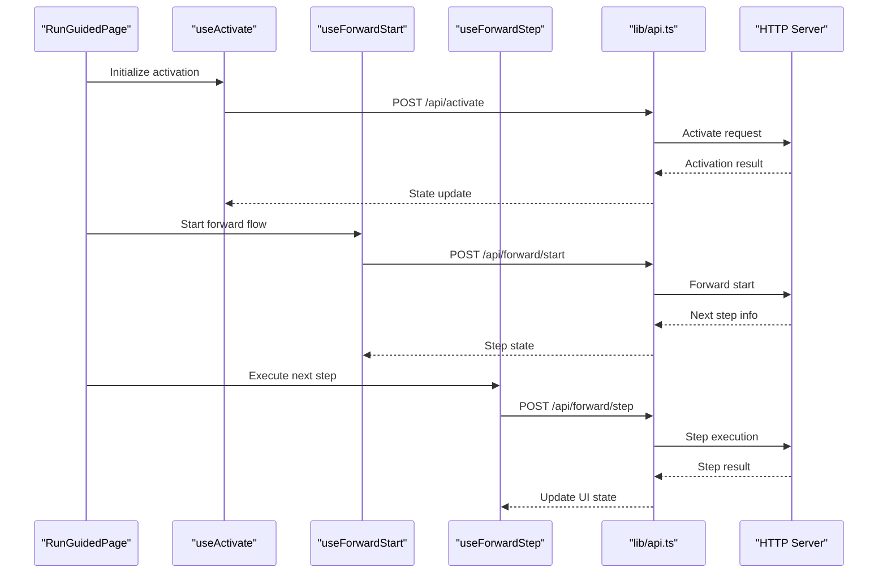
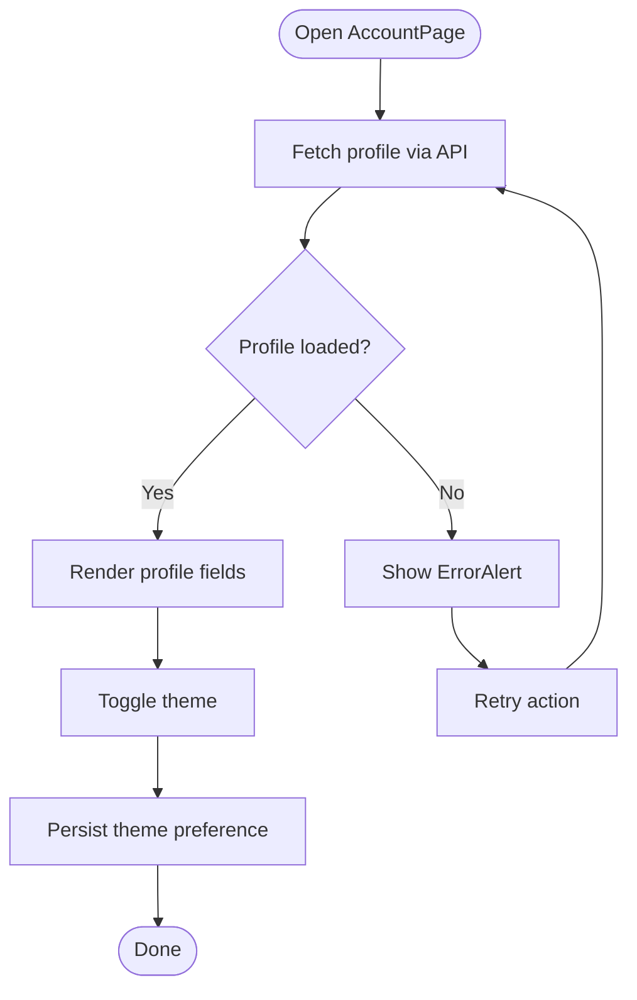
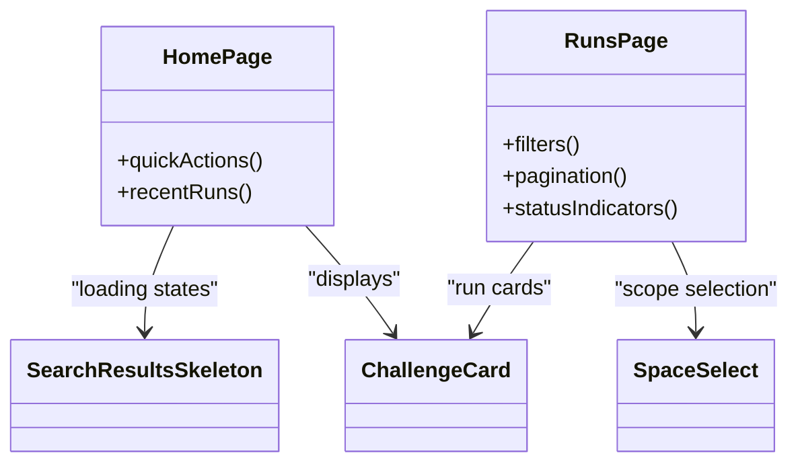
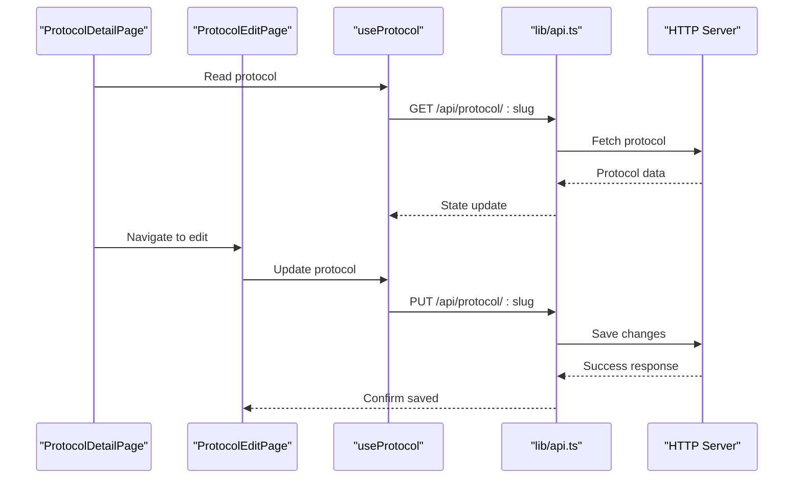
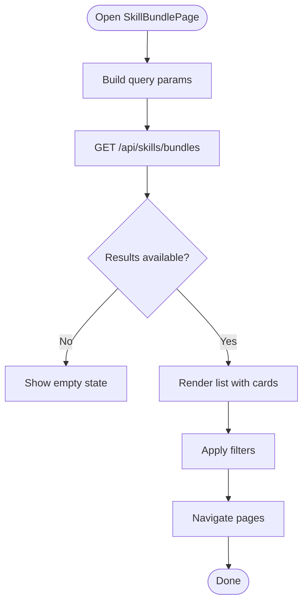
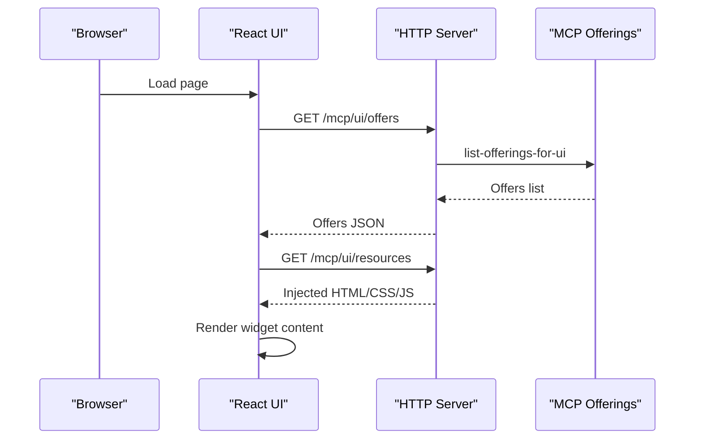
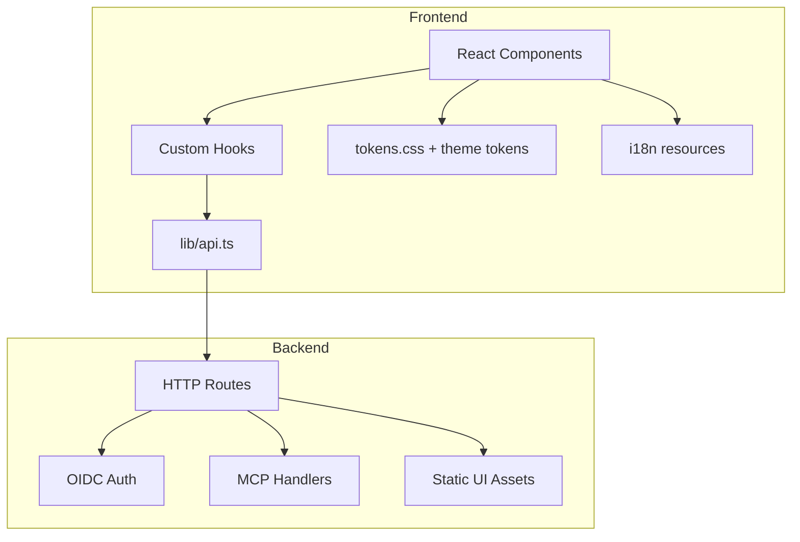

# Web Interface

<cite>
**Referenced Files in This Document**
- [src/ui/App.tsx](file://src/ui/App.tsx)
- [src/ui/main.tsx](file://src/ui/main.tsx)
- [src/ui/index.html](file://src/ui/index.html)
- [src/ui/pages/HomePage.tsx](file://src/ui/pages/HomePage.tsx)
- [src/ui/pages/RunsPage.tsx](file://src/ui/pages/RunsPage.tsx)
- [src/ui/pages/RunGuidedPage.tsx](file://src/ui/pages/RunGuidedPage.tsx)
- [src/ui/pages/AccountPage.tsx](file://src/ui/pages/AccountPage.tsx)
- [src/ui/pages/ProtocolDetailPage.tsx](file://src/ui/pages/ProtocolDetailPage.tsx)
- [src/ui/pages/ProtocolEditPage.tsx](file://src/ui/pages/ProtocolEditPage.tsx)
- [src/ui/pages/SkillBundlePage.tsx](file://src/ui/pages/SkillBundlePage.tsx)
- [src/ui/pages/kairos-page-sections.tsx](file://src/ui/pages/kairos-page-sections.tsx)
- [src/ui/components/Layout.tsx](file://src/ui/components/Layout.tsx)
- [src/ui/components/ChallengeCard.tsx](file://src/ui/components/ChallengeCard.tsx)
- [src/ui/components/CopyButton.tsx](file://src/ui/components/CopyButton.tsx)
- [src/ui/components/ErrorAlert.tsx](file://src/ui/components/ErrorAlert.tsx)
- [src/ui/components/RenderedMarkdown.tsx](file://src/ui/components/RenderedMarkdown.tsx)
- [src/ui/components/RichTextEditor.tsx](file://src/ui/components/RichTextEditor.tsx)
- [src/ui/components/SearchResultsSkeleton.tsx](file://src/ui/components/SearchResultsSkeleton.tsx)
- [src/ui/components/SpaceSelect.tsx](file://src/ui/components/SpaceSelect.tsx)
- [src/ui/components/StepFlowGraph.tsx](file://src/ui/components/StepFlowGraph.tsx)
- [src/ui/components/SurfaceCard.tsx](file://src/ui/components/SurfaceCard.tsx)
- [src/ui/hooks/useAuth.ts](file://src/ui/hooks/useAuth.ts)
- [src/ui/hooks/useThemePreference.tsx](file://src/ui/hooks/useThemePreference.tsx)
- [src/ui/hooks/useActivate.ts](file://src/ui/hooks/useActivate.ts)
- [src/ui/hooks/useForwardStart.ts](file://src/ui/hooks/useForwardStart.ts)
- [src/ui/hooks/useForwardStep.ts](file://src/ui/hooks/useForwardStep.ts)
- [src/ui/hooks/useProtocol.ts](file://src/ui/hooks/useProtocol.ts)
- [src/ui/hooks/useReward.ts](file://src/ui/hooks/useReward.ts)
- [src/ui/hooks/useRunSession.ts](file://src/ui/hooks/useRunSession.ts)
- [src/ui/hooks/useSpaces.ts](file://src/ui/hooks/useSpaces.ts)
- [src/ui/lib/api.ts](file://src/ui/lib/api.ts)
- [src/ui/theme/tokens.css](file://src/ui/theme/tokens.css)
- [src/ui/theme/tokens-shared.css](file://src/ui/theme/tokens-shared.css)
- [src/ui/theme/tokens-theme-light.css](file://src/ui/theme/tokens-theme-light.css)
- [src/ui/theme/tokens-theme-dark.css](file://src/ui/theme/tokens-theme-dark.css)
- [src/ui/i18n/en.json](file://src/ui/i18n/en.json)
- [src/ui/i18n/index.ts](file://src/ui/i18n/index.ts)
- [src/ui/utils/browse-adapters.ts](file://src/ui/utils/browse-adapters.ts)
- [src/ui/utils/confidence.ts](file://src/ui/utils/confidence.ts)
- [src/ui/utils/rich-text-editor-extensions.ts](file://src/ui/utils/rich-text-editor-extensions.ts)
- [src/mcp-apps/list-offerings-for-ui.ts](file://src/mcp-apps/list-offerings-for-ui.ts)
- [src/mcp-apps/register-spaces-ui-resources.ts](file://src/mcp-apps/register-spaces-ui-resources.ts)
- [src/mcp-apps/spaces-widget-html.ts](file://src/mcp-apps/spaces-widget-html.ts)
- [src/mcp-apps/spaces-mcp-app-widget-html.ts](file://src/mcp-apps/spaces-mcp-app-widget-html.ts)
- [src/mcp-apps/activate-widget-html.ts](file://src/mcp-apps/activate-widget-html.ts)
- [src/mcp-apps/forward-widget-html.ts](file://src/mcp-apps/forward-widget-html.ts)
- [src/mcp-apps/mcp-widget-presentation-inject.ts](file://src/mcp-apps/mcp-widget-presentation-inject.ts)
- [src/http/http-api-routes.ts](file://src/http/http-api-routes.ts)
- [src/http/http-auth-callback.ts](file://src/http/http-auth-callback.ts)
- [src/http/http-auth-oidc-redirect.ts](file://src/http/http-auth-oidc-redirect.ts)
- [src/http/http-auth-middleware.ts](file://src/http/http-auth-middleware.ts)
- [src/http/http-ui-static.ts](file://src/http/http-ui-static.ts)
- [src/http/http-mcp-handler.ts](file://src/http/http-mcp-handler.ts)
- [src/http/mcp-ui-offerings-auth-jsonrpc.ts](file://src/http/mcp-ui-offerings-auth-jsonrpc.ts)
</cite>

## Table of Contents
1. [Introduction](#introduction)
2. [Project Structure](#project-structure)
3. [Core Components](#core-components)
4. [Architecture Overview](#architecture-overview)
5. [Detailed Component Analysis](#detailed-component-analysis)
6. [Dependency Analysis](#dependency-analysis)
7. [Performance Considerations](#performance-considerations)
8. [Troubleshooting Guide](#troubleshooting-guide)
9. [Conclusion](#conclusion)
10. [Appendices](#appendices)

## Introduction
This document describes the Kairos MCP web interface, a React-based UI that provides user account management, dashboard and run workflows, protocol editing, skill bundle browsing, and extensible widget integrations. It explains the component architecture, page layouts, theming system, responsive design patterns, accessibility considerations, and the integration between frontend components and backend APIs. It also covers guidelines for developing custom widgets and UI extensions, as well as browser compatibility and performance optimization strategies.

## Project Structure
The web interface is organized under src/ui with clear separation of concerns:
- Pages define top-level routes and compose reusable components
- Components encapsulate UI logic and presentation
- Hooks provide stateful behavior and data access
- Theme tokens define CSS variables for light/dark themes
- i18n resources support internationalization
- Utilities include helpers for adapters, markdown rendering, and editor extensions
- The application entrypoint bootstraps routing, providers, and theme initialization

**Diagram sources**
- [src/ui/App.tsx](file://src/ui/App.tsx)
- [src/ui/components/Layout.tsx](file://src/ui/components/Layout.tsx)
- [src/ui/pages/HomePage.tsx](file://src/ui/pages/HomePage.tsx)
- [src/ui/pages/RunsPage.tsx](file://src/ui/pages/RunsPage.tsx)
- [src/ui/pages/RunGuidedPage.tsx](file://src/ui/pages/RunGuidedPage.tsx)
- [src/ui/pages/AccountPage.tsx](file://src/ui/pages/AccountPage.tsx)
- [src/ui/pages/ProtocolDetailPage.tsx](file://src/ui/pages/ProtocolDetailPage.tsx)
- [src/ui/pages/ProtocolEditPage.tsx](file://src/ui/pages/ProtocolEditPage.tsx)
- [src/ui/pages/SkillBundlePage.tsx](file://src/ui/pages/SkillBundlePage.tsx)
- [src/ui/theme/tokens.css](file://src/ui/theme/tokens.css)
- [src/ui/i18n/en.json](file://src/ui/i18n/en.json)
- [src/ui/lib/api.ts](file://src/ui/lib/api.ts)

**Section sources**
- [src/ui/App.tsx](file://src/ui/App.tsx)
- [src/ui/main.tsx](file://src/ui/main.tsx)
- [src/ui/index.html](file://src/ui/index.html)

## Core Components
- Layout: Provides global navigation, header, sidebar, and content shell; integrates authentication context and theme switching.
- HomePage: Entry point to dashboards, quick actions, and recent runs.
- RunsPage: Lists and filters runs, supports pagination and status indicators.
- RunGuidedPage: Orchestrates step-by-step guided flows using hooks for activation and forward steps.
- AccountPage: Displays current user profile and preferences (e.g., theme).
- ProtocolDetailPage and ProtocolEditPage: View and edit protocol definitions with rich text and validation.
- SkillBundlePage: Browse and manage skill bundles with search and filtering.

Reusable components:
- ChallengeCard: Presents challenge metadata and actions.
- CopyButton: Copies content to clipboard with feedback.
- ErrorAlert: Centralized error display with retry options.
- RenderedMarkdown: Renders Markdown safely with syntax highlighting.
- RichTextEditor: WYSIWYG editor with custom extensions.
- SearchResultsSkeleton: Loading placeholders for search results.
- SpaceSelect: Dropdown to select spaces for scoped operations.
- StepFlowGraph: Visualizes workflow step transitions.
- SurfaceCard: Card container with consistent elevation and padding.

Hooks:
- useAuth: Authentication state, login/logout, and session checks.
- useThemePreference: Persisted theme selection and toggling.
- useActivate, useForwardStart, useForwardStep: Orchestrate activation and forward flows.
- useProtocol: Fetch and mutate protocol data.
- useReward: Submit rewards and fetch evaluations.
- useRunSession: Manage active run sessions.
- useSpaces: List and filter spaces.

API layer:
- lib/api.ts: Centralized HTTP client configuration, request/response handling, and typed endpoints.

Theming:
- tokens.css and theme-specific token files define CSS variables for colors, typography, spacing, and breakpoints.

Internationalization:
- en.json and index.ts provide translation keys and loading utilities.

Utilities:
- browse-adapters.ts: Helpers for adapter discovery and filtering.
- confidence.ts: Confidence scoring helpers for UI displays.
- rich-text-editor-extensions.ts: Editor plugins and behaviors.

**Section sources**
- [src/ui/components/Layout.tsx](file://src/ui/components/Layout.tsx)
- [src/ui/pages/HomePage.tsx](file://src/ui/pages/HomePage.tsx)
- [src/ui/pages/RunsPage.tsx](file://src/ui/pages/RunsPage.tsx)
- [src/ui/pages/RunGuidedPage.tsx](file://src/ui/pages/RunGuidedPage.tsx)
- [src/ui/pages/AccountPage.tsx](file://src/ui/pages/AccountPage.tsx)
- [src/ui/pages/ProtocolDetailPage.tsx](file://src/ui/pages/ProtocolDetailPage.tsx)
- [src/ui/pages/ProtocolEditPage.tsx](file://src/ui/pages/ProtocolEditPage.tsx)
- [src/ui/pages/SkillBundlePage.tsx](file://src/ui/pages/SkillBundlePage.tsx)
- [src/ui/components/ChallengeCard.tsx](file://src/ui/components/ChallengeCard.tsx)
- [src/ui/components/CopyButton.tsx](file://src/ui/components/CopyButton.tsx)
- [src/ui/components/ErrorAlert.tsx](file://src/ui/components/ErrorAlert.tsx)
- [src/ui/components/RenderedMarkdown.tsx](file://src/ui/components/RenderedMarkdown.tsx)
- [src/ui/components/RichTextEditor.tsx](file://src/ui/components/RichTextEditor.tsx)
- [src/ui/components/SearchResultsSkeleton.tsx](file://src/ui/components/SearchResultsSkeleton.tsx)
- [src/ui/components/SpaceSelect.tsx](file://src/ui/components/SpaceSelect.tsx)
- [src/ui/components/StepFlowGraph.tsx](file://src/ui/components/StepFlowGraph.tsx)
- [src/ui/components/SurfaceCard.tsx](file://src/ui/components/SurfaceCard.tsx)
- [src/ui/hooks/useAuth.ts](file://src/ui/hooks/useAuth.ts)
- [src/ui/hooks/useThemePreference.tsx](file://src/ui/hooks/useThemePreference.tsx)
- [src/ui/hooks/useActivate.ts](file://src/ui/hooks/useActivate.ts)
- [src/ui/hooks/useForwardStart.ts](file://src/ui/hooks/useForwardStart.ts)
- [src/ui/hooks/useForwardStep.ts](file://src/ui/hooks/useForwardStep.ts)
- [src/ui/hooks/useProtocol.ts](file://src/ui/hooks/useProtocol.ts)
- [src/ui/hooks/useReward.ts](file://src/ui/hooks/useReward.ts)
- [src/ui/hooks/useRunSession.ts](file://src/ui/hooks/useRunSession.ts)
- [src/ui/hooks/useSpaces.ts](file://src/ui/hooks/useSpaces.ts)
- [src/ui/lib/api.ts](file://src/ui/lib/api.ts)
- [src/ui/theme/tokens.css](file://src/ui/theme/tokens.css)
- [src/ui/theme/tokens-theme-light.css](file://src/ui/theme/tokens-theme-light.css)
- [src/ui/theme/tokens-theme-dark.css](file://src/ui/theme/tokens-theme-dark.css)
- [src/ui/i18n/en.json](file://src/ui/i18n/en.json)
- [src/ui/i18n/index.ts](file://src/ui/i18n/index.ts)
- [src/ui/utils/browse-adapters.ts](file://src/ui/utils/browse-adapters.ts)
- [src/ui/utils/confidence.ts](file://src/ui/utils/confidence.ts)
- [src/ui/utils/rich-text-editor-extensions.ts](file://src/ui/utils/rich-text-editor-extensions.ts)

## Architecture Overview
The UI is a single-page application bootstrapped by main.tsx and App.tsx. Routing composes pages within a shared Layout. Data fetching is centralized through lib/api.ts, which wraps HTTP calls and handles auth headers. Authentication integrates with OIDC via backend redirects and callbacks. Widget integrations are injected into the UI through server-side resource registration and JSON-RPC offerings.

**Diagram sources**
- [src/ui/main.tsx](file://src/ui/main.tsx)
- [src/ui/App.tsx](file://src/ui/App.tsx)
- [src/ui/lib/api.ts](file://src/ui/lib/api.ts)
- [src/http/http-auth-callback.ts](file://src/http/http-auth-callback.ts)
- [src/http/http-auth-oidc-redirect.ts](file://src/http/http-auth-oidc-redirect.ts)
- [src/http/http-auth-middleware.ts](file://src/http/http-auth-middleware.ts)

## Detailed Component Analysis

### Application Shell and Routing
- App.tsx configures routes and composes pages.
- Layout.tsx provides global navigation, breadcrumbs, and content area.
- kairos-page-sections.tsx organizes page sections and layout fragments.

**Diagram sources**
- [src/ui/App.tsx](file://src/ui/App.tsx)
- [src/ui/components/Layout.tsx](file://src/ui/components/Layout.tsx)
- [src/ui/pages/kairos-page-sections.tsx](file://src/ui/pages/kairos-page-sections.tsx)

**Section sources**
- [src/ui/App.tsx](file://src/ui/App.tsx)
- [src/ui/components/Layout.tsx](file://src/ui/components/Layout.tsx)
- [src/ui/pages/kairos-page-sections.tsx](file://src/ui/pages/kairos-page-sections.tsx)

### Guided Run Flow
RunGuidedPage orchestrates activation and forward steps using dedicated hooks.

**Diagram sources**
- [src/ui/pages/RunGuidedPage.tsx](file://src/ui/pages/RunGuidedPage.tsx)
- [src/ui/hooks/useActivate.ts](file://src/ui/hooks/useActivate.ts)
- [src/ui/hooks/useForwardStart.ts](file://src/ui/hooks/useForwardStart.ts)
- [src/ui/hooks/useForwardStep.ts](file://src/ui/hooks/useForwardStep.ts)
- [src/ui/lib/api.ts](file://src/ui/lib/api.ts)

**Section sources**
- [src/ui/pages/RunGuidedPage.tsx](file://src/ui/pages/RunGuidedPage.tsx)
- [src/ui/hooks/useActivate.ts](file://src/ui/hooks/useActivate.ts)
- [src/ui/hooks/useForwardStart.ts](file://src/ui/hooks/useForwardStart.ts)
- [src/ui/hooks/useForwardStep.ts](file://src/ui/hooks/useForwardStep.ts)
- [src/ui/lib/api.ts](file://src/ui/lib/api.ts)

### Account Management
AccountPage displays user profile and allows preference changes such as theme selection.

**Diagram sources**
- [src/ui/pages/AccountPage.tsx](file://src/ui/pages/AccountPage.tsx)
- [src/ui/hooks/useAuth.ts](file://src/ui/hooks/useAuth.ts)
- [src/ui/hooks/useThemePreference.tsx](file://src/ui/hooks/useThemePreference.tsx)
- [src/ui/components/ErrorAlert.tsx](file://src/ui/components/ErrorAlert.tsx)
- [src/ui/lib/api.ts](file://src/ui/lib/api.ts)

**Section sources**
- [src/ui/pages/AccountPage.tsx](file://src/ui/pages/AccountPage.tsx)
- [src/ui/hooks/useAuth.ts](file://src/ui/hooks/useAuth.ts)
- [src/ui/hooks/useThemePreference.tsx](file://src/ui/hooks/useThemePreference.tsx)
- [src/ui/components/ErrorAlert.tsx](file://src/ui/components/ErrorAlert.tsx)
- [src/ui/lib/api.ts](file://src/ui/lib/api.ts)

### Dashboard and Runs
HomePage provides quick actions and overview metrics. RunsPage lists runs with filtering and pagination.

**Diagram sources**
- [src/ui/pages/HomePage.tsx](file://src/ui/pages/HomePage.tsx)
- [src/ui/pages/RunsPage.tsx](file://src/ui/pages/RunsPage.tsx)
- [src/ui/components/ChallengeCard.tsx](file://src/ui/components/ChallengeCard.tsx)
- [src/ui/components/SearchResultsSkeleton.tsx](file://src/ui/components/SearchResultsSkeleton.tsx)
- [src/ui/components/SpaceSelect.tsx](file://src/ui/components/SpaceSelect.tsx)

**Section sources**
- [src/ui/pages/HomePage.tsx](file://src/ui/pages/HomePage.tsx)
- [src/ui/pages/RunsPage.tsx](file://src/ui/pages/RunsPage.tsx)
- [src/ui/components/ChallengeCard.tsx](file://src/ui/components/ChallengeCard.tsx)
- [src/ui/components/SearchResultsSkeleton.tsx](file://src/ui/components/SearchResultsSkeleton.tsx)
- [src/ui/components/SpaceSelect.tsx](file://src/ui/components/SpaceSelect.tsx)

### Protocol Editing
ProtocolDetailPage shows protocol details; ProtocolEditPage enables editing with rich text and validation.

**Diagram sources**
- [src/ui/pages/ProtocolDetailPage.tsx](file://src/ui/pages/ProtocolDetailPage.tsx)
- [src/ui/pages/ProtocolEditPage.tsx](file://src/ui/pages/ProtocolEditPage.tsx)
- [src/ui/hooks/useProtocol.ts](file://src/ui/hooks/useProtocol.ts)
- [src/ui/lib/api.ts](file://src/ui/lib/api.ts)

**Section sources**
- [src/ui/pages/ProtocolDetailPage.tsx](file://src/ui/pages/ProtocolDetailPage.tsx)
- [src/ui/pages/ProtocolEditPage.tsx](file://src/ui/pages/ProtocolEditPage.tsx)
- [src/ui/hooks/useProtocol.ts](file://src/ui/hooks/useProtocol.ts)
- [src/ui/lib/api.ts](file://src/ui/lib/api.ts)

### Skill Bundle Browsing
SkillBundlePage provides search, filtering, and viewing of skill bundles.

**Diagram sources**
- [src/ui/pages/SkillBundlePage.tsx](file://src/ui/pages/SkillBundlePage.tsx)
- [src/ui/lib/api.ts](file://src/ui/lib/api.ts)

**Section sources**
- [src/ui/pages/SkillBundlePage.tsx](file://src/ui/pages/SkillBundlePage.tsx)
- [src/ui/lib/api.ts](file://src/ui/lib/api.ts)

### Widget System and Extensibility
The server registers UI resources and offers for specific flows (spaces, activate, forward). Widgets can inject HTML, CSS, and scripts into the UI.

**Diagram sources**
- [src/mcp-apps/list-offerings-for-ui.ts](file://src/mcp-apps/list-offerings-for-ui.ts)
- [src/mcp-apps/register-spaces-ui-resources.ts](file://src/mcp-apps/register-spaces-ui-resources.ts)
- [src/mcp-apps/spaces-widget-html.ts](file://src/mcp-apps/spaces-widget-html.ts)
- [src/mcp-apps/spaces-mcp-app-widget-html.ts](file://src/mcp-apps/spaces-mcp-app-widget-html.ts)
- [src/mcp-apps/activate-widget-html.ts](file://src/mcp-apps/activate-widget-html.ts)
- [src/mcp-apps/forward-widget-html.ts](file://src/mcp-apps/forward-widget-html.ts)
- [src/mcp-apps/mcp-widget-presentation-inject.ts](file://src/mcp-apps/mcp-widget-presentation-inject.ts)
- [src/http/http-mcp-handler.ts](file://src/http/http-mcp-handler.ts)
- [src/http/mcp-ui-offerings-auth-jsonrpc.ts](file://src/http/mcp-ui-offerings-auth-jsonrpc.ts)

**Section sources**
- [src/mcp-apps/list-offerings-for-ui.ts](file://src/mcp-apps/list-offerings-for-ui.ts)
- [src/mcp-apps/register-spaces-ui-resources.ts](file://src/mcp-apps/register-spaces-ui-resources.ts)
- [src/mcp-apps/spaces-widget-html.ts](file://src/mcp-apps/spaces-widget-html.ts)
- [src/mcp-apps/spaces-mcp-app-widget-html.ts](file://src/mcp-apps/spaces-mcp-app-widget-html.ts)
- [src/mcp-apps/activate-widget-html.ts](file://src/mcp-apps/activate-widget-html.ts)
- [src/mcp-apps/forward-widget-html.ts](file://src/mcp-apps/forward-widget-html.ts)
- [src/mcp-apps/mcp-widget-presentation-inject.ts](file://src/mcp-apps/mcp-widget-presentation-inject.ts)
- [src/http/http-mcp-handler.ts](file://src/http/http-mcp-handler.ts)
- [src/http/mcp-ui-offerings-auth-jsonrpc.ts](file://src/http/mcp-ui-offerings-auth-jsonrpc.ts)

## Dependency Analysis
Frontend dependencies:
- React components depend on hooks for state and side effects.
- Hooks rely on lib/api.ts for HTTP requests.
- Theming tokens are consumed across components via CSS variables.
- i18n resources are loaded at startup and used by components.

Backend integration points:
- Authentication uses OIDC redirect and callback endpoints.
- Protected routes require bearer tokens set by middleware.
- Static UI assets are served by the HTTP server.
- MCP UI offerings and resources are exposed via JSON-RPC and resource endpoints.

**Diagram sources**
- [src/ui/lib/api.ts](file://src/ui/lib/api.ts)
- [src/ui/theme/tokens.css](file://src/ui/theme/tokens.css)
- [src/ui/i18n/en.json](file://src/ui/i18n/en.json)
- [src/http/http-api-routes.ts](file://src/http/http-api-routes.ts)
- [src/http/http-auth-callback.ts](file://src/http/http-auth-callback.ts)
- [src/http/http-auth-oidc-redirect.ts](file://src/http/http-auth-oidc-redirect.ts)
- [src/http/http-auth-middleware.ts](file://src/http/http-auth-middleware.ts)
- [src/http/http-ui-static.ts](file://src/http/http-ui-static.ts)
- [src/http/http-mcp-handler.ts](file://src/http/http-mcp-handler.ts)

**Section sources**
- [src/ui/lib/api.ts](file://src/ui/lib/api.ts)
- [src/ui/theme/tokens.css](file://src/ui/theme/tokens.css)
- [src/ui/i18n/en.json](file://src/ui/i18n/en.json)
- [src/http/http-api-routes.ts](file://src/http/http-api-routes.ts)
- [src/http/http-auth-callback.ts](file://src/http/http-auth-callback.ts)
- [src/http/http-auth-oidc-redirect.ts](file://src/http/http-auth-oidc-redirect.ts)
- [src/http/http-auth-middleware.ts](file://src/http/http-auth-middleware.ts)
- [src/http/http-ui-static.ts](file://src/http/http-ui-static.ts)
- [src/http/http-mcp-handler.ts](file://src/http/http-mcp-handler.ts)

## Performance Considerations
- Prefer memoization and stable references in hooks to avoid unnecessary re-renders.
- Use skeleton loaders for heavy lists and search results to improve perceived performance.
- Defer non-critical widget injections until after initial render.
- Minimize network requests by batching where possible and leveraging caching headers from the server.
- Optimize images and assets; consider lazy-loading off-screen components.
- Keep theme token updates minimal; prefer CSS variable switches over inline styles.

[No sources needed since this section provides general guidance]

## Troubleshooting Guide
Common issues and resolutions:
- Authentication failures: Verify OIDC redirect and callback endpoints; ensure bearer token propagation via middleware.
- Widget injection errors: Check MCP offerings endpoint and resource registration; validate HTML/CSS/JS payloads.
- API errors: Inspect lib/api.ts error handling paths and server route responses.
- Theme not applying: Confirm tokens.css and theme token files are loaded and CSS variables are correctly scoped.
- i18n missing keys: Ensure en.json includes required keys and index.ts loads translations before rendering.

**Section sources**
- [src/ui/components/ErrorAlert.tsx](file://src/ui/components/ErrorAlert.tsx)
- [src/ui/lib/api.ts](file://src/ui/lib/api.ts)
- [src/http/http-auth-callback.ts](file://src/http/http-auth-callback.ts)
- [src/http/http-auth-oidc-redirect.ts](file://src/http/http-auth-oidc-redirect.ts)
- [src/http/http-auth-middleware.ts](file://src/http/http-auth-middleware.ts)
- [src/mcp-apps/mcp-widget-presentation-inject.ts](file://src/mcp-apps/mcp-widget-presentation-inject.ts)
- [src/ui/theme/tokens.css](file://src/ui/theme/tokens.css)
- [src/ui/i18n/en.json](file://src/ui/i18n/en.json)

## Conclusion
The Kairos MCP web interface combines a modular React architecture with robust backend integrations for authentication, MCP offerings, and static asset serving. Its theming system, internationalization, and reusable components enable a consistent and accessible user experience. The widget system facilitates extensibility by injecting UI resources into key flows. Following the guidelines here will help maintain performance, responsiveness, and accessibility while extending functionality through custom widgets and UI enhancements.

[No sources needed since this section summarizes without analyzing specific files]

## Appendices

### Guidelines for Developing Custom Widgets and UI Extensions
- Register UI resources via server-side registration modules to expose HTML, CSS, and JS.
- Implement MCP offerings listing to inform the UI about available widgets.
- Follow security best practices: sanitize injected content and restrict script execution scope.
- Test widget rendering across browsers and devices; ensure keyboard navigation and screen reader support.
- Use existing hooks and API layer to interact with backend services consistently.

**Section sources**
- [src/mcp-apps/register-spaces-ui-resources.ts](file://src/mcp-apps/register-spaces-ui-resources.ts)
- [src/mcp-apps/list-offerings-for-ui.ts](file://src/mcp-apps/list-offerings-for-ui.ts)
- [src/mcp-apps/spaces-widget-html.ts](file://src/mcp-apps/spaces-widget-html.ts)
- [src/mcp-apps/activate-widget-html.ts](file://src/mcp-apps/activate-widget-html.ts)
- [src/mcp-apps/forward-widget-html.ts](file://src/mcp-apps/forward-widget-html.ts)
- [src/mcp-apps/mcp-widget-presentation-inject.ts](file://src/mcp-apps/mcp-widget-presentation-inject.ts)

### Browser Compatibility and Mobile Responsiveness
- Leverage CSS variables for theming and responsive breakpoints defined in tokens files.
- Validate layout on common mobile viewports; ensure touch-friendly interactions.
- Avoid deprecated APIs; test on latest stable versions of major browsers.
- Use progressive enhancement for advanced features; degrade gracefully when unsupported.

**Section sources**
- [src/ui/theme/tokens.css](file://src/ui/theme/tokens.css)
- [src/ui/theme/tokens-theme-light.css](file://src/ui/theme/tokens-theme-light.css)
- [src/ui/theme/tokens-theme-dark.css](file://src/ui/theme/tokens-theme-dark.css)