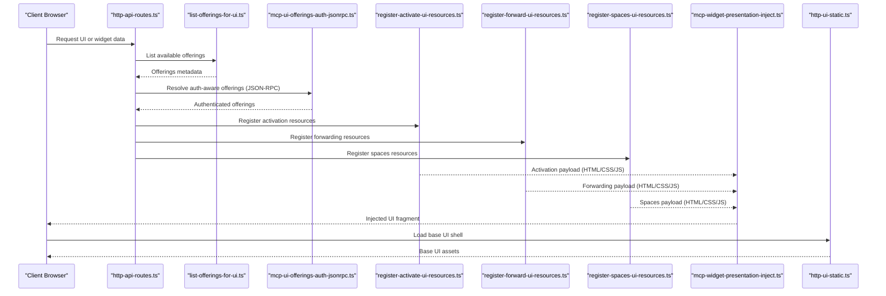
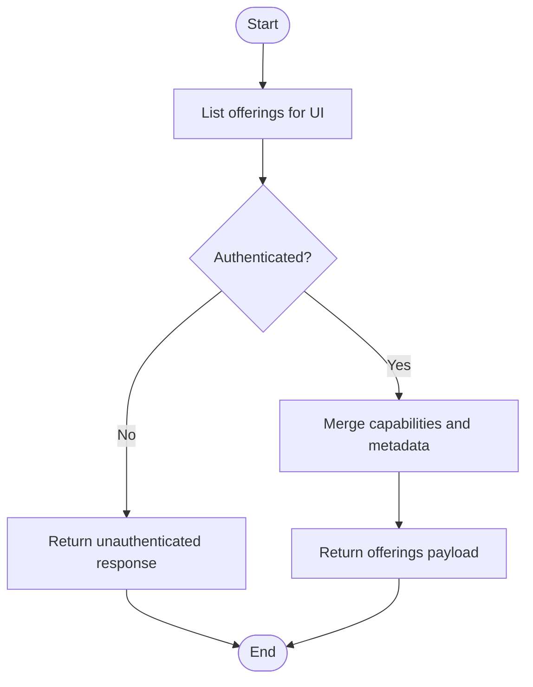
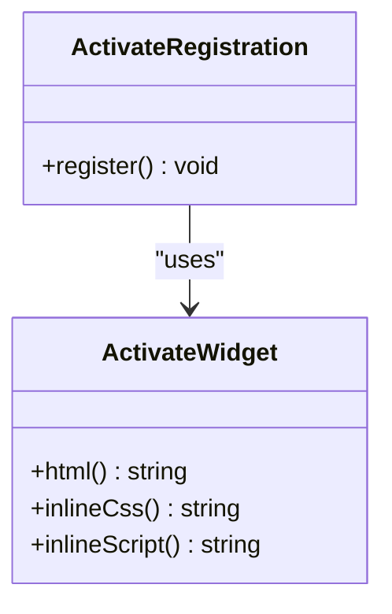
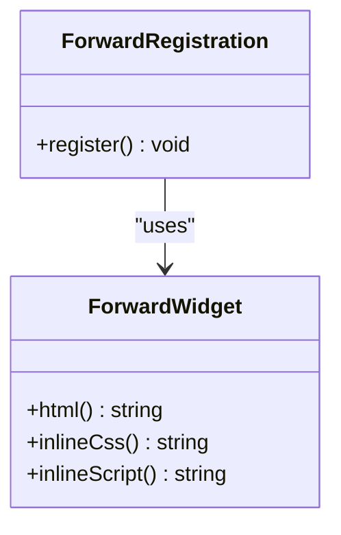
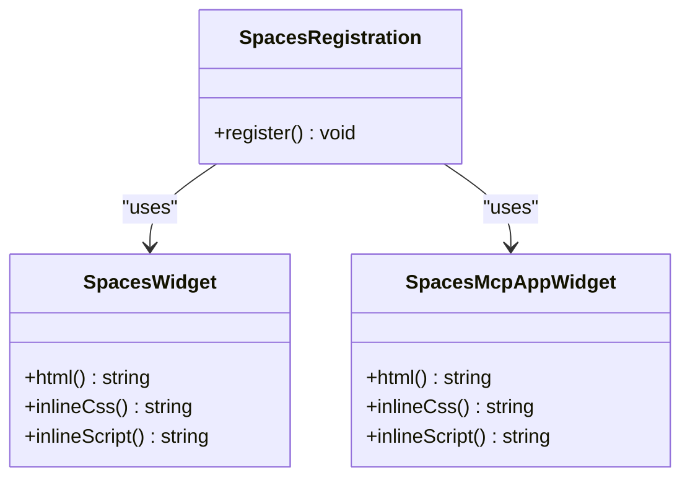
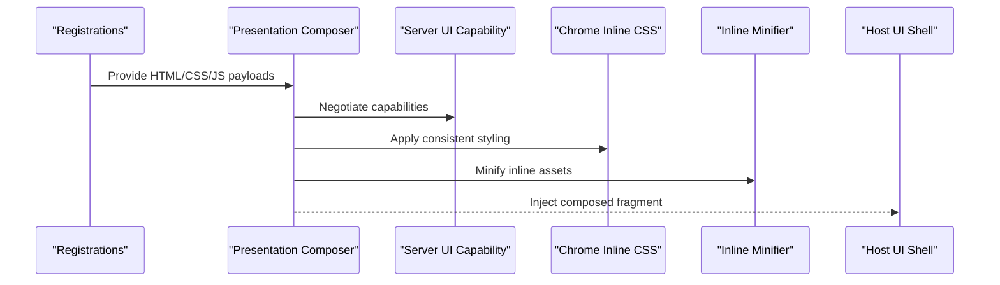
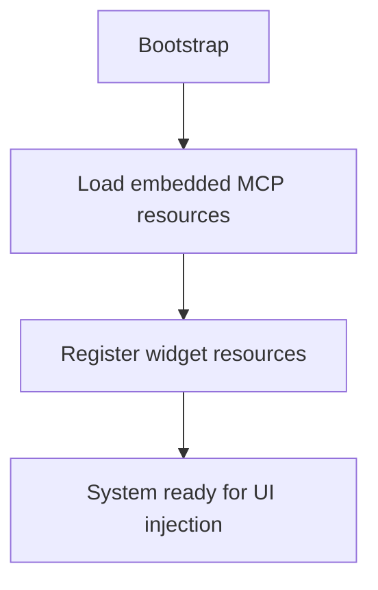
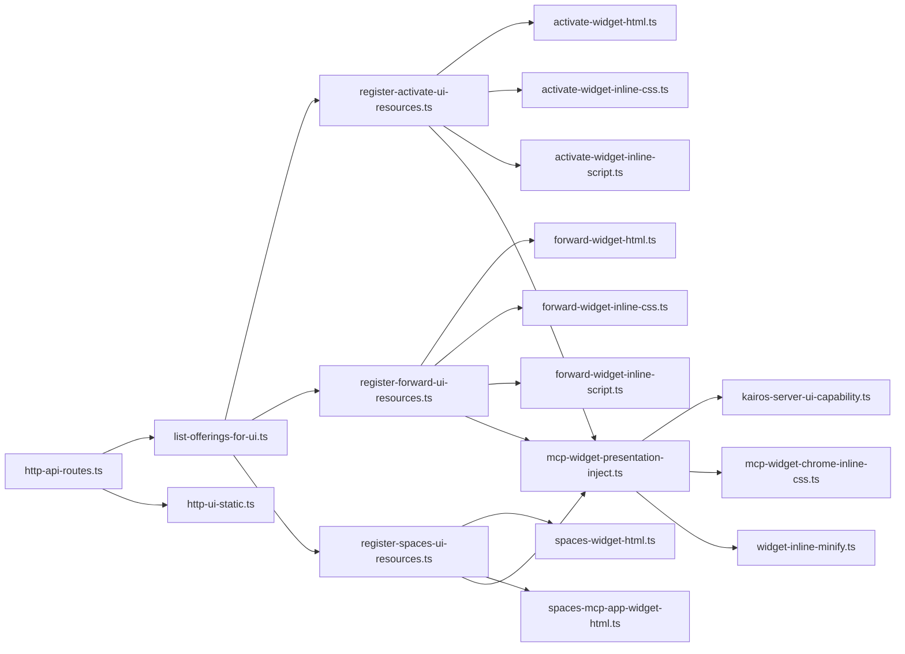

# Widget Extension System

<cite>
**Referenced Files in This Document**
- [mcp-ui-offerings-auth-jsonrpc.ts](file://src/http/mcp-ui-offerings-auth-jsonrpc.ts)
- [list-offerings-for-ui.ts](file://src/mcp-apps/list-offerings-for-ui.ts)
- [register-activate-ui-resources.ts](file://src/mcp-apps/register-activate-ui-resources.ts)
- [register-forward-ui-resources.ts](file://src/mcp-apps/register-forward-ui-resources.ts)
- [register-spaces-ui-resources.ts](file://src/mcp-apps/register-spaces-ui-resources.ts)
- [activate-widget-html.ts](file://src/mcp-apps/activate-widget-html.ts)
- [activate-widget-inline-css.ts](file://src/mcp-apps/activate-widget-inline-css.ts)
- [activate-widget-inline-script.ts](file://src/mcp-apps/activate-widget-inline-script.ts)
- [forward-widget-html.ts](file://src/mcp-apps/forward-widget-html.ts)
- [forward-widget-inline-css.ts](file://src/mcp-apps/forward-widget-inline-css.ts)
- [forward-widget-inline-script.ts](file://src/mcp-apps/forward-widget-inline-script.ts)
- [spaces-mcp-app-widget-html.ts](file://src/mcp-apps/spaces-mcp-app-widget-html.ts)
- [spaces-widget-html.ts](file://src/mcp-apps/spaces-widget-html.ts)
- [kairos-server-ui-capability.ts](file://src/mcp-apps/kairos-server-ui-capability.ts)
- [mcp-widget-presentation-inject.ts](file://src/mcp-apps/mcp-widget-presentation-inject.ts)
- [mcp-widget-chrome-inline-css.ts](file://src/mcp-apps/mcp-widget-chrome-inline-css.ts)
- [widget-inline-minify.ts](file://src/mcp-apps/widget-inline-minify.ts)
- [http-api-routes.ts](file://src/http/http-api-routes.ts)
- [http-ui-static.ts](file://src/http/http-ui-static.ts)
- [embedded-mcp-resources.ts](file://src/resources/embedded-mcp-resources.ts)
- [resource-bootstrap.ts](file://src/resources/resource-bootstrap.ts)
</cite>

## Table of Contents
1. [Introduction](#introduction)
2. [Project Structure](#project-structure)
3. [Core Components](#core-components)
4. [Architecture Overview](#architecture-overview)
5. [Detailed Component Analysis](#detailed-component-analysis)
6. [Dependency Analysis](#dependency-analysis)
7. [Performance Considerations](#performance-considerations)
8. [Troubleshooting Guide](#troubleshooting-guide)
9. [Conclusion](#conclusion)
10. [Appendices](#appendices)

## Introduction
This document explains the widget extension system that enables dynamic UI customization for activation, forwarding, and spaces workflows. It covers how widgets are registered, discovered, and presented to clients; how resources are managed and injected into the UI; and how security and sandboxing are enforced. It also provides guidance for building custom widgets with proper HTML structure, CSS isolation, and JavaScript execution context, along with debugging, performance monitoring, and troubleshooting advice.

## Project Structure
The widget system is implemented across HTTP endpoints, MCP offerings discovery, resource registration, and embedded UI assets:
- HTTP layer exposes routes and static UI serving.
- MCP offerings listing aggregates available widgets for the UI.
- Resource registration modules attach widget payloads (HTML/CSS/JS) to specific features.
- Embedded resources provide built-in widget implementations for activation, forwarding, and spaces.
- Presentation injection composes final UI content and injects it into the host page.

```mermaid
graph TB
subgraph "HTTP Layer"
R["http-api-routes.ts"]
S["http-ui-static.ts"]
end
subgraph "MCP Offerings"
L["list-offerings-for-ui.ts"]
O["mcp-ui-offerings-auth-jsonrpc.ts"]
end
subgraph "Resource Registration"
RA["register-activate-ui-resources.ts"]
RF["register-forward-ui-resources.ts"]
RS["register-spaces-ui-resources.ts"]
end
subgraph "Embedded Widgets"
WA["activate-widget-html.ts"]
WFC["forward-widget-html.ts"]
WS["spaces-widget-html.ts"]
WSA["spaces-mcp-app-widget-html.ts"]
end
subgraph "Presentation & Injection"
P["mcp-widget-presentation-inject.ts"]
C["kairos-server-ui-capability.ts"]
M["mcp-widget-chrome-inline-css.ts"]
I["widget-inline-minify.ts"]
end
subgraph "Resources"
E["embedded-mcp-resources.ts"]
B["resource-bootstrap.ts"]
end
R --> L
R --> S
L --> RA
L --> RF
L --> RS
RA --> WA
RF --> WFC
RS --> WS
RS --> WSA
RA --> P
RF --> P
RS --> P
P --> C
P --> M
P --> I
E --> B
```

**Diagram sources**
- [http-api-routes.ts](file://src/http/http-api-routes.ts)
- [http-ui-static.ts](file://src/http/http-ui-static.ts)
- [list-offerings-for-ui.ts](file://src/mcp-apps/list-offerings-for-ui.ts)
- [mcp-ui-offerings-auth-jsonrpc.ts](file://src/http/mcp-ui-offerings-auth-jsonrpc.ts)
- [register-activate-ui-resources.ts](file://src/mcp-apps/register-activate-ui-resources.ts)
- [register-forward-ui-resources.ts](file://src/mcp-apps/register-forward-ui-resources.ts)
- [register-spaces-ui-resources.ts](file://src/mcp-apps/register-spaces-ui-resources.ts)
- [activate-widget-html.ts](file://src/mcp-apps/activate-widget-html.ts)
- [forward-widget-html.ts](file://src/mcp-apps/forward-widget-html.ts)
- [spaces-widget-html.ts](file://src/mcp-apps/spaces-widget-html.ts)
- [spaces-mcp-app-widget-html.ts](file://src/mcp-apps/spaces-mcp-app-widget-html.ts)
- [mcp-widget-presentation-inject.ts](file://src/mcp-apps/mcp-widget-presentation-inject.ts)
- [kairos-server-ui-capability.ts](file://src/mcp-apps/kairos-server-ui-capability.ts)
- [mcp-widget-chrome-inline-css.ts](file://src/mcp-apps/mcp-widget-chrome-inline-css.ts)
- [widget-inline-minify.ts](file://src/mcp-apps/widget-inline-minify.ts)
- [embedded-mcp-resources.ts](file://src/resources/embedded-mcp-resources.ts)
- [resource-bootstrap.ts](file://src/resources/resource-bootstrap.ts)

**Section sources**
- [http-api-routes.ts](file://src/http/http-api-routes.ts)
- [http-ui-static.ts](file://src/http/http-ui-static.ts)
- [list-offerings-for-ui.ts](file://src/mcp-apps/list-offerings-for-ui.ts)
- [mcp-ui-offerings-auth-jsonrpc.ts](file://src/http/mcp-ui-offerings-auth-jsonrpc.ts)
- [register-activate-ui-resources.ts](file://src/mcp-apps/register-activate-ui-resources.ts)
- [register-forward-ui-resources.ts](file://src/mcp-apps/register-forward-ui-resources.ts)
- [register-spaces-ui-resources.ts](file://src/mcp-apps/register-spaces-ui-resources.ts)
- [activate-widget-html.ts](file://src/mcp-apps/activate-widget-html.ts)
- [forward-widget-html.ts](file://src/mcp-apps/forward-widget-html.ts)
- [spaces-widget-html.ts](file://src/mcp-apps/spaces-widget-html.ts)
- [spaces-mcp-app-widget-html.ts](file://src/mcp-apps/spaces-mcp-app-widget-html.ts)
- [mcp-widget-presentation-inject.ts](file://src/mcp-apps/mcp-widget-presentation-inject.ts)
- [kairos-server-ui-capability.ts](file://src/mcp-apps/kairos-server-ui-capability.ts)
- [mcp-widget-chrome-inline-css.ts](file://src/mcp-apps/mcp-widget-chrome-inline-css.ts)
- [widget-inline-minify.ts](file://src/mcp-apps/widget-inline-minify.ts)
- [embedded-mcp-resources.ts](file://src/resources/embedded-mcp-resources.ts)
- [resource-bootstrap.ts](file://src/resources/resource-bootstrap.ts)

## Core Components
- Offerings Discovery: Aggregates available widgets for the UI via MCP listings and authentication-aware JSON-RPC exposure.
- Resource Registration: Attaches widget payloads (HTML, inline CSS, inline scripts) to feature-specific contexts (activation, forwarding, spaces).
- Embedded Widgets: Built-in implementations for activation, forwarding, and spaces, including presentation composition and Chrome-style styling.
- Presentation Injection: Composes final UI fragments and injects them into the host page with capability negotiation and minification.
- Static UI Serving: Provides the base UI surface where widgets are rendered.

Key responsibilities:
- Discover and list widgets for the UI.
- Register and serve widget resources per feature.
- Build and inject widget HTML with isolated styles and safe scripts.
- Serve the UI shell and related assets.

**Section sources**
- [list-offerings-for-ui.ts](file://src/mcp-apps/list-offerings-for-ui.ts)
- [mcp-ui-offerings-auth-jsonrpc.ts](file://src/http/mcp-ui-offerings-auth-jsonrpc.ts)
- [register-activate-ui-resources.ts](file://src/mcp-apps/register-activate-ui-resources.ts)
- [register-forward-ui-resources.ts](file://src/mcp-apps/register-forward-ui-resources.ts)
- [register-spaces-ui-resources.ts](file://src/mcp-apps/register-spaces-ui-resources.ts)
- [activate-widget-html.ts](file://src/mcp-apps/activate-widget-html.ts)
- [forward-widget-html.ts](file://src/mcp-apps/forward-widget-html.ts)
- [spaces-widget-html.ts](file://src/mcp-apps/spaces-widget-html.ts)
- [spaces-mcp-app-widget-html.ts](file://src/mcp-apps/spaces-mcp-app-widget-html.ts)
- [mcp-widget-presentation-inject.ts](file://src/mcp-apps/mcp-widget-presentation-inject.ts)
- [kairos-server-ui-capability.ts](file://src/mcp-apps/kairos-server-ui-capability.ts)
- [mcp-widget-chrome-inline-css.ts](file://src/mcp-apps/mcp-widget-chrome-inline-css.ts)
- [widget-inline-minify.ts](file://src/mcp-apps/widget-inline-minify.ts)
- [http-ui-static.ts](file://src/http/http-ui-static.ts)

## Architecture Overview
The widget system integrates with the HTTP server and MCP offerings layer to present dynamic UI components within the application. The flow begins with route handling, which delegates to offerings discovery and resource registration. Registered resources include HTML templates, inline CSS, and inline scripts. The presentation layer composes these pieces and injects them into the UI shell.

**Diagram sources**
- [http-api-routes.ts](file://src/http/http-api-routes.ts)
- [list-offerings-for-ui.ts](file://src/mcp-apps/list-offerings-for-ui.ts)
- [mcp-ui-offerings-auth-jsonrpc.ts](file://src/http/mcp-ui-offerings-auth-jsonrpc.ts)
- [register-activate-ui-resources.ts](file://src/mcp-apps/register-activate-ui-resources.ts)
- [register-forward-ui-resources.ts](file://src/mcp-apps/register-forward-ui-resources.ts)
- [register-spaces-ui-resources.ts](file://src/mcp-apps/register-spaces-ui-resources.ts)
- [mcp-widget-presentation-inject.ts](file://src/mcp-apps/mcp-widget-presentation-inject.ts)
- [http-ui-static.ts](file://src/http/http-ui-static.ts)

## Detailed Component Analysis

### Offerings Discovery and Authentication
- Offerings listing aggregates widget capabilities for the UI.
- Authentication-aware JSON-RPC endpoint exposes offerings securely.

**Diagram sources**
- [list-offerings-for-ui.ts](file://src/mcp-apps/list-offerings-for-ui.ts)
- [mcp-ui-offerings-auth-jsonrpc.ts](file://src/http/mcp-ui-offerings-auth-jsonrpc.ts)

**Section sources**
- [list-offerings-for-ui.ts](file://src/mcp-apps/list-offerings-for-ui.ts)
- [mcp-ui-offerings-auth-jsonrpc.ts](file://src/http/mcp-ui-offerings-auth-jsonrpc.ts)

### Resource Registration: Activation
- Registers activation-related UI resources (HTML, inline CSS, inline script).
- Produces a cohesive payload for the activation workflow.

**Diagram sources**
- [register-activate-ui-resources.ts](file://src/mcp-apps/register-activate-ui-resources.ts)
- [activate-widget-html.ts](file://src/mcp-apps/activate-widget-html.ts)
- [activate-widget-inline-css.ts](file://src/mcp-apps/activate-widget-inline-css.ts)
- [activate-widget-inline-script.ts](file://src/mcp-apps/activate-widget-inline-script.ts)

**Section sources**
- [register-activate-ui-resources.ts](file://src/mcp-apps/register-activate-ui-resources.ts)
- [activate-widget-html.ts](file://src/mcp-apps/activate-widget-html.ts)
- [activate-widget-inline-css.ts](file://src/mcp-apps/activate-widget-inline-css.ts)
- [activate-widget-inline-script.ts](file://src/mcp-apps/activate-widget-inline-script.ts)

### Resource Registration: Forwarding
- Registers forwarding-related UI resources (HTML, inline CSS, inline script).
- Ensures consistent styling and behavior for forwarding flows.

**Diagram sources**
- [register-forward-ui-resources.ts](file://src/mcp-apps/register-forward-ui-resources.ts)
- [forward-widget-html.ts](file://src/mcp-apps/forward-widget-html.ts)
- [forward-widget-inline-css.ts](file://src/mcp-apps/forward-widget-inline-css.ts)
- [forward-widget-inline-script.ts](file://src/mcp-apps/forward-widget-inline-script.ts)

**Section sources**
- [register-forward-ui-resources.ts](file://src/mcp-apps/register-forward-ui-resources.ts)
- [forward-widget-html.ts](file://src/mcp-apps/forward-widget-html.ts)
- [forward-widget-inline-css.ts](file://src/mcp-apps/forward-widget-inline-css.ts)
- [forward-widget-inline-script.ts](file://src/mcp-apps/forward-widget-inline-script.ts)

### Resource Registration: Spaces
- Registers spaces-related UI resources (HTML, inline CSS, inline script).
- Supports both general spaces and MCP app-specific spaces.

**Diagram sources**
- [register-spaces-ui-resources.ts](file://src/mcp-apps/register-spaces-ui-resources.ts)
- [spaces-widget-html.ts](file://src/mcp-apps/spaces-widget-html.ts)
- [spaces-mcp-app-widget-html.ts](file://src/mcp-apps/spaces-mcp-app-widget-html.ts)

**Section sources**
- [register-spaces-ui-resources.ts](file://src/mcp-apps/register-spaces-ui-resources.ts)
- [spaces-widget-html.ts](file://src/mcp-apps/spaces-widget-html.ts)
- [spaces-mcp-app-widget-html.ts](file://src/mcp-apps/spaces-mcp-app-widget-html.ts)

### Presentation Composition and Injection
- Composes final UI fragments from registered resources.
- Applies capability negotiation, Chrome-style styling, and minification.
- Injects composed content into the host UI shell.

**Diagram sources**
- [mcp-widget-presentation-inject.ts](file://src/mcp-apps/mcp-widget-presentation-inject.ts)
- [kairos-server-ui-capability.ts](file://src/mcp-apps/kairos-server-ui-capability.ts)
- [mcp-widget-chrome-inline-css.ts](file://src/mcp-apps/mcp-widget-chrome-inline-css.ts)
- [widget-inline-minify.ts](file://src/mcp-apps/widget-inline-minify.ts)

**Section sources**
- [mcp-widget-presentation-inject.ts](file://src/mcp-apps/mcp-widget-presentation-inject.ts)
- [kairos-server-ui-capability.ts](file://src/mcp-apps/kairos-server-ui-capability.ts)
- [mcp-widget-chrome-inline-css.ts](file://src/mcp-apps/mcp-widget-chrome-inline-css.ts)
- [widget-inline-minify.ts](file://src/mcp-apps/widget-inline-minify.ts)

### Embedded Resources and Bootstrap
- Embedded MCP resources provide built-in widget definitions.
- Resource bootstrap initializes and wires up resources at startup.

**Diagram sources**
- [embedded-mcp-resources.ts](file://src/resources/embedded-mcp-resources.ts)
- [resource-bootstrap.ts](file://src/resources/resource-bootstrap.ts)

**Section sources**
- [embedded-mcp-resources.ts](file://src/resources/embedded-mcp-resources.ts)
- [resource-bootstrap.ts](file://src/resources/resource-bootstrap.ts)

## Dependency Analysis
The widget system exhibits clear separation between discovery, registration, and presentation layers. Dependencies flow from HTTP routes to offerings and registrations, culminating in presentation injection.

**Diagram sources**
- [http-api-routes.ts](file://src/http/http-api-routes.ts)
- [http-ui-static.ts](file://src/http/http-ui-static.ts)
- [list-offerings-for-ui.ts](file://src/mcp-apps/list-offerings-for-ui.ts)
- [register-activate-ui-resources.ts](file://src/mcp-apps/register-activate-ui-resources.ts)
- [register-forward-ui-resources.ts](file://src/mcp-apps/register-forward-ui-resources.ts)
- [register-spaces-ui-resources.ts](file://src/mcp-apps/register-spaces-ui-resources.ts)
- [activate-widget-html.ts](file://src/mcp-apps/activate-widget-html.ts)
- [activate-widget-inline-css.ts](file://src/mcp-apps/activate-widget-inline-css.ts)
- [activate-widget-inline-script.ts](file://src/mcp-apps/activate-widget-inline-script.ts)
- [forward-widget-html.ts](file://src/mcp-apps/forward-widget-html.ts)
- [forward-widget-inline-css.ts](file://src/mcp-apps/forward-widget-inline-css.ts)
- [forward-widget-inline-script.ts](file://src/mcp-apps/forward-widget-inline-script.ts)
- [spaces-widget-html.ts](file://src/mcp-apps/spaces-widget-html.ts)
- [spaces-mcp-app-widget-html.ts](file://src/mcp-apps/spaces-mcp-app-widget-html.ts)
- [mcp-widget-presentation-inject.ts](file://src/mcp-apps/mcp-widget-presentation-inject.ts)
- [kairos-server-ui-capability.ts](file://src/mcp-apps/kairos-server-ui-capability.ts)
- [mcp-widget-chrome-inline-css.ts](file://src/mcp-apps/mcp-widget-chrome-inline-css.ts)
- [widget-inline-minify.ts](file://src/mcp-apps/widget-inline-minify.ts)

**Section sources**
- [http-api-routes.ts](file://src/http/http-api-routes.ts)
- [http-ui-static.ts](file://src/http/http-ui-static.ts)
- [list-offerings-for-ui.ts](file://src/mcp-apps/list-offerings-for-ui.ts)
- [register-activate-ui-resources.ts](file://src/mcp-apps/register-activate-ui-resources.ts)
- [register-forward-ui-resources.ts](file://src/mcp-apps/register-forward-ui-resources.ts)
- [register-spaces-ui-resources.ts](file://src/mcp-apps/register-spaces-ui-resources.ts)
- [activate-widget-html.ts](file://src/mcp-apps/activate-widget-html.ts)
- [activate-widget-inline-css.ts](file://src/mcp-apps/activate-widget-inline-css.ts)
- [activate-widget-inline-script.ts](file://src/mcp-apps/activate-widget-inline-script.ts)
- [forward-widget-html.ts](file://src/mcp-apps/forward-widget-html.ts)
- [forward-widget-inline-css.ts](file://src/mcp-apps/forward-widget-inline-css.ts)
- [forward-widget-inline-script.ts](file://src/mcp-apps/forward-widget-inline-script.ts)
- [spaces-widget-html.ts](file://src/mcp-apps/spaces-widget-html.ts)
- [spaces-mcp-app-widget-html.ts](file://src/mcp-apps/spaces-mcp-app-widget-html.ts)
- [mcp-widget-presentation-inject.ts](file://src/mcp-apps/mcp-widget-presentation-inject.ts)
- [kairos-server-ui-capability.ts](file://src/mcp-apps/kairos-server-ui-capability.ts)
- [mcp-widget-chrome-inline-css.ts](file://src/mcp-apps/mcp-widget-chrome-inline-css.ts)
- [widget-inline-minify.ts](file://src/mcp-apps/widget-inline-minify.ts)

## Performance Considerations
- Prefer inline minification for small assets to reduce network overhead.
- Cache widget payloads at the server level when possible to avoid recomposition on each request.
- Use capability negotiation to skip unnecessary styles/scripts for unsupported clients.
- Keep widget HTML minimal and modular to reduce DOM size and improve rendering speed.
- Monitor memory usage during resource registration to prevent leaks in long-running processes.

[No sources needed since this section provides general guidance]

## Troubleshooting Guide
Common issues and resolutions:
- Missing widget in UI: Verify offerings listing includes the widget and that authentication allows access.
- Styles not applied: Ensure Chrome-style CSS is included and minification did not strip required selectors.
- Scripts not executing: Confirm inline script registration and check browser console for errors.
- Injection failures: Validate capability negotiation results and inspect presentation composer logs.
- Static UI not loading: Check static asset routes and ensure the UI shell is served correctly.

**Section sources**
- [list-offerings-for-ui.ts](file://src/mcp-apps/list-offerings-for-ui.ts)
- [mcp-ui-offerings-auth-jsonrpc.ts](file://src/http/mcp-ui-offerings-auth-jsonrpc.ts)
- [mcp-widget-chrome-inline-css.ts](file://src/mcp-apps/mcp-widget-chrome-inline-css.ts)
- [widget-inline-minify.ts](file://src/mcp-apps/widget-inline-minify.ts)
- [mcp-widget-presentation-inject.ts](file://src/mcp-apps/mcp-widget-presentation-inject.ts)
- [http-ui-static.ts](file://src/http/http-ui-static.ts)

## Conclusion
The widget extension system provides a structured approach to dynamic UI customization through offerings discovery, resource registration, and secure presentation injection. Built-in widgets for activation, forwarding, and spaces demonstrate consistent patterns for HTML structure, CSS isolation, and JavaScript execution. By following the guidelines and leveraging the provided components, developers can create robust, secure, and performant custom widgets.

[No sources needed since this section summarizes without analyzing specific files]

## Appendices

### Creating Custom Widgets
Guidelines for building custom widgets:
- HTML structure:
  - Use semantic elements and scoped IDs/classes to avoid conflicts.
  - Keep markup minimal and focused on the widget’s purpose.
- CSS isolation:
  - Scope styles to a unique container to prevent leakage.
  - Leverage Chrome-style utilities for consistency.
- JavaScript execution context:
  - Avoid global state; encapsulate logic within module scopes.
  - Use capability checks before invoking advanced features.
- Resource registration:
  - Implement registration functions for HTML, inline CSS, and inline script.
  - Integrate with the presentation injector to compose and deliver the widget.
- Security considerations:
  - Sanitize user inputs and avoid dangerous APIs.
  - Enforce origin checks and restrict cross-origin requests.
- Debugging:
  - Enable verbose logging during development.
  - Inspect network payloads and browser console for errors.
- Performance:
  - Minimize DOM operations and prefer efficient updates.
  - Profile rendering and script execution to identify bottlenecks.

[No sources needed since this section provides general guidance]