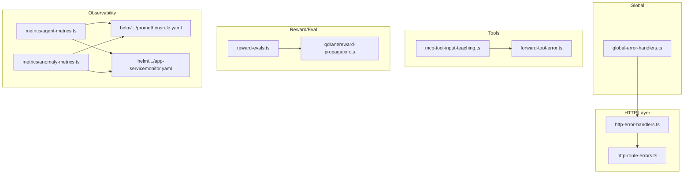
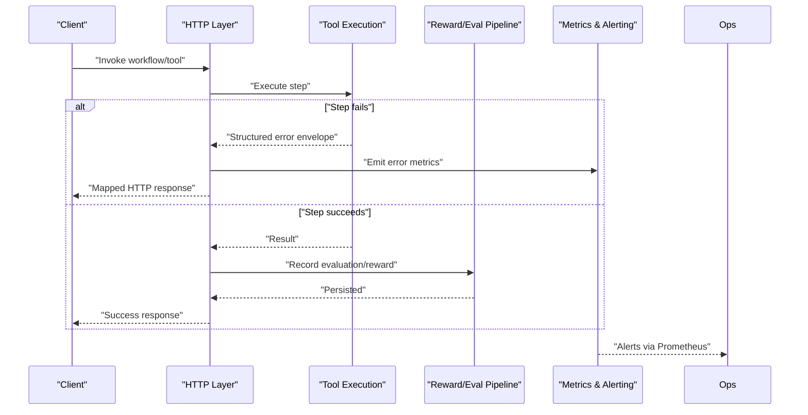
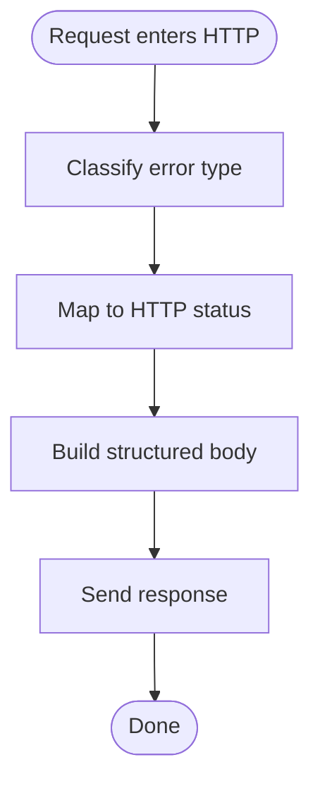
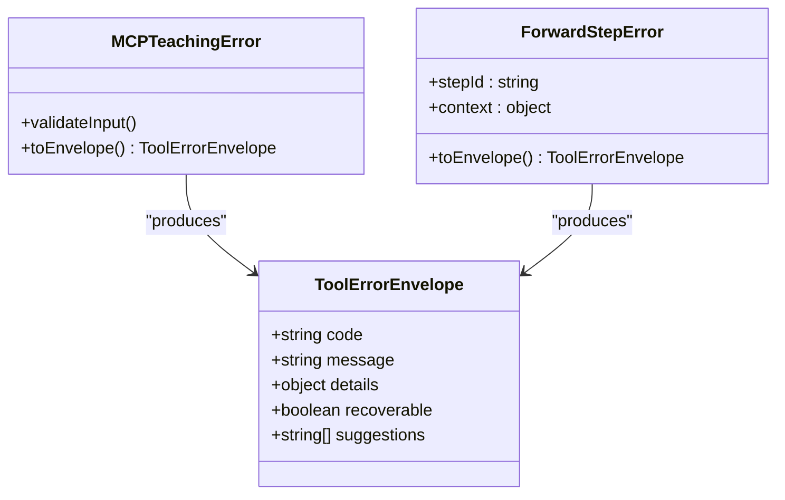
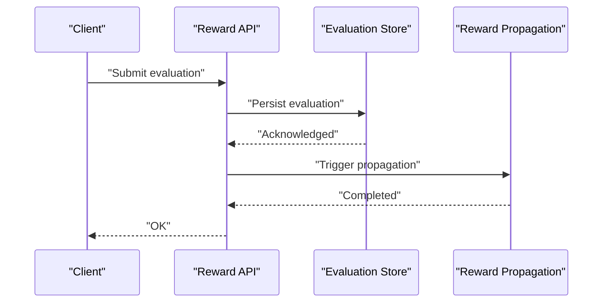
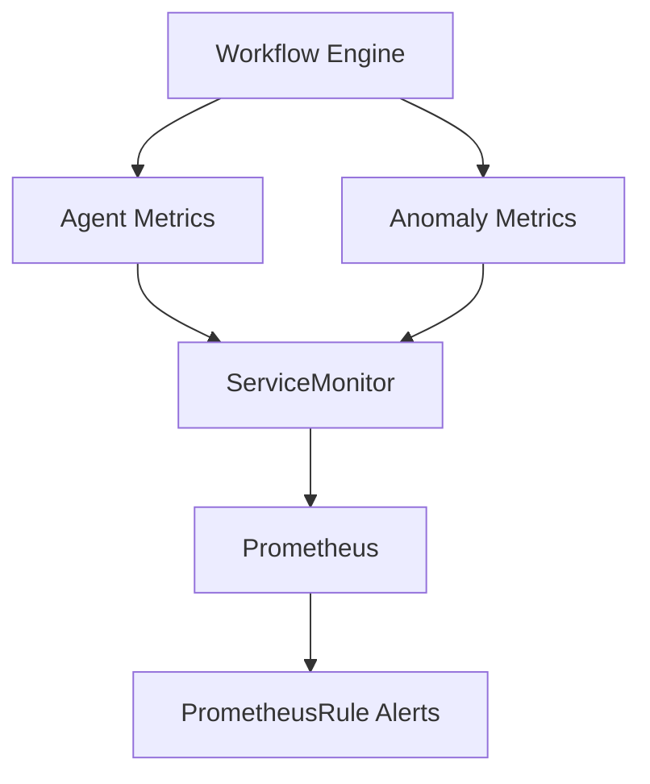
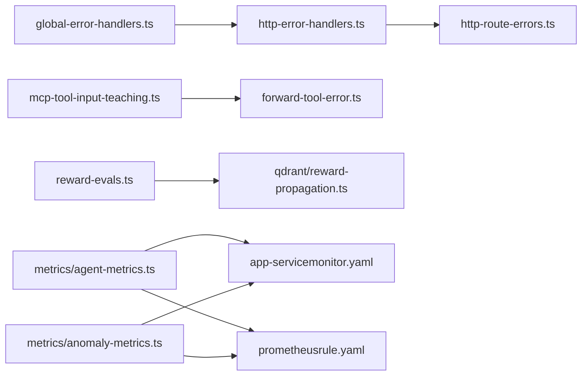

# Error Handling and Recovery

<cite>
**Referenced Files in This Document**
- [http-error-handlers.ts](file://src/http/http-error-handlers.ts)
- [http-route-errors.ts](file://src/http/http-route-errors.ts)
- [global-error-handlers.ts](file://src/utils/global-error-handlers.ts)
- [mcp-tool-input-teaching.ts](file://src/tools/mcp-tool-input-teaching.ts)
- [forward-tool-error.ts](file://src/tools/forward-tool-error.ts)
- [reward-evals.ts](file://src/services/reward-evals.ts)
- [qdrant-reward-propagation.ts](file://src/services/qdrant/reward-propagation.ts)
- [agent-metrics.ts](file://src/services/metrics/agent-metrics.ts)
- [anomaly-metrics.ts](file://src/services/metrics/anomaly-metrics.ts)
- [prometheusrule.yaml](file://helm/kairos-mcp/templates/prometheusrule.yaml)
- [app-servicemonitor.yaml](file://helm/kairos-mcp/templates/app-servicemonitor.yaml)
- [incident-runbook.md](file://docs/security/incident-runbook.md)
- [logging.md](file://docs/architecture/logging.md)
</cite>

## Table of Contents
1. [Introduction](#introduction)
2. [Project Structure](#project-structure)
3. [Core Components](#core-components)
4. [Architecture Overview](#architecture-overview)
5. [Detailed Component Analysis](#detailed-component-analysis)
6. [Dependency Analysis](#dependency-analysis)
7. [Performance Considerations](#performance-considerations)
8. [Troubleshooting Guide](#troubleshooting-guide)
9. [Conclusion](#conclusion)
10. [Appendices](#appendices)

## Introduction
This document explains the error handling and recovery mechanisms implemented across the workflow engine, focusing on:
- Error classification and propagation patterns
- Fault tolerance strategies including retry with exponential backoff and circuit breaker concepts
- Fallback mechanisms and manual intervention workflows (human-in-the-loop)
- Reward and evaluation system for quality assessment and continuous improvement
- Monitoring, alerting, and debugging tools
- Examples of custom error handlers and recovery strategies for different failure scenarios

The goal is to provide both a conceptual overview and concrete code-level references so that engineers can implement robust error handling and recovery in their own adapters and tools.

## Project Structure
Error handling spans HTTP layer, tool execution, metrics/alerting, and reward/evaluation flows. Key areas include:
- HTTP error mapping and route-level error responses
- Global unhandled exception handling
- Tool-specific error shaping for MCP and forward flows
- Reward and evaluation persistence and propagation
- Metrics collection and Prometheus integration for observability
- Security incident runbooks and logging guidance

**Diagram sources**
- [http-error-handlers.ts](file://src/http/http-error-handlers.ts)
- [http-route-errors.ts](file://src/http/http-route-errors.ts)
- [global-error-handlers.ts](file://src/utils/global-error-handlers.ts)
- [mcp-tool-input-teaching.ts](file://src/tools/mcp-tool-input-teaching.ts)
- [forward-tool-error.ts](file://src/tools/forward-tool-error.ts)
- [reward-evals.ts](file://src/services/reward-evals.ts)
- [qdrant-reward-propagation.ts](file://src/services/qdrant/reward-propagation.ts)
- [agent-metrics.ts](file://src/services/metrics/agent-metrics.ts)
- [anomaly-metrics.ts](file://src/services/metrics/anomaly-metrics.ts)
- [prometheusrule.yaml](file://helm/kairos-mcp/templates/prometheusrule.yaml)
- [app-servicemonitor.yaml](file://helm/kairos-mcp/templates/app-servicemonitor.yaml)

**Section sources**
- [http-error-handlers.ts](file://src/http/http-error-handlers.ts)
- [http-route-errors.ts](file://src/http/http-route-errors.ts)
- [global-error-handlers.ts](file://src/utils/global-error-handlers.ts)
- [mcp-tool-input-teaching.ts](file://src/tools/mcp-tool-input-teaching.ts)
- [forward-tool-error.ts](file://src/tools/forward-tool-error.ts)
- [reward-evals.ts](file://src/services/reward-evals.ts)
- [qdrant-reward-propagation.ts](file://src/services/qdrant/reward-propagation.ts)
- [agent-metrics.ts](file://src/services/metrics/agent-metrics.ts)
- [anomaly-metrics.ts](file://src/services/metrics/anomaly-metrics.ts)
- [prometheusrule.yaml](file://helm/kairos-mcp/templates/prometheusrule.yaml)
- [app-servicemonitor.yaml](file://helm/kairos-mcp/templates/app-servicemonitor.yaml)

## Core Components
- HTTP error mapping: Centralized mapping from domain errors to HTTP status codes and structured JSON responses.
- Route-level error helpers: Reusable utilities to produce consistent error payloads across endpoints.
- Global error handlers: Catch-all logic for unhandled exceptions and unexpected states.
- Tool error shaping: Standardized error envelopes for MCP tool calls and forward step failures.
- Reward and evaluation pipeline: Persisted evaluations and propagated rewards used for model tuning and quality feedback.
- Observability: Metrics emission and Prometheus rules/service monitors for alerting.

**Section sources**
- [http-error-handlers.ts](file://src/http/http-error-handlers.ts)
- [http-route-errors.ts](file://src/http/http-route-errors.ts)
- [global-error-handlers.ts](file://src/utils/global-error-handlers.ts)
- [mcp-tool-input-teaching.ts](file://src/tools/mcp-tool-input-teaching.ts)
- [forward-tool-error.ts](file://src/tools/forward-tool-error.ts)
- [reward-evals.ts](file://src/services/reward-evals.ts)
- [qdrant-reward-propagation.ts](file://src/services/qdrant/reward-propagation.ts)
- [agent-metrics.ts](file://src/services/metrics/agent-metrics.ts)
- [anomaly-metrics.ts](file://src/services/metrics/anomaly-metrics.ts)

## Architecture Overview
End-to-end error flow across layers:

**Diagram sources**
- [http-error-handlers.ts](file://src/http/http-error-handlers.ts)
- [mcp-tool-input-teaching.ts](file://src/tools/mcp-tool-input-teaching.ts)
- [forward-tool-error.ts](file://src/tools/forward-tool-error.ts)
- [reward-evals.ts](file://src/services/reward-evals.ts)
- [agent-metrics.ts](file://src/services/metrics/agent-metrics.ts)
- [anomaly-metrics.ts](file://src/services/metrics/anomaly-metrics.ts)

## Detailed Component Analysis

### HTTP Error Mapping and Propagation
Responsibilities:
- Map internal errors to standardized HTTP responses
- Provide reusable helpers for common error shapes
- Ensure consistent content types and error fields

Key behaviors:
- Centralized mapping function(s) translate domain errors into HTTP status codes and bodies
- Route-level helpers encapsulate repeated error construction patterns
- Global handler ensures no uncaught exceptions escape to the transport layer

**Diagram sources**
- [http-error-handlers.ts](file://src/http/http-error-handlers.ts)
- [http-route-errors.ts](file://src/http/http-route-errors.ts)

**Section sources**
- [http-error-handlers.ts](file://src/http/http-error-handlers.ts)
- [http-route-errors.ts](file://src/http/http-route-errors.ts)

### Global Unhandled Exception Handling
Responsibilities:
- Catch unhandled promise rejections and synchronous exceptions
- Normalize them into safe, non-leaking responses
- Emit diagnostic metrics and logs

Best practices:
- Avoid exposing stack traces or secrets in production responses
- Include correlation IDs for tracing
- Record anomaly metrics for unusual error rates

**Section sources**
- [global-error-handlers.ts](file://src/utils/global-error-handlers.ts)

### Tool Error Envelopes (MCP and Forward)
Responsibilities:
- Shape tool errors into a uniform envelope consumed by clients and UI
- Preserve actionable details (e.g., validation messages, retry hints)
- Support human-readable guidance for failed steps

Patterns:
- MCP input teaching errors are normalized before being returned to callers
- Forward step errors carry context needed for resuming or manual intervention

**Diagram sources**
- [mcp-tool-input-teaching.ts](file://src/tools/mcp-tool-input-teaching.ts)
- [forward-tool-error.ts](file://src/tools/forward-tool-error.ts)

**Section sources**
- [mcp-tool-input-teaching.ts](file://src/tools/mcp-tool-input-teaching.ts)
- [forward-tool-error.ts](file://src/tools/forward-tool-error.ts)

### Reward and Evaluation System
Responsibilities:
- Capture user or automated evaluations for outputs
- Persist evaluations and propagate rewards to downstream systems
- Feed signals into training/tuning pipelines

Flow:
- Evaluate result -> persist evaluation -> propagate reward -> update indexes/models

**Diagram sources**
- [reward-evals.ts](file://src/services/reward-evals.ts)
- [qdrant-reward-propagation.ts](file://src/services/qdrant/reward-propagation.ts)

**Section sources**
- [reward-evals.ts](file://src/services/reward-evals.ts)
- [qdrant-reward-propagation.ts](file://src/services/qdrant/reward-propagation.ts)

### Observability, Monitoring, and Alerting
Responsibilities:
- Emit operational metrics for errors, retries, and anomalies
- Expose metrics for Prometheus scraping
- Define alerting rules for critical conditions

Components:
- Agent metrics for workflow-level counters
- Anomaly metrics for detecting unusual error spikes
- Prometheus ServiceMonitor and Rule resources for scraping and alerting

**Diagram sources**
- [agent-metrics.ts](file://src/services/metrics/agent-metrics.ts)
- [anomaly-metrics.ts](file://src/services/metrics/anomaly-metrics.ts)
- [app-servicemonitor.yaml](file://helm/kairos-mcp/templates/app-servicemonitor.yaml)
- [prometheusrule.yaml](file://helm/kairos-mcp/templates/prometheusrule.yaml)

**Section sources**
- [agent-metrics.ts](file://src/services/metrics/agent-metrics.ts)
- [anomaly-metrics.ts](file://src/services/metrics/anomaly-metrics.ts)
- [app-servicemonitor.yaml](file://helm/kairos-mcp/templates/app-servicemonitor.yaml)
- [prometheusrule.yaml](file://helm/kairos-mcp/templates/prometheusrule.yaml)

## Dependency Analysis
- HTTP error mapping depends on global error handlers to ensure consistent behavior at boundaries.
- Tool error envelopes depend on shared structures to keep client contracts stable.
- Reward pipeline depends on storage and propagation services; it should be resilient to transient failures.
- Metrics and alerting depend on exporters and Kubernetes monitoring components.

**Diagram sources**
- [global-error-handlers.ts](file://src/utils/global-error-handlers.ts)
- [http-error-handlers.ts](file://src/http/http-error-handlers.ts)
- [http-route-errors.ts](file://src/http/http-route-errors.ts)
- [mcp-tool-input-teaching.ts](file://src/tools/mcp-tool-input-teaching.ts)
- [forward-tool-error.ts](file://src/tools/forward-tool-error.ts)
- [reward-evals.ts](file://src/services/reward-evals.ts)
- [qdrant-reward-propagation.ts](file://src/services/qdrant/reward-propagation.ts)
- [agent-metrics.ts](file://src/services/metrics/agent-metrics.ts)
- [anomaly-metrics.ts](file://src/services/metrics/anomaly-metrics.ts)
- [app-servicemonitor.yaml](file://helm/kairos-mcp/templates/app-servicemonitor.yaml)
- [prometheusrule.yaml](file://helm/kairos-mcp/templates/prometheusrule.yaml)

**Section sources**
- [global-error-handlers.ts](file://src/utils/global-error-handlers.ts)
- [http-error-handlers.ts](file://src/http/http-error-handlers.ts)
- [http-route-errors.ts](file://src/http/http-route-errors.ts)
- [mcp-tool-input-teaching.ts](file://src/tools/mcp-tool-input-teaching.ts)
- [forward-tool-error.ts](file://src/tools/forward-tool-error.ts)
- [reward-evals.ts](file://src/services/reward-evals.ts)
- [qdrant-reward-propagation.ts](file://src/services/qdrant/reward-propagation.ts)
- [agent-metrics.ts](file://src/services/metrics/agent-metrics.ts)
- [anomaly-metrics.ts](file://src/services/metrics/anomaly-metrics.ts)
- [app-servicemonitor.yaml](file://helm/kairos-mcp/templates/app-servicemonitor.yaml)
- [prometheusrule.yaml](file://helm/kairos-mcp/templates/prometheusrule.yaml)

## Performance Considerations
- Keep error envelopes small to reduce payload sizes and parsing overhead.
- Avoid heavy computation inside error paths; defer expensive diagnostics to async logging.
- Use metrics sampling where appropriate to prevent metric cardinality explosion.
- Ensure reward propagation does not block request paths; prefer background jobs or queues.

[No sources needed since this section provides general guidance]

## Troubleshooting Guide
- Use structured logs and correlation IDs to trace requests across layers.
- Inspect HTTP error mappings and route helpers to verify expected status codes and bodies.
- Check global error handlers for unhandled exceptions and normalize them consistently.
- Validate tool error envelopes for required fields and recoverability flags.
- Review Prometheus alerts and dashboards for error rate spikes and anomaly detections.
- Follow the incident runbook for escalation and remediation procedures.

**Section sources**
- [http-error-handlers.ts](file://src/http/http-error-handlers.ts)
- [http-route-errors.ts](file://src/http/http-route-errors.ts)
- [global-error-handlers.ts](file://src/utils/global-error-handlers.ts)
- [mcp-tool-input-teaching.ts](file://src/tools/mcp-tool-input-teaching.ts)
- [forward-tool-error.ts](file://src/tools/forward-tool-error.ts)
- [agent-metrics.ts](file://src/services/metrics/agent-metrics.ts)
- [anomaly-metrics.ts](file://src/services/metrics/anomaly-metrics.ts)
- [incident-runbook.md](file://docs/security/incident-runbook.md)
- [logging.md](file://docs/architecture/logging.md)

## Conclusion
Robust error handling and recovery in the workflow engine rely on clear classification, consistent propagation, and strong observability. By standardizing error envelopes, centralizing HTTP error mapping, capturing evaluations and rewards, and integrating metrics and alerts, the system supports both automatic resilience and effective manual intervention when needed.

[No sources needed since this section summarizes without analyzing specific files]

## Appendices

### Error Classification and Propagation Patterns
- Classify errors by category (validation, upstream failure, transient, authorization).
- Attach metadata such as step ID, correlation ID, and suggested actions.
- Propagate errors up the call stack using typed envelopes rather than raw exceptions.

[No sources needed since this section provides general guidance]

### Automatic Retry with Exponential Backoff
- Implement retry with jitter for transient failures (network timeouts, rate limits).
- Limit maximum attempts and total duration to avoid runaway retries.
- Track retry counts in metrics and error envelopes.

[No sources needed since this section provides general guidance]

### Circuit Breaker Patterns
- Open the circuit after consecutive failures or high error rates.
- Fail fast with a fallback response while allowing periodic probes.
- Reset the circuit when health checks succeed.

[No sources needed since this section provides general guidance]

### Fallback Mechanisms
- Provide degraded functionality or cached results when primary dependencies fail.
- Ensure fallbacks are idempotent and safe to replay.
- Log fallback activations for auditing and alerting.

[No sources needed since this section provides general guidance]

### Manual Intervention Workflows (Human-in-the-Loop)
- Surface actionable guidance in error envelopes to support operators.
- Enable UI flows to resume failed steps after correction.
- Require approvals for destructive operations and log all interventions.

[No sources needed since this section provides general guidance]

### Custom Error Handlers and Recovery Strategies
- Create per-domain handlers that map specific exceptions to standardized envelopes.
- Wrap external calls with retry/backoff and circuit breaker logic.
- Integrate reward submission even on partial success to capture useful signals.

[No sources needed since this section provides general guidance]