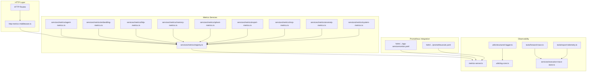
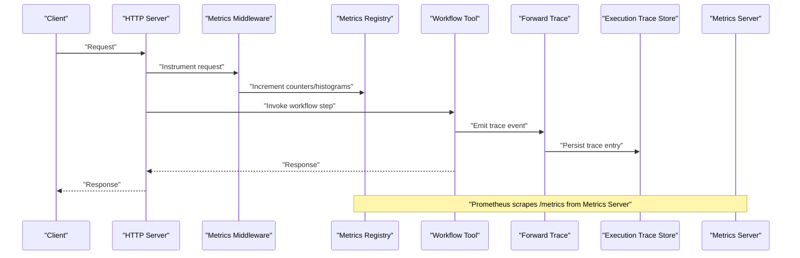
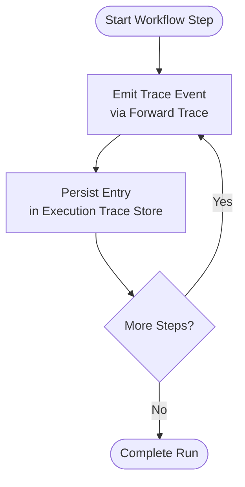
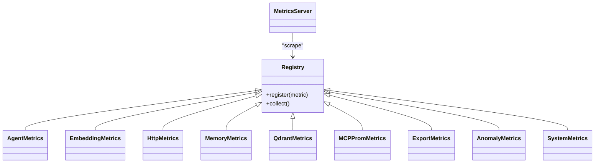
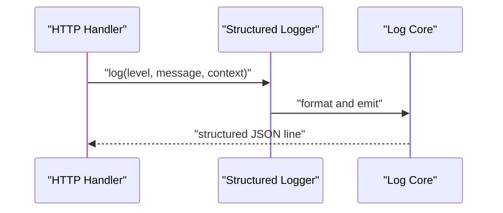
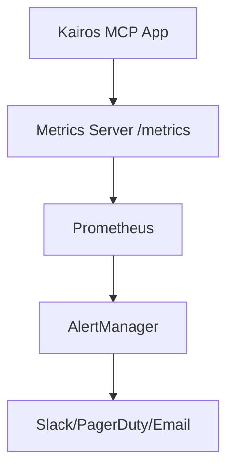
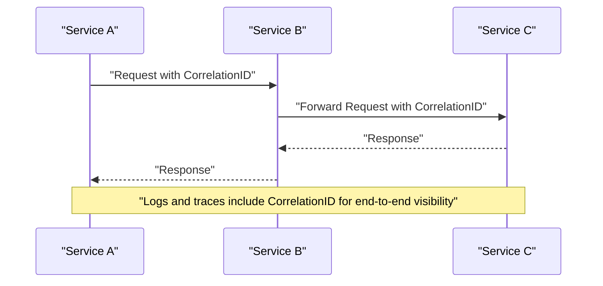
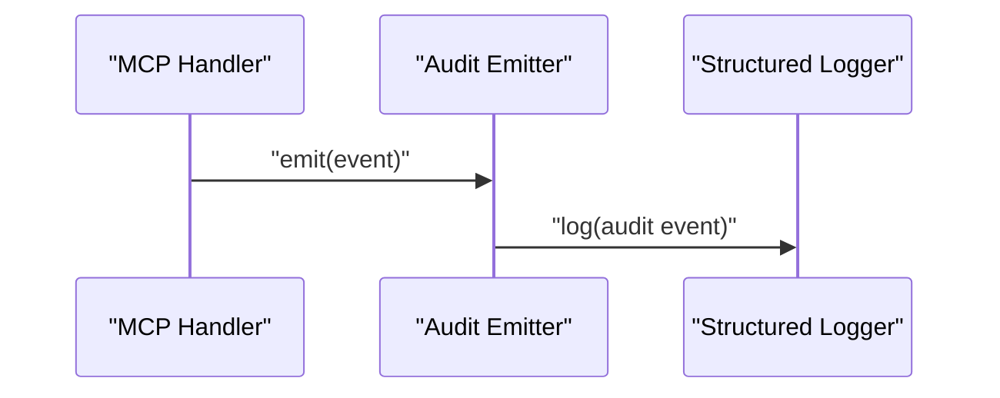
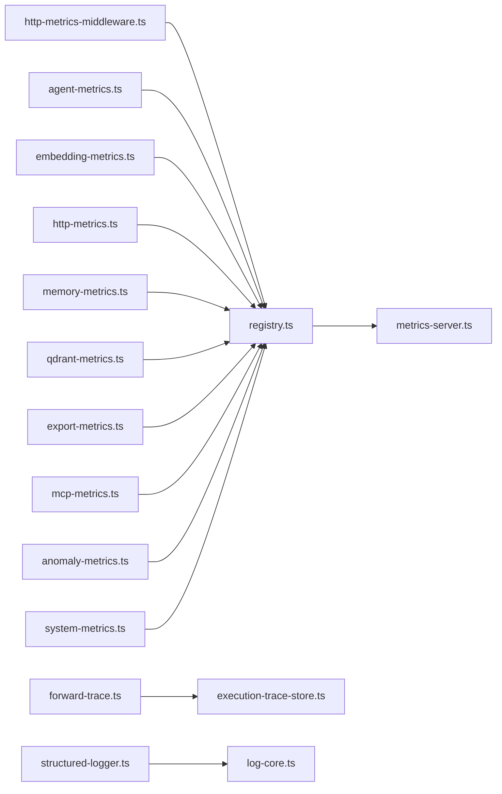

# Monitoring and Tracing

<cite>
**Referenced Files in This Document**
- [execution-trace-store.ts](file://src/services/execution-trace-store.ts)
- [structured-logger.ts](file://src/utils/structured-logger.ts)
- [log-core.ts](file://src/utils/log-core.ts)
- [metrics-server.ts](file://src/metrics-server.ts)
- [http-metrics-middleware.ts](file://src/http/http-metrics-middleware.ts)
- [registry.ts](file://src/services/metrics/registry.ts)
- [agent-metrics.ts](file://src/services/metrics/agent-metrics.ts)
- [anomaly-metrics.ts](file://src/services/metrics/anomaly-metrics.ts)
- [embedding-metrics.ts](file://src/services/metrics/embedding-metrics.ts)
- [export-metrics.ts](file://src/services/metrics/export-metrics.ts)
- [http-metrics.ts](file://src/services/metrics/http-metrics.ts)
- [mcp-metrics.ts](file://src/services/metrics/mcp-metrics.ts)
- [memory-metrics.ts](file://src/services/metrics/memory-metrics.ts)
- [qdrant-metrics.ts](file://src/services/metrics/qdrant-metrics.ts)
- [system-metrics.ts](file://src/services/metrics/system-metrics.ts)
- [forward-trace.ts](file://src/tools/forward-trace.ts)
- [export-telemetry.ts](file://src/tools/export-telemetry.ts)
- [prometheusrule.yaml](file://helm/kairos-mcp/templates/prometheusrule.yaml)
- [app-servicemonitor.yaml](file://helm/kairos-mcp/templates/app-servicemonitor.yaml)
- [redis-servicemonitor.yaml](file://helm/kairos-mcp/templates/redis-servicemonitor.yaml)
- [postgres-servicemonitor.yaml](file://helm/kairos-mcp/templates/postgres-servicemonitor.yaml)
- [qdrant-servicemonitor.yaml](file://helm/kairos-mcp/templates/qdrant-servicemonitor.yaml)
- [keycloak-servicemonitor.yaml](file://helm/kairos-mcp/templates/keycloak-servicemonitor.yaml)
- [audit-log-events.ts](file://src/utils/audit-log-events.ts)
- [mcp-audit-emit.ts](file://src/http/mcp-audit-emit.ts)
</cite>

## Table of Contents
1. [Introduction](#introduction)
2. [Project Structure](#project-structure)
3. [Core Components](#core-components)
4. [Architecture Overview](#architecture-overview)
5. [Detailed Component Analysis](#detailed-component-analysis)
6. [Dependency Analysis](#dependency-analysis)
7. [Performance Considerations](#performance-considerations)
8. [Troubleshooting Guide](#troubleshooting-guide)
9. [Conclusion](#conclusion)
10. [Appendices](#appendices)

## Introduction
This document explains the monitoring and tracing capabilities for workflow execution, including:
- Execution trace system for capturing detailed run information (timestamps, inputs, outputs, intermediate states)
- Metrics collection and aggregation for performance monitoring and analytics
- Structured logging with consistent formatting and correlation
- Real-time dashboards, alerting rules, and notification systems
- Distributed tracing support across multi-service workflows
- Examples of custom metrics, log processors, and monitoring integrations

The goal is to provide both a high-level overview and code-level details so that operators and developers can instrument, observe, and troubleshoot workflows effectively.

## Project Structure
Monitoring and tracing spans several layers:
- HTTP layer instrumentation and metrics middleware
- Service-layer metrics collectors for agents, memory, Qdrant, MCP, export, embedding, anomaly detection, and system resources
- A dedicated metrics server exposing Prometheus-compatible endpoints
- Execution trace store for persisting workflow run traces
- Structured logger for consistent log formatting and correlation
- Helm templates for Prometheus ServiceMonitors and AlertRules
- Audit logging for security-relevant events

**Diagram sources**
- [http-metrics-middleware.ts](file://src/http/http-metrics-middleware.ts)
- [registry.ts](file://src/services/metrics/registry.ts)
- [metrics-server.ts](file://src/metrics-server.ts)
- [structured-logger.ts](file://src/utils/structured-logger.ts)
- [log-core.ts](file://src/utils/log-core.ts)
- [execution-trace-store.ts](file://src/services/execution-trace-store.ts)
- [forward-trace.ts](file://src/tools/forward-trace.ts)
- [export-telemetry.ts](file://src/tools/export-telemetry.ts)
- [app-servicemonitor.yaml](file://helm/kairos-mcp/templates/app-servicemonitor.yaml)
- [prometheusrule.yaml](file://helm/kairos-mcp/templates/prometheusrule.yaml)

**Section sources**
- [http-metrics-middleware.ts](file://src/http/http-metrics-middleware.ts)
- [registry.ts](file://src/services/metrics/registry.ts)
- [metrics-server.ts](file://src/metrics-server.ts)
- [structured-logger.ts](file://src/utils/structured-logger.ts)
- [log-core.ts](file://src/utils/log-core.ts)
- [execution-trace-store.ts](file://src/services/execution-trace-store.ts)
- [forward-trace.ts](file://src/tools/forward-trace.ts)
- [export-telemetry.ts](file://src/tools/export-telemetry.ts)
- [app-servicemonitor.yaml](file://helm/kairos-mcp/templates/app-servicemonitor.yaml)
- [prometheusrule.yaml](file://helm/kairos-mcp/templates/prometheusrule.yaml)

## Core Components
- Execution Trace Store: Persists workflow run traces with timestamps, inputs, outputs, and intermediate states. Used by forward and export telemetry flows.
- Structured Logger: Provides consistent JSON-formatted logs with correlation IDs and contextual fields.
- Metrics Registry and Collectors: Central registry for counters, gauges, histograms; per-domain collectors for agent, embedding, memory, Qdrant, MCP, export, HTTP, anomaly, and system metrics.
- Metrics Server: Exposes Prometheus scrape endpoint and health checks.
- HTTP Metrics Middleware: Instruments HTTP requests with latency, status codes, and route labels.
- Forward Trace Utilities: Emit structured trace events during workflow steps.
- Export Telemetry: Emits telemetry artifacts for exported runs.
- Prometheus Integration: ServiceMonitors and AlertRules for scraping and alerting.

**Section sources**
- [execution-trace-store.ts](file://src/services/execution-trace-store.ts)
- [structured-logger.ts](file://src/utils/structured-logger.ts)
- [log-core.ts](file://src/utils/log-core.ts)
- [registry.ts](file://src/services/metrics/registry.ts)
- [agent-metrics.ts](file://src/services/metrics/agent-metrics.ts)
- [anomaly-metrics.ts](file://src/services/metrics/anomaly-metrics.ts)
- [embedding-metrics.ts](file://src/services/metrics/embedding-metrics.ts)
- [export-metrics.ts](file://src/services/metrics/export-metrics.ts)
- [http-metrics.ts](file://src/services/metrics/http-metrics.ts)
- [mcp-metrics.ts](file://src/services/metrics/mcp-metrics.ts)
- [memory-metrics.ts](file://src/services/metrics/memory-metrics.ts)
- [qdrant-metrics.ts](file://src/services/metrics/qdrant-metrics.ts)
- [system-metrics.ts](file://src/services/metrics/system-metrics.ts)
- [metrics-server.ts](file://src/metrics-server.ts)
- [http-metrics-middleware.ts](file://src/http/http-metrics-middleware.ts)
- [forward-trace.ts](file://src/tools/forward-trace.ts)
- [export-telemetry.ts](file://src/tools/export-telemetry.ts)
- [app-servicemonitor.yaml](file://helm/kairos-mcp/templates/app-servicemonitor.yaml)
- [prometheusrule.yaml](file://helm/kairos-mcp/templates/prometheusrule.yaml)

## Architecture Overview
The observability architecture integrates three pillars:
- Traces: Workflow execution traces captured at key points and persisted via the execution trace store.
- Metrics: Domain-specific collectors register metrics into a central registry; a metrics server exposes them for Prometheus.
- Logs: Structured logs emitted throughout the stack with correlation IDs for cross-cutting analysis.

**Diagram sources**
- [http-metrics-middleware.ts](file://src/http/http-metrics-middleware.ts)
- [registry.ts](file://src/services/metrics/registry.ts)
- [forward-trace.ts](file://src/tools/forward-trace.ts)
- [execution-trace-store.ts](file://src/services/execution-trace-store.ts)
- [metrics-server.ts](file://src/metrics-server.ts)

## Detailed Component Analysis

### Execution Trace System
Captures detailed workflow run information including timestamps, inputs, outputs, and intermediate states. The forward flow emits trace events which are persisted by the execution trace store. Export telemetry also contributes to trace data for archival.

**Diagram sources**
- [forward-trace.ts](file://src/tools/forward-trace.ts)
- [execution-trace-store.ts](file://src/services/execution-trace-store.ts)
- [export-telemetry.ts](file://src/tools/export-telemetry.ts)

**Section sources**
- [forward-trace.ts](file://src/tools/forward-trace.ts)
- [execution-trace-store.ts](file://src/services/execution-trace-store.ts)
- [export-telemetry.ts](file://src/tools/export-telemetry.ts)

### Metrics Collection and Aggregation
A centralized registry collects domain-specific metrics:
- Agent metrics: tool invocations, success/failure counts, durations
- Embedding metrics: embedding calls, token usage, errors
- Memory/Qdrant metrics: search latency, vector operations, cache hits
- MCP metrics: tool call counts, error rates, latency
- Export metrics: export job lifecycle, sizes, durations
- HTTP metrics: request latency, status distribution, throughput
- Anomaly metrics: detection outcomes and scores
- System metrics: resource utilization

These metrics are exposed via a dedicated metrics server for Prometheus scraping.

**Diagram sources**
- [registry.ts](file://src/services/metrics/registry.ts)
- [agent-metrics.ts](file://src/services/metrics/agent-metrics.ts)
- [embedding-metrics.ts](file://src/services/metrics/embedding-metrics.ts)
- [http-metrics.ts](file://src/services/metrics/http-metrics.ts)
- [memory-metrics.ts](file://src/services/metrics/memory-metrics.ts)
- [qdrant-metrics.ts](file://src/services/metrics/qdrant-metrics.ts)
- [mcp-metrics.ts](file://src/services/metrics/mcp-metrics.ts)
- [export-metrics.ts](file://src/services/metrics/export-metrics.ts)
- [anomaly-metrics.ts](file://src/services/metrics/anomaly-metrics.ts)
- [system-metrics.ts](file://src/services/metrics/system-metrics.ts)
- [metrics-server.ts](file://src/metrics-server.ts)

**Section sources**
- [registry.ts](file://src/services/metrics/registry.ts)
- [agent-metrics.ts](file://src/services/metrics/agent-metrics.ts)
- [embedding-metrics.ts](file://src/services/metrics/embedding-metrics.ts)
- [http-metrics.ts](file://src/services/metrics/http-metrics.ts)
- [memory-metrics.ts](file://src/services/metrics/memory-metrics.ts)
- [qdrant-metrics.ts](file://src/services/metrics/qdrant-metrics.ts)
- [mcp-metrics.ts](file://src/services/metrics/mcp-metrics.ts)
- [export-metrics.ts](file://src/services/metrics/export-metrics.ts)
- [anomaly-metrics.ts](file://src/services/metrics/anomaly-metrics.ts)
- [system-metrics.ts](file://src/services/metrics/system-metrics.ts)
- [metrics-server.ts](file://src/metrics-server.ts)

### Structured Logging and Correlation
Structured logging ensures consistent JSON formatting and correlation across services. It provides:
- Consistent log levels and fields
- Correlation IDs propagated through request boundaries
- Contextual enrichment (e.g., tenant, user, workflow ID)

**Diagram sources**
- [structured-logger.ts](file://src/utils/structured-logger.ts)
- [log-core.ts](file://src/utils/log-core.ts)

**Section sources**
- [structured-logger.ts](file://src/utils/structured-logger.ts)
- [log-core.ts](file://src/utils/log-core.ts)

### Real-Time Dashboards, Alerting, and Notifications
- Dashboards: Use Prometheus to scrape metrics exposed by the metrics server. Grafana or similar tools can visualize latency, throughput, error rates, and resource usage.
- Alerting Rules: Defined via PrometheusRule resources to trigger alerts on thresholds such as high error rates, slow responses, or resource saturation.
- Notifications: Configure Prometheus Alertmanager to send notifications to channels like Slack, PagerDuty, or email.

**Diagram sources**
- [metrics-server.ts](file://src/metrics-server.ts)
- [app-servicemonitor.yaml](file://helm/kairos-mcp/templates/app-servicemonitor.yaml)
- [prometheusrule.yaml](file://helm/kairos-mcp/templates/prometheusrule.yaml)

**Section sources**
- [metrics-server.ts](file://src/metrics-server.ts)
- [app-servicemonitor.yaml](file://helm/kairos-mcp/templates/app-servicemonitor.yaml)
- [prometheusrule.yaml](file://helm/kairos-mcp/templates/prometheusrule.yaml)

### Distributed Tracing Support
For multi-service workflows, propagate correlation identifiers across service boundaries:
- Attach correlation IDs to outgoing requests and extract them from incoming ones
- Include correlation IDs in structured logs and metric labels
- Persist correlation IDs in execution traces to link distributed steps

[No sources needed since this diagram shows conceptual workflow, not actual code structure]

### Audit Logging
Security-relevant actions are recorded via audit events:
- MCP audit emission hooks integrate with structured logging
- Audit events capture who did what, when, and where

**Diagram sources**
- [mcp-audit-emit.ts](file://src/http/mcp-audit-emit.ts)
- [audit-log-events.ts](file://src/utils/audit-log-events.ts)

**Section sources**
- [mcp-audit-emit.ts](file://src/http/mcp-audit-emit.ts)
- [audit-log-events.ts](file://src/utils/audit-log-events.ts)

## Dependency Analysis
Key dependencies and relationships:
- HTTP metrics middleware depends on the metrics registry to record request-level metrics
- Each domain collector registers metrics with the registry
- The metrics server exposes the aggregated metrics for Prometheus
- Forward trace utilities depend on the execution trace store to persist trace entries
- Structured logger depends on the log core for formatting and output

**Diagram sources**
- [http-metrics-middleware.ts](file://src/http/http-metrics-middleware.ts)
- [registry.ts](file://src/services/metrics/registry.ts)
- [agent-metrics.ts](file://src/services/metrics/agent-metrics.ts)
- [embedding-metrics.ts](file://src/services/metrics/embedding-metrics.ts)
- [http-metrics.ts](file://src/services/metrics/http-metrics.ts)
- [memory-metrics.ts](file://src/services/metrics/memory-metrics.ts)
- [qdrant-metrics.ts](file://src/services/metrics/qdrant-metrics.ts)
- [export-metrics.ts](file://src/services/metrics/export-metrics.ts)
- [mcp-metrics.ts](file://src/services/metrics/mcp-metrics.ts)
- [anomaly-metrics.ts](file://src/services/metrics/anomaly-metrics.ts)
- [system-metrics.ts](file://src/services/metrics/system-metrics.ts)
- [metrics-server.ts](file://src/metrics-server.ts)
- [forward-trace.ts](file://src/tools/forward-trace.ts)
- [execution-trace-store.ts](file://src/services/execution-trace-store.ts)
- [structured-logger.ts](file://src/utils/structured-logger.ts)
- [log-core.ts](file://src/utils/log-core.ts)

**Section sources**
- [http-metrics-middleware.ts](file://src/http/http-metrics-middleware.ts)
- [registry.ts](file://src/services/metrics/registry.ts)
- [metrics-server.ts](file://src/metrics-server.ts)
- [forward-trace.ts](file://src/tools/forward-trace.ts)
- [execution-trace-store.ts](file://src/services/execution-trace-store.ts)
- [structured-logger.ts](file://src/utils/structured-logger.ts)
- [log-core.ts](file://src/utils/log-core.ts)

## Performance Considerations
- Prefer histogram-based metrics for latency distributions to enable quantile analysis
- Avoid excessive cardinality in metric labels; use coarse-grained dimensions where possible
- Batch or sample heavy telemetry paths if necessary to reduce overhead
- Ensure correlation IDs are lightweight strings and avoid embedding large payloads
- Tune Prometheus scrape intervals based on workload characteristics
- Monitor metrics server resource usage and scale horizontally if needed

[No sources needed since this section provides general guidance]

## Troubleshooting Guide
Common issues and resolutions:
- Missing metrics endpoint: Verify the metrics server is running and accessible; check ServiceMonitor configuration
- High cardinality spikes: Review metric label values and remove unstable identifiers
- Incomplete traces: Confirm forward trace emissions occur at all critical steps and the execution trace store is reachable
- Unstructured logs: Ensure structured logger initialization and correlation ID propagation are present in handlers
- Alert fatigue: Refine AlertRule thresholds and add grouping to reduce noise

**Section sources**
- [metrics-server.ts](file://src/metrics-server.ts)
- [app-servicemonitor.yaml](file://helm/kairos-mcp/templates/app-servicemonitor.yaml)
- [prometheusrule.yaml](file://helm/kairos-mcp/templates/prometheusrule.yaml)
- [forward-trace.ts](file://src/tools/forward-trace.ts)
- [execution-trace-store.ts](file://src/services/execution-trace-store.ts)
- [structured-logger.ts](file://src/utils/structured-logger.ts)

## Conclusion
The monitoring and tracing subsystem provides comprehensive observability for workflow execution:
- Execution traces capture detailed run information for post-mortem analysis
- Metrics collectors and a dedicated server expose actionable performance signals
- Structured logging ensures consistent, correlated diagnostics
- Prometheus integration enables real-time dashboards and alerting
- Distributed tracing patterns facilitate end-to-end visibility across services

Adopt these components to build robust operational insights and improve reliability.

## Appendices

### Example Integrations and Customizations
- Custom metrics: Extend the registry with new counters/gauges/histograms in a domain-specific collector file
- Log processors: Implement additional formatting or redaction in the structured logger pipeline
- Monitoring integrations: Add ServiceMonitors for additional services and define AlertRules for new KPIs

[No sources needed since this section provides general guidance]