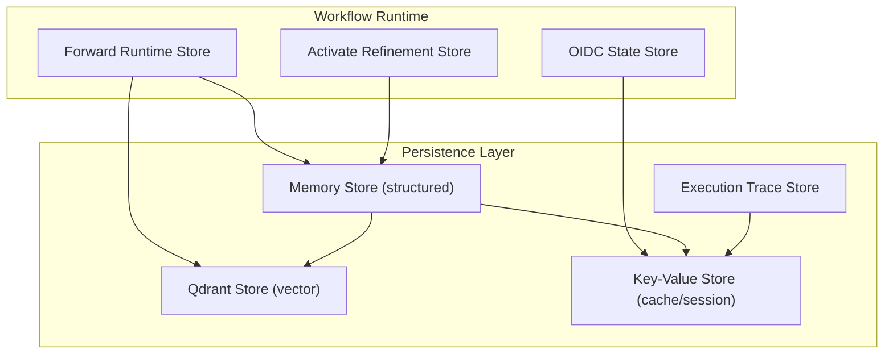
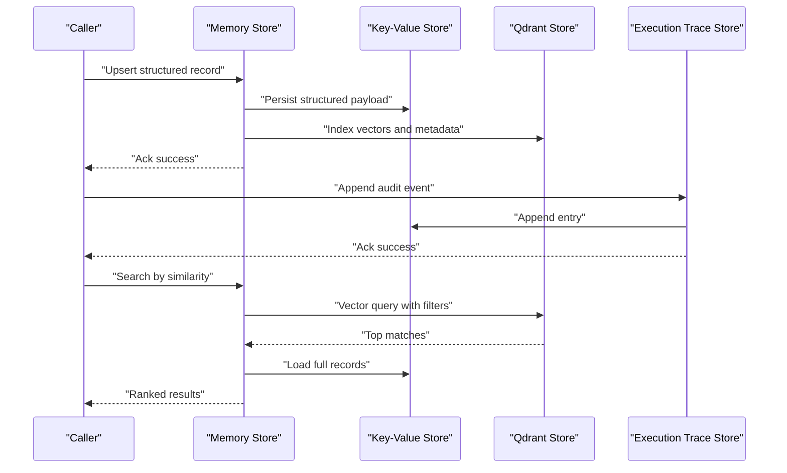
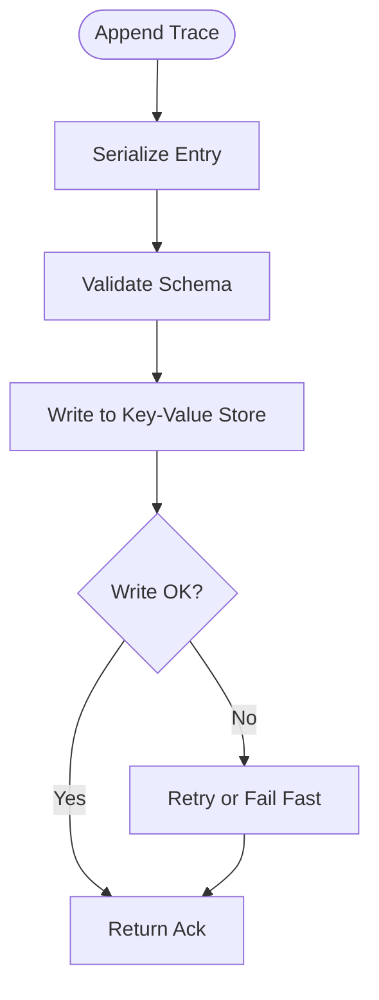
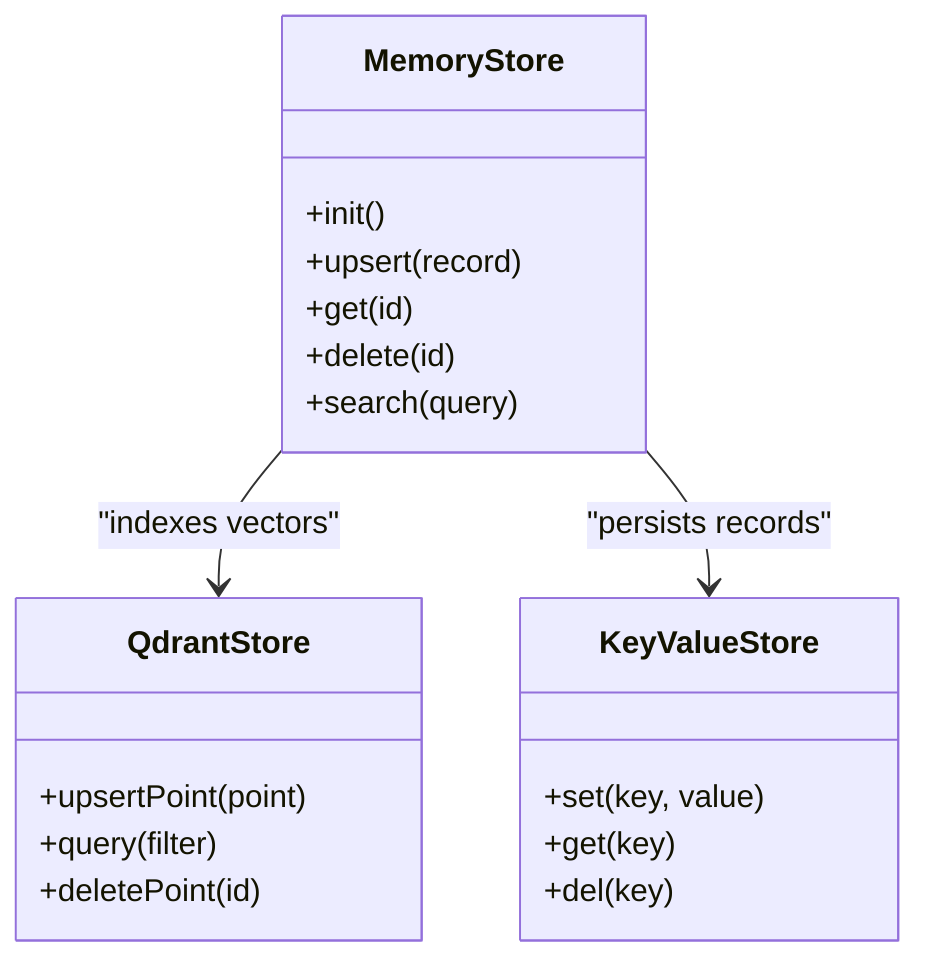
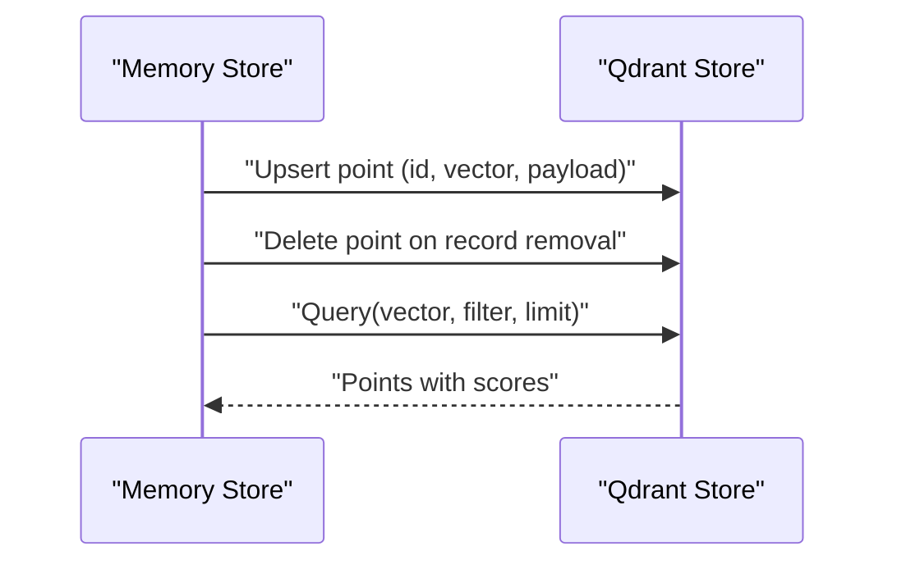
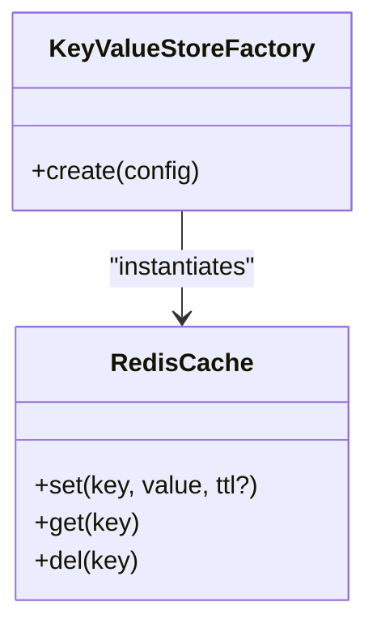
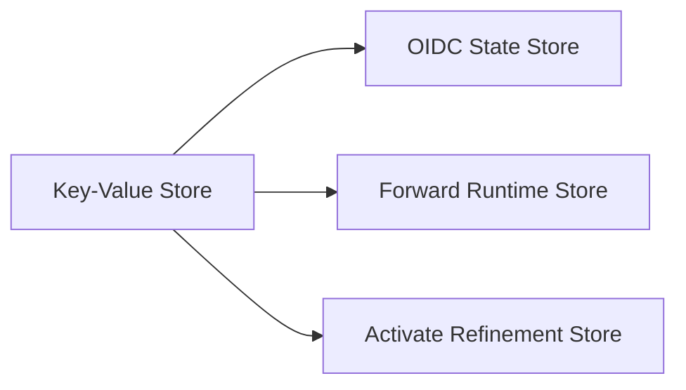
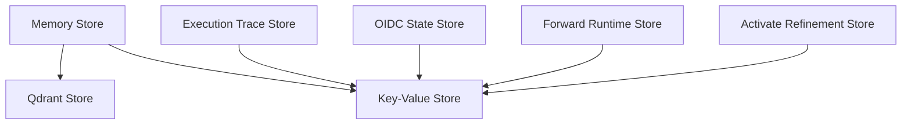

# State Management and Persistence

<cite>
**Referenced Files in This Document**
- [execution-trace-store.ts](file://src/services/execution-trace-store.ts)
- [memory-store.ts](file://src/services/memory-store.ts)
- [store.ts](file://src/services/memory/store.ts)
- [store-methods.ts](file://src/services/memory/store-methods.ts)
- [store-init.ts](file://src/services/memory/store-init.ts)
- [qdrant-memory-store.ts](file://src/services/qdrant/memory-store.ts)
- [qdrant-memory-updates.ts](file://src/services/qdrant/memory-updates.ts)
- [qdrant-memory-retrieval.ts](file://src/services/qdrant/memory-retrieval.ts)
- [key-value-store-factory.ts](file://src/services/key-value-store-factory.ts)
- [key-value-store.ts](file://src/services/key-value-store.ts)
- [redis-cache.ts](file://src/services/redis-cache.ts)
- [oidc-state-store.ts](file://src/services/oidc-state-store.ts)
- [forward-runtime-store.ts](file://src/services/forward-runtime-store.ts)
- [activate-refinement-store.ts](file://src/services/activate-refinement-store.ts)
- [store-artifact.ts](file://src/services/memory/store-artifact.ts)
- [qdrant-snapshots.ts](file://src/services/qdrant/snapshots.ts)
</cite>

## Table of Contents
1. [Introduction](#introduction)
2. [Project Structure](#project-structure)
3. [Core Components](#core-components)
4. [Architecture Overview](#architecture-overview)
5. [Detailed Component Analysis](#detailed-component-analysis)
6. [Dependency Analysis](#dependency-analysis)
7. [Performance Considerations](#performance-considerations)
8. [Troubleshooting Guide](#troubleshooting-guide)
9. [Conclusion](#conclusion)
10. [Appendices](#appendices)

## Introduction
This document explains how workflow states are captured, serialized, and persisted across multiple storage backends. It covers the execution trace store for audit trails and debugging, state checkpointing strategies, incremental updates, conflict resolution, integration with Qdrant for vector-based retrieval, and a memory store for structured data persistence. It also documents migration patterns, version compatibility handling, and backup/restore procedures, along with examples of custom serializers and storage adapters.

## Project Structure
The state management and persistence logic is implemented under services:
- Memory store layer for structured data persistence and adapter orchestration
- Qdrant-backed vector store for semantic search and retrieval
- Key-value store abstraction for cache and session-like state
- Specialized stores for OIDC state, forward runtime, activation refinement, and artifacts
- Execution trace store for durable audit logs

**Diagram sources**
- [forward-runtime-store.ts](file://src/services/forward-runtime-store.ts)
- [activate-refinement-store.ts](file://src/services/activate-refinement-store.ts)
- [oidc-state-store.ts](file://src/services/oidc-state-store.ts)
- [memory-store.ts](file://src/services/memory-store.ts)
- [qdrant-memory-store.ts](file://src/services/qdrant/memory-store.ts)
- [key-value-store-factory.ts](file://src/services/key-value-store-factory.ts)
- [execution-trace-store.ts](file://src/services/execution-trace-store.ts)

**Section sources**
- [memory-store.ts](file://src/services/memory-store.ts)
- [qdrant-memory-store.ts](file://src/services/qdrant/memory-store.ts)
- [key-value-store-factory.ts](file://src/services/key-value-store-factory.ts)
- [execution-trace-store.ts](file://src/services/execution-trace-store.ts)

## Core Components
- Memory Store: Orchestrates structured persistence and coordinates with Qdrant for vector indexing and retrieval. Provides initialization, CRUD methods, and artifact handling.
- Qdrant Store: Manages vector collections, point upserts, and retrieval by similarity or filters. Includes snapshotting utilities.
- Key-Value Store Abstraction: Factory-backed cache/session store used by OIDC state, execution traces, and other transient or semi-persistent state.
- Execution Trace Store: Appends immutable audit entries to a durable backend for replay and debugging.
- Forward Runtime Store: Holds ephemeral per-run context and checkpoints during forward execution.
- Activate Refinement Store: Persists intermediate refinement state for activation flows.
- OIDC State Store: Stores short-lived OAuth/OIDC state using the key-value store.

**Section sources**
- [memory-store.ts](file://src/services/memory-store.ts)
- [store.ts](file://src/services/memory/store.ts)
- [store-methods.ts](file://src/services/memory/store-methods.ts)
- [store-init.ts](file://src/services/memory/store-init.ts)
- [qdrant-memory-store.ts](file://src/services/qdrant/memory-store.ts)
- [qdrant-memory-updates.ts](file://src/services/qdrant/memory-updates.ts)
- [qdrant-memory-retrieval.ts](file://src/services/qdrant/memory-retrieval.ts)
- [qdrant-snapshots.ts](file://src/services/qdrant/snapshots.ts)
- [key-value-store-factory.ts](file://src/services/key-value-store-factory.ts)
- [key-value-store.ts](file://src/services/key-value-store.ts)
- [redis-cache.ts](file://src/services/redis-cache.ts)
- [execution-trace-store.ts](file://src/services/execution-trace-store.ts)
- [forward-runtime-store.ts](file://src/services/forward-runtime-store.ts)
- [activate-refinement-store.ts](file://src/services/activate-refinement-store.ts)
- [oidc-state-store.ts](file://src/services/oidc-state-store.ts)
- [store-artifact.ts](file://src/services/memory/store-artifact.ts)

## Architecture Overview
The system separates concerns between structured state (memory store), vector state (Qdrant), and transient/cache state (key-value store). The memory store acts as the primary coordinator, persisting structured records and synchronizing embeddings to Qdrant. The execution trace store writes append-only events to the key-value store for auditability.

**Diagram sources**
- [memory-store.ts](file://src/services/memory-store.ts)
- [qdrant-memory-store.ts](file://src/services/qdrant/memory-store.ts)
- [qdrant-memory-retrieval.ts](file://src/services/qdrant/memory-retrieval.ts)
- [key-value-store-factory.ts](file://src/services/key-value-store-factory.ts)
- [execution-trace-store.ts](file://src/services/execution-trace-store.ts)

## Detailed Component Analysis

### Execution Trace Store
Purpose:
- Append-only audit trail for workflow steps, tool calls, and outcomes.
- Supports querying recent traces and exporting for debugging.

Key behaviors:
- Serializes trace entries into a stable format before writing.
- Uses the key-value store as the backing for durability and ordering guarantees.
- Provides helpers to batch-append and paginate reads.

**Diagram sources**
- [execution-trace-store.ts](file://src/services/execution-trace-store.ts)
- [key-value-store-factory.ts](file://src/services/key-value-store-factory.ts)
- [key-value-store.ts](file://src/services/key-value-store.ts)

**Section sources**
- [execution-trace-store.ts](file://src/services/execution-trace-store.ts)
- [key-value-store-factory.ts](file://src/services/key-value-store-factory.ts)
- [key-value-store.ts](file://src/services/key-value-store.ts)

### Memory Store (Structured Data Persistence)
Responsibilities:
- Initialize and configure storage backends.
- Provide CRUD operations for structured records.
- Coordinate artifact persistence and lifecycle.
- Synchronize embeddings to Qdrant when applicable.

Initialization flow:
- Loads configuration, validates environment, and sets up both memory and Qdrant clients.
- Performs readiness checks and optional migrations.

CRUD and synchronization:
- Upserts structured records to the key-value store.
- Computes and persists vectors to Qdrant, ensuring idempotency via unique IDs.
- On delete, removes both structured and vector representations.

**Diagram sources**
- [memory-store.ts](file://src/services/memory-store.ts)
- [store.ts](file://src/services/memory/store.ts)
- [store-methods.ts](file://src/services/memory/store-methods.ts)
- [store-init.ts](file://src/services/memory/store-init.ts)
- [qdrant-memory-store.ts](file://src/services/qdrant/memory-store.ts)
- [key-value-store-factory.ts](file://src/services/key-value-store-factory.ts)
- [key-value-store.ts](file://src/services/key-value-store.ts)

**Section sources**
- [memory-store.ts](file://src/services/memory-store.ts)
- [store.ts](file://src/services/memory/store.ts)
- [store-methods.ts](file://src/services/memory/store-methods.ts)
- [store-init.ts](file://src/services/memory/store-init.ts)
- [store-artifact.ts](file://src/services/memory/store-artifact.ts)

### Qdrant Integration (Vector-Based Retrieval)
Capabilities:
- Point upserts with payloads containing structured metadata.
- Similarity search with optional filters (e.g., space, tags).
- Snapshotting utilities for backups and restores.

Update and retrieval flows:
- Incremental updates use idempotent upserts keyed by record ID.
- Retrieval combines vector scores with metadata filters to rank results.

**Diagram sources**
- [qdrant-memory-store.ts](file://src/services/qdrant/memory-store.ts)
- [qdrant-memory-updates.ts](file://src/services/qdrant/memory-updates.ts)
- [qdrant-memory-retrieval.ts](file://src/services/qdrant/memory-retrieval.ts)
- [qdrant-snapshots.ts](file://src/services/qdrant/snapshots.ts)

**Section sources**
- [qdrant-memory-store.ts](file://src/services/qdrant/memory-store.ts)
- [qdrant-memory-updates.ts](file://src/services/qdrant/memory-updates.ts)
- [qdrant-memory-retrieval.ts](file://src/services/qdrant/memory-retrieval.ts)
- [qdrant-snapshots.ts](file://src/services/qdrant/snapshots.ts)

### Key-Value Store Abstraction and Backends
Abstraction:
- Factory creates a concrete implementation based on configuration (e.g., Redis).
- Provides set/get/del semantics with TTL support where applicable.

Backends:
- Redis-backed cache for high-throughput, low-latency access.
- Used by OIDC state, execution traces, and other transient state.

**Diagram sources**
- [key-value-store-factory.ts](file://src/services/key-value-store-factory.ts)
- [key-value-store.ts](file://src/services/key-value-store.ts)
- [redis-cache.ts](file://src/services/redis-cache.ts)

**Section sources**
- [key-value-store-factory.ts](file://src/services/key-value-store-factory.ts)
- [key-value-store.ts](file://src/services/key-value-store.ts)
- [redis-cache.ts](file://src/services/redis-cache.ts)

### Specialized Stores
- OIDC State Store: Short-lived state for OAuth/OIDC flows; uses key-value store with TTL.
- Forward Runtime Store: Per-run runtime state and checkpoints; supports incremental updates and recovery.
- Activate Refinement Store: Intermediate state for activation refinement; durable until completion.

**Diagram sources**
- [oidc-state-store.ts](file://src/services/oidc-state-store.ts)
- [forward-runtime-store.ts](file://src/services/forward-runtime-store.ts)
- [activate-refinement-store.ts](file://src/services/activate-refinement-store.ts)
- [key-value-store-factory.ts](file://src/services/key-value-store-factory.ts)

**Section sources**
- [oidc-state-store.ts](file://src/services/oidc-state-store.ts)
- [forward-runtime-store.ts](file://src/services/forward-runtime-store.ts)
- [activate-refinement-store.ts](file://src/services/activate-refinement-store.ts)

## Dependency Analysis
High-level dependencies:
- Memory Store depends on Qdrant Store and Key-Value Store.
- Execution Trace Store depends on Key-Value Store.
- Specialized stores depend on Key-Value Store.
- Qdrant Store depends on Qdrant client and snapshot utilities.

**Diagram sources**
- [memory-store.ts](file://src/services/memory-store.ts)
- [qdrant-memory-store.ts](file://src/services/qdrant/memory-store.ts)
- [key-value-store-factory.ts](file://src/services/key-value-store-factory.ts)
- [execution-trace-store.ts](file://src/services/execution-trace-store.ts)
- [oidc-state-store.ts](file://src/services/oidc-state-store.ts)
- [forward-runtime-store.ts](file://src/services/forward-runtime-store.ts)
- [activate-refinement-store.ts](file://src/services/activate-refinement-store.ts)

**Section sources**
- [memory-store.ts](file://src/services/memory-store.ts)
- [qdrant-memory-store.ts](file://src/services/qdrant/memory-store.ts)
- [key-value-store-factory.ts](file://src/services/key-value-store-factory.ts)
- [execution-trace-store.ts](file://src/services/execution-trace-store.ts)
- [oidc-state-store.ts](file://src/services/oidc-state-store.ts)
- [forward-runtime-store.ts](file://src/services/forward-runtime-store.ts)
- [activate-refinement-store.ts](file://src/services/activate-refinement-store.ts)

## Performance Considerations
- Batched writes: Prefer batching upserts to Qdrant and key-value store to reduce round trips.
- Idempotency: Use stable IDs to avoid duplicate points and records.
- TTL tuning: Configure appropriate TTLs for OIDC and runtime state to prevent unbounded growth.
- Search optimization: Apply metadata filters alongside vector queries to narrow result sets early.
- Serialization efficiency: Keep payloads compact and schema-stable to minimize serialization overhead.

[No sources needed since this section provides general guidance]

## Troubleshooting Guide
Common issues and resolutions:
- Missing or invalid configuration: Ensure all required keys for Qdrant and key-value store are present and valid.
- Vector index mismatch: Verify collection names and payload schemas align with expectations.
- Stale cache entries: Clear or refresh key-value store entries if inconsistent state is observed.
- Trace gaps: Confirm append-only semantics and monotonic ordering in the key-value backend.

Operational tips:
- Inspect recent traces via the execution trace store to pinpoint failures.
- Use Qdrant snapshots to validate vector integrity and restore from known-good states.
- Monitor key-value store latency and errors to detect bottlenecks.

**Section sources**
- [execution-trace-store.ts](file://src/services/execution-trace-store.ts)
- [qdrant-snapshots.ts](file://src/services/qdrant/snapshots.ts)
- [key-value-store-factory.ts](file://src/services/key-value-store-factory.ts)

## Conclusion
The state management layer combines structured persistence, vector search, and transient caching to support robust workflow execution. The execution trace store ensures auditability, while Qdrant enables powerful semantic retrieval. With clear separation of responsibilities and idempotent operations, the system scales reliably and remains debuggable.

[No sources needed since this section summarizes without analyzing specific files]

## Appendices

### State Checkpointing Strategies
- Periodic snapshots: Save current state at safe points to enable fast recovery.
- Incremental deltas: Persist only changed fields to reduce write amplification.
- Conflict resolution: Use last-write-wins with version counters or compare-and-set semantics where supported by the backend.

[No sources needed since this section provides general guidance]

### Migration Patterns and Version Compatibility
- Schema versioning: Include version fields in serialized payloads and apply migrations on read/write paths.
- Backward-compatible changes: Add new fields with defaults; avoid removing existing fields abruptly.
- Rollout strategy: Support dual-read paths during transition periods to ensure continuity.

[No sources needed since this section provides general guidance]

### Backup and Restore Procedures
- Structured data: Export from key-value store periodically; import during restore.
- Vector data: Use Qdrant snapshots to capture and restore vector collections.
- Traces: Archive append-only logs for compliance and post-mortem analysis.

**Section sources**
- [qdrant-snapshots.ts](file://src/services/qdrant/snapshots.ts)
- [key-value-store-factory.ts](file://src/services/key-value-store-factory.ts)

### Custom State Serializers and Storage Adapters
Guidelines:
- Define a stable serialization contract with explicit versioning.
- Implement adapters that conform to the key-value store interface for pluggable backends.
- Provide unit tests for roundtrip serialization and error paths.

Example references:
- See the key-value store factory and implementations for adapter patterns.
- Review specialized stores for usage examples of custom serialization and TTL policies.

**Section sources**
- [key-value-store-factory.ts](file://src/services/key-value-store-factory.ts)
- [key-value-store.ts](file://src/services/key-value-store.ts)
- [redis-cache.ts](file://src/services/redis-cache.ts)
- [oidc-state-store.ts](file://src/services/oidc-state-store.ts)
- [forward-runtime-store.ts](file://src/services/forward-runtime-store.ts)
- [activate-refinement-store.ts](file://src/services/activate-refinement-store.ts)