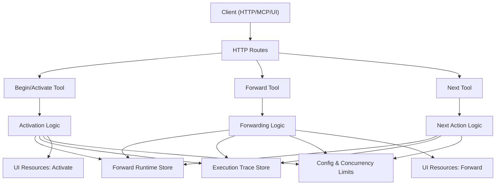
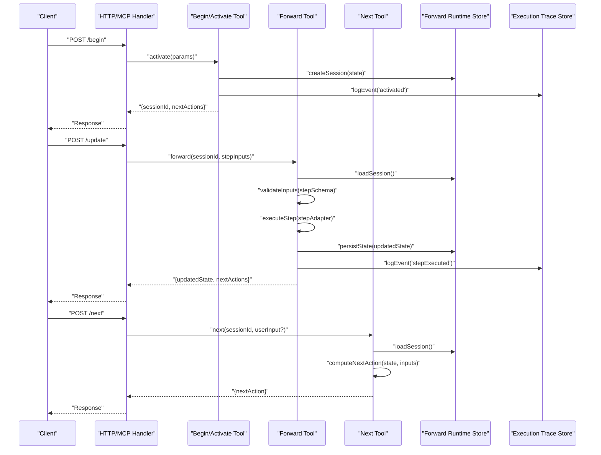
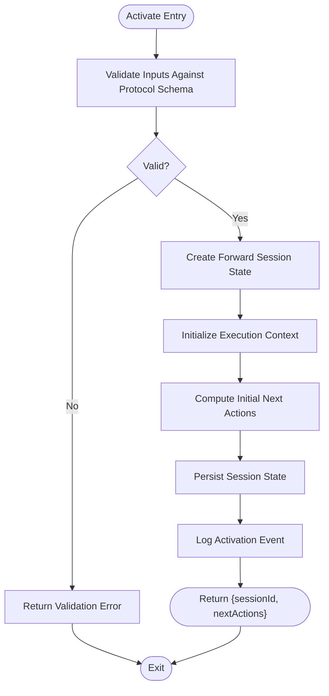
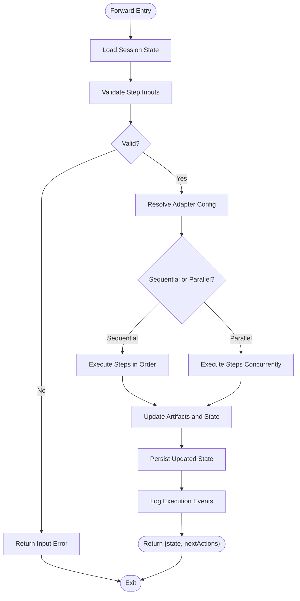
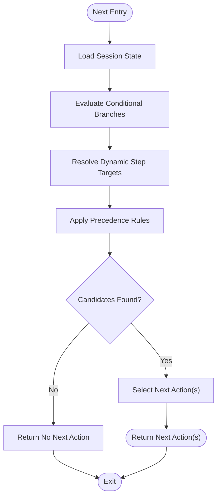
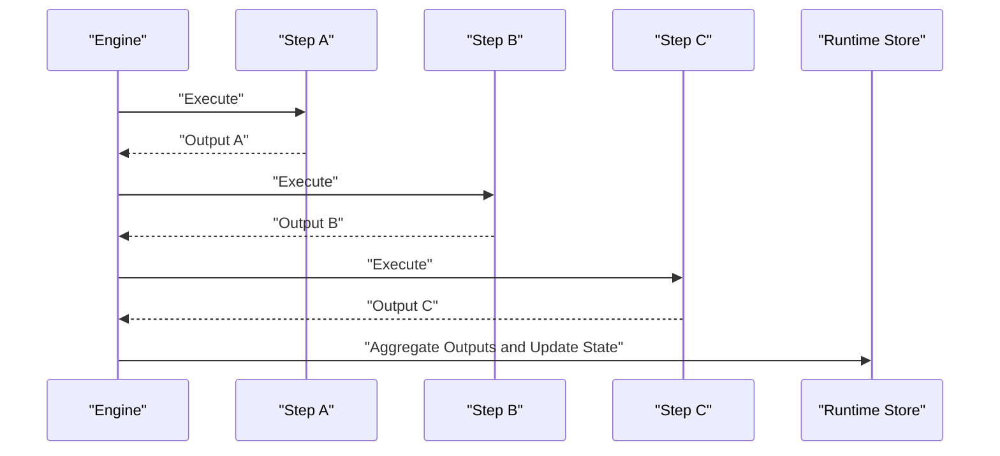
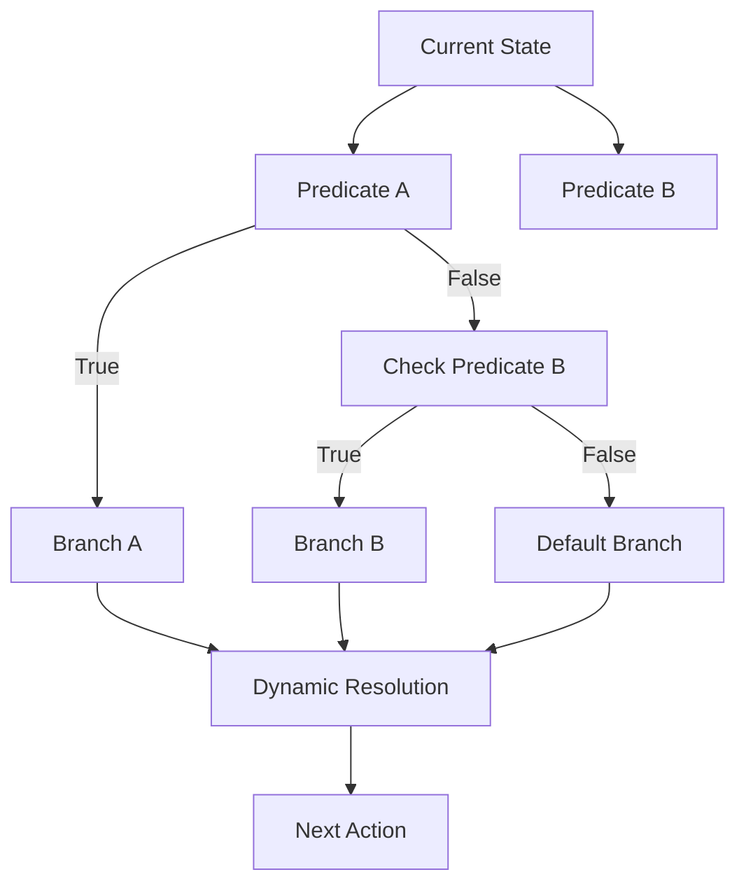
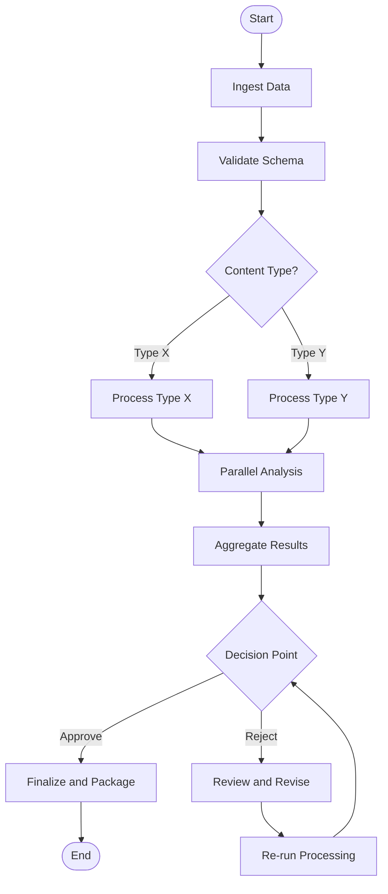
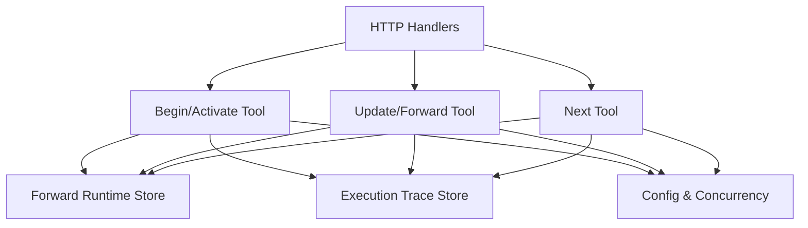

# Workflow Definition and Execution

<cite>
**Referenced Files in This Document**
- [src/tools/activate.ts](file://src/tools/activate.ts)
- [src/tools/forward.ts](file://src/tools/forward.ts)
- [src/tools/next.ts](file://src/tools/next.ts)
- [src/services/forward-runtime-store.ts](file://src/services/forward-runtime-store.ts)
- [src/services/execution-trace-store.ts](file://src/services/execution-trace-store.ts)
- [src/http/http-api-begin.ts](file://src/http/http-api-begin.ts)
- [src/http/http-api-update.ts](file://src/http/http-api-update.ts)
- [src/http/http-mcp-handler.ts](file://src/http/http-mcp-handler.ts)
- [src/mcp-apps/register-forward-ui-resources.ts](file://src/mcp-apps/register-forward-ui-resources.ts)
- [src/mcp-apps/register-activate-ui-resources.ts](file://src/mcp-apps/register-activate-ui-resources.ts)
- [src/utils/concurrency-limit.ts](file://src/utils/concurrency-limit.ts)
- [src/config.ts](file://src/config.ts)
- [src/bootstrap.ts](file://src/bootstrap.ts)
- [src/index.ts](file://src/index.ts)
- [src/server.ts](file://src/server.ts)
- [src/http/http-server-startup.ts](file://src/http/http-server-startup.ts)
- [src/http/http-server-config.ts](file://src/http/http-server-config.ts)
- [src/http/http-api-routes.ts](file://src/http/http-api-routes.ts)
- [src/tools/forward-helpers.ts](file://src/tools/forward-helpers.ts)
- [src/tools/forward-tool-error.ts](file://src/tools/forward-tool-error.ts)
- [src/tools/forward-trace.ts](file://src/tools/forward-trace.ts)
- [src/tools/forward-view.ts](file://src/tools/forward-view.ts)
- [src/tools/forward-register.ts](file://src/tools/forward-register.ts)
- [src/tools/next-pow-helpers.ts](file://src/tools/next-pow-helpers.ts)
- [src/tools/next-proof-types.ts](file://src/tools/next-proof-types.ts)
- [src/tools/next-missing-proof-payload.ts](file://src/tools/next-missing-proof-payload.ts)
- [src/tools/next-previous-step.ts](file://src/tools/next-previous-step.ts)
- [src/tools/review-evidence-check.ts](file://src/tools/review-evidence-check.ts)
- [src/tools/kairos-genesis-proof-hash.ts](file://src/tools/kairos-genesis-proof-hash.ts)
- [src/tools/kairos-challenge-display.ts](file://src/tools/kairos-challenge-display.ts)
- [src/tools/shell-challenge-invocation.ts](file://src/tools/shell-challenge-invocation.ts)
- [src/tools/export-resolve-adapter.ts](file://src/tools/export-resolve-adapter.ts)
- [src/tools/export-selection.ts](file://src/tools/export-selection.ts)
- [src/tools/export-source.ts](file://src/tools/export-source.ts)
- [src/tools/export-telemetry.ts](file://src/tools/export-telemetry.ts)
- [src/tools/export-artifact-download-capability.ts](file://src/tools/export-artifact-download-capability.ts)
- [src/tools/export-artifact-download-capability-store.ts](file://src/tools/export-artifact-download-capability-store.ts)
- [src/tools/export-download-capability.ts](file://src/tools/export-download-capability.ts)
- [src/tools/export-download-capability-store.ts](file://src/tools/export-download-capability-store.ts)
- [src/tools/export.ts](file://src/tools/export.ts)
- [src/tools/search.ts](file://src/tools/search.ts)
- [src/tools/search_output.ts](file://src/tools/search_output.ts)
- [src/tools/train.ts](file://src/tools/train.ts)
- [src/tools/tune.ts](file://src/tools/tune.ts)
- [src/tools/update.ts](file://src/tools/update.ts)
- [src/tools/delete.ts](file://src/tools/delete.ts)
- [src/tools/dump.ts](file://src/tools/dump.ts)
- [src/tools/spaces.ts](file://src/tools/spaces.ts)
- [src/tools/reward.ts](file://src/tools/reward.ts)
- [src/tools/artifact-catalog.ts](file://src/tools/artifact-catalog.ts)
- [src/tools/artifact-mime.ts](file://src/tools/artifact-mime.ts)
- [src/tools/artifact-relative-path.ts](file://src/tools/artifact-relative-path.ts)
- [src/tools/kairos-uri.ts](file://src/tools/kairos-uri.ts)
- [src/tools/mcp-contract-match.ts](file://src/tools/mcp-contract-match.ts)
- [src/tools/mcp-loose-input-schema.ts](file://src/tools/mcp-loose-input-schema.ts)
- [src/tools/mcp-runtime-error.ts](file://src/tools/mcp-runtime-error.ts)
- [src/tools/mcp-tool-input-teaching.ts](file://src/tools/mcp-tool-input-teaching.ts)
- [src/tools/local-artifact-dir-contract.ts](file://src/tools/local-artifact-dir-contract.ts)
- [src/tools/training-output-adapter-uri.ts](file://src/tools/training-output-adapter-uri.ts)
- [src/tools/training-artifact-adapter-uri.ts](file://src/tools/training-artifact-adapter-uri.ts)
- [src/tools/tune-cache-invalidation.ts](file://src/tools/tune-cache-invalidation.ts)
- [src/tools/tune-execute.ts](file://src/tools/tune-execute.ts)
- [src/tools/tune-messages.ts](file://src/tools/tune-messages.ts)
- [src/tools/tune-verify.ts](file://src/tools/tune-verify.ts)
- [src/tools/kairos-genesis-proof-hash.ts](file://src/tools/kairos-genesis-proof-hash.ts)
- [src/tools/kairos-challenge-display.ts](file://src/tools/kairos-challenge-display.ts)
- [src/tools/shell-challenge-invocation.ts](file://src/tools/shell-challenge-invocation.ts)
- [src/tools/export-resolve-adapter.ts](file://src/tools/export-resolve-adapter.ts)
- [src/tools/export-selection.ts](file://src/tools/export-selection.ts)
- [src/tools/export-source.ts](file://src/tools/export-source.ts)
- [src/tools/export-telemetry.ts](file://src/tools/export-telemetry.ts)
- [src/tools/export-artifact-download-capability.ts](file://src/tools/export-artifact-download-capability.ts)
- [src/tools/export-artifact-download-capability-store.ts](file://src/tools/export-artifact-download-capability-store.ts)
- [src/tools/export-download-capability.ts](file://src/tools/export-download-capability.ts)
- [src/tools/export-download-capability-store.ts](file://src/tools/export-download-capability-store.ts)
- [src/tools/export.ts](file://src/tools/export.ts)
- [src/tools/search.ts](file://src/tools/search.ts)
- [src/tools/search_output.ts](file://src/tools/search_output.ts)
- [src/tools/train.ts](file://src/tools/train.ts)
- [src/tools/tune.ts](file://src/tools/tune.ts)
- [src/tools/update.ts](file://src/tools/update.ts)
- [src/tools/delete.ts](file://src/tools/delete.ts)
- [src/tools/dump.ts](file://src/tools/dump.ts)
- [src/tools/spaces.ts](file://src/tools/spaces.ts)
- [src/tools/reward.ts](file://src/tools/reward.ts)
- [src/tools/artifact-catalog.ts](file://src/tools/artifact-catalog.ts)
- [src/tools/artifact-mime.ts](file://src/tools/artifact-mime.ts)
- [src/tools/artifact-relative-path.ts](file://src/tools/artifact-relative-path.ts)
- [src/tools/kairos-uri.ts](file://src/tools/kairos-uri.ts)
- [src/tools/mcp-contract-match.ts](file://src/tools/mcp-contract-match.ts)
- [src/tools/mcp-loose-input-schema.ts](file://src/tools/mcp-loose-input-schema.ts)
- [src/tools/mcp-runtime-error.ts](file://src/tools/mcp-runtime-error.ts)
- [src/tools/mcp-tool-input-teaching.ts](file://src/tools/mcp-tool-input-teaching.ts)
- [src/tools/local-artifact-dir-contract.ts](file://src/tools/local-artifact-dir-contract.ts)
- [src/tools/training-output-adapter-uri.ts](file://src/tools/training-output-adapter-uri.ts)
- [src/tools/training-artifact-adapter-uri.ts](file://src/tools/training-artifact-adapter-uri.ts)
- [src/tools/tune-cache-invalidation.ts](file://src/tools/tune-cache-invalidation.ts)
- [src/tools/tune-execute.ts](file://src/tools/tune-execute.ts)
- [src/tools/tune-messages.ts](file://src/tools/tune-messages.ts)
- [src/tools/tune-verify.ts](file://src/tools/tune-verify.ts)
</cite>

## Table of Contents
1. [Introduction](#introduction)
2. [Project Structure](#project-structure)
3. [Core Components](#core-components)
4. [Architecture Overview](#architecture-overview)
5. [Detailed Component Analysis](#detailed-component-analysis)
6. [Dependency Analysis](#dependency-analysis)
7. [Performance Considerations](#performance-considerations)
8. [Troubleshooting Guide](#troubleshooting-guide)
9. [Conclusion](#conclusion)
10. [Appendices](#appendices)

## Introduction
This document explains how workflows are defined and executed in the Kairos MCP system. It covers:
- How workflows are modeled using protocol schemas, step definitions, and adapter configurations
- The activation process that initializes workflow state and prepares execution context
- The step execution model including sequential and parallel patterns, conditional branching, and dynamic step resolution
- The next action determination algorithm used by the engine to decide subsequent steps based on current state and tool outputs
- Examples of complex workflow definitions with multiple branches and decision points
- Configuration options for execution timeouts, retry policies, and resource limits

The goal is to provide a clear mental model for both new users and advanced practitioners who need to author or operate workflows end-to-end.

## Project Structure
At a high level, workflow definition and execution spans several layers:
- HTTP/MCP entrypoints expose tools like activate, forward, and next
- Tool implementations orchestrate runtime state, adapters, and persistence
- Runtime stores maintain forward session state and execution traces
- UI resources register interactive flows for activation and forwarding
- Concurrency and configuration utilities control execution behavior

**Diagram sources**
- [src/http/http-api-routes.ts](file://src/http/http-api-routes.ts)
- [src/http/http-api-begin.ts](file://src/http/http-api-begin.ts)
- [src/http/http-api-update.ts](file://src/http/http-api-update.ts)
- [src/http/http-mcp-handler.ts](file://src/http/http-mcp-handler.ts)
- [src/tools/activate.ts](file://src/tools/activate.ts)
- [src/tools/forward.ts](file://src/tools/forward.ts)
- [src/tools/next.ts](file://src/tools/next.ts)
- [src/services/forward-runtime-store.ts](file://src/services/forward-runtime-store.ts)
- [src/services/execution-trace-store.ts](file://src/services/execution-trace-store.ts)
- [src/mcp-apps/register-activate-ui-resources.ts](file://src/mcp-apps/register-activate-ui-resources.ts)
- [src/mcp-apps/register-forward-ui-resources.ts](file://src/mcp-apps/register-forward-ui-resources.ts)
- [src/utils/concurrency-limit.ts](file://src/utils/concurrency-limit.ts)
- [src/config.ts](file://src/config.ts)

**Section sources**
- [src/http/http-api-routes.ts](file://src/http/http-api-routes.ts)
- [src/http/http-api-begin.ts](file://src/http/http-api-begin.ts)
- [src/http/http-api-update.ts](file://src/http/http-api-update.ts)
- [src/http/http-mcp-handler.ts](file://src/http/http-mcp-handler.ts)
- [src/tools/activate.ts](file://src/tools/activate.ts)
- [src/tools/forward.ts](file://src/tools/forward.ts)
- [src/tools/next.ts](file://src/tools/next.ts)
- [src/services/forward-runtime-store.ts](file://src/services/forward-runtime-store.ts)
- [src/services/execution-trace-store.ts](file://src/services/execution-trace-store.ts)
- [src/mcp-apps/register-activate-ui-resources.ts](file://src/mcp-apps/register-activate-ui-resources.ts)
- [src/mcp-apps/register-forward-ui-resources.ts](file://src/mcp-apps/register-forward-ui-resources.ts)
- [src/utils/concurrency-limit.ts](file://src/utils/concurrency-limit.ts)
- [src/config.ts](file://src/config.ts)

## Core Components
- Activation tool: Initializes a new workflow run, validates inputs against protocol schemas, creates forward session state, and returns initial next action.
- Forward tool: Executes one or more steps within an active forward session, updates artifacts and state, and returns updated next actions.
- Next tool: Determines the next actionable step(s) given current state and optional user input, supporting branching and dynamic resolution.
- Forward runtime store: Persists forward session state across calls, enabling multi-turn execution.
- Execution trace store: Records detailed traces for auditing and debugging.
- UI resources: Register UI components for activation and forwarding experiences.
- Concurrency limiter and config: Control parallelism, timeouts, and resource constraints.

Key responsibilities:
- Schema validation and adaptation for tool inputs
- State transitions and artifact management
- Conditional branching and dynamic step selection
- Error handling and telemetry

**Section sources**
- [src/tools/activate.ts](file://src/tools/activate.ts)
- [src/tools/forward.ts](file://src/tools/forward.ts)
- [src/tools/next.ts](file://src/tools/next.ts)
- [src/services/forward-runtime-store.ts](file://src/services/forward-runtime-store.ts)
- [src/services/execution-trace-store.ts](file://src/services/execution-trace-store.ts)
- [src/mcp-apps/register-activate-ui-resources.ts](file://src/mcp-apps/register-activate-ui-resources.ts)
- [src/mcp-apps/register-forward-ui-resources.ts](file://src/mcp-apps/register-forward-ui-resources.ts)
- [src/utils/concurrency-limit.ts](file://src/utils/concurrency-limit.ts)
- [src/config.ts](file://src/config.ts)

## Architecture Overview
The workflow engine exposes three primary operations:
- Activate: Start a new workflow instance and prepare execution context
- Forward: Execute steps and update state
- Next: Compute next actions based on current state and inputs

**Diagram sources**
- [src/http/http-api-begin.ts](file://src/http/http-api-begin.ts)
- [src/http/http-api-update.ts](file://src/http/http-api-update.ts)
- [src/http/http-mcp-handler.ts](file://src/http/http-mcp-handler.ts)
- [src/tools/activate.ts](file://src/tools/activate.ts)
- [src/tools/forward.ts](file://src/tools/forward.ts)
- [src/tools/next.ts](file://src/tools/next.ts)
- [src/services/forward-runtime-store.ts](file://src/services/forward-runtime-store.ts)
- [src/services/execution-trace-store.ts](file://src/services/execution-trace-store.ts)

## Detailed Component Analysis

### Activation Process
Activation initializes a new workflow run:
- Validates inputs against protocol schema
- Creates forward session state with initial context
- Computes initial next actions
- Logs activation event to execution trace

**Diagram sources**
- [src/tools/activate.ts](file://src/tools/activate.ts)
- [src/services/forward-runtime-store.ts](file://src/services/forward-runtime-store.ts)
- [src/services/execution-trace-store.ts](file://src/services/execution-trace-store.ts)

**Section sources**
- [src/tools/activate.ts](file://src/tools/activate.ts)
- [src/services/forward-runtime-store.ts](file://src/services/forward-runtime-store.ts)
- [src/services/execution-trace-store.ts](file://src/services/execution-trace-store.ts)

### Step Execution Model
The forward operation executes steps within an active session:
- Loads current session state
- Validates step inputs against step-specific schemas
- Resolves adapter configuration for the target step
- Executes step logic (sequential or parallel depending on step definition)
- Updates artifacts and state
- Persists updated state and logs execution events

**Diagram sources**
- [src/tools/forward.ts](file://src/tools/forward.ts)
- [src/services/forward-runtime-store.ts](file://src/services/forward-runtime-store.ts)
- [src/services/execution-trace-store.ts](file://src/services/execution-trace-store.ts)

**Section sources**
- [src/tools/forward.ts](file://src/tools/forward.ts)
- [src/services/forward-runtime-store.ts](file://src/services/forward-runtime-store.ts)
- [src/services/execution-trace-store.ts](file://src/services/execution-trace-store.ts)

### Next Action Determination Algorithm
The next action algorithm decides subsequent steps based on current state and optional user input:
- Loads session state
- Evaluates conditional branches using state predicates
- Resolves dynamic step targets based on previous outputs
- Applies precedence rules when multiple candidates exist
- Returns the next actionable step(s)

**Diagram sources**
- [src/tools/next.ts](file://src/tools/next.ts)
- [src/services/forward-runtime-store.ts](file://src/services/forward-runtime-store.ts)

**Section sources**
- [src/tools/next.ts](file://src/tools/next.ts)
- [src/services/forward-runtime-store.ts](file://src/services/forward-runtime-store.ts)

### Sequential and Parallel Execution Patterns
- Sequential pattern: Steps execute one after another; each step’s output can influence the next step’s inputs.
- Parallel pattern: Multiple steps execute concurrently; results are aggregated before updating state.

**Diagram sources**
- [src/tools/forward.ts](file://src/tools/forward.ts)
- [src/services/forward-runtime-store.ts](file://src/services/forward-runtime-store.ts)

**Section sources**
- [src/tools/forward.ts](file://src/tools/forward.ts)
- [src/services/forward-runtime-store.ts](file://src/services/forward-runtime-store.ts)

### Conditional Branching and Dynamic Resolution
Conditional branching uses predicates over state to choose among alternative paths. Dynamic resolution selects step targets based on prior outputs or external data.

**Diagram sources**
- [src/tools/next.ts](file://src/tools/next.ts)
- [src/tools/forward.ts](file://src/tools/forward.ts)

**Section sources**
- [src/tools/next.ts](file://src/tools/next.ts)
- [src/tools/forward.ts](file://src/tools/forward.ts)

### Complex Workflow Example
A complex workflow might include:
- Initial data ingestion and validation
- Conditional processing based on content type
- Parallel analysis steps with aggregation
- Decision point to route to different downstream tasks
- Finalization and artifact packaging

[No sources needed since this diagram shows conceptual workflow, not actual code structure]

## Dependency Analysis
The following diagram maps key dependencies between HTTP handlers, tools, and stores:

**Diagram sources**
- [src/http/http-api-routes.ts](file://src/http/http-api-routes.ts)
- [src/http/http-api-begin.ts](file://src/http/http-api-begin.ts)
- [src/http/http-api-update.ts](file://src/http/http-api-update.ts)
- [src/http/http-mcp-handler.ts](file://src/http/http-mcp-handler.ts)
- [src/tools/activate.ts](file://src/tools/activate.ts)
- [src/tools/forward.ts](file://src/tools/forward.ts)
- [src/tools/next.ts](file://src/tools/next.ts)
- [src/services/forward-runtime-store.ts](file://src/services/forward-runtime-store.ts)
- [src/services/execution-trace-store.ts](file://src/services/execution-trace-store.ts)
- [src/utils/concurrency-limit.ts](file://src/utils/concurrency-limit.ts)
- [src/config.ts](file://src/config.ts)

**Section sources**
- [src/http/http-api-routes.ts](file://src/http/http-api-routes.ts)
- [src/http/http-api-begin.ts](file://src/http/http-api-begin.ts)
- [src/http/http-api-update.ts](file://src/http/http-api-update.ts)
- [src/http/http-mcp-handler.ts](file://src/http/http-mcp-handler.ts)
- [src/tools/activate.ts](file://src/tools/activate.ts)
- [src/tools/forward.ts](file://src/tools/forward.ts)
- [src/tools/next.ts](file://src/tools/next.ts)
- [src/services/forward-runtime-store.ts](file://src/services/forward-runtime-store.ts)
- [src/services/execution-trace-store.ts](file://src/services/execution-trace-store.ts)
- [src/utils/concurrency-limit.ts](file://src/utils/concurrency-limit.ts)
- [src/config.ts](file://src/config.ts)

## Performance Considerations
- Concurrency limits: Use concurrency limiting to prevent resource exhaustion during parallel step execution.
- Timeouts: Configure per-step and overall timeouts to avoid long-running operations blocking sessions.
- Retry policies: Implement retries with backoff for transient failures in external adapters.
- Artifact size limits: Enforce size constraints to manage memory and storage usage.
- Tracing overhead: Keep execution traces concise to minimize I/O impact.

[No sources needed since this section provides general guidance]

## Troubleshooting Guide
Common issues and diagnostics:
- Validation errors: Ensure inputs match protocol and step schemas.
- Missing proofs or challenges: Use proof helpers and challenge display utilities to guide users.
- Adapter resolution failures: Verify adapter URIs and contracts.
- Forward session state inconsistencies: Inspect execution traces and runtime store entries.
- UI integration problems: Confirm UI resources are registered for activation and forwarding.

Useful modules:
- Proof and challenge helpers
- Contract matching and error mapping
- Forward tracing and view rendering
- Evidence review checks

**Section sources**
- [src/tools/next-pow-helpers.ts](file://src/tools/next-pow-helpers.ts)
- [src/tools/next-proof-types.ts](file://src/tools/next-proof-types.ts)
- [src/tools/next-missing-proof-payload.ts](file://src/tools/next-missing-proof-payload.ts)
- [src/tools/next-previous-step.ts](file://src/tools/next-previous-step.ts)
- [src/tools/review-evidence-check.ts](file://src/tools/review-evidence-check.ts)
- [src/tools/kairos-genesis-proof-hash.ts](file://src/tools/kairos-genesis-proof-hash.ts)
- [src/tools/kairos-challenge-display.ts](file://src/tools/kairos-challenge-display.ts)
- [src/tools/shell-challenge-invocation.ts](file://src/tools/shell-challenge-invocation.ts)
- [src/tools/mcp-contract-match.ts](file://src/tools/mcp-contract-match.ts)
- [src/tools/mcp-runtime-error.ts](file://src/tools/mcp-runtime-error.ts)
- [src/tools/forward-trace.ts](file://src/tools/forward-trace.ts)
- [src/tools/forward-view.ts](file://src/tools/forward-view.ts)

## Conclusion
Kairos MCP provides a robust framework for defining and executing workflows through protocol schemas, step definitions, and adapter configurations. The activation process sets up state and context, while the forward and next tools drive step execution and decision-making. With support for sequential and parallel patterns, conditional branching, and dynamic resolution, the engine accommodates complex workflows. Proper configuration of timeouts, retries, and concurrency ensures reliable performance.

[No sources needed since this section summarizes without analyzing specific files]

## Appendices

### Configuration Options
- Concurrency limits: Control maximum parallel steps.
- Timeouts: Define per-step and overall execution timeouts.
- Retry policies: Specify retry counts and backoff strategies.
- Resource limits: Set artifact size and memory constraints.

**Section sources**
- [src/utils/concurrency-limit.ts](file://src/utils/concurrency-limit.ts)
- [src/config.ts](file://src/config.ts)

### Server Startup and Bootstrap
The server bootstraps HTTP routes, MCP handlers, and UI resources, wiring tools to endpoints and registering interactive flows.

**Section sources**
- [src/bootstrap.ts](file://src/bootstrap.ts)
- [src/index.ts](file://src/index.ts)
- [src/server.ts](file://src/server.ts)
- [src/http/http-server-startup.ts](file://src/http/http-server-startup.ts)
- [src/http/http-server-config.ts](file://src/http/http-server-config.ts)
- [src/http/http-api-routes.ts](file://src/http/http-api-routes.ts)
- [src/mcp-apps/register-activate-ui-resources.ts](file://src/mcp-apps/register-activate-ui-resources.ts)
- [src/mcp-apps/register-forward-ui-resources.ts](file://src/mcp-apps/register-forward-ui-resources.ts)