# Workflow Engine

<cite>
**Referenced Files in This Document**
- [src/tools/activate.ts](file://src/tools/activate.ts)
- [src/tools/forward.ts](file://src/tools/forward.ts)
- [src/tools/reward.ts](file://src/tools/reward.ts)
- [src/services/execution-trace-store.ts](file://src/services/execution-trace-store.ts)
- [src/services/forward-runtime-store.ts](file://src/services/forward-runtime-store.ts)
- [src/http/http-api-begin.ts](file://src/http/http-api-begin.ts)
- [src/http/http-api-begin-step.ts](file://src/http/http-api-begin-step.ts)
- [src/http/http-api-update.ts](file://src/http/http-api-update.ts)
- [src/http/http-mcp-handler.ts](file://src/http/http-mcp-handler.ts)
- [src/utils/concurrency-limit.ts](file://src/utils/concurrency-limit.ts)
- [src/services/key-value-store-factory.ts](file://src/services/key-value-store-factory.ts)
- [src/services/key-value-store.ts](file://src/services/key-value-store.ts)
- [src/services/redis-cache.ts](file://src/services/redis-cache.ts)
- [src/services/qdrant/reward-propagation.ts](file://src/services/qdrant/reward-propagation.ts)
- [src/services/reward-evals.ts](file://src/services/reward-evals.ts)
- [src/services/stats/scoring.ts](file://src/services/stats/scoring.ts)
- [src/services/stats/types.ts](file://src/services/stats/types.ts)
- [src/tools/export-telemetry.ts](file://src/tools/export-telemetry.ts)
- [src/tools/export-artifact-download-capability.ts](file://src/tools/export-artifact-download-capability.ts)
- [src/tools/export-artifact-download-capability-store.ts](file://src/tools/export-artifact-download-capability-store.ts)
- [src/tools/export-download-capability.ts](file://src/tools/export-download-capability.ts)
- [src/tools/export-download-capability-store.ts](file://src/tools/export-download-capability-store.ts)
- [src/tools/forward-register.ts](file://src/tools/forward-register.ts)
- [src/tools/forward-helpers.ts](file://src/tools/forward-helpers.ts)
- [src/tools/next-pow-helpers.ts](file://src/tools/next-pow-helpers.ts)
- [src/tools/next-proof-types.ts](file://src/tools/next-proof-types.ts)
- [src/tools/next-previous-step.ts](file://src/tools/next-previous-step.ts)
- [src/tools/next-missing-proof-payload.ts](file://src/tools/next-missing-proof-payload.ts)
- [src/tools/next.ts](file://src/tools/next.ts)
- [src/tools/next_schema.ts](file://src/tools/next_schema.ts)
- [src/tools/forward-view.ts](file://src/tools/forward-view.ts)
- [src/tools/forward-tool-error.ts](file://src/tools/forward-tool-error.ts)
- [src/tools/forward-trace.ts](file://src/tools/forward-trace.ts)
- [src/tools/kairos-genesis-proof-hash.ts](file://src/tools/kairos-genesis-proof-hash.ts)
- [src/tools/mcp-runtime-error.ts](file://src/tools/mcp-runtime-error.ts)
- [src/tools/review-evidence-check.ts](file://src/tools/review-evidence-check.ts)
- [src/tools/shell-challenge-invocation.ts](file://src/tools/shell-challenge-invocation.ts)
- [src/tools/tune-execute.ts](file://src/tools/tune-execute.ts)
- [src/tools/tune-messages.ts](file://src/tools/tune-messages.ts)
- [src/tools/tune-verify.ts](file://src/tools/tune-verify.ts)
- [src/tools/tune.ts](file://src/tools/tune.ts)
- [src/tools/train.ts](file://src/tools/train.ts)
- [src/tools/train-store.ts](file://src/tools/train-store.ts)
- [src/tools/update.ts](file://src/tools/update.ts)
- [src/tools/delete.ts](file://src/tools/delete.ts)
- [src/tools/dump.ts](file://src/tools/dump.ts)
- [src/tools/search.ts](file://src/tools/search.ts)
- [src/tools/spaces.ts](file://src/tools/spaces.ts)
- [src/tools/artifact-catalog.ts](file://src/tools/artifact-catalog.ts)
- [src/tools/artifact-relative-path.ts](file://src/tools/artifact-relative-path.ts)
- [src/tools/artifact-mime.ts](file://src/tools/artifact-mime.ts)
- [src/tools/local-artifact-dir-contract.ts](file://src/tools/local-artifact-dir-contract.ts)
- [src/tools/mcp-contract-match.ts](file://src/tools/mcp-contract-match.ts)
- [src/tools/mcp-loose-input-schema.ts](file://src/tools/mcp-loose-input-schema.ts)
- [src/tools/mcp-tool-input-teaching.ts](file://src/tools/mcp-tool-input-teaching.ts)
- [src/tools/kairos-uri.ts](file://src/tools/kairos-uri.ts)
- [src/tools/kairos-challenge-display.ts](file://src/tools/kairos-challenge-display.ts)
- [src/tools/export-resolve-adapter.ts](file://src/tools/export-resolve-adapter.ts)
- [src/tools/export-selection.ts](file://src/tools/export-selection.ts)
- [src/tools/export-source.ts](file://src/tools/export-source.ts)
- [src/tools/export-skill-items.ts](file://src/tools/export-skill-items.ts)
- [src/tools/export-reward-jsonl.ts](file://src/tools/export-reward-jsonl.ts)
- [src/tools/export.ts](file://src/tools/export.ts)
- [src/tools/export_schema.ts](file://src/tools/export_schema.ts)
- [src/tools/training-output-adapter-uri.ts](file://src/tools/train-output-adapter-uri.ts)
- [src/tools/training-artifact-adapter-uri.ts](file://src/tools/train-artifact-adapter-uri.ts)
- [src/tools/tune-cache-invalidation.ts](file://src/tools/tune-cache-invalidation.ts)
- [src/tools/tune_schema.ts](file://src/tools/tune_schema.ts)
- [src/tools/train_schema.ts](file://src/tools/train_schema.ts)
- [src/tools/update_schema.ts](file://src/tools/update_schema.ts)
- [src/tools/delete_schema.ts](file://src/tools/delete_schema.ts)
- [src/tools/dump_schema.ts](file://src/tools/dump_schema.ts)
- [src/tools/search_schema.ts](file://src/tools/search_schema.ts)
- [src/tools/spaces_schema.ts](file://src/tools/spaces_schema.ts)
- [src/tools/activate_schema.ts](file://src/tools/activate_schema.ts)
- [src/tools/forward_schema.ts](file://src/tools/forward_schema.ts)
- [src/tools/reward_schema.ts](file://src/tools/reward_schema.ts)
- [src/tools/next_schema.ts](file://src/tools/next_schema.ts)
</cite>

## Table of Contents
1. [Introduction](#introduction)
2. [Project Structure](#project-structure)
3. [Core Components](#core-components)
4. [Architecture Overview](#architecture-overview)
5. [Detailed Component Analysis](#detailed-component-analysis)
6. [Dependency Analysis](#dependency-analysis)
7. [Performance Considerations](#performance-considerations)
8. [Troubleshooting Guide](#troubleshooting-guide)
9. [Conclusion](#conclusion)
10. [Appendices](#appendices)

## Introduction
This document explains the Kairos MCP workflow engine with a focus on stateful workflow execution, lifecycle management, orchestration patterns, and observability. It covers how workflows are defined and activated, how steps are executed with branching and error recovery, how persistence and checkpointing work, and how the execution trace system supports monitoring and debugging. It also documents configuration options for timeouts, retries, and failure recovery, as well as the reward and evaluation system used to assess workflow quality. Finally, it provides examples and best practices for designing robust workflows.

## Project Structure
The workflow engine is implemented across HTTP endpoints, tool handlers, runtime stores, and supporting services:
- HTTP layer exposes activation, step progression, update, and other operations.
- Tool handlers implement core workflow logic (activation, forward, reward).
- Runtime stores manage session state, traces, and capability registries.
- Supporting services provide concurrency control, key-value storage, Redis caching, and Qdrant-based reward propagation.

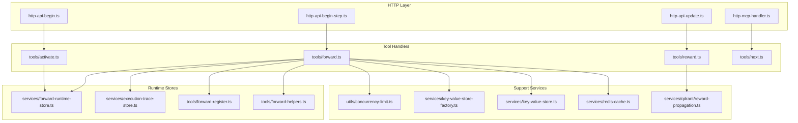

**Diagram sources**
- [src/http/http-api-begin.ts](file://src/http/http-api-begin.ts)
- [src/http/http-api-begin-step.ts](file://src/http/http-api-begin-step.ts)
- [src/http/http-api-update.ts](file://src/http/http-api-update.ts)
- [src/http/http-mcp-handler.ts](file://src/http/http-mcp-handler.ts)
- [src/tools/activate.ts](file://src/tools/activate.ts)
- [src/tools/forward.ts](file://src/tools/forward.ts)
- [src/tools/reward.ts](file://src/tools/reward.ts)
- [src/tools/next.ts](file://src/tools/next.ts)
- [src/services/forward-runtime-store.ts](file://src/services/forward-runtime-store.ts)
- [src/services/execution-trace-store.ts](file://src/services/execution-trace-store.ts)
- [src/tools/forward-register.ts](file://src/tools/forward-register.ts)
- [src/tools/forward-helpers.ts](file://src/tools/forward-helpers.ts)
- [src/utils/concurrency-limit.ts](file://src/utils/concurrency-limit.ts)
- [src/services/key-value-store-factory.ts](file://src/services/key-value-store-factory.ts)
- [src/services/key-value-store.ts](file://src/services/key-value-store.ts)
- [src/services/redis-cache.ts](file://src/services/redis-cache.ts)
- [src/services/qdrant/reward-propagation.ts](file://src/services/qdrant/reward-propagation.ts)

**Section sources**
- [src/http/http-api-begin.ts](file://src/http/http-api-begin.ts)
- [src/http/http-api-begin-step.ts](file://src/http/http-api-begin-step.ts)
- [src/http/http-api-update.ts](file://src/http/http-api-update.ts)
- [src/http/http-mcp-handler.ts](file://src/http/http-mcp-handler.ts)
- [src/tools/activate.ts](file://src/tools/activate.ts)
- [src/tools/forward.ts](file://src/tools/forward.ts)
- [src/tools/reward.ts](file://src/tools/reward.ts)
- [src/tools/next.ts](file://src/tools/next.ts)
- [src/services/forward-runtime-store.ts](file://src/services/forward-runtime-store.ts)
- [src/services/execution-trace-store.ts](file://src/services/execution-trace-store.ts)
- [src/tools/forward-register.ts](file://src/tools/forward-register.ts)
- [src/tools/forward-helpers.ts](file://src/tools/forward-helpers.ts)
- [src/utils/concurrency-limit.ts](file://src/utils/concurrency-limit.ts)
- [src/services/key-value-store-factory.ts](file://src/services/key-value-store-factory.ts)
- [src/services/key-value-store.ts](file://src/services/key-value-store.ts)
- [src/services/redis-cache.ts](file://src/services/redis-cache.ts)
- [src/services/qdrant/reward-propagation.ts](file://src/services/qdrant/reward-propagation.ts)

## Core Components
- Activation: Initializes a new workflow run, validates inputs, creates a runtime session, and persists initial state.
- Forward: Executes the next step(s), handles branching, updates runtime state, records execution traces, and manages errors.
- Reward: Records quality signals and propagates them to downstream components for evaluation and learning.
- Next: Provides guidance on the next action or proof required by the current step.
- Concurrency Control: Limits parallelism to protect resources and ensure stable throughput.
- Persistence: Key-value store and Redis-backed caches maintain checkpoints and transient state.
- Execution Trace Store: Captures detailed per-run telemetry for monitoring and debugging.

Key responsibilities and interactions:
- Activation writes initial runtime state and registers capabilities.
- Forward reads current state, executes step logic, branches based on conditions, and persists updated state plus traces.
- Reward writes evaluations and triggers propagation to Qdrant for scoring and retrieval.
- Next consults runtime state and helpers to determine required proofs or actions.

**Section sources**
- [src/tools/activate.ts](file://src/tools/activate.ts)
- [src/tools/forward.ts](file://src/tools/forward.ts)
- [src/tools/reward.ts](file://src/tools/reward.ts)
- [src/tools/next.ts](file://src/tools/next.ts)
- [src/services/forward-runtime-store.ts](file://src/services/forward-runtime-store.ts)
- [src/services/execution-trace-store.ts](file://src/services/execution-trace-store.ts)
- [src/utils/concurrency-limit.ts](file://src/utils/concurrency-limit.ts)
- [src/services/key-value-store-factory.ts](file://src/services/key-value-store-factory.ts)
- [src/services/key-value-store.ts](file://src/services/key-value-store.ts)
- [src/services/redis-cache.ts](file://src/services/redis-cache.ts)
- [src/services/qdrant/reward-propagation.ts](file://src/services/qdrant/reward-propagation.ts)

## Architecture Overview
The workflow engine follows a layered architecture:
- HTTP API layer routes requests to tool handlers.
- Tool handlers implement business logic and coordinate with runtime stores.
- Runtime stores persist state and traces.
- Support services provide concurrency limits, caching, and external integrations.

```mermaid
sequenceDiagram
participant Client as "Client"
participant HTTP as "HTTP API"
participant Activate as "Activate Handler"
participant Forward as "Forward Handler"
participant RTStore as "Forward Runtime Store"
participant Trace as "Execution Trace Store"
participant KV as "Key-Value Store"
participant Cache as "Redis Cache"
participant Qdrant as "Qdrant Reward Propagation"
Client->>HTTP : "Begin workflow"
HTTP->>Activate : "validate + create session"
Activate->>KV : "persist initial state"
Activate-->>HTTP : "session id"
HTTP-->>Client : "activation response"
Client->>HTTP : "Forward step"
HTTP->>Forward : "load state + execute step"
Forward->>RTStore : "read current state"
Forward->>Trace : "record execution trace"
Forward->>KV : "checkpoint updated state"
Forward->>Cache : "invalidate/update cache"
alt "Reward recorded"
Forward->>Qdrant : "propagate reward signal"
end
Forward-->>HTTP : "next action / result"
HTTP-->>Client : "step result"
```

**Diagram sources**
- [src/http/http-api-begin.ts](file://src/http/http-api-begin.ts)
- [src/http/http-api-begin-step.ts](file://src/http/http-api-begin-step.ts)
- [src/tools/activate.ts](file://src/tools/activate.ts)
- [src/tools/forward.ts](file://src/tools/forward.ts)
- [src/services/forward-runtime-store.ts](file://src/services/forward-runtime-store.ts)
- [src/services/execution-trace-store.ts](file://src/services/execution-trace-store.ts)
- [src/services/key-value-store-factory.ts](file://src/services/key-value-store-factory.ts)
- [src/services/key-value-store.ts](file://src/services/key-value-store.ts)
- [src/services/redis-cache.ts](file://src/services/redis-cache.ts)
- [src/services/qdrant/reward-propagation.ts](file://src/services/qdrant/reward-propagation.ts)

## Detailed Component Analysis

### Activation Flow
Activation initializes a workflow run:
- Validates input schema and tenant context.
- Creates a unique session identifier.
- Persists initial runtime state to the key-value store.
- Registers UI and tool capabilities for the session.
- Returns activation metadata to the client.

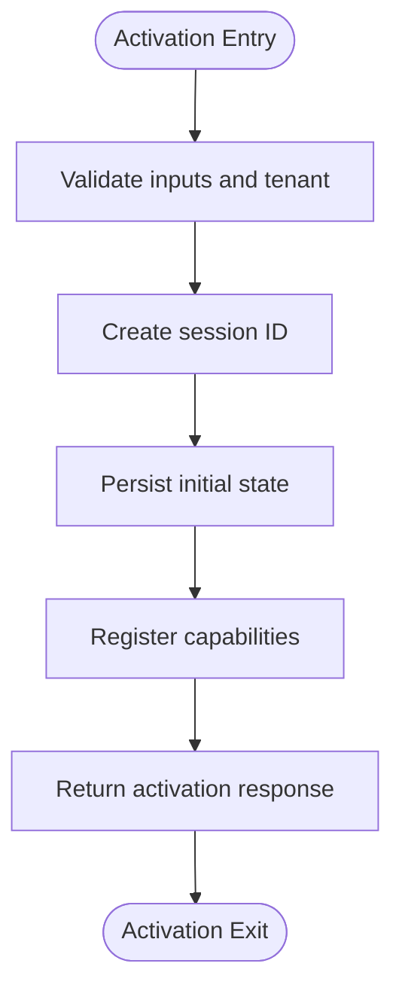

**Diagram sources**
- [src/tools/activate.ts](file://src/tools/activate.ts)
- [src/tools/activate_schema.ts](file://src/tools/activate_schema.ts)
- [src/services/key-value-store-factory.ts](file://src/services/key-value-store-factory.ts)
- [src/services/key-value-store.ts](file://src/services/key-value-store.ts)

**Section sources**
- [src/tools/activate.ts](file://src/tools/activate.ts)
- [src/tools/activate_schema.ts](file://src/tools/activate_schema.ts)
- [src/services/key-value-store-factory.ts](file://src/services/key-value-store-factory.ts)
- [src/services/key-value-store.ts](file://src/services/key-value-store.ts)

### Forward Step Execution
Forward drives step execution:
- Loads current runtime state from the runtime store.
- Executes step logic with optional conditional branching.
- Records execution traces for each operation.
- Updates and checkpoints state to persistent storage.
- Manages concurrency via a limiter.
- Handles errors and returns actionable results.

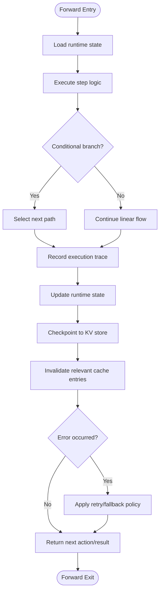

**Diagram sources**
- [src/tools/forward.ts](file://src/tools/forward.ts)
- [src/services/forward-runtime-store.ts](file://src/services/forward-runtime-store.ts)
- [src/services/execution-trace-store.ts](file://src/services/execution-trace-store.ts)
- [src/utils/concurrency-limit.ts](file://src/utils/concurrency-limit.ts)
- [src/services/redis-cache.ts](file://src/services/redis-cache.ts)
- [src/tools/forward-register.ts](file://src/tools/forward-register.ts)
- [src/tools/forward-helpers.ts](file://src/tools/forward-helpers.ts)

**Section sources**
- [src/tools/forward.ts](file://src/tools/forward.ts)
- [src/services/forward-runtime-store.ts](file://src/services/forward-runtime-store.ts)
- [src/services/execution-trace-store.ts](file://src/services/execution-trace-store.ts)
- [src/utils/concurrency-limit.ts](file://src/utils/concurrency-limit.ts)
- [src/services/redis-cache.ts](file://src/services/redis-cache.ts)
- [src/tools/forward-register.ts](file://src/tools/forward-register.ts)
- [src/tools/forward-helpers.ts](file://src/tools/forward-helpers.ts)

### Reward and Evaluation System
Reward captures quality signals and propagates them:
- Accepts reward payloads validated against schemas.
- Writes evaluations to persistent storage.
- Triggers propagation to Qdrant for scoring and retrieval.
- Integrates with stats and scoring utilities for aggregation.

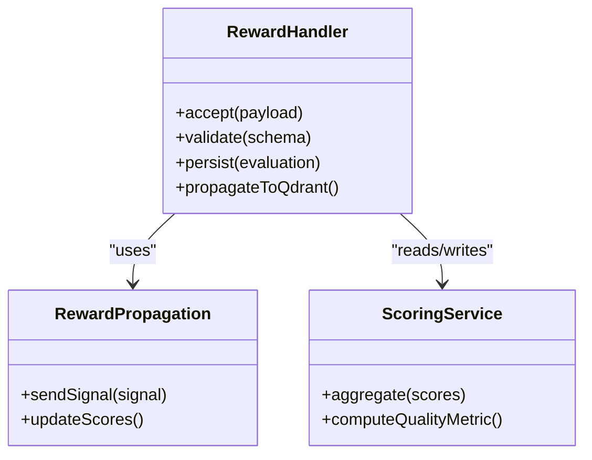

**Diagram sources**
- [src/tools/reward.ts](file://src/tools/reward.ts)
- [src/tools/reward_schema.ts](file://src/tools/reward_schema.ts)
- [src/services/qdrant/reward-propagation.ts](file://src/services/qdrant/reward-propagation.ts)
- [src/services/stats/scoring.ts](file://src/services/stats/scoring.ts)
- [src/services/stats/types.ts](file://src/services/stats/types.ts)

**Section sources**
- [src/tools/reward.ts](file://src/tools/reward.ts)
- [src/tools/reward_schema.ts](file://src/tools/reward_schema.ts)
- [src/services/qdrant/reward-propagation.ts](file://src/services/qdrant/reward-propagation.ts)
- [src/services/stats/scoring.ts](file://src/services/stats/scoring.ts)
- [src/services/stats/types.ts](file://src/services/stats/types.ts)

### Next Action Guidance
Next determines the subsequent action or required proof:
- Inspects current runtime state and missing proofs.
- Uses helpers to compute canonical next action.
- Returns structured guidance for clients.

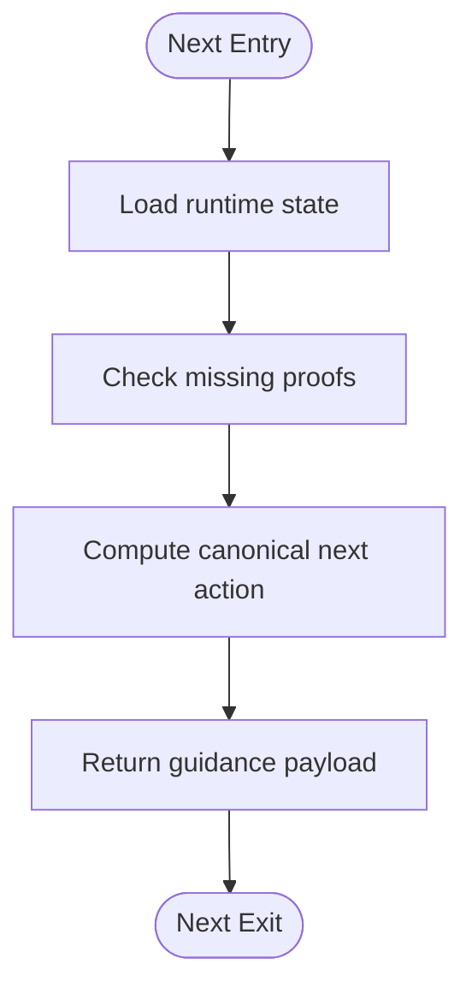

**Diagram sources**
- [src/tools/next.ts](file://src/tools/next.ts)
- [src/tools/next_schema.ts](file://src/tools/next_schema.ts)
- [src/tools/next-previous-step.ts](file://src/tools/next-previous-step.ts)
- [src/tools/next-missing-proof-payload.ts](file://src/tools/next-missing-proof-payload.ts)
- [src/tools/next-pow-helpers.ts](file://src/tools/next-pow-helpers.ts)

**Section sources**
- [src/tools/next.ts](file://src/tools/next.ts)
- [src/tools/next_schema.ts](file://src/tools/next_schema.ts)
- [src/tools/next-previous-step.ts](file://src/tools/next-previous-step.ts)
- [src/tools/next-missing-proof-payload.ts](file://src/tools/next-missing-proof-payload.ts)
- [src/tools/next-pow-helpers.ts](file://src/tools/next-pow-helpers.ts)

### MCP Integration and UI Offerings
MCP handler integrates with UI offerings and forwards calls:
- Routes MCP requests to appropriate handlers.
- Supports UI widgets and inline resources.
- Ensures consistent error responses and telemetry.

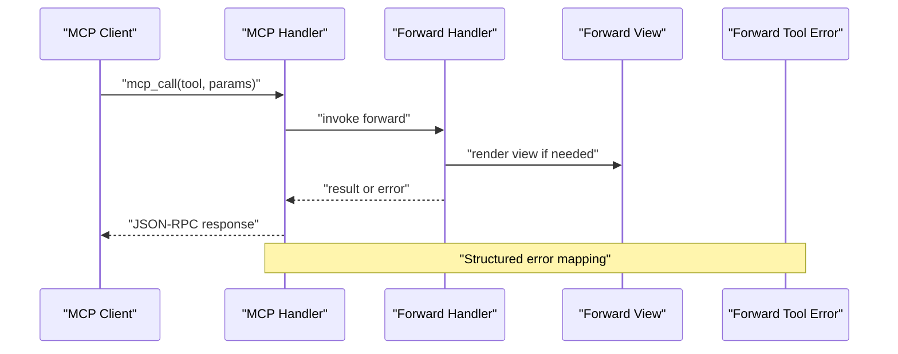

**Diagram sources**
- [src/http/http-mcp-handler.ts](file://src/http/http-mcp-handler.ts)
- [src/tools/forward.ts](file://src/tools/forward.ts)
- [src/tools/forward-view.ts](file://src/tools/forward-view.ts)
- [src/tools/forward-tool-error.ts](file://src/tools/forward-tool-error.ts)

**Section sources**
- [src/http/http-mcp-handler.ts](file://src/http/http-mcp-handler.ts)
- [src/tools/forward.ts](file://src/tools/forward.ts)
- [src/tools/forward-view.ts](file://src/tools/forward-view.ts)
- [src/tools/forward-tool-error.ts](file://src/tools/forward-tool-error.ts)

### Execution Trace System
The execution trace store captures detailed telemetry:
- Records per-operation timestamps, inputs, outputs, and errors.
- Associates traces with session IDs for correlation.
- Supports export and analysis for debugging and performance tuning.

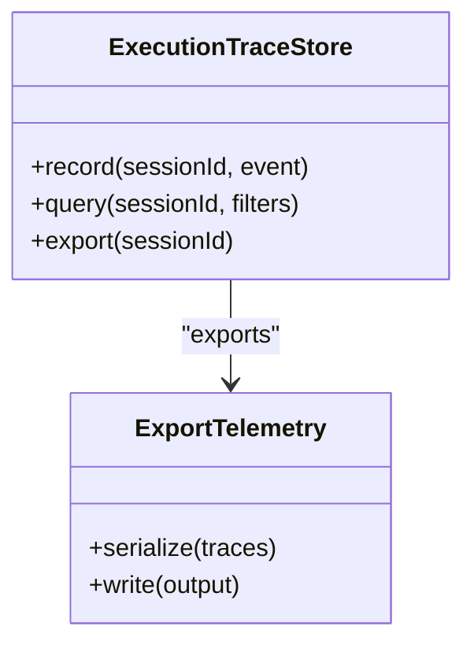

**Diagram sources**
- [src/services/execution-trace-store.ts](file://src/services/execution-trace-store.ts)
- [src/tools/export-telemetry.ts](file://src/tools/export-telemetry.ts)

**Section sources**
- [src/services/execution-trace-store.ts](file://src/services/execution-trace-store.ts)
- [src/tools/export-telemetry.ts](file://src/tools/export-telemetry.ts)

### Capability Registration and Artifacts
Capability registration and artifact handling support rich workflows:
- Registers UI and tool capabilities during activation and forward.
- Manages artifact catalogs, MIME types, and relative paths.
- Provides download capabilities and stores for artifacts.

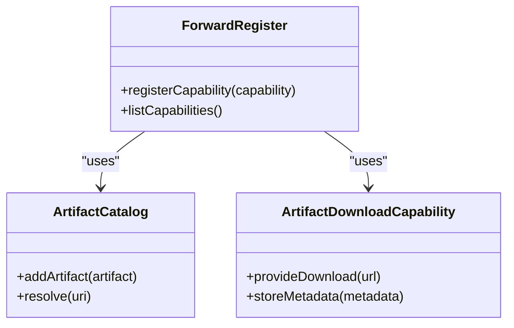

**Diagram sources**
- [src/tools/forward-register.ts](file://src/tools/forward-register.ts)
- [src/tools/artifact-catalog.ts](file://src/tools/artifact-catalog.ts)
- [src/tools/artifact-mime.ts](file://src/tools/artifact-mime.ts)
- [src/tools/artifact-relative-path.ts](file://src/tools/artifact-relative-path.ts)
- [src/tools/export-artifact-download-capability.ts](file://src/tools/export-artifact-download-capability.ts)
- [src/tools/export-artifact-download-capability-store.ts](file://src/tools/export-artifact-download-capability-store.ts)

**Section sources**
- [src/tools/forward-register.ts](file://src/tools/forward-register.ts)
- [src/tools/artifact-catalog.ts](file://src/tools/artifact-catalog.ts)
- [src/tools/artifact-mime.ts](file://src/tools/artifact-mime.ts)
- [src/tools/artifact-relative-path.ts](file://src/tools/artifact-relative-path.ts)
- [src/tools/export-artifact-download-capability.ts](file://src/tools/export-artifact-download-capability.ts)
- [src/tools/export-artifact-download-capability-store.ts](file://src/tools/export-artifact-download-capability-store.ts)

### Training, Tuning, and Evidence Review
Training and tuning tools integrate with workflow execution:
- Train pipelines ingest artifacts and produce models.
- Tune executes verification and message generation.
- Evidence review checks compliance and correctness.

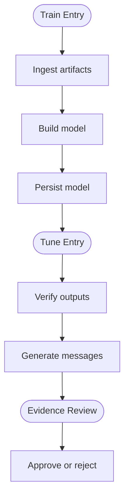

**Diagram sources**
- [src/tools/train.ts](file://src/tools/train.ts)
- [src/tools/train-store.ts](file://src/tools/train-store.ts)
- [src/tools/tune.ts](file://src/tools/tune.ts)
- [src/tools/tune-execute.ts](file://src/tools/tune-execute.ts)
- [src/tools/tune-messages.ts](file://src/tools/tune-messages.ts)
- [src/tools/tune-verify.ts](file://src/tools/tune-verify.ts)
- [src/tools/review-evidence-check.ts](file://src/tools/review-evidence-check.ts)

**Section sources**
- [src/tools/train.ts](file://src/tools/train.ts)
- [src/tools/train-store.ts](file://src/tools/train-store.ts)
- [src/tools/tune.ts](file://src/tools/tune.ts)
- [src/tools/tune-execute.ts](file://src/tools/tune-execute.ts)
- [src/tools/tune-messages.ts](file://src/tools/tune-messages.ts)
- [src/tools/tune-verify.ts](file://src/tools/tune-verify.ts)
- [src/tools/review-evidence-check.ts](file://src/tools/review-evidence-check.ts)

### Shell Challenges and Proof Generation
Shell challenges and proof generation extend workflow capabilities:
- Invokes shell commands safely within constraints.
- Generates genesis proof hashes for integrity.
- Defines proof types and structures.

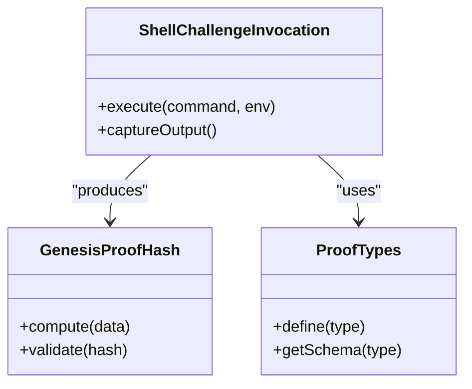

**Diagram sources**
- [src/tools/shell-challenge-invocation.ts](file://src/tools/shell-challenge-invocation.ts)
- [src/tools/kairos-genesis-proof-hash.ts](file://src/tools/kairos-genesis-proof-hash.ts)
- [src/tools/next-proof-types.ts](file://src/tools/next-proof-types.ts)

**Section sources**
- [src/tools/shell-challenge-invocation.ts](file://src/tools/shell-challenge-invocation.ts)
- [src/tools/kairos-genesis-proof-hash.ts](file://src/tools/kairos-genesis-proof-hash.ts)
- [src/tools/next-proof-types.ts](file://src/tools/next-proof-types.ts)

### Export and Download Capabilities
Export and download capabilities enable artifact portability:
- Resolves adapters and selections for export.
- Serializes telemetry and rewards.
- Provides download endpoints and stores.

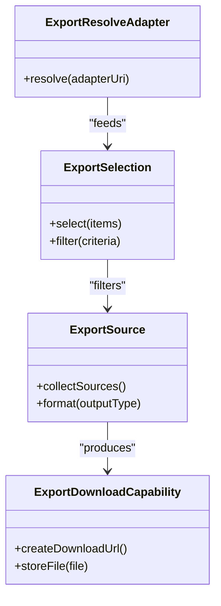

**Diagram sources**
- [src/tools/export-resolve-adapter.ts](file://src/tools/export-resolve-adapter.ts)
- [src/tools/export-selection.ts](file://src/tools/export-selection.ts)
- [src/tools/export-source.ts](file://src/tools/export-source.ts)
- [src/tools/export-download-capability.ts](file://src/tools/export-download-capability.ts)
- [src/tools/export-download-capability-store.ts](file://src/tools/export-download-capability-store.ts)

**Section sources**
- [src/tools/export-resolve-adapter.ts](file://src/tools/export-resolve-adapter.ts)
- [src/tools/export-selection.ts](file://src/tools/export-selection.ts)
- [src/tools/export-source.ts](file://src/tools/export-source.ts)
- [src/tools/export-download-capability.ts](file://src/tools/export-download-capability.ts)
- [src/tools/export-download-capability-store.ts](file://src/tools/export-download-capability-store.ts)

## Dependency Analysis
The workflow engine exhibits clear separation between HTTP routing, tool handlers, runtime stores, and support services. Dependencies are primarily unidirectional:
- HTTP endpoints depend on tool handlers.
- Tool handlers depend on runtime stores and support services.
- Runtime stores depend on key-value and Redis backends.
- Reward propagation depends on Qdrant integration.

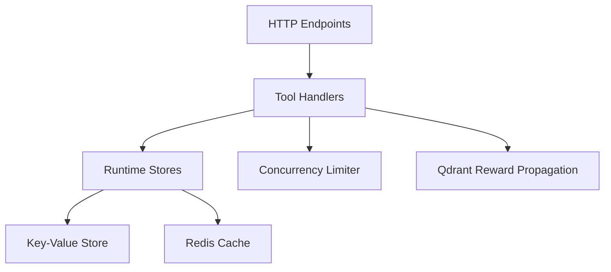

**Diagram sources**
- [src/http/http-api-begin.ts](file://src/http/http-api-begin.ts)
- [src/http/http-api-begin-step.ts](file://src/http/http-api-begin-step.ts)
- [src/http/http-api-update.ts](file://src/http/http-api-update.ts)
- [src/tools/activate.ts](file://src/tools/activate.ts)
- [src/tools/forward.ts](file://src/tools/forward.ts)
- [src/tools/reward.ts](file://src/tools/reward.ts)
- [src/services/forward-runtime-store.ts](file://src/services/forward-runtime-store.ts)
- [src/services/execution-trace-store.ts](file://src/services/execution-trace-store.ts)
- [src/services/key-value-store-factory.ts](file://src/services/key-value-store-factory.ts)
- [src/services/key-value-store.ts](file://src/services/key-value-store.ts)
- [src/services/redis-cache.ts](file://src/services/redis-cache.ts)
- [src/utils/concurrency-limit.ts](file://src/utils/concurrency-limit.ts)
- [src/services/qdrant/reward-propagation.ts](file://src/services/qdrant/reward-propagation.ts)

**Section sources**
- [src/http/http-api-begin.ts](file://src/http/http-api-begin.ts)
- [src/http/http-api-begin-step.ts](file://src/http/http-api-begin-step.ts)
- [src/http/http-api-update.ts](file://src/http/http-api-update.ts)
- [src/tools/activate.ts](file://src/tools/activate.ts)
- [src/tools/forward.ts](file://src/tools/forward.ts)
- [src/tools/reward.ts](file://src/tools/reward.ts)
- [src/services/forward-runtime-store.ts](file://src/services/forward-runtime-store.ts)
- [src/services/execution-trace-store.ts](file://src/services/execution-trace-store.ts)
- [src/services/key-value-store-factory.ts](file://src/services/key-value-store-factory.ts)
- [src/services/key-value-store.ts](file://src/services/key-value-store.ts)
- [src/services/redis-cache.ts](file://src/services/redis-cache.ts)
- [src/utils/concurrency-limit.ts](file://src/utils/concurrency-limit.ts)
- [src/services/qdrant/reward-propagation.ts](file://src/services/qdrant/reward-propagation.ts)

## Performance Considerations
- Concurrency Limiting: Use the concurrency limiter to cap parallel step executions and prevent resource exhaustion.
- Caching Strategy: Leverage Redis for short-lived caches and invalidate entries after state updates to reduce redundant work.
- Checkpoint Frequency: Balance checkpoint frequency with write overhead; frequent checkpoints improve recovery but increase I/O.
- Trace Volume: Keep execution traces concise and filterable to avoid storage bloat while retaining diagnostic value.
- Reward Propagation: Batch reward signals when possible to minimize network calls to Qdrant.

[No sources needed since this section provides general guidance]

## Troubleshooting Guide
Common issues and resolutions:
- Activation Failures: Validate input schemas and tenant context; check key-value store connectivity.
- Forward Errors: Inspect execution traces for operation-level failures; verify capability registration and artifact availability.
- Reward Propagation Issues: Confirm Qdrant service health and payload formats; review scoring metrics for anomalies.
- Concurrency Bottlenecks: Adjust concurrency limits and monitor queue depths; consider scaling workers.
- Cache Inconsistencies: Ensure cache invalidation occurs after successful state updates; verify TTL alignment.

**Section sources**
- [src/tools/forward-tool-error.ts](file://src/tools/forward-tool-error.ts)
- [src/tools/mcp-runtime-error.ts](file://src/tools/mcp-runtime-error.ts)
- [src/services/execution-trace-store.ts](file://src/services/execution-trace-store.ts)
- [src/services/redis-cache.ts](file://src/services/redis-cache.ts)
- [src/services/qdrant/reward-propagation.ts](file://src/services/qdrant/reward-propagation.ts)

## Conclusion
The Kairos MCP workflow engine provides a robust, stateful execution system with comprehensive lifecycle management, orchestration patterns, and observability. By leveraging runtime stores, concurrency controls, and reward propagation, it supports complex workflows with reliable error recovery and high-quality assessment. Adhering to best practices for design and configuration ensures scalable and maintainable workflow deployments.

[No sources needed since this section summarizes without analyzing specific files]

## Appendices

### Configuration Options
- Timeout Handling: Configure step timeouts at the HTTP layer and tool handlers to prevent long-running operations.
- Retry Logic: Implement retry policies in forward handlers with exponential backoff for transient failures.
- Failure Recovery: Use checkpoints and execution traces to resume workflows after interruptions.
- Concurrency Limits: Tune concurrency parameters based on resource capacity and workload characteristics.
- Reward Thresholds: Set thresholds for reward acceptance and propagation to maintain quality standards.

[No sources needed since this section provides general guidance]

### Examples and Best Practices
- Complex Workflow Definition: Combine multiple steps with conditional branching, artifact handling, and evidence review.
- Parallel Execution: Use concurrency limits to safely execute independent steps in parallel.
- Resource Management: Monitor and adjust resource allocations based on observed usage patterns.
- Quality Assessment: Integrate reward signals early and often to guide workflow improvements.
- Monitoring and Debugging: Enable detailed execution traces and export telemetry for post-mortem analysis.

[No sources needed since this section provides general guidance]