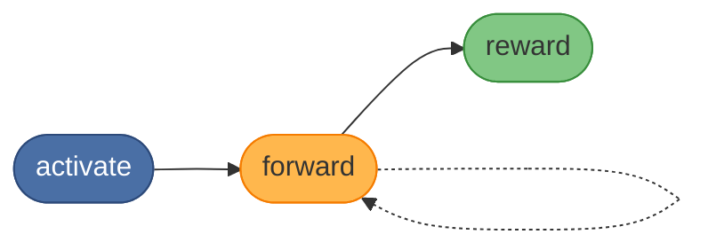
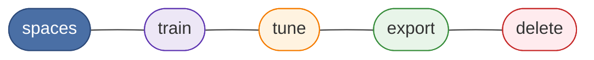

# KAIROS MCP


[](https://opensource.org/licenses/MIT)
[](https://nodejs.org/)

KAIROS MCP is a TypeScript service for storing and executing reusable protocol
chains for AI agents. It exposes:

- an MCP endpoint at `POST /mcp`
- REST endpoints under `/api/*`
- a browser UI under `/ui`
- a CLI named `kairos`

Without persistent workflows, agents repeat work, lose context, and cannot
follow multi-step procedures reliably. KAIROS fixes this with three core
ideas (the diagrams below list every **MCP tool**):

- **Persistent memory** — store and retrieve protocol chains across sessions
- **Deterministic execution** — **activate** → **forward** (per layer) →
  **reward**; the server drives `next_action` at every step
- **Agent-facing design** — tool descriptions and error messages built for
  programmatic consumption and recovery

Protocol execution runs in a fixed order: **activate** (match adapters),
**forward** (run each layer’s contract; loop), then **reward** (finalize the
run). Use **train** / **tune** / **export** / **delete** / **spaces** as
described in each tool’s MCP description.

**Default run order** — `activate` → `forward` (loop per layer) → `reward`:



**Discovery and adapter lifecycle** — no fixed order; follow each tool’s MCP description:



The server generates challenge data (`nonce`, `proof_hash`, URIs); agents echo
those values back exactly.

## What runs in this repository

The current codebase includes:

- **HTTP application server** — Express app for MCP, REST, auth routes, and UI
- **Qdrant-backed protocol store** — required for runtime
- **Optional Redis cache / proof-of-work state store** — enabled when `REDIS_URL` is set
- **Optional Keycloak auth integration** — browser session + Bearer JWT validation
- **React UI** — served from the same origin at `/ui`
- **CLI** — talks to the HTTP API

## Quick start

If your agent supports installable skills, start with the guided setup below.
If not, use the manual Docker path that follows.

### Guided setup with the `kairos-install` skill

Use this when you want a guided first-time setup for Ollama, `.env`
configuration, and the minimal local stack.
The repo stores `kairos-install` under `skills/.system/`, but you still
install it by name.

1. Install the setup skill:

   ```bash
   npx skills add debian777/kairos-mcp --skill kairos-install
   ```

2. Ask your agent to run `kairos-install` for this repo. The skill confirms
   each system-changing step before it installs Ollama, prepares `.env`, and
   starts the minimal Docker stack.

3. Verify the server:

   ```bash
   curl http://localhost:3000/health
   ```

4. Open the UI or MCP endpoint:
   - UI: `http://localhost:3000/ui`
   - MCP: `http://localhost:3000/mcp`
   - Metrics: `http://localhost:9090/metrics`

### Manual minimal Docker stack

Use this when you want the smallest working server deployment without the
guided skill. The default Compose profile starts **Qdrant + app only**.

1. Copy the minimal env example:

   ```bash
   cp docs/install/env.example.minimal.txt .env
   ```

2. Edit `.env` and set at least:
   - `QDRANT_API_KEY`
   - one embedding provider:
     - `OPENAI_API_KEY`, or
     - `OPENAI_API_URL` + `OPENAI_EMBEDDING_MODEL` + `OPENAI_API_KEY=ollama`, or
     - `TEI_BASE_URL` (+ optional `TEI_MODEL`)

3. Start the stack:

   ```bash
   docker compose -p kairos-mcp up -d
   ```

4. Verify the server:

   ```bash
   curl http://localhost:3000/health
   ```

5. Open the UI or MCP endpoint:
   - UI: `http://localhost:3000/ui`
   - MCP: `http://localhost:3000/mcp`
   - Metrics: `http://localhost:9090/metrics`

### Full stack (Redis + Postgres + Keycloak)

For local auth-enabled development, copy the fullstack env example and start
the `fullstack` profile:

```bash
cp docs/install/env.example.fullstack.txt .env
docker compose -p kairos-mcp --profile fullstack up -d
```

If you want the repo’s full local development flow, use the documented scripts:

```bash
npm ci
npm run infra:up
npm run dev:deploy
```

See [docs/install/README.md](docs/install/README.md) and
[CONTRIBUTING.md](CONTRIBUTING.md) for the exact env variables and dev workflow.

## Installation options

### Run the server with Docker Compose

Use the Compose quick start above. This repository ships `compose.yaml`,
minimal and fullstack env examples, and the scripts used for local development
and CI.

### Install the CLI

Node.js 25 or later is required.

Run once without installing globally:

```bash
npx @debian777/kairos-mcp --help
```

Or install globally:

```bash
npm install -g @debian777/kairos-mcp
kairos --help
```

The CLI talks to a running KAIROS server over HTTP. See [docs/CLI.md](docs/CLI.md).

### Add KAIROS to your agent instructions

This repo ships the **kairos** skill for running protocols. Use `--list`
to see what the skills registry reports for this repo.

If you want agents to use KAIROS consistently, add a short repo rule or
instruction such as:

> KAIROS MCP is a Model Context Protocol server for persistent memory and
> deterministic adapter execution. Execute protocols in this order:
> **`activate`** → **`forward`** (loop per layer until `next_action` points to
> **`reward`**) → **`reward`**. Echo all server-generated hashes, nonces, and
> URIs exactly.

## Agent skills shipped in this repo

This repository currently ships three installable skills. The primary
workflow skill lives in `skills/`. The helper skills live in
`skills/.system/`, but you still install them by name.

| Skill | Purpose |
|-------|---------|
| `kairos` | Run KAIROS protocols |
| `kairos-bug-report` | Capture structured MCP bug reports in `reports/` |
| `kairos-install` | First-time local setup guidance |

Install all shipped skills:

```bash
npx skills add debian777/kairos-mcp
```

Install one specific skill:

```bash
npx skills add debian777/kairos-mcp --skill kairos
```

List available skills:

```bash
npx skills add debian777/kairos-mcp --list
```

Popular global installs:

| Agents | Command |
|--------|---------|
| Cursor | `npx skills add debian777/kairos-mcp -y -g -a cursor` |
| Claude Code | `npx skills add debian777/kairos-mcp -y -g -a claude-code` |
| Cursor + Claude Code | `npx skills add debian777/kairos-mcp -y -g -a cursor -a claude-code` |
| All detected agents | `npx skills add debian777/kairos-mcp -y -g` |

More detail: [skills/README.md](skills/README.md)

## Documentation map

- [Documentation index](docs/README.md)
- [Install and environment](docs/install/README.md)
- [Install KAIROS MCP in Cursor](docs/INSTALL-MCP.md)
- [CLI reference](docs/CLI.md)
- [Architecture](docs/architecture/README.md)
- [Protocol examples](docs/examples/README.md)
- [Contributing](CONTRIBUTING.md)

## Troubleshooting

### The server does not start

Check container logs:

```bash
docker compose -p kairos-mcp logs app-prod
```

Also verify that required ports are free:

- minimal stack: `3000`, `6333`, `9090`
- full stack adds: `6379`, `5432`, `8080`, `9000`

### Health check returns `503`

KAIROS only reports healthy when Qdrant is ready. Wait for Qdrant to finish
starting, then retry:

```bash
curl http://localhost:3000/health
```

### Embeddings fail on startup

Set one working embedding backend in `.env`:

- OpenAI: `OPENAI_API_KEY`
- Ollama/OpenAI-compatible: `OPENAI_API_URL`, `OPENAI_EMBEDDING_MODEL`, `OPENAI_API_KEY=ollama`
- TEI: `TEI_BASE_URL` (+ optional `TEI_MODEL`)

### Auth-enabled development is failing

Use the fullstack env example, start the `fullstack` profile, and configure
realms:

```bash
npm run infra:up
```

### The CLI keeps asking for login

The CLI stores tokens per API URL. Confirm that:

- you are using the expected `--url` / `KAIROS_API_URL`
- the token is still valid
- Keycloak and the KAIROS server agree on issuer and audience

Use:

```bash
kairos token --validate
```

## Support

- [Documentation](docs/README.md)
- [Issues](https://github.com/debian777/kairos-mcp/issues)
- [Discussions](https://github.com/debian777/kairos-mcp/discussions)

## Trademark

KAIROS MCP™ and the KAIROS MCP logo are trademarks of the project owner.
They are not covered by the MIT license. Forks must remove the name and logo.

See [TRADEMARK.md](TRADEMARK.md).

## License

MIT — see [LICENSE](LICENSE).