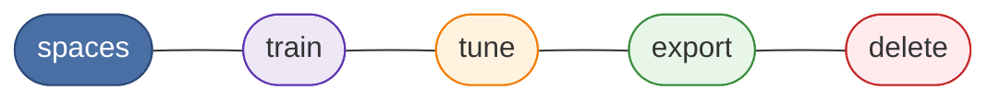

# KAIROS MCP

<!-- kairos-lint-allow-protocol-synonyms -->


[](https://opensource.org/licenses/MIT)
[](https://nodejs.org/)

KAIROS MCP is a TypeScript service for storing and executing reusable protocol
chains for AI agents. It exposes:

- an MCP endpoint at `POST /mcp`
- REST endpoints under `/api/*`
- a browser UI under `/ui`
- a CLI named `kairos`

Without persistent workflows, agents repeat work, lose context, and cannot
follow multi-step procedures reliably. KAIROS fixes this with three core
ideas (the diagrams below list every **MCP tool**):

- **Persistent memory** — store and retrieve protocol chains across sessions
- **Deterministic execution** — **activate** → **forward** (per layer) →
  **reward**; the server drives `next_action` at every step
- **Agent-facing design** — tool descriptions and error messages built for
  programmatic consumption and recovery

Protocol execution runs in a fixed order: **activate** (match adapters),
**forward** (run each layer’s contract; loop), then **reward** (finalize the
run). Use **train** / **tune** / **export** / **delete** / **spaces** as
described in each tool’s MCP description.

**Default run order** — `activate` → `forward` (loop per layer) → `reward`:


**Discovery and adapter lifecycle** — no fixed order; follow each tool’s MCP description:



The server generates challenge data (`nonce`, `proof_hash`, URIs); agents echo
those values back exactly.

## Protocol execution

Authoritative behavior for agents is defined in the MCP tool resources under
[`src/embed-docs/tools/`](src/embed-docs/tools/) (**`activate`**, **`forward`**,
**`reward`**). This is an on-wire summary; follow each response’s `next_action`
and `must_obey` fields in real runs.

1. **`activate`** — Provide a short `query` string (about 3-8 words) on every
   call. From `choices`, pick **one** row and obey **that** row’s `next_action`
   (do not mix in another URI). Typical roles: **`match`** (continue with
   **`forward`** on the given adapter URI), **`refine`**, **`create`**
   (register a new adapter with **`train`**).

2. **`forward`** — With the adapter URI from **`activate`**, call **`forward`**
   and **omit** `solution` on the **first** call for that run. Read `contract`
   and `next_action`. For each layer, call **`forward`** again using the **layer**
   URI from the last response (add `?execution_id=...` when the server returns
   it) and supply a `solution` whose `type` matches `contract.type`. Loop until
   `next_action` tells you to call **`reward`**.

3. **`reward`** — After the last layer, call **`reward`** with the **layer** URI
   from **`forward`** (not the adapter URI unless the schema explicitly allows
   it), `outcome` (`success` or `failure`), and optional evaluator fields per the
   tool description.

**Must always:** Obey `next_action` verbatim. Echo server-issued `nonce`,
`proof_hash`, and URIs exactly.

**Must never:** Invent URIs; skip layers; submit a solution whose type does not
match `contract.type`.

For a longer narrative, see the **Workflow Engine** pages in the
[KAIROS wiki](https://github.com/debian777/kairos-mcp/wiki).

## What runs in this repository

The current codebase includes:

- **HTTP application server** — Express app for MCP, REST, auth routes, and UI
- **stdio MCP transport** — direct local-host launch path for desktop/IDE MCP clients
- **Qdrant-backed adapter store** — required for runtime
- **Optional Redis cache / proof-of-work state store** — enabled when `REDIS_URL` is set
- **Optional Keycloak auth integration** — browser session + Bearer JWT validation
- **React UI** — served from the same origin at `/ui`
- **CLI** — talks to the HTTP API

## Transport modes

Use one transport mode per process:

**`kairos serve` / `kairos-mcp serve`** (run the MCP server from the npm package):

- **`--transport stdio|http`** overrides **`TRANSPORT_TYPE`** for that process only.
- If neither is set, **`serve` defaults to stdio** (good for local MCP hosts).
- Other **`kairos`** commands (login, train, …) do not use `--transport`; they only see
  **`TRANSPORT_TYPE`** if you set it in the environment (normally leave it unset for CLI-only use).

- **`TRANSPORT_TYPE=http`**: serves `/mcp`, `/api/*`, `/ui`, and `/health`; this is
  the default for Docker Compose deployments.
- **`TRANSPORT_TYPE=stdio`**: runs MCP over stdin/stdout for local hosts such as
  Claude Desktop, Cursor, or Claude Code. In this mode, stdout is reserved for
  MCP protocol frames and logs go to stderr.

## Quick start

KAIROS runs as a local MCP server that your agent host launches over **stdio**
(the default transport). You do not need to clone this repo or run Docker
Compose — `npx` fetches and runs the published package.

### Prerequisites

- **Node.js 24+**.
- **A Qdrant instance on `http://localhost:6333`** — KAIROS cannot start
  without it, and no auth is required for local use. If you don't already run
  one, this is the quickest option (optional convenience):

  ```bash
  docker run -p 6333:6333 qdrant/qdrant
  ```

- **One embedding backend**, supplied through the host `env` below.

### Configure your MCP host

Add KAIROS to your host's `mcp.json` (Cursor, Claude Desktop, Claude Code, …).
`serve` uses **stdio** by default, so **no `--transport` flag is needed**:

```json
{
  "mcpServers": {
    "KAIROS": {
      "command": "npx",
      "args": ["-y", "@debian777/kairos-mcp", "serve"],
      "env": {
        "QDRANT_URL": "http://localhost:6333",
        "QDRANT_API_KEY": "",
        "OPENAI_API_KEY": "sk-..."
      }
    }
  }
}
```

`QDRANT_API_KEY=""` selects no-auth localhost Qdrant. For the embedding backend,
supply **one** of:

- **OpenAI** — `OPENAI_API_KEY`
- **Ollama / OpenAI-compatible** — `OPENAI_API_URL`, `OPENAI_EMBEDDING_MODEL`,
  and `OPENAI_API_KEY=ollama`
- **TEI** — `TEI_BASE_URL` (+ optional `TEI_MODEL`)

Every parameter is **ENV-overridable**. To run KAIROS as an HTTP listener
instead of stdio, add `"--transport", "http"` to `args` (see
[Transport modes](#transport-modes)).

Some hosts show a longer **agent-visible** server id (for example one ending in
`-KAIROS`); see [AGENTS.md](AGENTS.md) for the runtime authority note.

When executing over MCP, follow **[Protocol execution](#protocol-execution)**
above and each tool result's `next_action`. The connected server's tool
descriptions are the runtime authority if they differ from this file.

> **Developers:** to run the full Docker Compose stack (Qdrant + app + optional
> Keycloak / Redis / Postgres) for local development and testing, see
> [CONTRIBUTING.md](CONTRIBUTING.md).

## Install the CLI (optional)

The `kairos` CLI talks to a running KAIROS HTTP server. It is optional — the
MCP quick start above does not require it.

Node.js 24 or later is required.

Run once without installing globally:

```bash
npx @debian777/kairos-mcp --help
```

Or install globally:

```bash
npm install -g @debian777/kairos-mcp
kairos --help
```

See [docs/CLI.md](docs/CLI.md).

## Add KAIROS to your agent instructions

This repo ships the **kairos** skill for running protocols. Use `--list`
to see what the skills registry reports for this repo.

If you want agents to use KAIROS consistently, add a short repo rule or
instruction such as:

> KAIROS MCP is a Model Context Protocol server for persistent memory and
> deterministic adapter execution. Execute protocols in this order:
> **`activate`** → **`forward`** (loop per layer until `next_action` points to
> **`reward`**) → **`reward`**. Echo all server-generated hashes, nonces, and
> URIs exactly.

## Agent skills shipped in this repo

This repository ships its agent skills under
[`.agents/skills/`](.agents/skills/). Two skills are published:

| Skill | Audience | Purpose |
|-------|----------|---------|
| `kairos` | Users | Run KAIROS protocols; install and update guidance; bug reports |
| `kairos-dev` | Developers | Docker Compose dev environment and maintainer workflows (internal; not installed by `npx skills add`) |

Install the user skill:

```bash
npx skills add debian777/kairos-mcp --skill kairos
```

List available skills:

```bash
npx skills add debian777/kairos-mcp --list
```

Popular global installs:

| Agents | Command |
|--------|---------|
| Cursor | `npx skills add debian777/kairos-mcp --skill kairos -y -g -a cursor` |
| Claude Code | `npx skills add debian777/kairos-mcp --skill kairos -y -g -a claude-code` |
| Cursor + Claude Code | `npx skills add debian777/kairos-mcp --skill kairos -y -g -a cursor -a claude-code` |

More detail: [.agents/skills/README.md](.agents/skills/README.md)

## Helm (advanced)

A Helm chart for Kubernetes deployment lives under [`helm/`](helm/). To
validate the chart locally (matches the GitHub Actions CI pipeline):

```bash
npm run test:helm
```

See [docs/install/helm.md](docs/install/helm.md) for deployment details.

## Documentation map

- [Documentation index](docs/README.md)
- [Install and environment](docs/install/README.md)
- [Cursor and MCP](docs/install/README.md#cursor-and-mcp)
- [CLI reference](docs/CLI.md)
- [Architecture (KAIROS wiki)](https://github.com/debian777/kairos-mcp/wiki)
- [Adapter examples](docs/examples/README.md)
- [Contributing](CONTRIBUTING.md)

## Troubleshooting

### The server does not start

In stdio mode KAIROS logs to **stderr** (stdout is reserved for MCP frames).
Check your host's MCP log panel for the `KAIROS` server. The most common cause
is Qdrant not being reachable.

### KAIROS cannot reach Qdrant

KAIROS requires a Qdrant instance and only becomes healthy once Qdrant is
ready. Confirm one is listening on your `QDRANT_URL` (default
`http://localhost:6333`):

```bash
curl http://localhost:6333/readyz
```

If you run KAIROS in HTTP mode (`--transport http`), you can also check its own
health endpoint (`curl http://localhost:3000/health`).

### Embeddings fail on startup

Set one working embedding backend in the host `env`:

- OpenAI: `OPENAI_API_KEY`
- Ollama/OpenAI-compatible: `OPENAI_API_URL`, `OPENAI_EMBEDDING_MODEL`, `OPENAI_API_KEY=ollama`
- TEI: `TEI_BASE_URL` (+ optional `TEI_MODEL`)

### The CLI keeps asking for login

The CLI stores tokens per API URL. Confirm that:

- you are using the expected `--url` / `KAIROS_API_URL`
- the token is still valid
- Keycloak and the KAIROS server agree on issuer and audience

Use:

```bash
kairos token --validate
```

> **Developers:** for Docker Compose, fullstack, and auth troubleshooting, see
> [CONTRIBUTING.md](CONTRIBUTING.md).

## Support

- [Documentation](docs/README.md)
- [Issues](https://github.com/debian777/kairos-mcp/issues)
- [Discussions](https://github.com/debian777/kairos-mcp/discussions)

## Trademark

KAIROS MCP™ and the KAIROS MCP logo are trademarks of the project owner.
They are not covered by the MIT license. Forks must remove the name and logo.

See [TRADEMARK.md](TRADEMARK.md).

## License

MIT — see [LICENSE](LICENSE).
