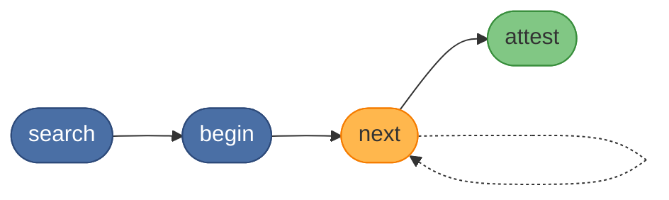

# KAIROS MCP


[](https://opensource.org/licenses/MIT)
[](https://nodejs.org/)

KAIROS MCP™ **automates AI agents and chats** with persistent memory and
deterministic protocol execution. Agents store, retrieve, and run reusable
workflows across sessions—so you get repeatable procedures, not one-off chat.

## Why KAIROS

Without persistent workflows, agents repeat work, lose context, and cannot
follow multi-step procedures reliably. KAIROS fixes this with three
primitives:

- **Persistent memory** — store and retrieve protocol chains across sessions
- **Deterministic execution** — search → begin → next → attest; the server
drives `next_action` at every step
- **Agent-facing design** — tool descriptions and error messages built for  
programmatic consumption and recovery

Protocol execution runs in a fixed order: search for a match, begin the run,
solve each step’s challenge, then attest completion.



**Use cases:** Run the same release or deploy checklist every time; onboard
repos or triage support with a searchable playbook; let agents follow
minted procedures across sessions instead of ad-hoc chat.

## Quick start

KAIROS runs as a Docker stack. Docker and Docker Compose are required.

**Minimal (default):** Qdrant + app only. No Redis or auth.

1. Download the Compose file and minimal env example (or from a clone: `cp docs/install/env.example.minimal.txt .env` from repo root):
  ```bash
   curl -LO https://raw.githubusercontent.com/debian777/kairos-mcp/main/compose.yaml
   curl -LO https://raw.githubusercontent.com/debian777/kairos-mcp/main/docs/install/env.example.minimal.txt
   cp env.example.minimal.txt .env
  ```
2. Set your embedding provider in `.env`: `OPENAI_API_KEY=sk-proj-...` (OpenAI), or [Ollama](docs/install/README.md#optional--ollama-local-embeddings) (local), or TEI — see [docs/install/README.md](docs/install/README.md).
3. Start the stack (from the directory that has `compose.yaml` and `.env`):
  ```bash
   docker compose -p kairos-mcp up -d
  ```
   For a separate minimal deployment (e.g. your own mini directory with its own compose and `.env`): `docker compose -p kairos-mini up -d` from that directory.
4. Confirm the server is healthy:
  ```bash
   curl http://localhost:3000/health
  ```

**Full stack (Redis, Postgres, Keycloak):** Use [docs/install/env.example.fullstack.txt](docs/install/env.example.fullstack.txt) as `.env`, set `REDIS_URL=redis://redis:6379` and your secrets. See [docs/install/README.md](docs/install/README.md) for env variants and full stack setup. Full developer workflow is in [CONTRIBUTING.md](CONTRIBUTING.md).

## Installation

- **Docker Compose (recommended)** — minimal (Qdrant + app) by default, or
full stack with Redis and Keycloak; see the quick start above.
- **npm (CLI only)** — run the `kairos` CLI without installing, or install globally.
Node.js 25 or later is required.
  ```bash
  npx @debian777/kairos-mcp
  ```
  Or install globally: `npm install -g @debian777/kairos-mcp` then run `kairos`.
  Pre-release: `npm install -g @debian777/kairos-mcp@3.2.0-pre.2` (or latest `*-pre.*` on [npm](https://www.npmjs.com/package/@debian777/kairos-mcp?activeTab=versions)). Use `--install-links` to install link dependencies as real packages.
  See [KAIROS CLI](docs/CLI.md) for usage.
- **Update your agent instructions (recommended):** Add the KAIROS intro to your project’s **AGENTS.md** (or your IDE’s rules) so agents follow the protocol. Example to copy or adapt:

  > KAIROS MCP is a Model Context Protocol server for persistent memory and
  > deterministic protocol-chain execution. It stores workflows as linked
  > memory chains where each step carries a proof-of-work challenge. You
  > execute a protocol by searching for a match, beginning the run, solving
  > each challenge via `kairos_next`, and attesting completion. Every hash,
  > nonce, and identifier is server-generated; echo them verbatim — never
  > compute them.


For development setup, all `npm run` commands, and **how we do releases**, see
[CONTRIBUTING.md](CONTRIBUTING.md).

### Agent skills

This repo ships the **kairos** skill (run protocols: /k, /apply, /search). Use `--list` to see what the skills registry reports for this repo.

**Install from this repo:**

```bash
npx skills add debian777/kairos-mcp
```

**Install only the kairos skill:**

```bash
npx skills add debian777/kairos-mcp --skill kairos
```

List what’s available: `npx skills add debian777/kairos-mcp --list`

| Skill | Purpose |
|-------|---------|
| `kairos` | Run protocols (/k, /apply, /search). |

**Popular agents (global install, non-interactive):**

| Agents | Command |
|--------|---------|
| Cursor | `npx skills add debian777/kairos-mcp -y -g -a cursor` |
| Claude Code | `npx skills add debian777/kairos-mcp -y -g -a claude-code` |
| Cursor + Claude Code | `npx skills add debian777/kairos-mcp -y -g -a cursor -a claude-code` |
| All detected agents | `npx skills add debian777/kairos-mcp -y -g` (omit `-a` to install to all) |

Optionally add `--skill kairos` to install only that skill.

**Remove a skill** (use the skill name, e.g. `kairos`):

```bash
npx skills remove kairos -g
```

Run without `-y` to choose agents interactively. Full list and install details: [skills/README.md](skills/README.md). For server setup and MCP config, see [Install KAIROS MCP in Cursor](docs/INSTALL-MCP.md).

## Documentation

- [Install KAIROS MCP in Cursor](docs/INSTALL-MCP.md)
- [KAIROS CLI reference](docs/CLI.md)
- [Architecture and protocol workflows](docs/architecture/README.md) — tool workflows, infrastructure, [auth overview](docs/architecture/auth-overview.md), [logging](docs/architecture/logging.md)
- [Protocol examples and challenge types](docs/examples/README.md)
- [All documentation](docs/README.md)

## Troubleshooting

**The server does not start.** Check that ports 3000 and 6333 (Qdrant) are free (6379 only if using fullstack). Run `docker compose -p kairos-mcp logs` to inspect errors.

**Embeddings fail on startup.** Set an embedding provider in `.env`: `OPENAI_API_KEY` (OpenAI), or [Ollama](docs/install/README.md#optional--ollama-local-embeddings) (`OPENAI_API_URL` base URL + `OPENAI_EMBEDDING_MODEL` + `OPENAI_API_KEY=ollama`; use `http://host.docker.internal:11434` if the app runs in Docker), or TEI (`TEI_BASE_URL` + `TEI_MODEL`). See [docs/install/README.md](docs/install/README.md).

**Health check returns 503.** Qdrant (and Redis if fullstack) may still be initializing. Wait 10–15 seconds, then retry.

**Container exits immediately.** Run `docker compose -p kairos-mcp logs app-prod` and look for missing required environment variables.

## Support

- [Documentation](docs/README.md)
- [Issue tracker](https://github.com/debian777/kairos-mcp/issues)
- [Discussions](https://github.com/debian777/kairos-mcp/discussions)

## Contributing

See [CONTRIBUTING.md](CONTRIBUTING.md) for development setup, contribution
guidelines, and agent-facing design principles.

## Trademark

KAIROS MCP™ and the KAIROS MCP logo are trademarks of the project.

The software is open source under the MIT License,
but the name and branding are not covered by that license.

Forks must remove the KAIROS MCP branding.

See [TRADEMARK.md](TRADEMARK.md) for details.

## License

MIT — see [LICENSE](LICENSE).