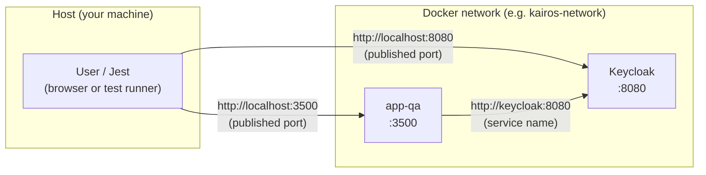
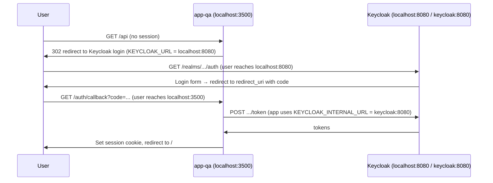
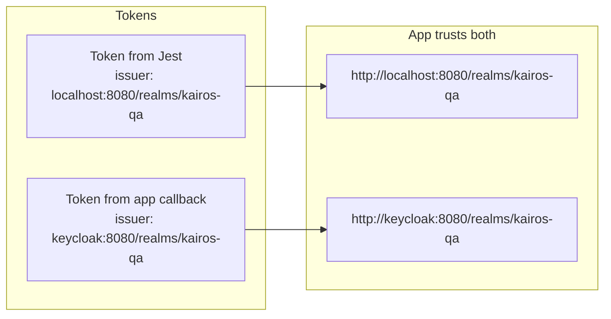

# Auth URLs: Who Talks to Whom (QA / Docker)

When the **app** and **Keycloak** run in Docker but the **user** (browser, Jest) is on the host, there are two different “views” of Keycloak. This doc clarifies which URL is used where.

**One Keycloak per environment:** Dev, QA, and Prod each have their own Keycloak instance (and realm). Each env file (e.g. `.env.qa`) sets `KEYCLOAK_URL`, `KEYCLOAK_REALM`, `KEYCLOAK_CLIENT_ID` for that env; no env-prefixed vars.

---

## Network topology

- **User → Keycloak:** browser (or Jest) uses **localhost:8080** (port published from container).
- **User → App:** browser (or Jest) uses **localhost:3500** (port published from app-qa).
- **App → Keycloak:** app runs inside Docker, so it must use the **service name**: **http://keycloak:8080**.

So we need **two** Keycloak base URLs:

| Role | Who uses it | URL | Env var |
|------|-------------|-----|--------|
| **User-facing** | Login redirect (sent to browser), well-known | Must be reachable by the **user** | `KEYCLOAK_URL` (e.g. `http://localhost:8080` in .env.qa) |
| **Server-side** | App → Keycloak (token exchange, server-side fetch) | Must be reachable by the **app** (Docker) | `KEYCLOAK_INTERNAL_URL` = `http://keycloak:8080` |

---

## OAuth / callback flow

- **redirect_uri** sent to Keycloak is where the **user** lands after login → **user-reachable** app URL:
  - `AUTH_CALLBACK_BASE_URL` = `http://localhost:3500`
  - So redirect_uri = `http://localhost:3500/auth/callback`
- Keycloak must have this redirect_uri allowed in the client (e.g. `kairos-mcp`) for the realm.

---

## JWT issuer (AUTH_TRUSTED_ISSUERS)

The **issuer** in the JWT depends on which URL was used to get the token:

So the app should trust **both**:

- `AUTH_TRUSTED_ISSUERS=http://localhost:8080/realms/kairos-qa,http://keycloak:8080/realms/kairos-qa`

---

## Summary for .env.qa and compose

| Where | Variable | Value | Purpose |
|-------|----------|--------|---------|
| **.env.qa** | `KEYCLOAK_URL` | `http://localhost:8080` | User-facing (login link, well-known); tests get Bearer token from here |
| **.env.qa** | `AUTH_CALLBACK_BASE_URL` | `http://localhost:3500` | Where the user returns after login |
| **.env.qa** | `AUTH_TRUSTED_ISSUERS` | `http://localhost:8080/realms/kairos-qa,http://keycloak:8080/realms/kairos-qa` | Accept tokens from either issuer |
| **Compose** (app-qa) | `KEYCLOAK_INTERNAL_URL` | `http://keycloak:8080` | App → Keycloak token exchange |
