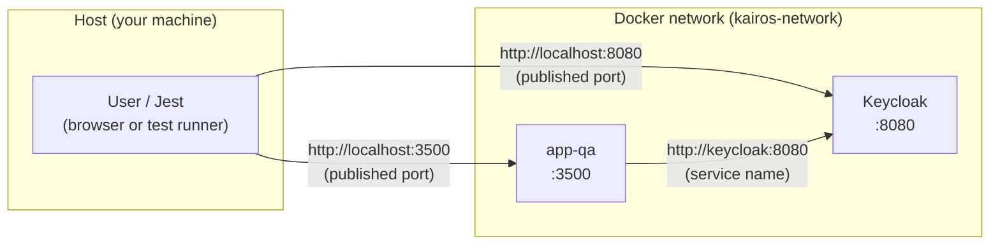
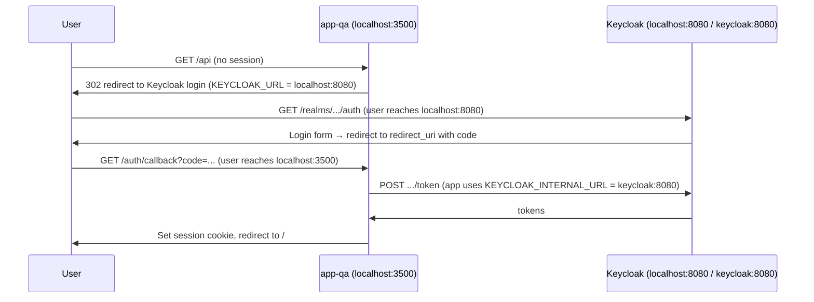
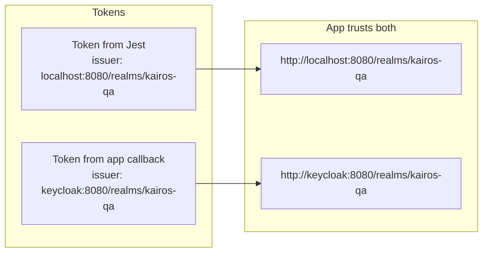

# Auth URL topology: QA and Docker

When the app and Keycloak run in Docker but the user (browser or Jest)
runs on the host, the two parties see Keycloak through different network
paths. This document clarifies which URL each party uses and how to
configure them.

**One Keycloak per environment:** Dev, QA, and prod each have their own
Keycloak instance and realm. Each env file (for example, `.env.qa`) sets
`KEYCLOAK_URL`, `KEYCLOAK_REALM`, and `KEYCLOAK_CLIENT_ID` for that
environment; no env-prefixed variables exist.

## Network topology


```mermaid
flowchart LR
    subgraph HOST["Host (your machine)"]
        USER["User / Jest\n(browser or test runner)"]
    end

    subgraph DOCKER["Docker network (kairos-network)"]
        KEYCLOAK["Keycloak\n:8080"]
        APP["app-qa\n:3500"]
    end

    USER -->|"http://localhost:8080\n(published port)"| KEYCLOAK
    USER -->|"http://localhost:3500\n(published port)"| APP
    APP   -->|"http://keycloak:8080\n(service name)"| KEYCLOAK
```

- **User → Keycloak:** The browser (or Jest) uses `localhost:8080` (the
  published port).
- **User → App:** The browser (or Jest) uses `localhost:3500` (the
  published app-qa port).
- **App → Keycloak:** The app runs inside Docker and must use the service
  name `http://keycloak:8080`.

Two Keycloak base URLs are needed:

| Role | Who uses it | URL | Env var |
|------|-------------|-----|--------|
| **User-facing** | Login redirect (sent to browser), well-known | Must be reachable by the user | `KEYCLOAK_URL` (for example, `http://localhost:8080` in `.env.qa`) |
| **Server-side** | App → Keycloak token exchange | Must be reachable by the app (Docker) | `KEYCLOAK_INTERNAL_URL` = `http://keycloak:8080` |

## OAuth callback flow


```mermaid
sequenceDiagram
    participant User
    participant App as app-qa (localhost:3500)
    participant Keycloak as Keycloak (localhost:8080 / keycloak:8080)

    User->>App: GET /api (no session)
    App->>User: 302 redirect to Keycloak login (KEYCLOAK_URL = localhost:8080)
    User->>Keycloak: GET /realms/.../auth (user reaches localhost:8080)
    Keycloak->>User: Login form → redirect to redirect_uri with code
    User->>App: GET /auth/callback?code=... (user reaches localhost:3500)
    App->>Keycloak: POST .../token (app uses KEYCLOAK_INTERNAL_URL = keycloak:8080)
    Keycloak->>App: tokens
    App->>User: Set session cookie, redirect to /
```

The `redirect_uri` sent to Keycloak is the user-reachable app URL:

- `AUTH_CALLBACK_BASE_URL` = `http://localhost:3500`
- `redirect_uri` = `http://localhost:3500/auth/callback`

Keycloak must have this `redirect_uri` allowed in the client (for example,
`kairos-mcp`) for the realm.

## JWT issuer (AUTH_TRUSTED_ISSUERS)

The issuer in the JWT depends on which URL was used to obtain the token:


```mermaid
flowchart LR
    subgraph Tokens
        T1["Token from Jest\nissuer: localhost:8080/realms/kairos-qa"]
        T2["Token from app callback\nissuer: keycloak:8080/realms/kairos-qa"]
    end
    subgraph Trust["App trusts both"]
        I1["http://localhost:8080/realms/kairos-qa"]
        I2["http://keycloak:8080/realms/kairos-qa"]
    end
    T1 --> I1
    T2 --> I2
```

The app must trust both:

```
AUTH_TRUSTED_ISSUERS=http://localhost:8080/realms/kairos-qa,http://keycloak:8080/realms/kairos-qa
```

## Summary: `.env.qa` and compose variables

| Where | Variable | Value | Purpose |
|-------|----------|--------|---------|
| `.env.qa` | `KEYCLOAK_URL` | `http://localhost:8080` | User-facing (login link, well-known); tests get Bearer token from here |
| `.env.qa` | `AUTH_CALLBACK_BASE_URL` | `http://localhost:3500` | Where the user returns after login |
| `.env.qa` | `AUTH_TRUSTED_ISSUERS` | `http://localhost:8080/realms/kairos-qa,http://keycloak:8080/realms/kairos-qa` | Accept tokens from either issuer |
| compose (`app-qa`) | `KEYCLOAK_INTERNAL_URL` | `http://keycloak:8080` | App → Keycloak token exchange |

## See also

- [`src/config.ts`](../../src/config.ts) — all auth env vars and defaults
- [Infrastructure architecture](infrastructure.md) — Docker network
  topology and port map
