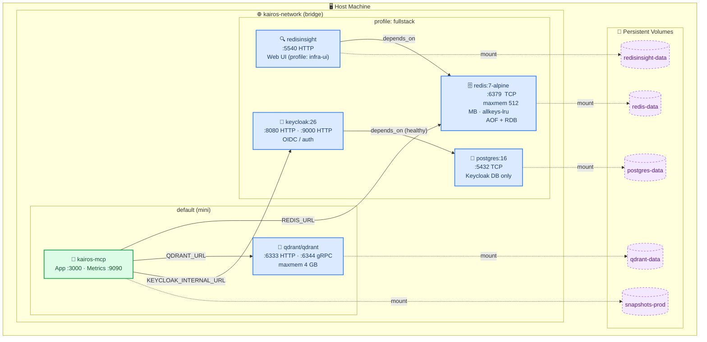
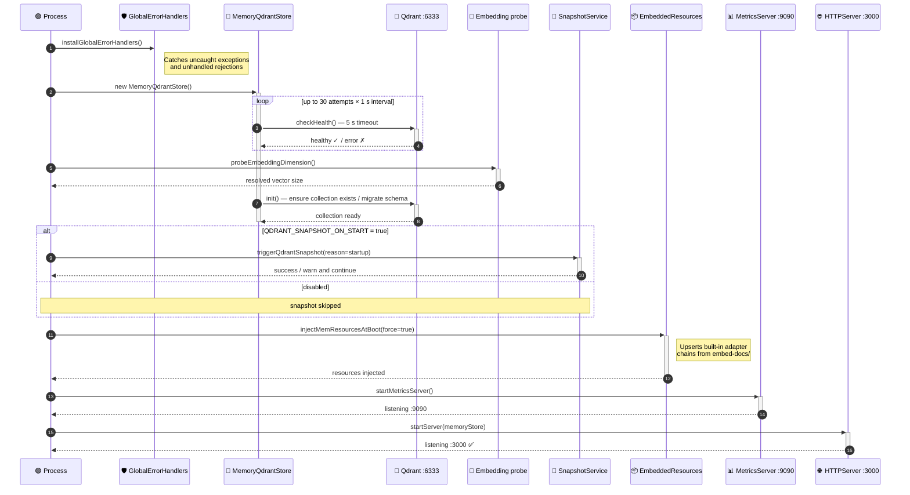
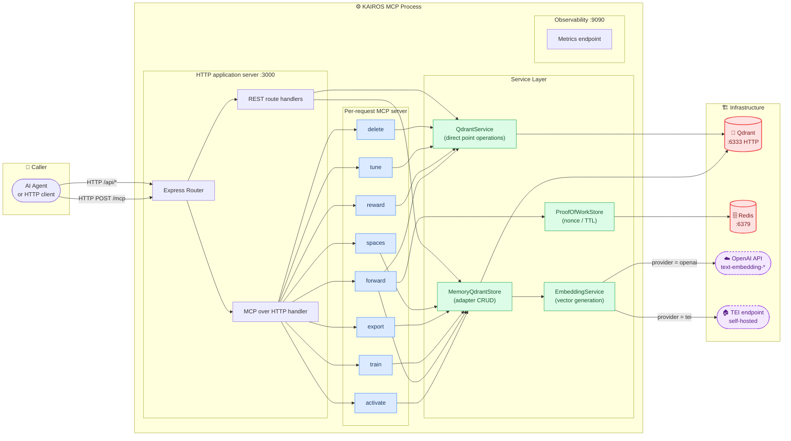
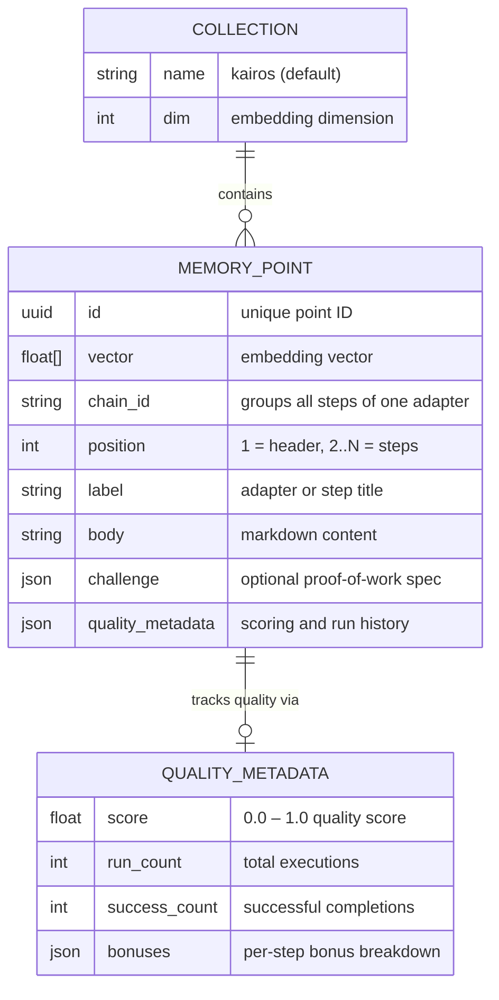
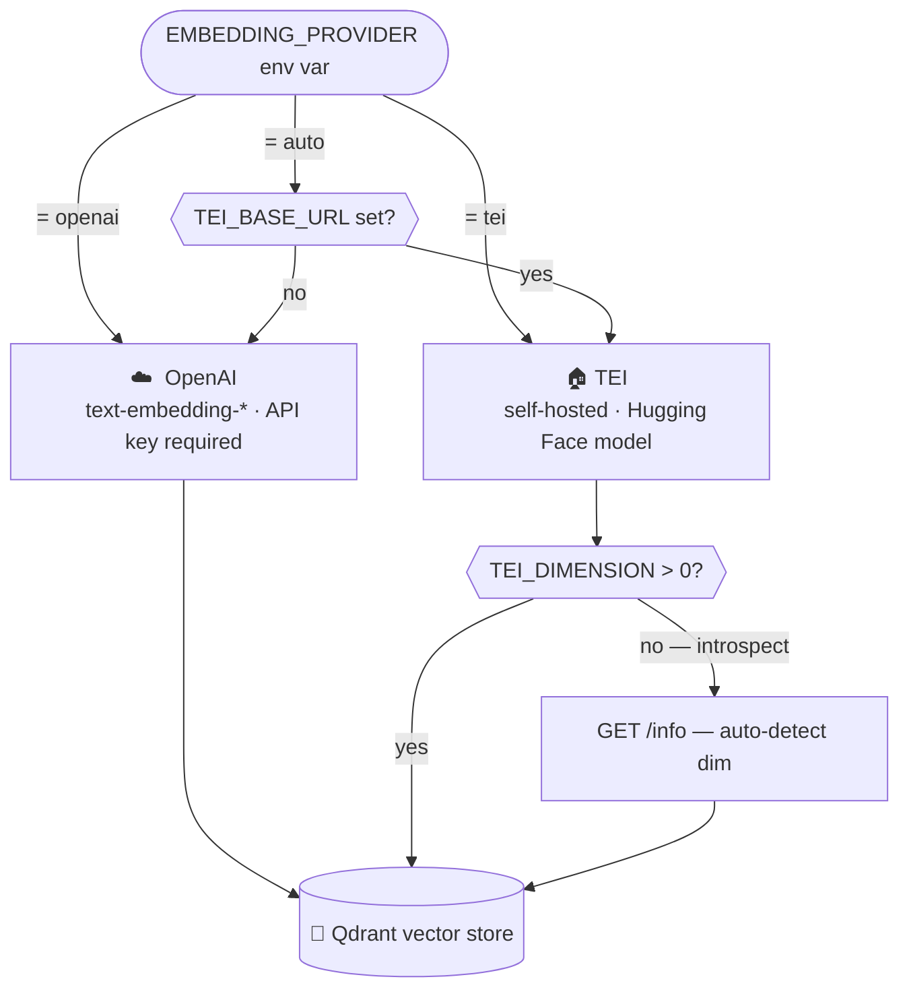

# Infrastructure architecture

This document describes the deployment topology, container composition,
network layout, and service relationships for KAIROS MCP. It is derived
from [`compose.yaml`](../../compose.yaml) and `src/index.ts`.

## Deployment profiles

`compose.yaml` uses Docker profiles so that **default = minimal** (Qdrant + app only). Full stack adds Redis, Postgres, and Keycloak.

| Profile     | Services added |
|-------------|----------------|
| *(default)* | qdrant, app-prod |
| `fullstack` | redis, postgres, keycloak |
| `infra-ui`  | redisinsight (optional; use with `fullstack`) |

```bash
# Minimal (default): Qdrant + app
docker compose -p kairos-mcp up -d

# Full stack: add Redis, Postgres, Keycloak
docker compose -p kairos-mcp --profile fullstack up -d

# Add Redis web UI (with fullstack)
docker compose -p kairos-mcp --profile fullstack --profile infra-ui up -d
```

Use `npm run infra:up` to start the full stack and configure Keycloak realms (uses `.env`).

## Container topology

All containers run on a single bridge network (`kairos-network`).


```mermaid
flowchart TB
    subgraph HOST["🖥  Host Machine"]
        subgraph NET["🌐  kairos-network  (bridge)"]
            direction TB

            subgraph DEFAULT["default (mini)"]
                QDRANT["🧠 qdrant/qdrant
                :6333  HTTP · :6344  gRPC
                maxmem 4 GB"]
                APP["🚀 kairos-mcp
                App :3000 · Metrics :9090"]
            end

            subgraph FULL["profile: fullstack"]
                REDIS["🗄 redis:7-alpine
                :6379  TCP
                maxmem 512 MB · allkeys-lru
                AOF + RDB"]
                RI["🔍 redisinsight
                :5540  HTTP
                Web UI (profile: infra-ui)"]
                PG["🐘 postgres:16
                :5432  TCP
                Keycloak DB only"]
                KC["🔐 keycloak:26
                :8080  HTTP · :9000  HTTP
                OIDC / auth"]
            end

            RI    -->|"depends_on"| REDIS
            KC    -->|"depends_on (healthy)"| PG
            APP   -->|"REDIS_URL"| REDIS
            APP   -->|"QDRANT_URL"| QDRANT
            APP   -->|"KEYCLOAK_INTERNAL_URL"| KC
        end

        subgraph VOLS["💾  Persistent Volumes"]
            direction LR
            VR[("redis-data")]
            VQ[("qdrant-data")]
            VRI[("redisinsight-data")]
            VPG[("postgres-data")]
            VSP[("snapshots-prod")]
        end

        REDIS  -.->|mount| VR
        QDRANT -.->|mount| VQ
        RI     -.->|mount| VRI
        PG     -.->|mount| VPG
        APP    -.->|mount| VSP
    end

    classDef infrasvc fill:#dbeafe,stroke:#3b82f6,color:#1e3a5f,stroke-width:2px
    classDef appsvc   fill:#dcfce7,stroke:#16a34a,color:#14532d,stroke-width:2px
    classDef vol      fill:#f3e8ff,stroke:#9333ea,color:#581c87,stroke-width:1px,stroke-dasharray:4

    class REDIS,RI,QDRANT,PG,KC infrasvc
    class APP appsvc
    class VR,VQ,VRI,VPG,VSP vol
```

## Port map

| Service      | Host port | Container port | Transport | Purpose |
|-------------|-----------|---------------|----------|---------|
| redis        | 6379  | 6379  | TCP  | Key-value store |
| redisinsight | 5540  | 5540  | HTTP | Redis web UI (profile `infra-ui`) |
| qdrant       | 6333  | 6333  | HTTP | Vector DB REST API |
| qdrant       | 6344  | 6344  | TCP | Extra Qdrant port exposed by `compose.yaml`; the application code uses the HTTP API on 6333 |
| postgres     | 5432  | 5432  | TCP  | Postgres (Keycloak DB only) |
| keycloak     | 8080  | 8080  | HTTP | OIDC / auth |
| keycloak     | 9000  | 9000  | HTTP | Keycloak health endpoint |
| app-prod     | 3000  | 3000  | HTTP | MCP + REST API |
| app-prod     | 9090  | 9090  | HTTP | Prometheus metrics |

## Application startup sequence

`src/index.ts` enforces a strict boot order. The process does not start serving
HTTP until the application has verified Qdrant availability, resolved the
embedding dimension, initialized the memory store, injected bundled resources,
and started the metrics server.


```mermaid
sequenceDiagram
    autonumber
    participant PROC  as 🟢 Process
    participant GEH   as 🛡 GlobalErrorHandlers
    participant MEM   as 🧩 MemoryQdrantStore
    participant QD    as 🧠 Qdrant :6333
    participant EMB   as 🧠 Embedding probe
    participant SNAP  as 📸 SnapshotService
    participant RES   as 📦 EmbeddedResources
    participant MT    as 📊 MetricsServer :9090
    participant HTTP  as 🌐 HTTPServer :3000

    PROC->>GEH: installGlobalErrorHandlers()
    Note right of GEH: Catches uncaught exceptions<br/>and unhandled rejections

    PROC->>+MEM: new MemoryQdrantStore()

    loop up to 30 attempts × 1 s interval
        MEM->>+QD: checkHealth() — 5 s timeout
        QD-->>-MEM: healthy ✓ / error ✗
    end

    PROC->>+EMB: probeEmbeddingDimension()
    EMB-->>-PROC: resolved vector size

    MEM->>+QD: init() — ensure collection exists / migrate schema
    QD-->>-MEM: collection ready
    deactivate MEM

    alt QDRANT_SNAPSHOT_ON_START = true
        PROC->>+SNAP: triggerQdrantSnapshot(reason=startup)
        SNAP-->>-PROC: success / warn and continue
    else disabled
        Note over PROC,SNAP: snapshot skipped
    end

    PROC->>+RES: injectMemResourcesAtBoot(force=true)
    Note right of RES: Upserts built-in adapter<br/>chains from embed-docs/
    RES-->>-PROC: resources injected

    PROC->>+MT: startMetricsServer()
    MT-->>-PROC: listening :9090

    PROC->>+HTTP: startServer(memoryStore)
    HTTP-->>-PROC: listening :3000 ✅
```

## Internal service wiring

This diagram shows how an incoming HTTP or MCP request flows through the
Express server and into the current service layer.


```mermaid
flowchart LR
    subgraph CLIENT["👤  Caller"]
        AGT(["AI Agent
        or HTTP client"])
    end

    subgraph APP["⚙️  KAIROS MCP Process"]
        direction TB

        subgraph TRANSPORT["HTTP application server :3000"]
            EXP["Express Router"]
            MCPH["MCP over HTTP handler"]
            API["REST route handlers"]
        end

        subgraph REGISTRY["Per-request MCP server"]
            T_ACTIVATE["activate"]
            T_FORWARD["forward"]
            T_TRAIN["train"]
            T_REWARD["reward"]
            T_TUNE["tune"]
            T_DEL["delete"]
            T_EXPORT["export"]
            T_SPACES["spaces"]
        end

        subgraph SERVICES["Service Layer"]
            MEM_SVC["MemoryQdrantStore
            (adapter CRUD)"]
            EMB_SVC["EmbeddingService
            (vector generation)"]
            POW_SVC["ProofOfWorkStore
            (nonce / TTL)"]
            QDRANT_SVC["QdrantService
            (direct point operations)"]
        end

        subgraph OBS["Observability  :9090"]
            PROM["Metrics endpoint"]
        end
    end

    subgraph INFRA["🏗  Infrastructure"]
        QDRANT_DB[("🧠 Qdrant
        :6333 HTTP")]
        REDIS_DB[("🗄 Redis
        :6379")]
        OPENAI(["☁️  OpenAI API
        text-embedding-*"])
        TEI(["🏠 TEI endpoint
        self-hosted"])
    end

    AGT   -->|"HTTP POST /mcp"| EXP
    AGT   -->|"HTTP /api/*"| EXP
    EXP   --> MCPH
    EXP   --> API
    MCPH  --> T_ACTIVATE & T_FORWARD & T_TRAIN & T_REWARD & T_TUNE & T_DEL & T_EXPORT & T_SPACES

    T_ACTIVATE --> MEM_SVC
    T_FORWARD  --> MEM_SVC & POW_SVC & QDRANT_SVC
    T_TRAIN    --> MEM_SVC
    T_REWARD   --> QDRANT_SVC
    T_TUNE     --> QDRANT_SVC
    T_DEL      --> QDRANT_SVC
    T_EXPORT   --> MEM_SVC
    T_SPACES   --> MEM_SVC
    API      --> MEM_SVC & QDRANT_SVC

    MEM_SVC  --> EMB_SVC
    MEM_SVC  --> QDRANT_DB
    POW_SVC  --> REDIS_DB
    QDRANT_SVC --> QDRANT_DB

    EMB_SVC  -->|"provider = openai"| OPENAI
    EMB_SVC  -->|"provider = tei"| TEI

    classDef tool  fill:#dbeafe,stroke:#3b82f6,color:#1e3a5f,stroke-width:1px
    classDef svc   fill:#dcfce7,stroke:#16a34a,color:#14532d,stroke-width:1px
    classDef infra fill:#fee2e2,stroke:#ef4444,color:#7f1d1d,stroke-width:2px
    classDef ext   fill:#f3e8ff,stroke:#9333ea,color:#581c87,stroke-width:1px,stroke-dasharray:4

    class T_ACTIVATE,T_FORWARD,T_TRAIN,T_REWARD,T_TUNE,T_DEL,T_EXPORT,T_SPACES tool
    class MEM_SVC,EMB_SVC,POW_SVC,QDRANT_SVC svc
    class QDRANT_DB,REDIS_DB infra
    class OPENAI,TEI ext
```

## Health checks

| Service  | Method | Interval | Timeout | Retries | Start period |
|----------|--------|----------|---------|---------|-------------|
| redis    | `redis-cli ping` | 10 s | 3 s | 3 | — |
| qdrant   | `/proc/net/tcp` hex port `:18BD` (= 6333) | 30 s | 5 s | 3 | — |
| postgres | `pg_isready -U keycloak` | 5 s | 5 s | 10 | — |
| app-prod | `wget /health` on `$SERVER_PORT` | 30 s | 5 s | 3 | 40 s |

## Volume layout

The checked-in `compose.yaml` uses Docker named volumes only:

- `redis-data`
- `redisinsight-data`
- `qdrant-data`
- `postgres-data`
- `snapshots-prod`

There is no alternate bind-mount compose file checked into this repository.
If you want host-path mounts, you must edit `compose.yaml` yourself.

## Redis data model

Redis holds only **transient** state; all durable adapter data lives in
Qdrant.

| Key pattern | TTL | Purpose |
|-------------|-----|---------|
| `kairos:pow:<nonce>` | short | Proof-of-work challenge; consumed on first valid submission |
| `kairos:cache:*` | configurable | Optional response cache |

Config: `maxmemory 512mb`, `allkeys-lru`, persistence via
`appendonly yes` + `save 60 1000`.

## Qdrant data model

One collection holds every adapter step as a vector + payload point. The
source default is `kairos` (`src/config.ts`), while the published runtime image
sets `QDRANT_COLLECTION=kairos_memories` unless you override it with env.
Within that collection, H1 headings become adapter headers and H2 headings become
steps.


```mermaid
erDiagram
    COLLECTION {
        string name   "kairos (default)"
        int    dim    "embedding dimension"
    }

    MEMORY_POINT {
        uuid    id               "unique point ID"
        float[] vector           "embedding vector"
        string  chain_id         "groups all steps of one adapter"
        int     position         "1 = header, 2..N = steps"
        string  label            "adapter or step title"
        string  body             "markdown content"
        json    challenge        "optional proof-of-work spec"
        json    quality_metadata "scoring and run history"
    }

    QUALITY_METADATA {
        float   score            "0.0 – 1.0 quality score"
        int     run_count        "total executions"
        int     success_count    "successful completions"
        json    bonuses          "per-step bonus breakdown"
    }

    COLLECTION     ||--o{ MEMORY_POINT    : "contains"
    MEMORY_POINT   ||--o| QUALITY_METADATA : "tracks quality via"
```

## Embedding provider selection

`EMBEDDING_PROVIDER` (default `auto`) determines the vector backend at
both train (store) and search time.


```mermaid
flowchart TD
    ENV(["EMBEDDING_PROVIDER env var"])

    ENV -->|"= openai"| OAI
    ENV -->|"= tei"| TEI
    ENV -->|"= auto"| AUTO{{"TEI_BASE_URL set?"}}

    AUTO -->|"yes"| TEI["🏠 TEI
    self-hosted · Hugging Face model"]
    AUTO -->|"no"| OAI["☁️  OpenAI
    text-embedding-* · API key required"]

    TEI --> DIM{{"TEI_DIMENSION > 0?"}}
    OAI --> VEC

    DIM -->|"yes"| VEC[("🧠 Qdrant vector store")]
    DIM -->|"no — introspect"| INTRO["GET /info — auto-detect dim"]
    INTRO --> VEC
```

## See also

- [Full execution workflow](workflow-full-execution.md) — adapter run
  end-to-end
- [Quality metadata](quality-metadata.md) — scoring and bonus structure
- [Authentication overview](auth-overview.md) — Keycloak URL
  routing
- [`compose.yaml`](../../compose.yaml) — default (Docker named volumes)
- `VOLUME_LOCAL_PATH` — host path for bind mounts (set in `.env`)
- [`src/config.ts`](../../src/config.ts) — all env vars and defaults
