# Infrastructure Architecture

This document describes the deployment topology, container composition, network layout,
and service relationships for KAIROS MCP. Derived from `compose.yaml` and `src/index.ts`.

---

## Deployment profiles

The compose file uses Docker profiles to control which services start together.

| Profile | Services started |
|---------|-----------------|
| `infra` | redis, redisinsight, qdrant, postgres *(3 KAIROS DBs: kairos_dev, kairos_qa, kairos_prod)* |
| `prod`  | redis, redisinsight, qdrant, postgres, app-prod |
| `qa`    | app-qa *(connects to externally running infra)* |

```bash
docker compose --profile infra up -d   # infrastructure only
docker compose --profile prod  up -d   # full production stack
docker compose --profile qa    up -d   # QA app against existing infra
```

---

## Container topology

Containers live on a single bridge network (`kairos-network`). Volumes are all
rooted under `${VOLUME_LOCAL_PATH}` on the host.

```mermaid
flowchart TB
    subgraph HOST["🖥  Host Machine"]
        subgraph NET["🌐  kairos-network  (bridge)"]
            direction TB

            subgraph INFRA["profile: infra / prod"]
                REDIS["🗄 redis:7-alpine
                :6379  TCP
                maxmem 512 MB · allkeys-lru
                AOF + RDB"]
                RI["🔍 redisinsight
                :5540  HTTP
                Web UI"]
                QDRANT["🧠 qdrant/qdrant
                :6333  HTTP · :6344  gRPC
                maxmem 4 GB"]
            end

            subgraph PROD["profile: prod"]
                APP["🚀 kairos-mcp
                App :3000 · Metrics :9090"]
            end

            subgraph QA["profile: qa"]
                QAAPP["🧪 kairos-mcp
                App :3500 · Metrics :9090"]
            end

            RI    -->|"depends_on"| REDIS
            APP   -->|"depends_on"| REDIS
            APP   -->|"depends_on"| QDRANT
            APP   -->|"REDIS_URL"| REDIS
            APP   -->|"QDRANT_URL"| QDRANT
            QAAPP -->|"REDIS_URL"| REDIS
            QAAPP -->|"QDRANT_URL"| QDRANT
        end

        subgraph VOLS["💾  Persistent Volumes"]
            direction LR
            VR[("data/redis")]
            VQ[("data/qdrant")]
            VRI[("data/redisinsight")]
            VSP[("snapshots/prod")]
            VSQ[("snapshots/qa")]
        end

        REDIS  -.->|mount| VR
        QDRANT -.->|mount| VQ
        RI     -.->|mount| VRI
        APP    -.->|mount| VSP
        QAAPP  -.->|mount| VSQ
    end

    classDef infrasvc fill:#dbeafe,stroke:#3b82f6,color:#1e3a5f,stroke-width:2px
    classDef appsvc   fill:#dcfce7,stroke:#16a34a,color:#14532d,stroke-width:2px
    classDef qasvc    fill:#fef9c3,stroke:#ca8a04,color:#713f12,stroke-width:2px
    classDef vol      fill:#f3e8ff,stroke:#9333ea,color:#581c87,stroke-width:1px,stroke-dasharray:4

    class REDIS,RI,QDRANT infrasvc
    class APP appsvc
    class QAAPP qasvc
    class VR,VQ,VRI,VSP,VSQ vol
```



---

## Port map

| Service      | Host port | Container port | Protocol | Purpose |
|-------------|-----------|---------------|----------|---------|
| redis        | 6379  | 6379  | TCP  | Key-value store |
| redisinsight | 5540  | 5540  | HTTP | Redis web UI |
| qdrant       | 6333  | 6333  | HTTP | Vector DB REST API |
| qdrant       | 6344  | 6344  | gRPC | Vector DB gRPC API |
| app-prod     | 3000  | 3000  | HTTP | MCP + REST API |
| app-prod     | 9090  | 9090  | HTTP | Prometheus metrics |
| app-qa       | 3500  | 3500  | HTTP | MCP + REST API |
| app-qa       | 9090  | 9090  | HTTP | Prometheus metrics |
| postgres     | 5432  | 5432  | TCP  | Postgres (kairos_dev, kairos_qa, kairos_prod; profiles `infra` / `prod`) |

---

## Application startup sequence

`src/index.ts` enforces a strict boot order. No HTTP traffic is accepted until
every step completes successfully.

```mermaid
sequenceDiagram
    autonumber
    participant PROC  as 🟢 Process
    participant GEH   as 🛡 GlobalErrorHandlers
    participant MEM   as 🧩 MemoryQdrantStore
    participant QD    as 🧠 Qdrant :6333
    participant SNAP  as 📸 SnapshotService
    participant RES   as 📦 EmbeddedResources
    participant MT    as 📊 MetricsServer :9090
    participant SRV   as ⚙️ MCPServer
    participant HTTP  as 🌐 HTTPServer :3000

    PROC->>GEH: installGlobalErrorHandlers()
    Note right of GEH: Catches uncaught exceptions<br/>and unhandled rejections

    PROC->>+MEM: new MemoryQdrantStore()

    loop up to 30 attempts × 1 s interval
        MEM->>+QD: checkHealth() — 5 s timeout
        QD-->>-MEM: healthy ✓ / error ✗
    end

    MEM->>+QD: init() — ensure collection exists
    QD-->>-MEM: collection ready
    deactivate MEM

    alt QDRANT_SNAPSHOT_ON_START = true
        PROC->>+SNAP: triggerQdrantSnapshot(reason=startup)
        SNAP-->>-PROC: success / warn and continue
    else disabled
        Note over PROC,SNAP: snapshot skipped
    end

    PROC->>+RES: injectMemResourcesAtBoot(force=true)
    Note right of RES: Upserts built-in protocol<br/>chains from embed-docs/
    RES-->>-PROC: resources injected

    PROC->>+MT: startMetricsServer()
    MT-->>-PROC: listening :9090

    PROC->>+SRV: createServer(memoryStore)
    Note right of SRV: Registers 8 MCP tools<br/>+ docs & prompt resources
    SRV-->>-PROC: McpServer instance

    PROC->>+HTTP: startServer(server, memoryStore)
    HTTP-->>-PROC: listening :3000 ✅
```



---

## Internal service wiring

How the application layers connect at runtime — from an incoming HTTP/MCP call
down through the service layer to external infrastructure.

```mermaid
flowchart LR
    subgraph CLIENT["👤  Caller"]
        AGT(["AI Agent
        or HTTP client"])
    end

    subgraph APP["⚙️  KAIROS MCP Process"]
        direction TB

        subgraph TRANSPORT["HTTP Transport  :3000"]
            EXP["Express Router"]
            MCPH["MCP over HTTP handler"]
        end

        subgraph REGISTRY["MCP Server  (tool registry)"]
            T_SEARCH["kairos_search"]
            T_BEGIN["kairos_begin"]
            T_NEXT["kairos_next"]
            T_MINT["kairos_mint"]
            T_UPD["kairos_update"]
            T_DEL["kairos_delete"]
            T_DUMP["kairos_dump"]
        end

        subgraph SERVICES["Service Layer"]
            MEM_SVC["MemoryQdrantStore
            (chain CRUD)"]
            SRCH_SVC["SearchService
            (semantic ranking)"]
            EMB_SVC["EmbeddingService
            (vector generation)"]
            POW_SVC["ProofOfWorkStore
            (nonce / TTL)"]
            STATS["StatsService
            (quality scoring)"]
        end

        subgraph OBS["Observability  :9090"]
            PROM["Prometheus Metrics"]
        end
    end

    subgraph INFRA["🏗  Infrastructure"]
        QDRANT_DB[("🧠 Qdrant
        :6333 HTTP · :6344 gRPC")]
        REDIS_DB[("🗄 Redis
        :6379")]
        OPENAI(["☁️  OpenAI API
        text-embedding-*"])
        TEI(["🏠 TEI endpoint
        self-hosted"])
    end

    AGT   -->|"HTTP POST /mcp"| EXP
    EXP   --> MCPH
    MCPH  --> T_SEARCH & T_BEGIN & T_NEXT & T_MINT & T_UPD & T_DEL & T_DUMP

    T_SEARCH --> SRCH_SVC
    T_BEGIN  --> MEM_SVC & POW_SVC
    T_NEXT   --> MEM_SVC & POW_SVC & STATS
    T_MINT   --> MEM_SVC
    T_UPD    --> MEM_SVC
    T_DEL    --> MEM_SVC
    T_DUMP   --> MEM_SVC

    MEM_SVC  --> EMB_SVC
    MEM_SVC  --> QDRANT_DB
    SRCH_SVC --> EMB_SVC
    SRCH_SVC --> QDRANT_DB
    POW_SVC  --> REDIS_DB
    STATS    --> QDRANT_DB

    EMB_SVC  -->|"provider = openai"| OPENAI
    EMB_SVC  -->|"provider = tei"| TEI

    PROM     -. "scrapes" .-> QDRANT_DB
    PROM     -. "scrapes" .-> REDIS_DB

    classDef tool  fill:#dbeafe,stroke:#3b82f6,color:#1e3a5f,stroke-width:1px
    classDef svc   fill:#dcfce7,stroke:#16a34a,color:#14532d,stroke-width:1px
    classDef infra fill:#fee2e2,stroke:#ef4444,color:#7f1d1d,stroke-width:2px
    classDef ext   fill:#f3e8ff,stroke:#9333ea,color:#581c87,stroke-width:1px,stroke-dasharray:4

    class T_SEARCH,T_BEGIN,T_NEXT,T_MINT,T_UPD,T_DEL,T_DUMP tool
    class MEM_SVC,SRCH_SVC,EMB_SVC,POW_SVC,STATS svc
    class QDRANT_DB,REDIS_DB infra
    class OPENAI,TEI ext
```



---

## Health checks

| Service  | Method | Interval | Timeout | Retries | Start period |
|----------|--------|----------|---------|---------|-------------|
| redis    | `redis-cli ping` | 10 s | 3 s | 3 | — |
| qdrant   | `/proc/net/tcp` hex port `:18BD` (= 6333) | 30 s | 5 s | 3 | — |
| app-prod | `wget /health` on `$PORT` | 30 s | 5 s | 3 | 40 s |
| app-qa   | `wget /health` on `$PORT` | 30 s | 5 s | 3 | 40 s |

---

## Volume layout

```
${VOLUME_LOCAL_PATH}/
├── data/
│   ├── redis/             # AOF journal + RDB snapshot (60 s / 1000 writes)
│   ├── qdrant/            # Vector storage (segments, WAL, indexes)
│   ├── redisinsight/      # RedisInsight UI settings
│   └── postgres/          # Postgres data (profiles infra/prod; 3 KAIROS DBs via init)
└── snapshots/
    ├── prod/qdrant/       # On-demand or startup snapshots — prod
    └── qa/qdrant/         # On-demand or startup snapshots — qa
```

---

## Redis data model

Redis holds only **transient** state; all durable protocol data lives in Qdrant.

| Key pattern | TTL | Purpose |
|-------------|-----|---------|
| `kairos:pow:<nonce>` | short | Proof-of-work challenge; consumed on first valid submission |
| `kairos:cache:*` | configurable | Optional response cache |

Config: `maxmemory 512mb`, `allkeys-lru`, persistence via `appendonly yes` + `save 60 1000`.

---

## Qdrant data model

One collection (default `kb_resources`) holds every protocol step as a
vector + payload point. H1 headings become chain headers; H2 headings become steps.

```mermaid
erDiagram
    COLLECTION {
        string name   "kb_resources (default)"
        int    dim    "embedding dimension"
    }

    MEMORY_POINT {
        uuid    id               "unique point ID"
        float[] vector           "embedding vector"
        string  chain_id         "groups all steps of one protocol"
        int     position         "1 = header, 2..N = steps"
        string  label            "protocol or step title"
        string  body             "markdown content"
        json    challenge        "optional proof-of-work spec"
        json    quality_metadata "scoring and run history"
    }

    QUALITY_METADATA {
        float   score            "0.0 – 1.0 quality score"
        int     run_count        "total executions"
        int     success_count    "successful completions"
        json    bonuses          "per-step bonus breakdown"
    }

    COLLECTION     ||--o{ MEMORY_POINT    : "contains"
    MEMORY_POINT   ||--o| QUALITY_METADATA : "tracks quality via"
```



---

## Embedding provider selection

`EMBEDDING_PROVIDER` (default `auto`) determines the vector backend at both
mint and search time.

```mermaid
flowchart TD
    ENV(["EMBEDDING_PROVIDER env var"])

    ENV -->|"= openai"| OAI
    ENV -->|"= tei"| TEI
    ENV -->|"= auto"| AUTO{{"TEI_BASE_URL set?"}}

    AUTO -->|"yes"| TEI["🏠 TEI
    self-hosted · Hugging Face model"]
    AUTO -->|"no"| OAI["☁️  OpenAI
    text-embedding-* · API key required"]

    TEI --> DIM{{"TEI_DIMENSION > 0?"}}
    OAI --> VEC

    DIM -->|"yes"| VEC[("🧠 Qdrant vector store")]
    DIM -->|"no — introspect"| INTRO["GET /info — auto-detect dim"]
    INTRO --> VEC

    classDef decision fill:#fef9c3,stroke:#ca8a04,color:#713f12,stroke-width:2px
    classDef provider fill:#dbeafe,stroke:#3b82f6,color:#1e3a5f,stroke-width:2px
    classDef store    fill:#fee2e2,stroke:#ef4444,color:#7f1d1d,stroke-width:2px

    class AUTO,DIM decision
    class TEI,OAI provider
    class VEC store
```



---

## See also

- [Full execution workflow](workflow-full-execution.md) — protocol run end-to-end
- [Quality metadata](quality-metadata.md) — scoring and bonus structure
- [Keycloak OIDC dev plan](../plans/keycloak-oidc-dev.md) — optional Keycloak (not in current compose)
- [`compose.yaml`](../../compose.yaml) — source of truth for container definitions
- [`src/config.ts`](../../src/config.ts) — all env vars and defaults
