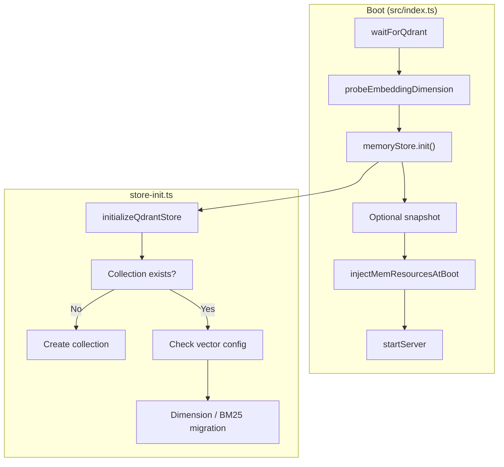

# Qdrant vector database migrations at boot

This document explains how the KAIROS MCP server initializes and migrates
the Qdrant vector database when the application starts. All migrations run
**before** the HTTP server accepts traffic so that the collection is ready
for search and protocol execution.

**Preferred approach for collection structural changes.** Boot-time
migrations in `store-init.ts` are the preferred way to change Qdrant
collection structure (vector names, dimensions, sparse vectors, schema).
Use this path instead of one-off scripts or manual API calls: it runs
before traffic, is idempotent, and keeps all migration logic in one
place. When you add or change vector config or schema, implement it in
`initializeQdrantStore()` (and helpers in `qdrant-vector-management.ts` /
`qdrant-collection-utils.ts`) so that every deployment applies the same
migrations consistently.

## Boot sequence

Startup in [`src/index.ts`](../../src/index.ts) runs in this order:

1. **Wait for Qdrant** — Health checks with retries (default 30 attempts,
   about 1 s apart) until Qdrant is reachable.
2. **Resolve embedding dimension** — `probeEmbeddingDimension()` determines
   the dense vector size (e.g. 1024 or 1536) from the configured embedding
   provider.
3. **Initialize Qdrant memory store** — `memoryStore.init()` runs the
   migration logic described below. This is the only place where collection
   creation and schema migrations run at boot.
4. **Optional startup snapshot** — If `QDRANT_SNAPSHOT_ON_START` is set, a
   Qdrant snapshot is triggered (does not change schema).
5. **Inject mem resources** — Embedded MCP resources are upserted into
   Qdrant (content only).
6. **Start servers** — Metrics and application HTTP servers bind.

The migration entry point is
[`initializeQdrantStore`](../../src/services/memory/store-init.ts) in
`src/services/memory/store-init.ts`, invoked from
[`MemoryQdrantStore.init()`](../../src/services/memory/store.ts).

## What runs during initialization

`initializeQdrantStore(client, collection, url)` uses the same Qdrant
client and collection name as the rest of the app (from `QDRANT_URL`,
`QDRANT_COLLECTION` / `QDRANT_COLLECTION_CURRENT`). It performs one of two
paths.

### Collection does not exist

1. **Create collection** — `createQdrantCollection()` creates the
   collection with:
   - **Named dense vector:** `vs{dim}` (e.g. `vs1536`) with size from
     `getVectorDescriptors()` (driven by embedding dimension), Cosine
     distance, on_disk.
   - **Sparse vector:** `bm25` for hybrid search.
   - **Quantization:** int8 scalar, always_ram.

No further migration runs; the server then continues boot.

### Collection already exists

The code reads the current vector config via `getCollectionVectorConfig()`.
It then:

1. **Reconcile vector name and dimension**
   - If the collection has a single unnamed vector (older), it is treated
     as `vs{existingDim}`.
   - If the **current** dimension or vector name differs from what the
     app expects (`vs{currentDim}`), a **dimension migration** runs (see
     below).
   - If the config already matches (named vector `vs{currentDim}` with
     correct size), this step is skipped.

2. **Ensure BM25 sparse vector**
   - If the collection does not have a `bm25` sparse vector config,
     `ensureBm25SparseConfig()` runs. It first tries
     `updateCollection(..., { sparse_vectors: { bm25: {} } })`. If the
     Qdrant server does not support adding sparse vectors in place, a
     **recreation-based BM25 migration** runs (copy to temp collection
     with dense + BM25, delete original, recreate, copy back, delete
     temp).

Both steps are idempotent: if the collection already has the right
dimension and BM25, they no-op.

## Dimension migration (dense vector size or name change)

When the existing collection has a different dense vector size or still
uses the older unnamed vector, migration runs in four steps.

1. **Older → named vector (if needed)**  
   If the collection has a single unnamed vector, the code adds a named
   vector with the same size (e.g. `vs1024`) via `addVectorsToCollection`.
   If the server does not support adding vectors, a recreation-based path
   (delete + create + restore points) is used instead.

2. **Add new vector space**  
   The new named vector (e.g. `vs1536`) is added to the collection (same
   API or recreation fallback).

3. **Migrate data**  
   `migrateVectorSpace()` scrolls through points that have the old vector,
   re-embeds text (description_full, label, text, tags) with the current
   embedding service, and upserts points with the new vector name. Batch
   size is 64. Points without embeddable content are skipped.

4. **Remove old vector (best-effort)**  
   After migration, `removeVectorFromCollection()` is called. If the
   server supports it, the old vector is removed; otherwise the
   collection may keep both vectors (old one unused).

Implementation details live in
[`src/utils/qdrant-vector-management.ts`](../../src/utils/qdrant-vector-management.ts)
(`addVectorsToCollection`, `migrateVectorSpace`, `removeVectorFromCollection`)
and in `store-init.ts` (orchestration and pre/post counts).

## BM25 migration (recreation path)

When `updateCollection(..., { sparse_vectors: { bm25: {} } })` is not
supported, the code runs a full recreation:

1. Create a **temporary collection** with the same vector config (dense
   + BM25) and name `{collection}_bm25_mig`.
2. **Scroll** the source collection in batches (256 points). For each
   point, compute BM25 sparse from `label` and `text` via
   `tokenizeToSparse()`, and upsert into the temp collection with both
   dense and `bm25` vectors.
3. **Delete** the original collection and **recreate** it with the
   dense + BM25 schema.
4. **Scroll** the temp collection and upsert all points back into the
   recreated collection.
5. **Delete** the temp collection.

If the process fails after deleting the original but before completing
restore, the temp collection still holds the data; you can point
`QDRANT_COLLECTION` at that temp name for recovery. Rollback is not
automatic.

## Collection and vector naming

- **Collection name** comes from config: `QDRANT_COLLECTION_CURRENT` or
  `QDRANT_COLLECTION`, with alias `current` resolved in
  `resolveCollectionAlias()` (see [`qdrant-vector-types.ts`](../../src/utils/qdrant-vector-types.ts)).
- **Dense vector name** is `vs{dimension}` (e.g. `vs1536`) so that
  dimension changes can be migrated by adding a new named vector and
  moving data.
- **Sparse vector** is always named `bm25` for hybrid search.

## Separate Qdrant service initialization

The codebase also has
[`src/services/qdrant/initialization.ts`](../../src/services/qdrant/initialization.ts),
which provides `initializeCollection(conn)` for the shared
`qdrantService`. That path:

- Creates the collection if missing (with size/vector check and optional
  recreate on mismatch).
- Creates payload indexes (e.g. `space_id`, `domain`, `type`, `task`,
  `quality_metadata.step_quality_score`, etc.).
- Runs `backfillSpaceId` (sets `space_id` for points that lack it).
- Optionally creates or updates the `current` alias.

**This path is not used during normal app boot.** The main server uses
only `MemoryQdrantStore` and `initializeQdrantStore()` in `store-init.ts`.
The qdrant service initialization is available for scripts, tests, or
other entry points that need payload indexes and alias setup. If you
need those in production, they must be triggered explicitly (e.g. by
calling `qdrantService.initialize()` in a one-off job or during a
custom startup sequence).

## Configuration and environment

| Env / config              | Effect on boot migrations |
|---------------------------|----------------------------|
| `QDRANT_URL`              | Qdrant base URL; must be reachable before init. |
| `QDRANT_COLLECTION`       | Collection name (fallback when `QDRANT_COLLECTION_CURRENT` unset). |
| `QDRANT_COLLECTION_CURRENT` | Resolved when collection alias is `current`. |
| Embedding provider config | Determines dimension and thus `vs{dim}`; dimension change triggers migration. |

## Next steps

- For how the collection is used in search, see [Search query
  architecture](search-query.md).
- For deployment and topology, see [Infrastructure
  architecture](infrastructure.md).
- For quality and payload fields, see [Quality
  metadata](quality-metadata.md).
