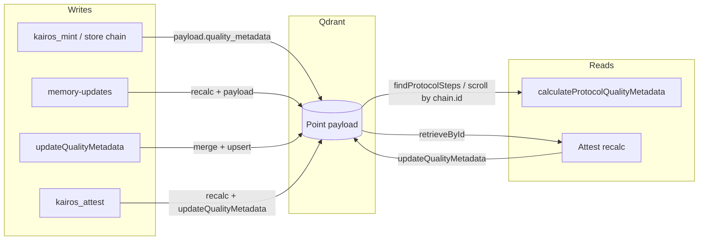

# How we use quality_metadata

This document describes how the KAIROS codebase uses the `quality_metadata`
payload field on Qdrant memory points. It covers the schema, write and read
paths, and real examples of Qdrant queries and payload shapes.

## What quality_metadata is

`quality_metadata` is a small object stored in the **payload** of each memory
point in the Qdrant collection. It classifies the step’s quality for
leaderboards, workflow-level quality, and post-execution updates. It lives
alongside other payload fields such as `label`, `text`, `chain`, and
`quality_metrics`.

Schema (TypeScript shape used in code):

- **`step_quality_score`** (number): Integer score used to aggregate workflow
  potential (e.g. 1–5+). Higher means more “valuable” for scoring.
- **`step_quality`** (string): Tier label — one of `'excellent' | 'high' |
  'standard' | 'basic'`. Used for display and bucketing.

All readers and writers use `quality_metadata` only.

## Where it is written

Quality metadata is set in four situations:

1. **Initial store (chain mint)**  
   When a protocol chain is stored via header-based or default chain store,
   each step’s payload is built with `quality_metadata` from
   `modelStats.calculateStepQualityMetadata(...)` using the step’s
   description, domain, task, type, and tags (no execution context yet).

2. **Memory payload updates**  
   When `memory-updates` applies updates that affect quality (e.g.
   `description_short`, `description_full`, `domain`, `task`, `type`, `tags`),
   it recalculates quality via `modelStats.calculateStepQualityMetadata(...)`
   and sets `quality_metadata` on the updated payload before upserting.

3. **Explicit update API**  
   `updateQualityMetadata(conn, id, { step_quality_score, step_quality })` in
   `src/services/qdrant/quality.ts` merges the given object into existing
   `quality_metadata`, then overwrites the point.

4. **After each step in kairos_next**  
   When a step is completed via `kairos_next` (solution validated), that
   step’s quality is updated with outcome `success` or `failure` (e.g. invalid
   proof → failure). Same logic as attest: `calculateStepQualityMetadata` +
   `updateQualityMetadata` + `updateQualityMetrics`.    This is the main path; the run is complete when `next_action` says "Run
   complete." (no attest required).

5. **After attestation (deprecated — optional override only)**
   When `kairos_attest` (or the HTTP attest API) runs with a success/failure
   outcome, it recalculates quality and calls `updateQualityMetadata`. Attest
   is no longer part of the default protocol; the run is already complete
   after the last `kairos_next`. The attest tool remains for optional override or backward compatibility.

Calculation is centralized in `src/services/stats/scoring.ts`:
`calculateStepQualityMetadata(description, domain, task, type, tags,
executionSuccess?)`. Execution success multiplies the base score and can
promote the tier (e.g. success + high base → excellent).

## Where it is read

- **Protocol-level quality**  
  `calculateProtocolQualityMetadata(protocolId)` in `src/services/stats/protocol.ts`
  fetches all steps for the protocol (e.g. via `findProtocolSteps`), then for
  each step uses `payload.quality_metadata` to get
  `step_quality_score` and `step_quality`. It
  aggregates these into `workflow_total_potential` and `workflow_quality`
  (e.g. “Legendary Workflow”, “Rare Workflow”).

- **Attestation**  
  Attest reads the point’s payload to get `description_short`, `domain`,
  `task`, `type`, `tags` for recalculating quality; it does not branch on
  existing `quality_metadata` for logic, but the updated
  `quality_metadata` is written back after the new score is computed.

- **Search (vector + quality boost)**  
  `vectorSearch` in `src/services/memory/store-methods.ts` uses the raw
  Qdrant similarity score and applies a bounded boost from
  `payload.quality_metadata.step_quality_score`: `score = rawScore * (1 +
  0.1 * min(max(step_quality_score, 0), 1))`. The quality term is clamped
  0–1 so it does not dominate the vector score. Higher-quality steps rank
  higher when vector scores are close.

## Real raw JSON examples

### Qdrant scroll: fetch all steps of a chain by chain id

Used when checking for duplicate chains or when loading steps that belong to
one chain. The filter uses the nested key `chain.id`:

```json
{
  "filter": {
    "must": [
      { "key": "chain.id", "match": { "value": "a67e7ead-4aef-4b0e-b3e5-b6cbb7416917" } }
    ]
  },
  "limit": 256,
  "with_payload": true,
  "with_vector": false
}
```

Request (as used in code):

```javascript
await client.scroll(collection, {
  filter: { must: [{ key: 'chain.id', match: { value: chainUuid } }] },
  limit: 256,
  with_payload: true,
  with_vector: false
});
```

Response points include payloads that contain `quality_metadata` (see below).

### Qdrant scroll: fetch steps by protocol_id (protocol stats)

Used by `findProtocolSteps(protocolId)` to load all steps of a protocol for
aggregate quality:

```json
{
  "filter": {
    "must": [
      { "key": "protocol_id", "match": { "value": "my-protocol-title" } }
    ]
  },
  "limit": 100,
  "with_payload": true,
  "with_vector": false
}
```

Each returned point’s `payload` contains `quality_metadata`; the stats layer reads it.

### Example payload of one memory point (with quality_metadata)

Typical payload shape for a chain step after store or update:

```json
{
  "label": "Step 1: Initialize",
  "tags": ["setup", "project"],
  "text": "Create the project directory structure.",
  "llm_model_id": "model-id",
  "created_at": "2026-02-17T12:00:00.000Z",
  "task": "configuration",
  "type": "context",
  "quality_metadata": {
    "step_quality_score": 3,
    "step_quality": "high"
  },
  "chain": {
    "id": "a67e7ead-4aef-4b0e-b3e5-b6cbb7416917",
    "label": "Simple Setup Protocol",
    "step_index": 1,
    "step_count": 3
  },
  "updated_at": "2026-02-17T12:05:00.000Z"
}
```

If you were to filter by quality tier (e.g. only “excellent” steps), a
theoretical scroll filter would look like:

```json
{
  "filter": {
    "must": [
      { "key": "quality_metadata.step_quality", "match": { "value": "excellent" } }
    ]
  },
  "limit": 100,
  "with_payload": true,
  "with_vector": false
}
```

The codebase does not currently use such a filter; quality is read from
payloads after fetching by `chain.id` or `protocol_id`.

## Data flow (Mermaid)

The following diagram summarizes where `quality_metadata` is produced and
consumed.



- **Writes:** Chain store and memory-updates set `quality_metadata` on upsert;
  attest and the quality API update it via retrieve + merge + upsert.
- **Storage:** One field on the point payload; no separate collection.
- **Reads:** Protocol stats scrolls by `protocol_id` and reads
  `quality_metadata` from each point; attest retrieves by
  id, then writes back updated `quality_metadata`.

## Observability and runbook

- **Metrics:** `kairos_quality_update_errors_total` (counter when
  kairos_next quality update fails), `kairos_mint_similar_memory_found_total`
  (counter when mint returns SIMILAR_MEMORY_FOUND).
- **Alert:** Configure an alert on `kairos_quality_update_errors_total` rate
  (e.g. > 0.1/s over 5m).
- **Runbook:** If quality seems stale or steps are not reflecting
  success/failure, check `kairos_quality_update_errors_total` and Qdrant write
  latency; quality updates are best-effort in kairos_next (log and continue),
  so errors are not surfaced to the client.

## Next steps

- For how protocol execution updates metrics and quality, see
  [workflow-kairos-attest](workflow-kairos-attest.md).
- For the overall architecture index, see [README](README.md).
