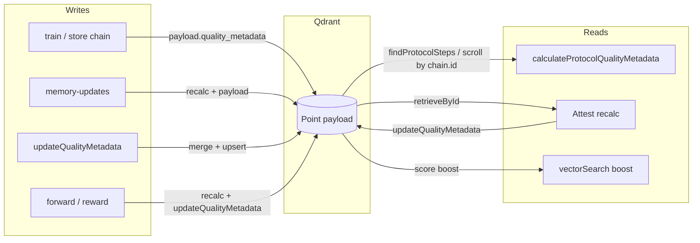

# How quality_metadata works

`quality_metadata` is a small object stored in the **payload** of each
memory point in Qdrant. It classifies a step's quality for leaderboards,
workflow-level quality scoring, and post-execution updates.

## Schema

TypeScript shape used in code:

- **`step_quality_score`** (number): Integer score used to aggregate
  workflow potential (for example, 1–5+). Higher means more valuable for
  scoring.
- **`step_quality`** (string): Tier label — one of `'excellent'`,
  `'high'`, `'standard'`, `'basic'`. Used for display and bucketing.

All readers and writers use `quality_metadata` only. No other field
on the payload stores quality tier or score.

## Where quality_metadata is written

Quality metadata is set in five situations:

1. **Initial store (chain mint):** When a protocol chain is stored,
   each step's payload is built with `quality_metadata` from
   `modelStats.calculateStepQualityMetadata(...)` using the step's
   description, domain, task, type, and tags (no execution context yet).

2. **Memory payload updates:** When `memory-updates` applies changes that
   affect quality (for example, `description_short`, `domain`, `task`,
   `type`, `tags`), it recalculates quality via
   `modelStats.calculateStepQualityMetadata(...)` and sets
   `quality_metadata` before upserting.

3. **Explicit quality API:** `updateQualityMetadata(conn, id, { step_quality_score, step_quality })`
   in `src/services/qdrant/quality.ts` merges the given object into
   existing `quality_metadata`, then overwrites the point.

4. **After each step in forward:** When a step is completed and the
   solution is validated, that step's quality is updated with outcome
   `success` or `failure`. This is the primary update path during a
   protocol run.

5. **After attestation (final step):** When `reward` runs with a
   success or failure outcome, it recalculates quality and calls
   `updateQualityMetadata`. `reward` is the required final step
   of every protocol run.

Calculation is centralized in `src/services/stats/scoring.ts`:
`calculateStepQualityMetadata(description, domain, task, type, tags,
executionSuccess?)`. Execution success multiplies the base score and can
promote the tier (for example, success + high base → excellent).

## Where quality_metadata is read

- **Protocol-level quality:** `calculateProtocolQualityMetadata(protocolId)`
  in `src/services/stats/protocol.ts` fetches all steps via
  `findProtocolSteps`, reads `payload.quality_metadata` from each point,
  and aggregates `step_quality_score` and `step_quality` into
  `workflow_total_potential` and `workflow_quality` (for example,
  "Legendary Workflow").

- **Attestation:** Attest reads the point's payload to get
  `description_short`, `domain`, `task`, `type`, and `tags` for
  recalculating quality. The updated `quality_metadata` is written back
  after the new score is computed.

- **Search (vector + quality boost):** `vectorSearch` in
  `src/services/memory/store-methods.ts` applies a bounded boost from
  `payload.quality_metadata.step_quality_score`:
  `score = rawScore * (1 + 0.1 * min(max(step_quality_score, 0), 1))`.
  The quality term is clamped to 0–1 so it does not dominate the vector
  score. Higher-quality steps rank higher when vector scores are close.

## Real Qdrant query examples

### Scroll: fetch all steps of a chain by chain ID

Used when checking for duplicate chains or loading steps that belong to one
chain.

```json
{
  "filter": {
    "must": [
      {
        "key": "chain.id",
        "match": { "value": "a67e7ead-4aef-4b0e-b3e5-b6cbb7416917" }
      }
    ]
  },
  "limit": 256,
  "with_payload": true,
  "with_vector": false
}
```

JavaScript (as used in code):

```javascript
await client.scroll(collection, {
  filter: {
    must: [{ key: 'chain.id', match: { value: chainUuid } }]
  },
  limit: 256,
  with_payload: true,
  with_vector: false
});
```

### Scroll: fetch steps by protocol_id (protocol stats)

Used by `findProtocolSteps(protocolId)` to load all steps of a protocol
for aggregate quality:

```json
{
  "filter": {
    "must": [
      { "key": "protocol_id", "match": { "value": "my-protocol-title" } }
    ]
  },
  "limit": 100,
  "with_payload": true,
  "with_vector": false
}
```

### Example payload (with quality_metadata)

Typical payload shape for a chain step after store or update:

```json
{
  "label": "Step 1: Initialize",
  "tags": ["setup", "project"],
  "text": "Create the project directory structure.",
  "llm_model_id": "model-id",
  "created_at": "2026-02-17T12:00:00.000Z",
  "task": "configuration",
  "type": "context",
  "quality_metadata": {
    "step_quality_score": 3,
    "step_quality": "high"
  },
  "chain": {
    "id": "a67e7ead-4aef-4b0e-b3e5-b6cbb7416917",
    "label": "Simple Setup Protocol",
    "step_index": 1,
    "step_count": 3
  },
  "updated_at": "2026-02-17T12:05:00.000Z"
}
```

To filter by quality tier — for example, only "excellent" steps:

```json
{
  "filter": {
    "must": [
      {
        "key": "quality_metadata.step_quality",
        "match": { "value": "excellent" }
      }
    ]
  },
  "limit": 100,
  "with_payload": true,
  "with_vector": false
}
```

The codebase does not currently use such a filter; quality is read from
payloads after fetching by `chain.id` or `protocol_id`.

## Data flow


```mermaid
flowchart LR
  subgraph writes["Writes"]
    A[train / store chain]
    B[memory-updates]
    C[updateQualityMetadata]
    D[forward / reward]
  end

  subgraph storage["Qdrant"]
    P[(Point payload)]
  end

  subgraph reads["Reads"]
    E[calculateProtocolQualityMetadata]
    F[Attest recalc]
    G[vectorSearch boost]
  end

  A -->|payload.quality_metadata| P
  B -->|recalc + payload| P
  C -->|merge + upsert| P
  D -->|recalc + updateQualityMetadata| P

  P -->|findProtocolSteps / scroll by chain.id| E
  P -->|retrieveById| F
  P -->|score boost| G
  F -->|updateQualityMetadata| P
```

- **Writes:** Chain store and memory-updates set `quality_metadata` on
  upsert. `forward` and `reward` update it via retrieve +
  merge + upsert.
- **Storage:** One field on the point payload; no separate collection.
- **Reads:** Protocol stats scrolls by `protocol_id` and reads
  `quality_metadata` from each point. Search applies a bounded quality
  boost to the vector score.

## Observability and runbook

- **Metrics:**
  - `kairos_quality_update_errors_total` — counter when a `forward`
    quality update fails.
  - `kairos_mint_similar_memory_found_total` — counter when mint returns
    `SIMILAR_MEMORY_FOUND`.
- **Alert:** Configure an alert on `kairos_quality_update_errors_total`
  rate (for example, > 0.1/s over 5 minutes).
- **Runbook:** When quality seems stale or steps are not reflecting
  success/failure, check `kairos_quality_update_errors_total` and Qdrant
  write latency. Quality updates in `forward` are best-effort (log
  and continue); errors are not surfaced to the client.

## See also

- [reward workflow](workflow-kairos-attest.md) — how attestation
  updates quality
- [forward workflow](workflow-kairos-next.md) — per-step quality
  update during execution
- [Architecture README](README.md)
