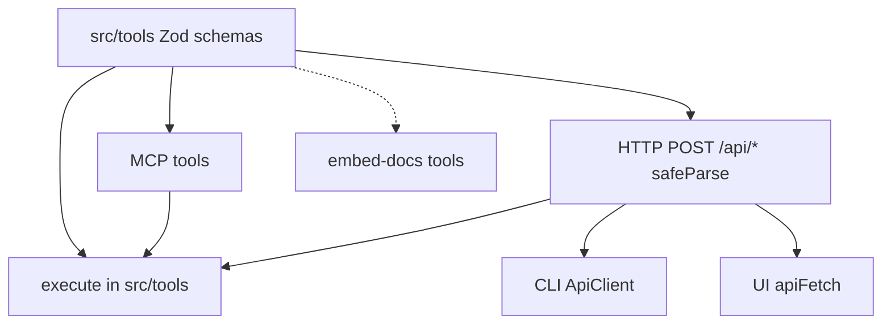

# Schemas across MCP, HTTP API, CLI, and UI

This page states how **input and output shapes** stay aligned across every
surface that talks to KAIROS. There is **one canonical definition** of those
shapes in TypeScript (Zod and derived types) under **`src/tools/`**. MCP tools,
HTTP **`/api/*`** routes, and embedded docs all trace back to that layer. The
CLI and the browser UI **do not** redefine contracts; they call the HTTP API
with JSON bodies the server validates with the same schemas.

For agent-facing wording and error design, see
[CONTRIBUTING.md — Agent-facing design principles](../../CONTRIBUTING.md#agent-facing-design-principles)
and [Agent recovery UX](agent-recovery-ux.md).

## Dependency

Everything that defines or checks a tool contract **depends on** the same Zod
layer in **`src/tools/`**. MCP and HTTP validate before **`execute*`**; CLI
and UI only send JSON; **`src/embed-docs/tools`** stays aligned by convention
(dotted edge: doc, not runtime).

---

## Single source of truth

- **Canonical schemas and types** live in **`src/tools/`**, typically as
  `*_schema.ts` files (for example
  [`export_schema.ts`](../../src/tools/export_schema.ts),
  [`activate_schema.ts`](../../src/tools/activate_schema.ts)).
- **Rule:** When you change a tool’s contract, you change **`src/tools`** (and
  related execution in **`src/tools/*.ts`**). You do **not** introduce a
  second Zod schema or parallel TypeScript type as the authority for the same
  concept in the CLI, UI, or HTTP layer.

---

## Naming

**Tool names** in MCP (for example `export`, `activate`) line up with **HTTP
routes** that implement the same operation (for example `POST /api/export`,
`POST /api/activate`). **Request and response field names** in JSON are the
same ones **`src/tools`** defines for that tool: do not invent alternate
property names in the CLI or UI for the same concept.

The CLI may expose **additional commands** that are not MCP tools (for example
`kairos login`, `kairos token`). Those handle **authentication and local
configuration** so the process that calls **`/api/*`** has a valid Bearer token.
They are not a second contract for tool inputs or outputs.

---

## MCP

- Tools register with **`inputSchema` / `outputSchema`** derived from the same
  Zod definitions used at runtime (often via helpers such as
  `mcpLooseToolInput` in
  [`src/tools/mcp-loose-input-schema.ts`](../../src/tools/mcp-loose-input-schema.ts)).
- **Live MCP:** The connected host may show tool JSON Schema that differs from
  this repository until upgraded. For **real calls**, treat the host’s
  descriptor as authoritative; for **implementation in this repo**, treat
  **`src/tools`** as authoritative (same split as in per-tool workflow docs).

---

## HTTP API (`/api/*`)

- Routes under **`src/http/http-api-*.ts`** validate request bodies with
  **`*.safeParse(req.body)`** using the **same** Zod schemas as the matching MCP
  tool (for example **`activateInputSchema`** on
  [`POST /api/activate`](../../src/http/http-api-begin.ts),
  **`exportInputSchema`** on
  [`POST /api/export`](../../src/http/http-api-dump.ts)).
- The HTTP API is the **parity surface** for non-MCP clients: same payloads the
  MCP tool would accept for the same operation.

---

## CLI

- **Authenticate before calling the API.** Commands that hit **`/api/*`** rely
  on a stored access token from **`kairos login`** (or equivalent). See
  [CLI](../CLI.md) and [Auth overview](auth-overview.md) for refresh and
  validation (`kairos token --validate`).
- The CLI builds JSON bodies and calls **`POST /api/...`** through
  [`ApiClient`](../../src/cli/api-client.ts) (for example **`export`** sends
  `JSON.stringify(input)` to **`/api/export`**).
- CLI code imports **types** from **`src/tools/*_schema.ts`** where needed (for
  example **`ExportInput`** in
  [`src/cli/commands/export.ts`](../../src/cli/commands/export.ts)) so flags map
  to the same selection union the server validates. Pre-server checks only
  disambiguate flags; **authoritative validation** remains on the server with
  Zod.
- **CLI-only behavior** after a successful API response (for example writing a
  file from a **`download_ref`** returned in JSON) does not change **`src/tools`**
  shapes; it is transport and local I/O on top of the same response types.

---

## UI

- The React app uses **`fetch` / `apiFetch`** (or equivalent) against the same
  **`/api/*`** routes as the CLI. Request JSON matches what **`src/tools`**
  expects; the UI does **not** ship a separate canonical schema for those
  bodies.
- TypeScript types in the UI may describe props or local state; they are **not**
  a second source of truth for MCP or API tool contracts.

---

## Embedded tool docs

- Markdown under **`src/embed-docs/tools/`** documents each MCP tool for
  agents. It must stay **consistent** with **`src/tools`** behavior; when
  schemas change, update both the Zod definitions and the embedded copy (see
  [CONTRIBUTING.md](../../CONTRIBUTING.md)).

---

## Summary table

| Surface        | Contract authority        | How it uses schemas                          |
| -------------- | ------------------------- | -------------------------------------------- |
| **`src/tools`**| **Canonical** (Zod + TS)  | Defines and validates inputs and outputs   |
| **MCP**        | Repo: `src/tools`; live: host descriptor | Runtime parse + tool registration |
| **HTTP API**   | `src/tools`               | `safeParse` on `req.body` per route          |
| **CLI**        | `src/tools` (types) + server Zod | HTTP POST with JSON body              |
| **UI**         | `src/tools` (via server)  | HTTP POST; server validates                |

---

## See also

- [Export workflow](workflow-export.md) — **Tool and API schema** section for a
  concrete example (`exportInputSchema` and **`POST /api/export`**).
- [Auth overview](auth-overview.md) — how the CLI obtains tokens for **`/api/*`**.
- [Artifacts](artifacts.md) — MCP, API, CLI, and UI boundaries for artifact flows.
- [UI frontend architecture](ui-frontend-architecture.md) — API boundary from the
  SPA.
- [CONTRIBUTING.md — Checklist for new or changed APIs](../../CONTRIBUTING.md#7-checklist-for-new-or-changed-apis)
