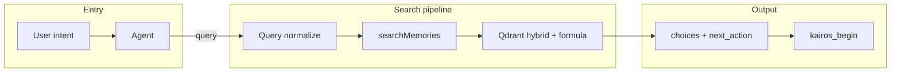

# KAIROS search query architecture

`kairos_search` is the **entry point for every KAIROS workflow**. Agents always search first, then follow a choice’s `next_action` (typically `kairos_begin`). This document describes how the search query is processed end-to-end and how scoring and filtering work. For response shape and scenarios, see [kairos_search workflow](workflow-kairos-search.md).

## Principle: scoring in Qdrant, not in the app

We **fully rely on Qdrant for scoring**. All search logic (ranking, filtering, score shape) belongs in Qdrant. Adjust scores by **modifying the query and the Qdrant request** (e.g. filter, formula, prefetch, or payload fields used in the formula), **not by post-processing in the app**. The app should pass through Qdrant’s scores and result set; any exception (e.g. a temporary app-side boost) should be documented and treated as technical debt until it is moved into Qdrant.

## Role in KAIROS

Protocol execution order is typically **search → begin → next (loop) → attest**. Search is the normal discovery path for natural-language requests, but code can also jump directly to `kairos_begin` with an exact protocol slug (`key`) or a previously stored URI. That makes the quality and behaviour of the search query pipeline especially important for open-ended requests, even though it is not the only deterministic entry path.

## End-to-end flow

1. **Input:** MCP tool `kairos_search` or HTTP `POST /api/kairos_search` with `query` (and optional `space`).
2. **Query preparation:** The raw query is cleaned for search and cache key: built-in protocol URIs and UUIDs (refine and creation) are stripped so the query text is not literally “searching for” those protocols. Empty after strip is valid (returns no vector matches).
3. **Space context:** If `space` is provided and allowed, the request runs in that space context; otherwise the default (e.g. personal) is used. Search sees **allowed spaces plus the KAIROS app space** (`getSearchSpaceIds()`).
4. **Cache:** A Redis cache key is built from the search query and group-collapse flag. On hit, the cached unified response is returned; no Qdrant call.
5. **Store call:** `memoryStore.searchMemories(searchQuery, limit, enableGroupCollapse)` runs. It uses the (trimmed) search query for cache write and passes the same query to the vector layer.
6. **Vector search:** Embedding + BM25 hybrid in Qdrant (see below). Results are chain heads only (`chain.step_index === 1`), with exclusions applied in the Qdrant filter.
7. **Candidate handling:** Results are deduplicated by chain (prefer chain head, then by score). Top N by score are kept; each is checked against `SCORE_THRESHOLD`. Refine and create choices are appended when needed (no match, or multiple matches, or single weak match).
8. **Response:** Unified `choices` with `uri`, `label`, `chain_label`, `score`, `role`, `tags`, `next_action`, and optional `protocol_version`.

Implementations: [src/tools/kairos_search.ts](../../src/tools/kairos_search.ts) (MCP), [src/http/http-api-begin.ts](../../src/http/http-api-begin.ts) (HTTP), [src/services/memory/store-methods.ts](../../src/services/memory/store-methods.ts) (vector search).

## Query normalization

Before the query is sent to the store or used in the cache key, the string is cleaned so that built-in protocol URIs and UUIDs do not affect search or cache:

- **Refine protocol:** `kairos://mem/00000000-0000-0000-0000-000000002002`, `00000000-0000-0000-0000-000000002002`
- **Creation protocol:** `kairos://mem/00000000-0000-0000-0000-000000002001`, `00000000-0000-0000-0000-000000002001`

Each token is removed (case-insensitive), then runs of whitespace are collapsed and the string is trimmed. If the result is empty, search runs with an empty query (no vector matches; refine and create are still offered).

Defined in both the MCP tool and the HTTP handler as `queryForSearch(query)`.

## Space scope

- **Search space set:** `getSearchSpaceIds()` = current context’s `allowedSpaceIds`, plus `KAIROS_APP_SPACE_ID` if not already included. So search always includes the app (system) space plus the user’s allowed spaces.
- **Filter:** Qdrant filter includes `space_id` in that set and `chain.step_index === 1` (chain heads only). Built-in protocols are excluded by UUID (and optionally by chain label) in `must_not`.

See [tenant-context](../../src/utils/tenant-context.ts) and [space-filter](../../src/utils/space-filter.ts).

## Qdrant query structure

Search uses the **Query API** (Qdrant 1.14+): prefetch with fusion, then an outer formula over the fused score.

### Prefetch (hybrid)

- **Dense:** One leg with the query embedding, vector name `vs{dim}`, limit 40, same filter, quantization rescore.
- **BM25:** Three legs with the same sparse query (from `bm25Tokenizer.tokenize(query)`), limits 40, 30, 20, same filter.
- **Fusion:** `query: { fusion: 'rrf' }`, limit 50. So 1× dense + 3× BM25 are combined with RRF (Reciprocal Rank Fusion).

### Outer formula

After RRF, the final score is:

`score = $score + TITLE_BOOST * match(chain.label, text: query) + attest_boost`

- `$score` is the RRF score from prefetch.
- `TITLE_BOOST` is 0.5.
- `match(chain.label, text: query)` is a Qdrant condition: it contributes when the chain's label contains all tokens of the (trimmed) search query (title match). So protocols whose chain title matches the query get an additive boost.
- `attest_boost` is a numeric payload field on the point (precomputed when quality metrics are updated); protocols with more successful attestations get a higher value, so they rank slightly higher when relevance is similar.

Per the principle above, all scoring is expressed in Qdrant (formula, filter, prefetch); the app does not modify scores after the query.

### Filter

- **must:**  
  - `space_id` in `getSearchSpaceIds()`  
  - `chain.step_index` = 1 (chain heads only)
- **must_not:**  
  - `has_id` = refine protocol UUID (`00000000-0000-0000-0000-000000002002`) so the built-in refine protocol never appears as a vector match. Creation protocol and copies in other spaces may be excluded by additional `has_id` or `chain.label` conditions; any remaining are filtered in code (e.g. `isRefineProtocol`) before returning.

Fallback if the Query API fails: plain dense search with the same filter and rescore.

## Attest-based score in Qdrant

Chain heads store `quality_metrics` (e.g. `successCount`, `failureCount`) updated on `kairos_attest`. When quality metrics are updated (e.g. in [quality.ts](../../src/services/qdrant/quality.ts) `updateQualityMetrics`), the app computes a precomputed **attest_boost** and writes it to the point payload:

`attest_boost = min(ATTEST_BOOST_MAX * successRatio * confidence, ATTEST_BOOST_MAX)` when `runs >= MIN_ATTEST_RUNS`, else `0`, with `confidence = min(runs / RUNS_FULL_CONFIDENCE, 1)`.

The search formula in Qdrant includes this payload field as a summand (`'attest_boost'`), so the final score is `$score + title_boost_term + attest_boost`. All scoring stays in Qdrant; the app does not modify scores after the query. Config: `MIN_ATTEST_RUNS`, `RUNS_FULL_CONFIDENCE`, `ATTEST_BOOST_MAX` in [config](../../src/config.ts). Existing chain heads can be backfilled with `npm run backfill:attest-boost`.

## Result path after Qdrant

Consistent with the principle: the app should not change scores or drop results that Qdrant returned; any such logic belongs in the query (filter/formula). Current behaviour:

1. Points are mapped to memories and scores (Qdrant score only; attest is in the formula).
2. Built-in refine protocol is excluded in the Qdrant filter by UUID; any remaining (e.g. duplicate in another space) are filtered out in code (`isRefineProtocol`) until exclusion is fully expressed in the Qdrant filter (e.g. by `chain.label`).
3. Sort by score descending, then by `memory_uuid` for tie-break; take up to `limit`.
4. Optional fallback: if all results were filtered out but there were points, return up to `limit` with a default score (e.g. 0.5) so the UI still shows options.

The store returns `{ memories, scores }`. The tool layer then:

- Collapses by chain (best score per chain, prefer head).
- Applies `SCORE_THRESHOLD` (config, default 0.3).
- Builds match choices with per-choice `next_action`.
- Appends refine and create choices when there is no single strong match (e.g. 0 or >1 match, or 1 match with score &lt; 0.5).

## Cache

- **Key:** `begin:v3:{effectiveSpaceId}:{searchQuery}:{enableGroupCollapse}:{limit}`.
- **Value:** Full unified JSON response (stringified).
- **TTL:** 300 seconds (configurable where the cache is set).
- Cache is written after a successful search and read at the start of the request when the key exists.

## Configuration (summary)

| Env / config | Purpose |
|--------------|--------|
| `SCORE_THRESHOLD` | Minimum score for a result to appear as a match (default 0.3). |
| `KAIROS_ENABLE_GROUP_COLLAPSE` | When true, first search uses collapse; fallback without collapse if few chains. |
| `MIN_ATTEST_RUNS`, `RUNS_FULL_CONFIDENCE`, `ATTEST_BOOST_MAX` | Used when writing precomputed `attest_boost` to payload; formula adds it in Qdrant. |
| `KAIROS_APP_SPACE_ID` | System space ID included in search scope. |

## Experimenting with the query (without the app)

To iterate on the Qdrant query (formula, filters, prefetch) without running or redeploying the app, use the standalone script. It uses the same Query API (prefetch + RRF + formula) and reads `.env` (`QDRANT_*`, `OPENAI_*`).

- **Run:** `npm run query-search -- "your query"` (default limit 20).
- **Options:** `--dense-only` (skip BM25), `--limit N`.
- **Space filter:** `SEARCH_SPACE_IDS=id1,id2 npm run query-search -- "query"`.

To see `attest_boost` in the printed results, run once on the target collection: `npm run backfill:attest-boost`. Script: [scripts/query-search-standalone.mjs](../../scripts/query-search-standalone.mjs).

## See also

- [kairos_search workflow](workflow-kairos-search.md) — response schema, scenarios, validation rules.
- [Full execution workflow](workflow-full-execution.md) — search → begin → next → attest.
- [Infrastructure](infrastructure.md) — Qdrant and Redis in the deployment.
