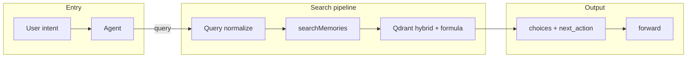

# KAIROS search query architecture

The **`activate`** MCP tool is the **entry point for matching adapters**.
It uses the same hybrid search pipeline described here. Agents call
**`activate`** first, then follow a choice’s `next_action` (typically
**`forward`** with an adapter URI). This document describes how the query
is processed end-to-end and how scoring and filtering work. For response
shape and scenarios, see [activate](../../src/embed-docs/tools/activate.md)
and the companion [activate workflow](workflow-activate.md) page.

## Principle: rank in Qdrant, expose bounded confidence in the app

Qdrant remains the source of truth for ranking and candidate selection. The app
uses Qdrant's raw score to sort results, apply the configured match threshold,
and decide which adapters stay in the candidate set. Before those scores are
returned to agents or the UI, the app converts them into a bounded public
confidence value so `score` and `activation_score` always stay in `0.0-1.0`.

## Role in KAIROS

Protocol execution order is: **activate → forward (loop) → reward**.
**Activate** is the usual way to discover which adapter to run; there is no
“run by name” without a prior **`activate`** (or a stored adapter URI from
an earlier run). So the quality and behaviour of this query pipeline
directly determine which adapters agents find and how they rank.

## End-to-end flow

1. **Input:** MCP tool **`activate`** or HTTP **`POST /api/activate`** with `query` (and optional `space`).
2. **Query preparation:** The raw query is cleaned for search and cache key: built-in protocol URIs and UUIDs (refine and creation) are stripped so the query text is not literally “searching for” those protocols. Empty after strip is valid (returns no vector matches).
3. **Space context:** If `space` is provided and allowed, the request runs in that space context; otherwise the default (e.g. personal) is used. Search sees **allowed spaces plus the KAIROS app space** (`getSearchSpaceIds()`).
4. **Cache:** A Redis cache key is built from the search query and group-collapse flag. On hit, the cached unified response is returned; no Qdrant call.
5. **Store call:** `memoryStore.searchMemories(searchQuery, limit, enableGroupCollapse)` runs. It uses the (trimmed) search query for cache write and passes the same query to the vector layer.
6. **Vector search:** Embedding + BM25 hybrid in Qdrant (see below). Results are adapter heads only (`adapter.layer_index === 1`), with exclusions applied in the Qdrant filter.
7. **Candidate handling:** Results are deduplicated by adapter (prefer the
   entry layer, then by score). Top N by score are kept; each is checked
   against `SCORE_THRESHOLD`. Refine and create choices are appended when
   needed (no match, or multiple matches, or single weak match).
8. **Response:** Search builds internal choice rows (adapter metadata and
   normalized public confidence scores). The MCP **`activate`** handler maps
   them to **`choices`** with **`kairos://adapter/{uuid}`**,
   **`adapter_name`**, **`activation_score`**, **`adapter_version`**,
   **`role`**, **`tags`**, and **`next_action`** (see
   [activate_schema.ts](../../src/tools/activate_schema.ts)).

Implementations: [src/tools/search.ts](../../src/tools/search.ts) and [src/tools/activate.ts](../../src/tools/activate.ts) (MCP **`activate`**), vector layer in [store-methods.ts](../../src/services/memory/store-methods.ts).

## Query normalization

Before the query is sent to the store or used in the cache key, the string is cleaned so that built-in protocol URIs and UUIDs do not affect search or cache:

- **Refine adapter:** `kairos://adapter/00000000-0000-0000-0000-000000002002`, UUID `00000000-0000-0000-0000-000000002002`
- **Creation flow:** `kairos://adapter/00000000-0000-0000-0000-000000002001`, UUID `00000000-0000-0000-0000-000000002001`

Each token is removed (case-insensitive), then runs of whitespace are collapsed and the string is trimmed. If the result is empty, search runs with an empty query (no vector matches; refine and create are still offered).

Defined in both the MCP tool and the HTTP handler as `queryForSearch(query)`.

## Space scope

- **Search space set:** `getSearchSpaceIds()` = current context’s `allowedSpaceIds`, plus `KAIROS_APP_SPACE_ID` if not already included. So search always includes the app (system) space plus the user’s allowed spaces.
- **Filter:** Qdrant filter includes `space_id` in that set and `adapter.layer_index === 1` (adapter heads only). Built-in adapters are excluded by UUID in `must_not`.

See [tenant-context](../../src/utils/tenant-context.ts) and [space-filter](../../src/utils/space-filter.ts).

## Qdrant query structure

Search uses the **Query API** (Qdrant 1.14+): multiple dense and sparse
prefetch legs fused with RRF, then an outer formula over the fused score.

### Prefetch (hybrid)

- **Primary dense:** One leg with the query embedding against `vs{dim}`,
  limit 60, same filter, quantization rescore.
- **Adapter-title dense:** One leg against `adapter_title_vs{dim}`,
  limit 40, same filter, quantization rescore.
- **Activation-pattern dense:** One leg against
  `activation_pattern_vs{dim}`, limit 40, same filter, quantization rescore.
- **BM25:** Two sparse legs with the same query (from
  `bm25Tokenizer.tokenize(query)`), limits 60 and 30, same filter.
- **Fusion:** `query: { fusion: 'rrf' }`, limit 80. The query combines
  three dense legs plus two sparse legs with Reciprocal Rank Fusion.

### Outer formula

After RRF, the final score is a Qdrant formula over payload text fields and
the fused score:

`score = $score + title_match + activation_pattern_match + label_match + tag_match + attest_boost`

- `$score` is the RRF score from prefetch.
- `title_match` uses `adapter_name_text`.
- `activation_pattern_match` uses `activation_patterns_text`.
- `label_match` uses `label_text`.
- `tag_match` uses `tags_text`.
- `attest_boost` is a numeric payload field on the point (precomputed when
  quality metrics are updated); adapters with better observed reward history
  rank slightly higher when relevance is otherwise similar.

Per the principle above, Qdrant determines raw ranking. The app keeps that
ordering, but it converts raw scores into bounded public confidence values
before it returns them.

### Filter

- **must:**  
  - `space_id` in `getSearchSpaceIds()`  
  - `adapter.layer_index` = 1 (adapter heads only)
- **must_not:**  
  - `has_id` = refine protocol UUID (`00000000-0000-0000-0000-000000002002`) so the built-in refine protocol never appears as a vector match. Creation protocol and copies in other spaces may be excluded by additional `has_id` or `adapter.name` conditions; any remaining are filtered in code (for example, `isRefineProtocol`) before returning.

Fallback if the Query API fails: plain dense search with the same filter and rescore.

## Reward-based score in Qdrant

Adapter heads store `quality_metrics` (for example, `successCount` and
`failureCount`) updated on `reward`. When quality metrics are updated (for
example, in [quality.ts](../../src/services/qdrant/quality.ts)
`updateQualityMetrics`), the app computes a precomputed boost and writes it to
the point payload. The current payload field name is `attest_boost`.

`attest_boost = min(ATTEST_BOOST_MAX * successRatio * confidence, ATTEST_BOOST_MAX)` when `runs >= MIN_ATTEST_RUNS`, else `0`, with `confidence = min(runs / RUNS_FULL_CONFIDENCE, 1)`.

The search formula in Qdrant includes this payload field as a summand, so raw
ranking stays in Qdrant before the app derives bounded public confidence.
Config: `MIN_ATTEST_RUNS`, `RUNS_FULL_CONFIDENCE`, `ATTEST_BOOST_MAX` in
[config](../../src/config.ts).

## Result path after Qdrant

Current behavior keeps Qdrant as the ranking authority, then normalizes public
confidence before the response is returned:

1. Points are mapped to memories and raw scores (Qdrant score only;
   reward-derived boost is already in the formula).
2. Built-in refine protocol is excluded in the Qdrant filter by UUID; any remaining (for example, duplicates in another space) are filtered out in code (`isRefineProtocol`) until exclusion is fully expressed in the Qdrant filter (for example, by `adapter.name`).
3. Sort by raw score descending, then by `memory_uuid` for tie-break; take up
   to `limit`.
4. Optional fallback: if all results were filtered out but there were points, return up to `limit` with a default score (e.g. 0.5) so the UI still shows options.

The store returns `{ memories, scores }`. The tool layer then:

- Collapses by adapter (best score per adapter, prefer the entry layer).
- Converts raw scores into public confidence with
  `raw_score / (raw_score + 0.5)`.
- Applies `SCORE_THRESHOLD` (config, default 0.3) using the same monotonic
  transform, so match inclusion stays aligned with the raw threshold.
- Builds match choices with per-choice `next_action`.
- Appends refine and create choices when there is no single strong match (for
  example, 0 or more than 1 match, or 1 match with confidence score below
  `0.5`).

## Cache

- **Key:** `activate:v4:{spaceId}:{searchQuery}:{enableGroupCollapse}:{limit}`.
- **Value:** Full unified JSON response (stringified).
- **TTL:** 300 seconds (configurable where the cache is set).
- Cache is written after a successful search and read at the start of the request when the key exists.

## Configuration (summary)

| Env / config | Purpose |
|--------------|--------|
| `SCORE_THRESHOLD` | Minimum raw Qdrant score for a result to appear as a match (default 0.3). The same threshold is normalized before public scores are returned. |
| `KAIROS_ENABLE_GROUP_COLLAPSE` | When true, first search uses collapse; fallback without collapse if few chains. |
| `MIN_ATTEST_RUNS`, `RUNS_FULL_CONFIDENCE`, `ATTEST_BOOST_MAX` | Used when writing the reward-derived Qdrant boost payload. |
| `KAIROS_APP_SPACE_ID` | System space ID included in search scope. |

## Experimenting with the query

To iterate on the Qdrant query, use targeted integration tests and direct
Qdrant inspection in dev. The code path in
[store-methods.ts](../../src/services/memory/store-methods.ts) is the
authoritative query definition.

## See also

- [activate workflow](workflow-activate.md) — response schema, scenarios, validation rules.
- [Full execution workflow](workflow-full-execution.md) — `activate` →
  `forward` → `reward`.
- [Infrastructure](infrastructure.md) — Qdrant and Redis in the deployment.
