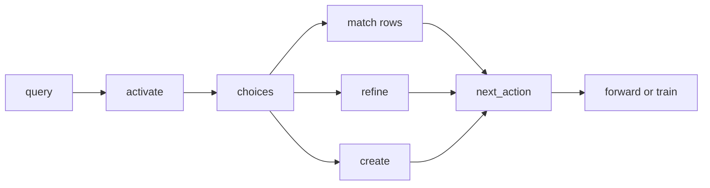

# Activate workflow

> **MCP tool:** **`activate`**. Agent-facing reference:
> [`activate.md`](../../src/embed-docs/tools/activate.md).

This document defines the **architecture** of **`activate`**: semantic ranking of
stored adapters for the caller’s intent, choice rows with **`next_action`**, and
parity with HTTP. Binding schemas live in
[`activate_schema.ts`](../../src/tools/activate_schema.ts).

---

## Role

**`activate`** ranks stored **adapters** for the user’s intent. Every successful
response has **`must_obey: true`**. Each choice includes an **`adapter` URI**
(`kairos://adapter/{uuid}`), **`activation_score`**, **`adapter_name`**, and a
per-choice **`next_action`** (typically **`forward`** on that adapter URI with
no **`solution`**, **`train`** for create, or **`forward`** on the refine
adapter).



---

## Tool and API schema

### Authority

- **Live MCP:** Use the connected server’s **`activate`** `inputSchema`,
  `outputSchema`, and description as the runtime contract.
- **This repository:** [`activate_schema.ts`](../../src/tools/activate_schema.ts).
  HTTP [`http-api-begin.ts`](../../src/http/http-api-begin.ts) validates
  **`POST /api/activate`** with the same input shape.

### Shipped input

| Field | Type | Required | Notes |
|-------|------|----------|--------|
| **`query`** | string | yes | Short intent string (minimum 1 character). |
| **`space`** | string | no | Scope: `"personal"`, group path, `Group: …`, or space id. |
| **`space_id`** | string | no | Alias for **`space`**. |
| **`max_choices`** | integer | no | Clamped to server min or max search cap. |

```json
{
  "query": "summarize adapter run"
}
```

### Shipped output

| Field | Type | Notes |
|-------|------|--------|
| **`must_obey`** | boolean | Always **`true`** on success. |
| **`message`**, **`next_action`**, **`query`** | string | Global and echoed query. |
| **`choices`** | array | Non-empty; see per-choice shape below. |
| **`kairos_local_artifact_dir`** | string | optional; absolute handoff path (JSON key matches lowercase snake of `KAIROS_LOCAL_ARTIFACT_DIR`) |

**Each choice:** **`uri`**, **`label`**, **`adapter_name`**, **`activation_score`**
(0.0 to 1.0 or null), **`role`** (`match` \| `refine` \| `create`), **`tags`**,
**`next_action`**, **`adapter_version`**, optional **`activation_patterns`**,
**`space_name`**, **`slug`**.

```json
{
  "must_obey": true,
  "message": "<string>",
  "next_action": "Pick one choice and follow that choice's next_action.",
  "query": "<string>",
  "choices": [
    {
      "uri": "kairos://adapter/<uuid>",
      "label": "<string>",
      "adapter_name": "<string or null>",
      "activation_score": 0.56,
      "role": "match | refine | create",
      "tags": ["<string>"],
      "next_action": "<string>",
      "adapter_version": "<string or null>",
      "activation_patterns": ["<string>"],
      "space_name": "<string or null>",
      "slug": "<string or null>"
    }
  ]
}
```

### HTTP

- **`POST /api/activate`** — JSON body: same properties as **Shipped input**.

---

## Choice roles and ordering

**`next_action` patterns** (see [`activate.ts`](../../src/tools/activate.ts)):

- **match:** `call forward with kairos://adapter/<uuid> and no solution to start this adapter`
- **refine:** `call forward with kairos://adapter/<uuid> and no solution to start the refine adapter`
- **create:** `call train with adapter markdown to register a new adapter`

- **`match`** — **`activation_score`** 0.0 to 1.0
- **`refine`** — built-in refine adapter; **`activation_score`**: null
- **`create`** — no stored adapter yet; **`activation_score`**: null

Ordering: all **`match`** rows first, then at most one **`refine`**, then one
**`create`**.

---

## Scenarios

### Scenario 1: single match

#### Input

```json
{
  "query": "summarize adapter run"
}
```

#### Expected output (illustrative)

```json
{
  "must_obey": true,
  "message": "Found 1 match.",
  "next_action": "Pick one choice and follow that choice's next_action.",
  "query": "summarize adapter run",
  "choices": [
    {
      "uri": "kairos://adapter/bd939b2a-b35f-40f2-8dec-7dec74a65116",
      "label": "EXTENSION — ACTIVATION → CODING → KAIROS (MANDATORY)",
      "adapter_name": "EXTENSION — ACTIVATION → CODING → KAIROS (MANDATORY)",
      "activation_score": 0.56,
      "role": "match",
      "tags": ["coding", "deploy", "mandatory"],
      "next_action": "call forward with kairos://adapter/bd939b2a-b35f-40f2-8dec-7dec74a65116 to execute this adapter",
      "adapter_version": null
    }
  ]
}
```

#### Agent behavior

1. Obey the chosen row’s **`next_action`** (here: **`forward`** with that adapter
   URI, omit **`solution`**).

### Scenario 2: multiple matches + refine + create

#### Expected output (illustrative)

```json
{
  "must_obey": true,
  "message": "Found 3 matches (top confidence: 52%). Choose one, refine your search, or create a new adapter.",
  "next_action": "Pick one choice and follow that choice's next_action.",
  "query": "summarize adapter run",
  "choices": [
    {
      "uri": "kairos://adapter/2ab737f0-a9b1-49a0-bb10-5c8105c4f6e8",
      "label": "Create Jira Ticket in BIB - Bug",
      "adapter_name": "Create Jira Ticket in BIB - Bug",
      "activation_score": 0.52,
      "role": "match",
      "tags": ["jira", "issue", "creator", "bib", "bug"],
      "next_action": "call forward with kairos://adapter/2ab737f0-a9b1-49a0-bb10-5c8105c4f6e8 to execute this adapter",
      "adapter_version": null
    },
    {
      "uri": "kairos://adapter/00000000-0000-0000-0000-000000002002",
      "label": "Get help refining your search",
      "adapter_name": "Run adapter to turn vague user request into a better activate query",
      "activation_score": null,
      "role": "refine",
      "tags": ["meta", "refine"],
      "next_action": "call forward with kairos://adapter/00000000-0000-0000-0000-000000002002 to execute the refine adapter",
      "adapter_version": null
    },
    {
      "uri": "kairos://adapter/00000000-0000-0000-0000-000000002001",
      "label": "Create New KAIROS Protocol Chain",
      "adapter_name": "Create New KAIROS Protocol Chain",
      "activation_score": null,
      "role": "create",
      "tags": ["meta", "creation"],
      "next_action": "call train with adapter markdown to register a new adapter",
      "adapter_version": null
    }
  ]
}
```

#### Agent behavior

1. Pick one choice using **`label`**, **`adapter_name`**, **`activation_score`**,
   and **`tags`**.
2. For **create**, call **`train`** with markdown—there is no adapter run yet.

### Scenario 3: weak matches

When scores are low, prefer **refine** once before **create**, if that fits the
user’s goal.

### Scenario 4: no strong matches

Only **refine** and **create** may appear. Follow the same **`next_action`**
rules.

---

## Validation rules

1. **`must_obey`** is always **`true`** on success.
2. **`choices`** is non-empty.
3. Every choice has **`uri`**, **`label`**, **`adapter_name`**,
   **`activation_score`**, **`role`**, **`tags`**, **`next_action`**,
   **`adapter_version`** (nullable).
4. **`uri`** values exposed to agents are **`kairos://adapter/{uuid}`**
   (including well-known refine or create ids when present).

---

## See also

- [First forward call](workflow-forward-first-call.md)
- [Full execution workflow](workflow-full-execution.md)
