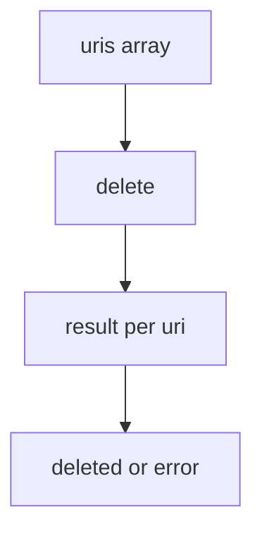

# Delete workflow

> **MCP tool:** **`delete`**. Agent-facing reference:
> [`delete.md`](../../src/embed-docs/tools/delete.md).

This document defines the **architecture** of **`delete`**: removing one or more
adapter or layer resources by URI. Binding schemas live in
[`delete_schema.ts`](../../src/tools/delete_schema.ts). HTTP:
[`http-api-delete.ts`](../../src/http/http-api-delete.ts) (**`POST /api/delete`**).

---

## Role

**`delete`** removes memories by URI. Resolve targets first (for example via
**`activate`** or **`export`**). Each URI is processed independently; partial
success is possible.



---

## Tool and API schema

### Authority

- **Live MCP:** **`delete`** on the connected server.
- **This repository:** [`delete_schema.ts`](../../src/tools/delete_schema.ts).

### Shipped input

| Field | Type | Notes |
|-------|------|--------|
| **`uris`** | array | Non-empty; **`kairos://adapter/{uuid}`** or **`kairos://layer/{uuid}`** (optional **`?execution_id=`**). |

```json
{
  "uris": ["kairos://adapter/<uuid>", "..."]
}
```

### Shipped output

| Field | Type | Notes |
|-------|------|--------|
| **`results`** | array | **`uri`**, **`status`** (`deleted` \| `error`), **`message`** |
| **`total_deleted`**, **`total_failed`** | number | Counts |

```json
{
  "results": [
    {
      "uri": "kairos://adapter/<uuid>",
      "status": "deleted | error",
      "message": "<string>"
    }
  ],
  "total_deleted": "<number>",
  "total_failed": "<number>"
}
```

### HTTP

- **`POST /api/delete`** — JSON body: **`uris`** array.

---

## Scenarios

### Delete one memory

#### Input

```json
{
  "uris": ["kairos://adapter/aaa11111-1111-1111-1111-111111111111"]
}
```

#### Expected output

```json
{
  "results": [
    {
      "uri": "kairos://adapter/aaa11111-1111-1111-1111-111111111111",
      "status": "deleted",
      "message": "Memory kairos://adapter/aaa11111-1111-1111-1111-111111111111 deleted successfully"
    }
  ],
  "total_deleted": 1,
  "total_failed": 0
}
```

#### Agent behavior

Confirm deletion to the user. If the URI was a layer in an adapter, note that
other layers of the same adapter are not automatically deleted. Delete them
explicitly when the user wants the whole adapter removed.

### Delete multiple memories

#### Input

```json
{
  "uris": [
    "kairos://adapter/aaa11111-1111-1111-1111-111111111111",
    "kairos://adapter/bbb22222-2222-2222-2222-222222222222",
    "kairos://adapter/ccc33333-3333-3333-3333-333333333333"
  ]
}
```

#### Expected output

```json
{
  "results": [
    {
      "uri": "kairos://adapter/aaa11111-1111-1111-1111-111111111111",
      "status": "deleted",
      "message": "Memory kairos://adapter/aaa11111-1111-1111-1111-111111111111 deleted successfully"
    },
    {
      "uri": "kairos://adapter/bbb22222-2222-2222-2222-222222222222",
      "status": "deleted",
      "message": "Memory kairos://adapter/bbb22222-2222-2222-2222-222222222222 deleted successfully"
    },
    {
      "uri": "kairos://adapter/ccc33333-3333-3333-3333-333333333333",
      "status": "deleted",
      "message": "Memory kairos://adapter/ccc33333-3333-3333-3333-333333333333 deleted successfully"
    }
  ],
  "total_deleted": 3,
  "total_failed": 0
}
```

#### Agent behavior

Confirm how many memories were deleted. When the user asked to remove an
adapter, verify that all step URIs for that adapter were included.

### Partial failure

```json
{
  "results": [
    {
      "uri": "kairos://adapter/aaa11111-1111-1111-1111-111111111111",
      "status": "deleted",
      "message": "Memory kairos://adapter/aaa11111-1111-1111-1111-111111111111 deleted successfully"
    },
    {
      "uri": "kairos://adapter/nonexistent-0000-0000-0000-000000000000",
      "status": "error",
      "message": "Failed to delete memory: Point not found"
    }
  ],
  "total_deleted": 1,
  "total_failed": 1
}
```

Report which URIs were deleted and which failed. Do not claim full success
when **`total_failed`** is greater than zero.

---

## Validation rules

1. **`uris`** must be a non-empty array of valid adapter or layer URIs (see schema).
2. **`total_deleted`** + **`total_failed`** equals **`results.length`**.
3. Each result has **`uri`**, **`status`**, and **`message`**.
4. Deleting one memory does not automatically delete other layers in the same
   adapter. Pass all layer URIs to remove an entire adapter chain.

---

## See also

- [activate workflow](workflow-activate.md)
- [export workflow](workflow-export.md)
