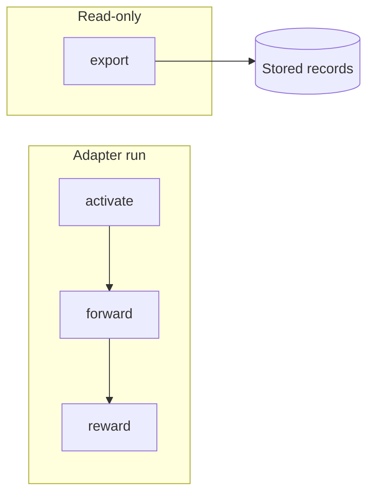
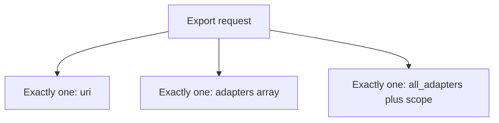
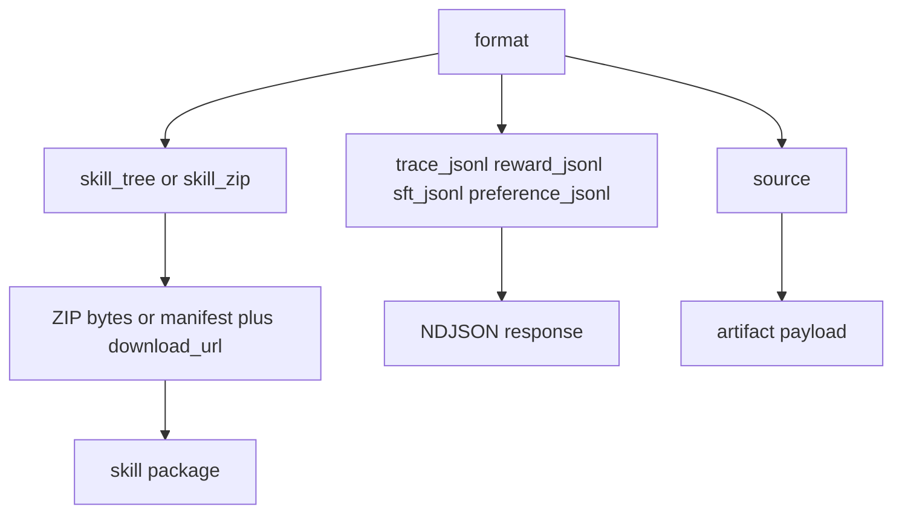
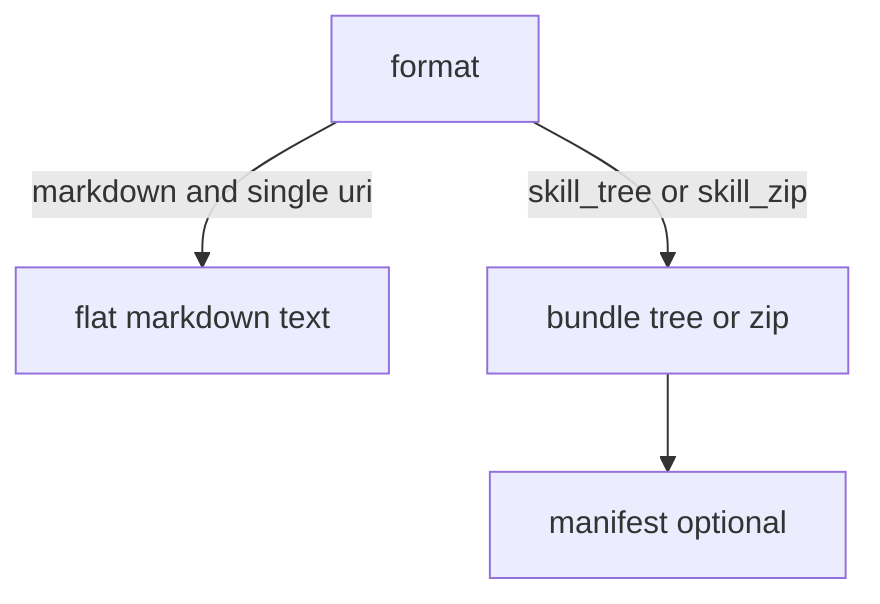

# Export workflow

> **MCP tool:** **`export`**. Agent-facing reference:
> [`export.md`](../../src/embed-docs/tools/export.md).

This document defines the **architecture** of **`export`**: how callers select
adapters, which **formats** are produced, how skill-shaped bundles are delivered,
and how MCP, HTTP, and UI stay consistent. Binding schemas live in
[`export_schema.ts`](../../src/tools/export_schema.ts).

---

## Role

**`export`** serializes stored adapter content and training data. It does not
advance an execution (no `execution_id` progression), issue nonces, or return
`next_action` / `must_obey` the way **`forward`** does.

Authoring folder layouts from before **`train`** are not authoritative. Export
reads **KAIROS-stored** Markdown, metadata, and execution traces as defined by
each **format**.



**`export`** only reads storage. It never participates in **`forward`** /
**`reward`** progression.

---

## Shipment status (this repository)

| Area | State | Notes |
|------|--------|--------|
| Selection union (`uri` / `adapters` / `all_adapters` + `space_name`) | **Shipped** | [`export_schema.ts`](../../src/tools/export_schema.ts) |
| **`skill_tree`**, **`skill_zip`**, **`format: markdown`** (flat, single **`uri`**) | **Shipped** | [`export.ts`](../../src/tools/export.ts) |
| Per-skill **`SHA256SUMS`**, artifact digests, sanitization diagnostics | **Shipped** | [`skill-export/`](../../src/tools/skill-export/) |
| MCP **`skill_zip`** (JSON + base64 + **`bundle_sha256`**) | **Shipped** | Full ZIP buffered for base64 (expected trade-off). |
| HTTP **`POST /api/export`** + **`Accept: application/zip`** | **Shipped** | Streams ZIP to the client; no server-local staging file. |
| UI **Download as Skill** | **Shipped** | Backend export, not client-only assembly. |
| Metrics / slow-export logging | **Shipped** | See performance note below. |
| **Incremental Qdrant → ZIP** (never hold full **`files[]`**) | **Not shipped** | Optional heap optimization; needs a lazy pipeline and likely a second pass or streaming hash for **`SHA256SUMS`**. |
| **Manifest + `download_url`** (object storage) | **Not shipped** | Optional; security model in **Optional extensions** below. |

**Release bar:** The rows marked **Shipped** are the supported contract for operators and agents. Rows **Not shipped** are **not** required for a correct, secure export—only for scale or ergonomics at very large bundle sizes.

---

## Selection

Callers identify work using **exactly one** of the following (validation rejects
ambiguous combinations):

1. **Single adapter** — **`uri`**: `kairos://adapter/{uuid|slug}` or
   `kairos://layer/{uuid}` (optional `?execution_id=` where applicable). Artifact
   URIs follow the **`source`** format path.
2. **Explicit list** — **`adapters`**: non-empty array of adapter identifiers
   (`kairos://adapter/{uuid|slug}` and/or resolvable slugs). One response bundle
   contains one top-level directory per exported skill **slug**.
3. **Scope** — **`all_adapters: true`** with a **bounded scope**, for example
   **`space_name`** (human-readable name, not a raw space id), so every adapter
   in that space is included. Any broader “export everything” mode must be
   explicit, capped, and policy-guarded.

**Guards:** reject **`uri`** together with **`adapters`**, empty **`adapters`**,
and other invalid mixes. Enforce a **maximum adapter count** per request for
list and scope exports.



---

## Formats

At a high level, **`format`** chooses which serializer runs. Training JSONL and
**`source`** do not use flat-adapter Markdown rules. For adapter Markdown, see **Flat
markdown (`format: markdown`)** and **Package layout** (skill bundles).



### Training dataset exports

These formats are unchanged in purpose: they apply the stored reward gate and
dataset rules documented for each label.

- **`trace_jsonl`**, **`reward_jsonl`**, **`sft_jsonl`**, **`preference_jsonl`**
- **`include_reward`** affects **`trace_jsonl`**; **`reward_jsonl`** always
  includes normalized reward fields and skips unrewarded executions.

`export` does not expose **`rft_jsonl`** until grader reliability and task
suitability are proven.

### Artifact and source export

- **`source`** returns attached non-Markdown content for artifact URIs and
  related flows (see [Artifacts](artifacts.md)).

### Adapter-oriented exports (skill-shaped program)

Adapter-facing exports build a **skill package** view of stored Markdown:

- **`skill_tree`** — JSON description of generated files (paths and contents),
  for inspection and debugging.
- **`skill_zip`** — ZIP bytes for the same tree, including optional
  **`<slug>/artifacts/`** and optional per-export manifest files.

**Delivery:** prefer a **compact** MCP or HTTP response for large bundles
(short-lived **`download_url`**, **`bundle_sha256`**, expiry). Inline base64 in
JSON may remain supported for small bundles.

Example manifest shape (field names may vary in implementation):

```json
{
  "type": "skill_bundle",
  "format": "zip",
  "expires_in_seconds": 900,
  "download_url": "https://example.com/api/exports/exp_abc123/download",
  "bundle_sha256": "sha256:...",
  "skills": [
    {
      "slug": "ui-ux-design-review-protocol",
      "entrypoint": "ui-ux-design-review-protocol/SKILL.md",
      "artifacts": []
    }
  ]
}
```

### Flat markdown (`format: markdown`)



Serialized **flat** adapter Markdown (single document, vocabulary normalized to
current **`contract`** spelling in JSON fences) is the **normal** fast path for
**`tune`**, inspection, and **local file** mirrors. Use **`format: markdown`**
with a **single** **`uri`** (adapter or layer). It is **invalid** with
**`adapters`** or **`all_adapters`** — use **`skill_zip`** / **`skill_tree`** for
multi-adapter bundles.

Markdown normalization (for example **`contract`** instead of **`challenge`** in
embedded JSON) applies to flat markdown outputs as today.

---

## Package layout

- One adapter: `<slug>/SKILL.md`, optional `<slug>/artifacts/*`.
- Multiple adapters: one archive root with multiple `<slug>/` trees.
- Each exported skill includes **`<slug>/SHA256SUMS`**: a GNU **`sha256sum`**-style
  listing (two spaces between digest and relative path) for every other file in
  that folder — **`SKILL.md`**, each **`artifacts/…`** entry, and **not** the
  **`SHA256SUMS`** file itself. Verify after unzip:

  `cd <slug> && sha256sum -c SHA256SUMS`

  Artifact lines use **`payload.artifact.sha256`** from storage when it matches
  the SHA-256 of the exported text; if a stored digest disagrees with the
  current bytes, export emits a **`artifact_stored_sha_mismatch`** diagnostic
  and lists the hash of the bytes actually written so verification stays
  consistent.

**`SKILL.md`** carries skill-style YAML frontmatter (at minimum **`name`** and
**`description`**, derived from stored Markdown and adapter metadata). Embedded
proof-of-work JSON contract blocks must round-trip without semantic change.

### Local install (agents)

**Intent:** **`export`** serves two related needs: **portable distribution**
(skill ZIP, manifests, integrity) and **local execution** (a writable tree so an
agent can run **`artifacts/`** scripts and re-read the adapter without pulling a
full bundle every time). The second is **not** a different API — it is the same
**`export`** with **`format: markdown`** (single file) or **`skill_zip`**
(full tree).

**Suggested layout (same config family as the CLI):** under
**`$XDG_CONFIG_HOME/kairos/`** (Unix fallback **`~/.config/kairos/`**; Windows
**`%APPDATA%\kairos\`**) use a **`skills/`** subdirectory per slug. The server
exposes **`getKairosSkillsInstallBaseDir`** and **`getKairosSkillInstallDirForSlug`**
in [`kairos-user-dirs.ts`](../../src/utils/kairos-user-dirs.ts) as the canonical
path helpers (directories are **not** created automatically).

1. **Fast single file:** **`export`** with **`format: markdown`** and one
   adapter or layer **`uri`**. Write **`content`** to a file under
   **`…/skills/<slug>/`** (exact filename is your convention; **`tune`** needs
   the Markdown body).
2. **Full skill folder:** **`format: skill_zip`**, unzip so you have
   **`<slug>/SKILL.md`**, **`<slug>/artifacts/`**, **`<slug>/SHA256SUMS`**.
   Verify with **`cd <slug> && sha256sum -c SHA256SUMS`**.
3. **Shared artifacts:** keep one unzip (or copy) per slug so **`artifacts/`**
   paths stay stable across runs; align with **`KAIROS_LOCAL_ARTIFACT_DIR`** /
   workspace rules if the adapter contract references them.

---

## Attached artifacts in bundles

Files attached to an adapter are placed under **`artifacts/`** when present in
storage. References in Markdown that cannot be resolved must appear in
diagnostics or **`missing_artifacts`**, not as invented files.

### Artifact sanitization (pluggable)

Skill exports run lightweight checks on each attached file before it is added to
**`skill_tree`** / **`skill_zip`**. The implementation uses a small **rule
pipeline** (`ArtifactSanitizationRule` in
[`artifact-sanitization`](../../src/tools/skill-export/artifact-sanitization/index.ts)):
new checks are added as new rules without changing call sites.

**Current rule:** **extension ↔ MIME consistency** — for known extensions (for
example **`.py`**, **`.sh`**, **`.yaml`**) the stored **`content_type`** must
match the allowed MIME set for that extension; extensionless names are expected
to use **`text/plain`**. Mismatches produce **`warning`** diagnostics (codes such
as **`artifact_ext_mime_mismatch`**, **`artifact_no_ext_mime`**) attached to the
skill item and included in **`skill_tree`** under each skill’s **`diagnostics`**
array.

---

## Tool and API schema

### Authority

- **Live MCP:** When you call **`export`** through a host, treat the **connected
  server’s** tool `inputSchema`, `outputSchema`, and description text as
  authoritative for that session. Hosts may cache descriptors that differ from
  this repository.
- **This repository:** [`export_schema.ts`](../../src/tools/export_schema.ts)
  defines the Zod schemas the server build uses. [`export.md`](../../src/embed-docs/tools/export.md)
  is the agent-facing tool reference. HTTP [`http-api-dump.ts`](../../src/http/http-api-dump.ts)
  validates **`POST /api/export`** with the **same** input schema as the tool.

### Shipped input (current code)

The following matches **`exportInputSchema`**: exactly one **selection** among **`uri`**, non-empty **`adapters`**, or **`all_adapters`** + **`space_name`**; optional **`format`**, **`include_reward`**.

| Field | Type | Default | Notes |
|-------|------|---------|--------|
| **`uri`** | string | — | Required when using single-URI selection. Adapter, layer, or artifact URI (see [`kairos-uri`](../../src/tools/kairos-uri.ts)). |
| **`adapters`** | string[] | — | Non-empty list mode; each entry is a URI or resolvable slug. |
| **`all_adapters`** | boolean | — | With **`space_name`**, export all adapters in that space. |
| **`space_name`** | string | — | Required when **`all_adapters`** is true (human-readable name). |
| **`format`** | enum | **`skill_zip`** | **`markdown`** (flat, single **`uri`**), `skill_tree`, `skill_zip`, `trace_jsonl`, `reward_jsonl`, `sft_jsonl`, `preference_jsonl`, `source`. |
| **`include_reward`** | boolean | `true` | Affects **`trace_jsonl`**; **`reward_jsonl`** has its own rules. |

```json
{
  "uri": "kairos://adapter/<uuid-or-slug>",
  "format": "skill_zip",
  "include_reward": true
}
```

Flat Markdown for **`tune`** / inspection:

```json
{
  "uri": "kairos://adapter/<uuid-or-slug>",
  "format": "markdown",
  "include_reward": true
}
```

### Shipped output (current code)

**`exportOutputSchema`** includes **`uri`**, **`format`**, **`content_type`**, **`content`**, optional counts, adapter metadata, optional space fields for flat Markdown exports, and optional **`content_encoding`**, **`bundle_sha256`**, **`export_adapter_count`**, **`skill_bundle_manifest`** for skill bundles.

| Field | Type | Notes |
|-------|------|--------|
| **`uri`** | string | Echo of the primary export target. |
| **`format`** | string | Same enum as request where applicable. |
| **`content_type`** | string | For example `text/markdown`, `application/zip`, `application/x-ndjson`. |
| **`content`** | string | Body, or base64 when **`content_encoding`** is set. |
| **`content_encoding`** | `"base64"` | Optional; ZIP skill bundles. |
| **`bundle_sha256`** | string | Optional; digest label for decoded bytes. |
| **`skill_bundle_manifest`** | string | Optional; JSON manifest for skill ZIP. |
| **`item_count`**, **`export_adapter_count`** | number | Optional. |
| **`adapter_name`**, **`adapter_version`** | string \| null | Optional. |
| **`space_id`**, **`space_name`**, **`space_type`** | optional | Present for flat Markdown adapter exports when space context exists. |

### HTTP

- **`POST /api/export`** — JSON body: same properties as **Shipped input**.
  Success: **200** with a JSON object matching **Shipped output** (or the
  server’s current strict superset). Validation errors: **400** with
  `INVALID_INPUT` where implemented.
- **`skill_zip` + `Accept: application/zip`:** response is **binary** **`application/zip`**
  (streamed, not base64 JSON). Includes headers **`X-KAIROS-Skill-Bundle-Manifest`**
  (base64 UTF-8 JSON, manifest without `bundle_sha256` until after stream; integrity
  is in logs / MCP JSON path), **`X-KAIROS-Primary-Export-Uri`**, **`X-KAIROS-Export-Adapter-Count`**,
  **`X-KAIROS-Export-Binary: 1`**. Omit **`Accept: application/zip`** to receive the
  JSON **`skill_zip`** body with base64 **`content`** (MCP-compatible).

### Performance note (current implementation)

Today’s **`skill_zip`** path builds the full ZIP **in memory**, then **base64-encodes** it into the JSON response. Large selections or many artifacts increase **heap use**, **CPU** (zip + encoding), and **response size**. In a **multi-instance** deployment, each instance performs work independently; there is no shared export cache unless you add one.

**ZIP compression:** zlib level is configurable via **`KAIROS_EXPORT_ZIP_COMPRESSION_LEVEL`** (**0**–**9**, default **6** — balanced CPU vs size for Markdown/text-heavy bundles). Set **0** for store-only (minimal CPU; larger ZIP bytes) or **9** for maximum compression.

**HTTP streaming (implemented for `POST /api/export`):** when the client sends **`Accept: application/zip`** with **`format: skill_zip`**, the server **pipes** the archiver to the response instead of buffering the full ZIP and base64-encoding it—lower **peak heap** for the ZIP bytes (file contents are still assembled before zip). **MCP** and JSON **`skill_zip`** responses remain base64-in-JSON.

**Not a v1 requirement:** reading each artifact from Qdrant **only** as each ZIP entry is written (incremental assembly). Today the export loads attachment payloads into **`files[]`** before zipping—same **upstream** cost (Qdrant), higher **heap** for huge bundles. See **Shipment status**; optional follow-up only.

**Observability:** Prometheus metrics `kairos_export_duration_seconds`, `kairos_export_requests_total`, `kairos_export_adapter_count`, `kairos_export_skill_zip_decoded_bytes`, plus structured logs with `event: export_complete`, `duration_ms`, and `slow_export` when duration exceeds **5s**—use these to detect overload and size regressions.

### Optional extensions (not yet required)

For **very large** bundles, a future design may return a **compact JSON manifest**
plus a **`download_url`** that yields the ZIP bytes (so MCP context stays small).
That usually means **object storage** or a **dedicated download host**, not
server-local temp files on each app instance (see multi-instance note in the
performance section above).

#### Download links: security with vs without a separate token

A **unique URL** by itself is a **capability**: whoever holds the URL can fetch
the object until it stops working. There is no magic “without token” mode that
stays safe if the link leaks — you choose **what** the URL proves.

| Approach | How the client authenticates | Strengths | Risks / costs |
|----------|-------------------------------|------------|----------------|
| **Bearer on GET** | `Authorization: Bearer …` (or session cookie) on **`GET …/download`** | Clear **identity** for audit; revocable sessions; URL can be opaque id only | Clients must attach headers; awkward for “paste URL in browser” unless the app adds a session |
| **Signed URL** | HMAC or cloud **signed GET** in query string; **no** separate header | Works with CDNs, **`curl`**, email; **short TTL** limits exposure | URL is a **bearer secret**; leaks via logs, **Referer**, history, shared chat; **revocation** is coarse (rotate signing key / wait for expiry) |
| **Opaque id only** | Long random path segment, no signature | Simple | **Weakest**: anyone who ever saw the URL has access until you add **auth**, **TTL**, or **one-time** semantics |

**Practical combinations**

1. **High assurance:** **`POST /export`** (authenticated) returns **`download_id`**; **`GET /exports/:id/download`** requires **same auth** as the API. The link is not sufficient alone.
2. **Large-file ergonomics:** authenticated **`POST`** returns a **time-limited signed URL** pointing at **object storage**; the bytes never sit on app disk. Treat the signed URL as **secret**, **short-lived**, and **tenant-scoped** in the signed payload.
3. **Never** rely on “unguessable UUID” alone for sensitive exports without **TTL** and/or **auth**.

**Multi-instance:** prefer **stateless** verification (HMAC with cluster secret,
or validation against **shared** object storage) so any instance can reject bad
links without sticky sessions.

### UI

**Download as Skill** uses **`POST /api/export`** with **`format: skill_zip`** (same contract as MCP), decodes the ZIP client-side, and saves a `.zip` file — not client-only Markdown stitching.

---

## Flows

1. After **`activate`**, choose **selection** and **`format`**.
2. For **flat Markdown** editing with **`tune`**, use **`format: markdown`** with
   a single **`uri`** (fastest path).
3. For **skill-shaped** distribution, use **`skill_tree`** or **`skill_zip`**
   (inline or HTTP binary; optional future **`download_url`** is not required).
4. Apply edits with **`tune`**; use **`train`** with `force_update: true` for
   structural adapter replacements.

---

## Appendix: regression reference (pre-rollout)

The following request and response shapes are the **flat Markdown** export used
for **`tune`** and regression tests.

**Request**

```json
{
  "uri": "kairos://adapter/<uuid>",
  "format": "markdown",
  "include_reward": true
}
```

**Response (markdown)**

```json
{
  "uri": "kairos://adapter/<uuid>",
  "format": "markdown",
  "content_type": "text/markdown",
  "content": "<serialized markdown>",
  "item_count": 1,
  "adapter_name": "<string or null>",
  "adapter_version": "<string or null>"
}
```

---

## See also

- [`export_schema.ts`](../../src/tools/export_schema.ts)
- [Artifacts](artifacts.md)
- [Train workflow](workflow-train.md)
- [Tune workflow](workflow-tune.md)
