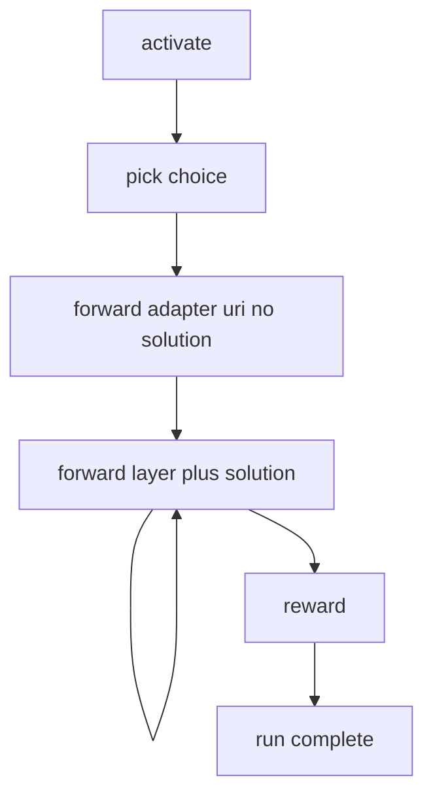

# Full execution workflow: activate through reward

This document gives an **end-to-end architecture** view of a KAIROS adapter run.
The server drives transitions via **`next_action`** and **`must_obey`**.

Authoritative tool copy lives under [`src/embed-docs/tools/`](../../src/embed-docs/tools/)
(**`activate.md`**, **`forward.md`**, **`reward.md`**). Companion pages in this
folder expand each step.

---

## Role

A successful run selects an adapter, steps through layers with **`forward`**, and
finalizes with **`reward`**. Other tools (**`train`**, **`tune`**, **`export`**,
**`delete`**, **`spaces`**) sit outside this chain but share the same storage
and URI model.



---

## Tool order and HTTP routes

| Step | MCP tool | HTTP method |
|------|----------|-------------|
| Discover spaces (optional) | **`spaces`** | **`POST /api/spaces`** |
| Match intent | **`activate`** | **`POST /api/activate`** |
| Step layers | **`forward`** | **`POST /api/forward`** |
| Finalize | **`reward`** | **`POST /api/reward`** |

**Related (not in the run chain):** **`train`**, **`tune`**, **`export`**,
**`delete`** — see their workflow pages and
[`http-health-routes.ts`](../../src/http/http-health-routes.ts) for the route map.

---

## Minimal sequence (illustrative)

**A —** pick a workflow:

```json
activate({
  "query": "summarize adapter run"
})
```

**B —** start the run (adapter URI from the chosen **`next_action`**):

```json
forward({
  "uri": "kairos://adapter/00000000-0000-4000-8000-000000000001"
})
```

**C —** satisfy the current **`contract`**, then call **`forward`** again with
the **layer** URI and a matching **`solution`** (details in **`forward.md`**).

**D —** when **`next_action`** says to call **`reward`**:

```json
reward({
  "uri": "kairos://layer/00000000-0000-4000-8000-000000000099?execution_id=...",
  "outcome": "success"
})
```

---

## Flow summary

```
activate({query: "…"})
  -> choices[].next_action -> forward(adapter_uri, no solution)
    -> contract + layer uri
    -> forward(layer_uri, solution)  # loop
    -> …
    -> next_action -> reward(layer_uri, outcome, …)
  -> run complete
```

- **`must_obey: true`** → follow **`next_action`**.
- Retry failures with the **fresh** **`contract`** in the error payload; do not
  restart the run from **`activate`** unless the tool text says so.

---

## Companion `workflow-*.md` pages

**`workflow-activate.md`**, **`workflow-forward-*.md`**, **`workflow-reward.md`**,
and related files are **companion narratives** aligned with this file and with
**`src/embed-docs/tools/*.md`**. They use the current MCP tool names. Execution
uses **`kairos://adapter/`** and **`kairos://layer/`** URIs.

---

## See also

- [Search / activation query architecture](search-query.md)
- [Export workflow](workflow-export.md)
- Embedded tool docs under [`src/embed-docs/tools/`](../../src/embed-docs/tools/)
