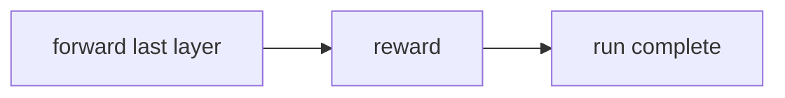

# Reward workflow

> **MCP tool:** **`reward`**. Agent-facing reference:
> [`reward.md`](../../src/embed-docs/tools/reward.md).

This document defines the **architecture** of **`reward`**: finalizing an adapter
run on the **final layer** URI, recording outcome and optional evaluator fields.
Binding schemas live in [`reward_schema.ts`](../../src/tools/reward_schema.ts).
HTTP: [`http-api-attest.ts`](../../src/http/http-api-attest.ts) (**`POST /api/reward`**).

---

## Role

**`reward`** runs after **`forward`** has validated the last layer’s contract
and **`next_action`** tells you to finalize. It records outcome (and optional
evaluator fields) and completes the run.



---

## Tool and API schema

### Authority

- **Live MCP:** **`reward`** input and output schemas on the connected server.
- **This repository:** [`reward_schema.ts`](../../src/tools/reward_schema.ts).
  **`POST /api/reward`** validates the same **`rewardInputSchema`**.

### Shipped input

| Field | Type | Notes |
|-------|------|--------|
| **`uri`** | string | **Layer** URI (include **`?execution_id=`** when the run used it). |
| **`outcome`** | enum | **`success`** or **`failure`**. |
| **`score`** | number | optional; 0 to 1 |
| **`feedback`** | string | optional; min length 1 when present |
| **`rater`**, **`rubric_version`**, **`llm_model_id`** | string | optional |

```json
{
  "uri": "kairos://layer/ccc33333-3333-3333-3333-333333333333?execution_id=eeeeeeee-eeee-4eee-8eee-eeeeeeeeeeee",
  "outcome": "success",
  "score": 0.95,
  "feedback": "<optional evaluator note>",
  "rater": "<optional>",
  "rubric_version": "<optional>",
  "llm_model_id": "<optional>"
}
```

Do not substitute an adapter URI unless the tool description explicitly allows it.

### Shipped output

| Field | Type | Notes |
|-------|------|--------|
| **`results`** | array | One row per rated layer with eligibility and blockers. |
| **`total_rated`**, **`total_failed`** | number | Aggregate counts |

```json
{
  "results": [
    {
      "uri": "kairos://layer/ccc33333-3333-3333-3333-333333333333?execution_id=eeeeeeee-eeee-4eee-8eee-eeeeeeeeeeee",
      "outcome": "success",
      "score": 0.95,
      "feedback": null,
      "rater": null,
      "rubric_version": null,
      "llm_model_id": "grader-model-v1",
      "grader_kind": "model",
      "evaluation_label": "gold",
      "exportable_for_sft": true,
      "exportable_for_preference": true,
      "sft_blockers": [],
      "preference_blockers": [],
      "rated_at": "2026-02-16T10:30:00.000Z"
    }
  ],
  "total_rated": 1,
  "total_failed": 0
}
```

### HTTP

- **`POST /api/reward`** — JSON body: same properties as **Shipped input**.

---

## Scenarios

### Success

After **`reward`**, the run is complete; you may answer the end user.

### Failure

Use **`outcome: "failure"`** and explain what went wrong in **`feedback`**.
This still records a reward row when the call succeeds. **`total_failed`**
tracks reward write failures, not adapter outcomes.

### Operational failures

If KAIROS cannot persist the reward or propagate the quality update, the
**`reward`** call fails instead of returning contradictory **`results`**
and aggregate counters. Retry the same **`reward`** call for the same
layer URI after the storage path is healthy.

---

## Export eligibility

Structured evaluator metadata controls whether a reward can flow into
training exports.

- **`reward_jsonl`** requires only a stored reward record. It preserves the
  normalized reward fields even when stricter training gates are not met.
- **`sft_jsonl`** requires `outcome: "success"`, a score at or above the
  SFT threshold, `rubric_version`, and either `rater` or `llm_model_id`.
- **`preference_jsonl`** requires a score at or above the preference
  threshold, `rubric_version`, and either `rater` or `llm_model_id`.
- **`sft_blockers`** and **`preference_blockers`** explain why a reward is
  not exportable yet.

---

## Validation rules

1. **`results`** is non-empty when the call succeeds.
2. **`total_rated`** + **`total_failed`** matches the result rows.
3. **`rated_at`** is ISO 8601.
4. **`exportable_for_sft`** and **`exportable_for_preference`** reflect the
   blocker arrays in the same result row.

---

## See also

- [forward (subsequent calls)](workflow-forward-continue.md)
- [Full execution workflow](workflow-full-execution.md)
- [Search query architecture](search-query.md)
- [Quality metadata](quality-metadata.md)
