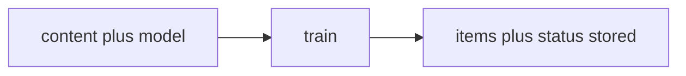

# Train workflow

> **MCP tool:** **`train`**. Agent-facing reference:
> [`train.md`](../../src/embed-docs/tools/train.md).

This document defines the **architecture** of **`train`**: storing adapter
markdown (H1 = adapter title; H2 = layers) and optional artifacts. Binding
schemas live in [`train_schema.ts`](../../src/tools/train_schema.ts). HTTP:
**`POST /api/train`** (JSON) and **`POST /api/train/raw`** (raw markdown) per
[`http-api-train-json.ts`](../../src/http/http-api-train-json.ts) and
[`http-api-train-raw.ts`](../../src/http/http-api-train-raw.ts).

---

## Role

**`train`** persists adapter or artifact content for later **`activate` →
forward → reward`** runs. End each verifiable layer with a fenced JSON block
using **`{"contract": ...}`** (see embedded **`train`** doc).



---

## Adapter markdown size limits (safety)

Before structure validation, **`train`** rejects oversized adapter Markdown to limit
**one-line injection** (huge single lines) and pathological payloads. Limits are
**configurable** (environment variables) and combine:

1. **Maximum line count** — default **350** (aligned with repository authoring and
   ESLint `max-lines` guidance).
2. **Maximum UTF-8 byte length per line** — default **8192** (stops megabyte-wide
   lines while allowing long prose).
3. **Maximum total UTF-8 size** — `ceil(max_lines × max_line_bytes × safety_factor)`;
   default **safety factor 1.15** leaves slack for newlines and normalization.

| Variable | Default | Role |
|----------|---------|------|
| **`KAIROS_ADAPTER_MARKDOWN_MAX_LINES`** | `350` | Reject documents with more logical lines. |
| **`KAIROS_ADAPTER_MARKDOWN_MAX_LINE_BYTES`** | `8192` | Reject any single line over this UTF-8 byte length. |
| **`KAIROS_ADAPTER_MARKDOWN_SIZE_SAFETY_FACTOR`** | `1.15` | Multiplier on `max_lines × max_line_bytes` for the total-byte ceiling. |

Non-markdown **artifacts** use the same **total-byte** ceiling only (no line-count
rule). Oversized bodies fail **`train`** with a structured error (see
[`validate-adapter-markdown-size.ts`](../../src/services/memory/validate-adapter-markdown-size.ts)).

**`tune`** applies the same rules for full-adapter Markdown updates; layer-only
body updates enforce **total bytes** and **per-line bytes** without the **full-document
line count** (see [Tune workflow](workflow-tune.md)).

---

## Tool and API schema

### Authority

- **Live MCP:** **`train`** on the connected server.
- **This repository:** [`train_schema.ts`](../../src/tools/train_schema.ts).

### Shipped input (MCP / JSON HTTP)

| Field | Type | Notes |
|-------|------|--------|
| **`content`** | string | optional if **`source_adapter_uri`** supplies fork source; adapter markdown or artifact body |
| **`llm_model_id`** | string | required; non-empty |
| **`force_update`** | boolean | default false; overwrite same-label adapter |
| **`protocol_version`** | string | optional |
| **`space`** | string | optional; **`personal`** or group name |
| **`source_adapter_uri`** | string | optional; fork from existing adapter |
| **`mime`** | string | optional; omit or **`text/markdown`** for adapters |
| **`artifact_name`** | string | required when **`mime`** is non-markdown |
| **`adapter_uri`** | string | required when storing an artifact (**`mime`** non-markdown) |

```json
{
  "content": "<string>",
  "llm_model_id": "<string, non-empty>",
  "force_update": false
}
```

### Shipped output (success)

| Field | Type | Notes |
|-------|------|--------|
| **`items`** | array | One row per stored layer or artifact |
| **`status`** | literal | **`stored`** |

Each item: **`uri`**, optional **`layer_uuid`** / **`artifact_uuid`**, optional
**`adapter_uri`**, **`label`**, **`tags`**, optional **`content_type`**.

```json
{
  "items": [
    {
      "uri": "kairos://layer/<uuid>",
      "layer_uuid": "<uuid>",
      "adapter_uri": "kairos://adapter/<uuid>",
      "label": "<string>",
      "tags": ["<string>"]
    }
  ],
  "status": "stored"
}
```

### HTTP

- **`POST /api/train`** — JSON body aligned with **`trainInputSchema`**.
- **`POST /api/train/raw`** — raw markdown body with query or headers supplying
  **`llm_model_id`** and options (see [`http-api-train-raw.ts`](../../src/http/http-api-train-raw.ts)).

---

## Contract types (examples)

Add one **contract** per layer as a trailing JSON code block. Use a fenced
` ```json ` block at the end of a layer.

**Shell:**

```json
{
  "contract": {
    "type": "shell",
    "shell": {
      "cmd": "npm test",
      "timeout_seconds": 60
    },
    "required": true
  }
}
```

**Comment:**

```json
{
  "contract": {
    "type": "comment",
    "comment": { "min_length": 50 },
    "required": true
  }
}
```

**User input:**

```json
{
  "contract": {
    "type": "user_input",
    "user_input": { "prompt": "Approve deployment?" },
    "required": true
  }
}
```

**MCP:**

```json
{
  "contract": {
    "type": "mcp",
    "mcp": { "tool_name": "train" },
    "required": true
  }
}
```

When both an older inline challenge block and a JSON block are present in a layer,
the JSON block takes precedence.

---

## Scenarios

### Scenario 1: store new adapter

The document is new. All steps are stored and URIs are returned.

#### Input

Example **`content`** (actual request body uses `\n` for newlines in JSON):

````
# Deploy Checklist

## Step 1: Build

Run tests.

```json
{"contract":{"type":"shell","shell":{"cmd":"npm test","timeout_seconds":60},"required":true}}
```

## Step 2: Deploy

Deploy to staging.

```json
{"contract":{"type":"comment","comment":{"min_length":20},"required":true}}
```
````

```json
{
  "content": "<see example above>",
  "llm_model_id": "gpt-4o"
}
```

#### Expected output

```json
{
  "items": [
    {
      "uri": "kairos://layer/aaa11111-1111-1111-1111-111111111111",
      "layer_uuid": "aaa11111-1111-1111-1111-111111111111",
      "label": "Step 1: Build",
      "tags": ["deploy", "build", "test"]
    },
    {
      "uri": "kairos://layer/bbb22222-2222-2222-2222-222222222222",
      "layer_uuid": "bbb22222-2222-2222-2222-222222222222",
      "label": "Step 2: Deploy",
      "tags": ["deploy", "staging"]
    }
  ],
  "status": "stored"
}
```

#### Agent behavior

Use the returned URIs for search or to inform the user. To run the adapter, call
**`activate`** with a query matching the adapter label, then follow
**`next_action`**.

### Scenario 2: force_update overwrites existing adapter

An adapter with the same label exists. Set **`force_update: true`** to replace it.

#### Input

```json
{
  "content": "# Deploy Checklist\n\n## Step 1: Build\n...",
  "llm_model_id": "gpt-4o",
  "force_update": true
}
```

#### Expected output

Same shape as scenario 1: **`items`** for each step (possibly new UUIDs after
replace), **`status: "stored"`**.

#### Agent behavior

Only use **`force_update: true`** after the user or agent has confirmed that
the existing adapter must be replaced (for example, after using **`export`** to
compare content).

### Scenario 3: error — DUPLICATE_ADAPTER

The store detected an existing adapter with the same identity and
**`force_update`** was not set.

#### Expected output (error body)

```json
{
  "error": "DUPLICATE_ADAPTER",
  "adapter_id": "<uuid>",
  "items": []
}
```

#### Agent behavior

Inform the user that an adapter with this content already exists. Offer to
run it via **`activate`** / **`forward`**, or replace it with **`train`** and
**`force_update: true`** after the user confirms.

### Scenario 4: error — SIMILAR_MEMORY_FOUND

#### Expected output (error body)

```json
{
  "error": "SIMILAR_MEMORY_FOUND",
  "existing_memory": {
    "uri": "kairos://adapter/ccc33333-3333-3333-3333-333333333333",
    "memory_uuid": "ccc33333-3333-3333-3333-333333333333",
    "label": "Deploy Checklist",
    "adapter_name": "Deploy Checklist",
    "score": 0.92,
    "layer_count": 2
  },
  "similarity_score": 0.92,
  "message": "A very similar memory already exists with title \"Deploy Checklist\" (similarity: 92%). Verify it before overwriting.",
  "must_obey": true,
  "next_action": "call export with uri kairos://adapter/ccc33333-3333-3333-3333-333333333333 (format markdown) to get content; compare with your train payload, then either call train with force_update: true to replace it or modify title/content to create a distinct adapter",
  "content_preview": "<optional string, truncated label + text>"
}
```

#### Agent behavior

1. **`must_obey: true`** — follow **`next_action`**: call **`export`** with the
   adapter URI from **`existing_memory.uri`** and default **`format: markdown`**
   to retrieve serialized markdown in **`content`**.
2. Compare the existing content with the intended train payload.
3. Either call **`train`** with **`force_update: true`** to replace, or change the
   document and call **`train`** again.

### Scenario 5: error — STORE_FAILED

#### Expected output (error body)

```json
{
  "error": "STORE_FAILED",
  "message": "<server error message>"
}
```

#### Agent behavior

Retry if the failure is transient. Otherwise report the error to the user and do
not claim success.

---

## Validation rules

1. On success, **`items`** is non-empty and **`status`** is **`stored`**.
2. Each item has **`uri`**, **`label`**, and **`tags`** (and optional ids per schema).
3. Error responses are returned as MCP error content with a JSON body containing
   **`error`** and scenario-specific fields.
4. For **`SIMILAR_MEMORY_FOUND`**, **`existing_memory`** includes **`uri`** and
   **`next_action`** is present when the agent must follow a recovery path.

---

## See also

- [export workflow](workflow-export.md)
- [tune workflow](workflow-tune.md)
- [activate workflow](workflow-activate.md)
