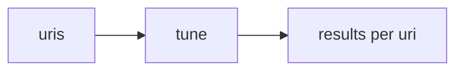

# Tune workflow

> **MCP tool:** **`tune`**. Agent-facing reference:
> [`tune.md`](../../src/embed-docs/tools/tune.md).

This document defines the **architecture** of **`tune`**: in-place updates to
stored adapter or layer bodies and optional space moves. Binding schemas live in
[`tune_schema.ts`](../../src/tools/tune_schema.ts). HTTP:
[`http-api-update.ts`](../../src/http/http-api-update.ts) (**`POST /api/tune`**).

---

## Role

**`tune`** updates stored adapter bodies or fields. Pass **`kairos://adapter/{uuid}`**
and/or **`kairos://layer/{uuid}`** URIs (optional **`?execution_id=`** on layers).
The server resolves them to the underlying stored records.



---

## Size limits (adapter Markdown)

Full-adapter **`tune`** ( **`kairos://adapter/{uuid}`** + **`content`**) uses the same
Markdown size guards as **`train`**: max lines, max line UTF-8 bytes, and a total-byte
ceiling with safety factor (see [Train workflow — Adapter markdown size limits](workflow-train.md)
and env vars **`KAIROS_ADAPTER_MARKDOWN_*`**).

Layer-only **`content`** updates enforce **total UTF-8 size** and **per-line** byte
limits only (no full-document line count), so a single layer body can be large
within those caps.

---

## Tool and API schema

### Authority

- **Live MCP:** **`tune`** schemas on the connected server.
- **This repository:** [`tune_schema.ts`](../../src/tools/tune_schema.ts).

### Shipped input

| Field | Type | Notes |
|-------|------|--------|
| **`uris`** | array | Non-empty; **`kairos://adapter/{uuid}`** or **`kairos://layer/{uuid}`** (optional **`execution_id`**). |
| **`content`** | string array | optional; one string per **`uris`** entry |
| **`updates`** | object | optional; advanced field updates |
| **`space`** | string | optional; move layers to **`personal`** or group name |

Provide **`content`**, **`updates`**, and/or **`space`** (at least one effective
update). **`content`** length must match **`uris`** length when present.

```json
{
  "uris": ["kairos://layer/<uuid>", "..."],
  "content": ["<string>", "..."],
  "updates": { "<key>": "<value>" }
}
```

### Body markers

When **`content`** strings include `<!-- KAIROS-BODY-START -->` /
`<!-- KAIROS-BODY-END -->`, only the enclosed region is applied as the stored
body (see server implementation).

### Shipped output

| Field | Type | Notes |
|-------|------|--------|
| **`results`** | array | **`uri`**, **`status`** (`updated` \| `error`), **`message`** |
| **`total_updated`**, **`total_failed`** | number | Counts |

```json
{
  "results": [
    {
      "uri": "kairos://layer/<uuid>",
      "status": "updated",
      "message": "<string>"
    }
  ],
  "total_updated": 1,
  "total_failed": 0
}
```

### HTTP

- **`POST /api/tune`** — JSON body: same properties as **Shipped input**.

---

## Typical use

1. **`export`** an adapter or layer to obtain current markdown (**`content`**).
2. Edit offline.
3. **`tune`** with the same target URIs and parallel **`content`** entries.

---

## Tune vs train

Use **`tune`** for in-place updates to existing adapter or layer records.

Use **`train`** with `force_update: true` when the change is structural (for
example, a changed H1 that resolves to a different adapter id, or a different
layer count than the stored adapter).

---

## Recovery hint

When **`forward`** returns **`must_obey: false`** after retries, **`next_action`**
may mention **`tune`** as a way to repair broken stored adapter or layer content
before new runs.

---

## See also

- [`tune_schema.ts`](../../src/tools/tune_schema.ts)
- [export workflow](workflow-export.md)
- [forward workflow](workflow-forward-continue.md)
