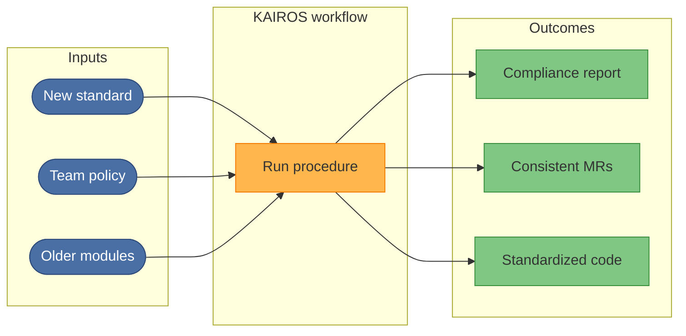

# Illustrative business application cases

This section contains **illustrative examples** of how KAIROS can be applied in
organizational workflows. These pages are scenario sketches for managers and
decision-makers, not executable product guarantees or benchmark results.

## What these examples show

- **Repeatable procedures:** The same workflow runs the same way every time,
  so outcomes are predictable.
- **Speed:** From a new requirement (e.g. a compliance document) to a first
  result in minutes.
- **Consistency:** Team practices (commits, merge requests, Terraform style)
  are enforced by a shared procedure instead of ad-hoc chat.

## Example cases

| Case | Problem | Outcome |
|------|--------|--------|
| [Standardize commits and merge requests](case-standardize-commits-and-merge-requests.md) | Align the team on commit messages and MR rules | One shared procedure; everyone follows the same steps when creating merge requests |
| [Compliance review from a new document](case-compliance-review-from-pdf.md) | Check a codebase against a new compliance standard (e.g. NIST) | Example flow for turning a document into a reusable review procedure |
| [Terraform module standardization](case-terraform-module-standardization.md) | Keep Terraform modules consistent and up to date | Standardize-project style workflow applied to Terraform; updated, consistent modules |

## Who this is for

| Audience | Interest |
|----------|----------|
| Engineering and platform leads | Automate team workflows and reduce drift |
| Compliance and risk | Fast, repeatable checks against standards |
| Product and delivery | Agents that follow a playbook instead of one-off chat |

## More information

For technical details on how protocols actually run in this repository, see
[Architecture and adapter workflows](../architecture/README.md).
