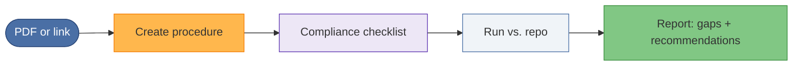

# Illustrative case 2: Turn a new compliance document into a review procedure

## Problem

Example problem: a new compliance or security standard is published (for
example a NIST guideline).
The team needs to check the codebase against it quickly, without manually
reading the whole document and turning it into a checklist every time.

## At a glance

| | |
|--|--|
| **Goal** | Turn a new standard into a reusable review procedure quickly |
| **Input** | Link to the standard (e.g. [NIST SP 800-218A](https://nvlpubs.nist.gov/nistpubs/SpecialPublications/NIST.SP.800-218A.pdf)) |
| **Output** | Runnable procedure + report (gaps and areas to improve) |
| **Benefit** | No manual checklist building; procedure is reusable for other repos |

## Scenario

1. **Input:** A link to the standard—for example
   [NIST SP 800-218A](https://nvlpubs.nist.gov/nistpubs/SpecialPublications/NIST.SP.800-218A.pdf)
   (Secure Software Development Practices for Generative AI and Dual-Use
   Foundation Models).

2. **Request:** "Prepare a new procedure for this document." The system
   turns the PDF (or its content) into a runnable compliance-review
   procedure—e.g. "NIST SP 800-218A — AI Model Development Security Review."

3. **Learning:** Once the procedure exists, the AI has effectively "learned"
   how to check compliance against that standard. The procedure encodes the
   review steps; no need to re-read the PDF for every run.

4. **First run:** The user runs the new procedure against the local repo.
   The agent follows the procedure and produces a **first compliance report**:
   areas that match the standard and areas to improve.

## Generic flow

1. Provide the new standard (e.g. PDF link or content).
2. Ask for a new procedure that reflects that standard.
3. Use the resulting procedure as the compliance checklist.
4. Run it against a target (e.g. repo, project); get a report with gaps and
   recommendations.

## Example outcome

- **Speed:** The checklist-building step becomes part of the workflow instead
  of a manual document review exercise.
- **Reuse:** The same procedure can be run again on other repos or after
  changes, so compliance checks stay repeatable.
- **Clarity:** The report highlights where the codebase aligns or falls
  short, so teams know what to fix.

## Takeaway

This is an illustrative workflow pattern for turning a new standard into a
repeatable review process.
