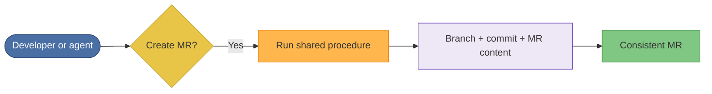

# Illustrative case 1: Standardize commits and merge requests across a team

## Problem

Example problem: a team's commit messages and merge request (MR) habits are inconsistent.
Some use conventional commits, others free-form text; branch naming and MR
titles vary. Review and tooling (e.g. changelogs) become harder, and
onboarding is noisy.

## At a glance

| | |
|--|--|
| **Goal** | One shared procedure for creating merge requests |
| **Input** | Team policy (branch naming, commit format, MR conventions) |
| **Output** | Consistent MRs and commits every time |
| **Benefit** | No reliance on each person remembering the policy |

## Approach

Introduce a **single, shared procedure** that everyone (and every AI agent)
uses when creating a merge request. The procedure encodes the team's rules:
branch naming, commit message format, optional scope, and any MR title/description
conventions. Once the procedure is in place, anyone—human or agent—runs the
same workflow and gets the same structure.

## Generic flow

1. The team (or platform lead) defines the desired standard and turns it
   into a runnable procedure (e.g. "Create merge request").
2. When a developer or agent needs to open an MR, they run that procedure
   instead of improvising.
3. The procedure guides them through: branch type and name, commit style,
   and MR content, so output is consistent.
4. Over time, all MRs created via this workflow follow the same rules;
   tooling and reviews can rely on that.

## Example outcome

- **One source of truth:** Commit and MR standards live in one procedure,
  not in scattered docs or memory.
- **Same behavior every time:** No need to remember the rules; the workflow
  applies them.
- **Easier automation:** Agents and scripts can "create merge request" by
  running the procedure, so automation stays aligned with the team standard.

## Takeaway

This is an example of how a shared workflow can encode MR and commit rules so
humans and agents follow the same structure.
