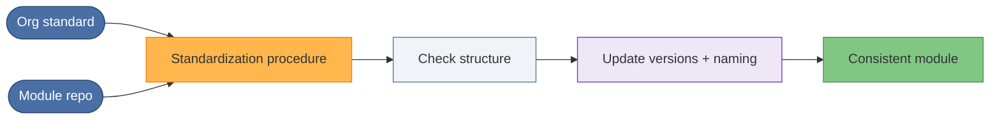

# Illustrative case 3: Standardizing and updating Terraform modules

## Problem

Example problem: Terraform modules across teams or repos have drifted: different naming,
structure, or patterns. Updating them manually is slow and error-prone; you
want a consistent, repeatable way to bring modules in line with a standard.

## At a glance

| | |
|--|--|
| **Goal** | All Terraform modules aligned to a single standard |
| **Input** | Standard (layout, naming, versions) + target module repo/dir |
| **Output** | Updated, consistent module (or report of changes) |
| **Benefit** | Same procedure scales to many repos; no hand-crafted edits |

## Approach

Use a **standardize-project** style procedure that applies a defined set of
rules to a Terraform codebase. The procedure guides the agent (or operator)
through the steps needed to align the module with the standard: structure,
naming, versions, and any project-specific conventions. The result is an
updated, consistent module without ad-hoc edits.

## Generic flow

1. The organization defines what "standard" means for Terraform modules
   (layout, naming, required files, version pins, etc.) and captures it in
   a standardization procedure.
2. When a module needs to be updated or aligned, the team runs that
   procedure against the module's repo or directory.
3. The procedure walks through the steps (e.g. check structure, update
   versions, apply naming rules) and produces changes or a report.
4. The same procedure can be run on other modules so that over time all
   of them follow the same standard.

## Example outcome

- **Consistency:** All modules that have been through the workflow conform
  to the same rules.
- **Repeatability:** Every run follows the same steps; no reliance on
  someone "just knowing" what to do.
- **Scalability:** New or legacy modules can be standardized by running the
  procedure again, so the standard scales across many repos.

## Takeaway

This is an example of how a standardization workflow can be applied to a class
of repositories instead of hand-crafting each update.
