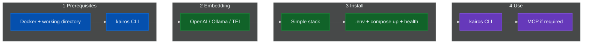

# Install KAIROS

`docs/install/` covers the supported installation flow for a local or
self-managed KAIROS deployment. Start by confirming the local requirements,
choose the embedding backend that determines your `.env` values, and then
complete the simple stack. Use the CLI as the primary interface for
authentication, verification, and day-to-day operations. Add MCP only when a
host explicitly requires it (streamable HTTP or stdio local process launch).

Follow this sequence:

1. Review **[installation prerequisites](prerequisites.md#prerequisites)**.
2. Choose an **[embedding backend](prerequisites.md#embedding-backend)** before
   you populate `.env`.
3. Complete **[Docker Compose — simple stack](docker-compose-simple.md)**, which
   is the recommended installation path.
4. Use **`kairos`** against the running server.
5. Configure **MCP** only for hosts that need it.

If you need more supporting services, the repository also includes **[Docker
Compose — full stack (advanced)](docker-compose-full-stack.md)** for
operator-managed deployments.

## Flow

This diagram summarizes the recommended order.



The pages in this directory serve distinct roles.

| Doc | Use for |
|-----|---------|
| [prerequisites](prerequisites.md) | Local requirements and embedding backend selection before `.env` |
| [docker-compose-simple](docker-compose-simple.md) | Recommended installation path: application + Qdrant |
| [docker-compose-full-stack](docker-compose-full-stack.md) | Full stack (advanced) for operator-managed deployments |

## CLI

Install the CLI first. It is the primary interface for authentication,
verification, and operational commands.

```sh
npm install -g @debian777/kairos-mcp
kairos --help
```

If you do not want a global installation, run the package with `npx`:

```sh
npx @debian777/kairos-mcp --help
```

For URL selection, authentication, and the full command surface, see
[CLI](../CLI.md).

## Cursor and MCP

Configure MCP only when your IDE or host needs it. The CLI remains the primary
interface even when MCP is enabled.

Use transport by host class:

- Streamable HTTP for containerized or remote workflows.
- stdio for local process-spawn hosts such as Claude Desktop, Cursor, and
  Claude Code.

The MCP URL uses the same host and port as `/health`, with `/mcp` appended.
Local development often uses port `3300`; the Compose examples in this
directory use port `3000`.

```json
{
  "mcpServers": {
    "KAIROS": {
      "type": "streamable-http",
      "url": "http://localhost:3000/mcp",
      "alwaysAllow": [
        "activate",
        "forward",
        "train",
        "reward",
        "tune",
        "delete",
        "export",
        "spaces"
      ]
    }
  }
}
```

```sh
curl -sS "http://localhost:3000/health"
```

- Discovery: `/.well-known/oauth-protected-resource`
- Auth: [CLI](../CLI.md#authentication), [auth overview](../architecture/auth-overview.md)
- Plugin: `integrations/cursor/plugin` often uses `http://localhost:3300/mcp`
- Widgets: `spaces` and `forward` use MCP Apps on hosts that support them

If MCP does not connect, verify the health URL first, confirm the host and
port, and make sure the server has Qdrant plus a working embedding backend.

## Local stdio hosts

Use stdio mode when your host spawns the MCP server process directly.

1. Build the project:

   ```sh
   npm run build
   ```

2. Start stdio mode:

   ```sh
   npm run dev:stdio
   ```

3. Configure your host command:
   - command: `node`
   - args: `["/absolute/path/to/kairos-mcp/dist/bootstrap.js"]`
   - env: `TRANSPORT_TYPE=stdio`

Host snippets:

- Claude Desktop:

  ```json
  {
    "mcpServers": {
      "KAIROS": {
        "command": "node",
        "args": ["/absolute/path/to/kairos-mcp/dist/bootstrap.js"],
        "env": {
          "TRANSPORT_TYPE": "stdio"
        }
      }
    }
  }
  ```

- Cursor:

  ```json
  {
    "mcpServers": {
      "KAIROS_STDIO": {
        "command": "node",
        "args": ["/absolute/path/to/kairos-mcp/dist/bootstrap.js"],
        "env": {
          "TRANSPORT_TYPE": "stdio"
        }
      }
    }
  }
  ```

- Claude Code:

  ```json
  {
    "mcpServers": {
      "KAIROS": {
        "command": "node",
        "args": ["/absolute/path/to/kairos-mcp/dist/bootstrap.js"],
        "env": {
          "TRANSPORT_TYPE": "stdio"
        }
      }
    }
  }
  ```

In stdio mode, the server writes MCP JSON-RPC frames to stdout and writes logs
to stderr.

For CI or local parity with HTTP integration tests, set
`KAIROS_HTTP_SIDECHAN=true` alongside `TRANSPORT_TYPE=stdio` so the HTTP app also
listens on `PORT` (REST and Streamable HTTP MCP); the primary MCP transport
remains stdio. Desktop hosts should omit this unless you need that dual surface.

## Index

Use these links when you want broader context outside the install flow.

- [Documentation map](../README.md)
- [Main README](../../README.md)
