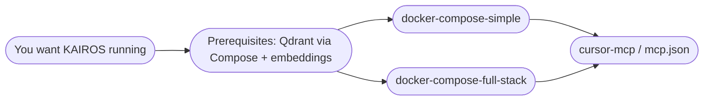

# Install KAIROS

All installation documentation for this repository lives under **`docs/install/`**.
Use this page as the entry point.

## How the pieces fit together

Typical flow: pick a **Docker** guide (simple or full stack). Each guide orders
steps as **`mcp.json` → installation → `.env` → start stack and MCP**. Deep
reference for variables and embeddings: [Environment variables and secrets](env-and-secrets.md).
[Install MCP in Cursor](cursor-mcp.md) also covers **HTTP-only MCP** (no stdio /
no `npx` subprocess for the wire). The **`kairos` CLI** (including `npx
@debian777/kairos-mcp`) is documented in [CLI reference](../CLI.md).

## Guides

| Guide | Purpose |
|-------|---------|
| [Docker Compose — simple stack](docker-compose-simple.md) | Default Compose: Qdrant + app; ordered install + `.env` block |
| [Docker Compose — full stack](docker-compose-full-stack.md) | Redis, Postgres, Keycloak; same section order |
| [Install MCP in Cursor](cursor-mcp.md) | Cursor `mcp.json`, HTTP vs stdio, plugin, widgets, auth |
| [Environment variables and secrets](env-and-secrets.md) | Embeddings, Redis URL, generated secrets, variable table |
| [CLI reference](../CLI.md) | `kairos` / `npx @debian777/kairos-mcp`, auth, config paths |

### Appendix

| Doc | Purpose |
|-----|---------|
| [Google sign-in for Keycloak (dev)](google-auth-dev.md) | Optional Google IdP on local `kairos-dev` realm |

Older bookmarks under `docs/INSTALL-*.md` redirect here.

## Repository index

- [Documentation map](../README.md)
- [Main README](../../README.md) — product overview and quick start summary
