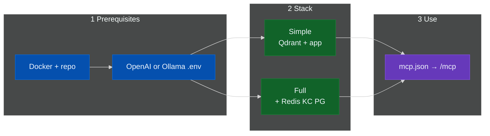

# Install KAIROS

Entry point for **`docs/install/`**. **Streamable HTTP MCP only** (no stdio `npx` server in `mcp.json`).

## Flow



| Doc | Use for |
|-----|---------|
| [prerequisites](prerequisites.md) | Embeddings: **OpenAI** key (screenshot) or **Ollama** URLs |
| [docker-compose-simple](docker-compose-simple.md) | Default stack: Qdrant + app |
| [docker-compose-full-stack](docker-compose-full-stack.md) | Redis, Postgres, Keycloak, prod-style `.env` |
| [env-and-secrets](env-and-secrets.md) | Variable list, `REDIS_URL`, TEI |
| [CLI](../CLI.md) | `kairos` / `npx @debian777/kairos-mcp` |

**Keycloak:** [Google IdP (dev)](../keycloak/google-auth-dev.md)

## Cursor and MCP

**Needs:** running app + `.env` with embeddings ([prerequisites](prerequisites.md)).

**URL:** same host/port as `/health` + path `/mcp`. Dev often **3300**, Compose default **3000**.

```json
{
  "mcpServers": {
    "KAIROS": {
      "type": "streamable-http",
      "url": "http://localhost:3000/mcp",
      "alwaysAllow": [
        "activate",
        "forward",
        "train",
        "reward",
        "tune",
        "delete",
        "export",
        "spaces"
      ]
    }
  }
}
```

```sh
curl -sS "http://localhost:3000/health"
```

- Discovery: `/.well-known/oauth-protected-resource`
- Auth: [CLI](../CLI.md#authentication), [auth overview](../architecture/auth-overview.md)
- Plugin: `integrations/cursor/plugin` → often `http://localhost:3300/mcp`
- **Widgets:** `spaces`, `forward` (MCP Apps); some hosts show JSON only

**Fix:** wrong port → health first; `command`+`npx` in mcp.json → use `streamable-http` + `url`; tool errors → Qdrant + embeddings + auth

## Index

- [Documentation map](../README.md)
- [Main README](../../README.md)
