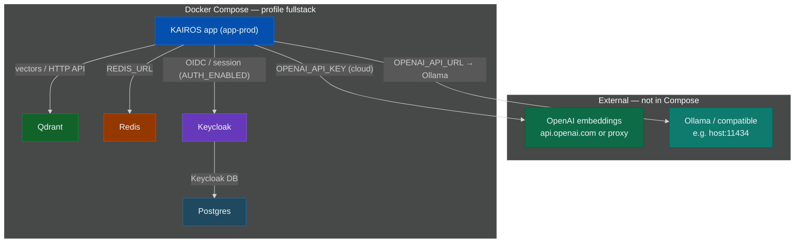

# Docker Compose — full stack (production-style)

**Profile `fullstack`:** Redis, Postgres, Keycloak, Qdrant, app. **Public HTTPS** app + IdP URLs, **`kairos-prod`**, Docker DNS **`redis` / `qdrant` / `keycloak`** in `.env`.

**No `compose up` without `.env`.** Keycloak in this repo = **`start-dev`** in `compose.yaml` → OK for many single nodes; hardened prod → [Keycloak guides](https://www.keycloak.org/guides).

## Stack topology

Colored **dark** theme. Compare [simple stack topology](docker-compose-simple.md#stack-topology).



## Prerequisites

- Docker + Compose v2, [repo](https://github.com/debian777/kairos-mcp)
- `npm run infra:up` → **Python 3**
- Embeddings → [prerequisites](prerequisites.md)
- DNS/TLS for app + Keycloak (often reverse proxy)

## 1. `mcp.json`

App **public** origin + `/mcp` (not Keycloak port). Replace host:

```json
{
  "mcpServers": {
    "KAIROS": {
      "type": "streamable-http",
      "url": "https://kairos.example.com/mcp",
      "alwaysAllow": [
        "activate",
        "forward",
        "train",
        "reward",
        "tune",
        "delete",
        "export",
        "spaces"
      ]
    }
  }
}
```

OAuth: `/.well-known/oauth-protected-resource` · [install README](README.md#cursor-and-mcp) · [CLI auth](../CLI.md#authentication)

## 2. Install

Repo root (paths for `scripts/` + `docs/install/`).

## 3. `.env`

Base: [`scripts/env/.env.template`](../../scripts/env/.env.template). Fill `__…__`, swap example hosts.

| In container | Example |
|----------------|---------|
| `REDIS_URL` | `redis://:PW@redis:6379` |
| `KEYCLOAK_INTERNAL_URL` | `http://keycloak:8080` |
| `QDRANT_URL` | `http://qdrant:6333` |

| Public (browser / redirects) | Example |
|------------------------------|---------|
| `AUTH_CALLBACK_BASE_URL` | `https://kairos.example.com` |
| `KEYCLOAK_URL` | `https://auth.example.com` |
| `KEYCLOAK_REALM` | `kairos-prod` |
| `AUTH_TRUSTED_ISSUERS` | `https://auth.example.com/realms/kairos-prod` |

```ini
KEYCLOAK_ADMIN_PASSWORD=__KEYCLOAK_ADMIN_PASSWORD__
KEYCLOAK_ADMIN_USERNAME=admin
KEYCLOAK_DB_PASSWORD=__KEYCLOAK_DB_PASSWORD__
REDIS_PASSWORD=__REDIS_PASSWORD__
QDRANT_API_KEY=__QDRANT_API_KEY__
QDRANT_COLLECTION=kairos_prod
QDRANT_URL=http://qdrant:6333
REDIS_URL=redis://:__REDIS_PASSWORD__@redis:6379
PORT=3000
METRICS_PORT=9090
MAX_CONCURRENT_MCP_REQUESTS=0
NODE_ENV=production
LOG_LEVEL=warn
LOG_FORMAT=json
KAIROS_REDIS_PREFIX=kairos:prod:
OPENAI_API_KEY=__OPENAI_API_KEY__
EMBEDDING_PROVIDER=openai
QDRANT_RESCORE=true
QDRANT_SNAPSHOT_DIR=var/snapshots
AUTH_ENABLED=true
SESSION_SECRET=__SESSION_SECRET__
SESSION_MAX_AGE_SEC=604800
AUTH_CALLBACK_BASE_URL=https://kairos.example.com
KEYCLOAK_INTERNAL_URL=http://keycloak:8080
KEYCLOAK_URL=https://auth.example.com
KEYCLOAK_REALM=kairos-prod
KEYCLOAK_CLIENT_ID=kairos-mcp
KEYCLOAK_CLI_CLIENT_ID=kairos-cli
AUTH_MODE=oidc_bearer
AUTH_TRUSTED_ISSUERS=https://auth.example.com/realms/kairos-prod
AUTH_ALLOWED_AUDIENCES=kairos-mcp,kairos-cli
```

After Keycloak is up: `python3 scripts/deploy-configure-keycloak-realms.py` · embeddings → [prerequisites](prerequisites.md)

**Host ports:** `PORT` 3000, `METRICS_PORT` 9090, 6333/6344, 6379, 5432, 8080/9000 — or TLS proxy only.

## 4. Start

```sh
docker compose -p kairos-mcp --profile fullstack up -d
```

**Realms script (optional):**

```sh
npm run infra:up
```

→ `deploy-configure-keycloak-realms.py` (**kairos-dev** + **kairos-prod**). Prod: `KEYCLOAK_REALM=kairos-prod` + redirects = `AUTH_CALLBACK_BASE_URL` / `KEYCLOAK_URL`.

**Redis Insight:**

```sh
docker compose -p kairos-mcp --profile fullstack --profile infra-ui up -d
```

**Health:**

```sh
curl -sS "https://kairos.example.com/health"
```

## Services (`fullstack`)

| Service | Notes |
|---------|--------|
| redis | `REDIS_PASSWORD` |
| postgres | Keycloak DB |
| keycloak | OIDC (`start-dev` in repo) |
| qdrant | vectors |
| app-prod | KAIROS |

**`infra-ui`:** Redis Insight on **5540**

## Ports (`compose.yaml`)

| Service | Ports |
|---------|-------|
| App | `${PORT:-3000}` |
| Metrics | `${METRICS_PORT:-9090}` |
| Qdrant | 6333, 6344 |
| Redis | 6379 |
| Postgres | 5432 |
| Keycloak | 8080, 9000 |
| Redis Insight | 5540 |

## Related

- [env-and-secrets](env-and-secrets.md) · [Cursor MCP](README.md#cursor-and-mcp) · [infrastructure](../architecture/infrastructure.md) · `scripts/keycloak/import/README.md`

## Google IdP

[google-auth-dev.md](google-auth-dev.md) shows **kairos-dev**; prod → `kairos-prod` + `deploy-configure-keycloak-google-idp.py`.

## Troubleshooting

| Issue | Fix |
|-------|-----|
| `REDIS_PASSWORD must be set` | `.env` → `up -d` |
| Keycloak / Postgres unhealthy | `docker compose -p kairos-mcp logs postgres keycloak` · DB password |
| App → Redis | `REDIS_URL` host **`redis`**, password match |
| `infra:up` fails | Python 3 · repo root · containers up first |
