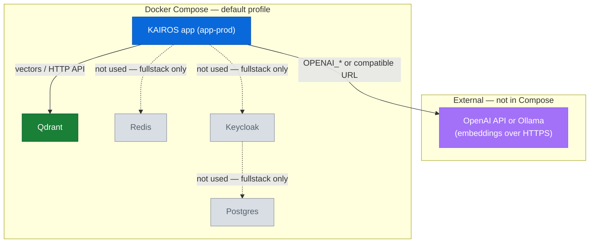

# Install KAIROS with Docker Compose (simple stack)

This guide starts the **default** Compose stack from the repository: **Qdrant**
and the **app** service only. No Redis, Postgres, or Keycloak profile is
enabled. Use this for the smallest runnable deployment.

Work through the sections **in order**. Do not run `docker compose up` until
`.env` exists and required variables are set.

## Prerequisites

Complete these before you follow the numbered steps:

1. **Docker Engine** and **Docker Compose v2** installed and running.
2. **Repository content** — a clone of
   [kairos-mcp](https://github.com/debian777/kairos-mcp) with `compose.yaml` at
   the working directory you will use (repository root is recommended).
3. **Qdrant** — you do not install Qdrant separately; this Compose file starts it
   as a service. Ensure host ports **6333** and **6344** are free (unless you
   change them in Compose).
4. **Embeddings (OpenAI or Ollama)** — the app needs a working embedding
   backend before training and search behave normally:
   - **OpenAI:** a valid `OPENAI_API_KEY` (embeddings API only).
   - **Ollama (or another OpenAI-compatible server):** base URL **without**
     `/v1`, a model name, and `OPENAI_API_KEY=ollama` when no real key is used.

   URLs differ when the app runs **inside Docker** vs on the **host**; see
   [Environment variables and secrets — Embedding backends](env-and-secrets.md#embedding-backends).

## 1. MCP client configuration (`mcp.json`)

Configure Cursor **after** the server is healthy (step 4), but set the URL to
match the app port you will use (`PORT` in `.env`, default **3000**).

Open **Settings → MCP → Edit config** in Cursor. Add a **streamable HTTP**
entry whose `url` is your app base URL with `/mcp` appended:

```json
{
  "mcpServers": {
    "KAIROS": {
      "type": "streamable-http",
      "url": "http://localhost:3000/mcp",
      "alwaysAllow": [
        "activate",
        "forward",
        "train",
        "reward",
        "tune",
        "delete",
        "export",
        "spaces"
      ]
    }
  }
}
```

If you set `PORT` to something other than 3000, replace `3000` in `url`. Auth,
discovery, widgets, and the Cursor plugin bundle:
[Install MCP in Cursor](cursor-mcp.md).

## 2. Installation

Use the **repository root** (recommended) or any directory that contains this
repository’s `compose.yaml`.

You do not run `docker compose up` until step 4.

## 3. Environment file

Create **`.env`** in the repository root (next to `compose.yaml`). This stack is
**app + Qdrant only** with `AUTH_ENABLED=false` (no Redis or Keycloak). Pick
**one** template — OpenAI or Ollama — then replace placeholder values.

### OpenAI (cloud)

```env
OPENAI_API_KEY=sk-proj-xxxxxxxx
QDRANT_API_KEY=change-me
AUTH_ENABLED=false
```

### Ollama (local)

For the **app running inside Docker Compose** while **Ollama runs on the host**
(macOS or Windows). The base URL must not include `/v1`. Pull the model first,
for example: `ollama pull nomic-embed-text`.

```env
OPENAI_API_URL=http://host.docker.internal:11434
OPENAI_EMBEDDING_MODEL=nomic-embed-text
OPENAI_API_KEY=ollama
QDRANT_API_KEY=change-me
AUTH_ENABLED=false
```

If the app runs **on the host** (not in Docker), use
`OPENAI_API_URL=http://127.0.0.1:11434` instead. More options:
[Environment variables and secrets](env-and-secrets.md#embedding-backends).

You must set `QDRANT_API_KEY` and the variables for your chosen embedding path.

### Free the default ports

Before starting, ensure nothing else is bound to:

- **App:** `PORT` (default **3000**)
- **Qdrant:** **6333** (and **6344** as in `compose.yaml`)
- **Metrics:** `METRICS_PORT` (default **9090**)

## 4. Start the stack and use MCP

Only after `.env` is ready and ports are clear:

```bash
docker compose -p kairos-mcp up -d
```

Verify the app:

```bash
curl -sS "http://localhost:${PORT:-3000}/health"
```

Endpoints (same host and port as health):

- UI: `http://localhost:3000/ui`
- MCP (streamable HTTP): `http://localhost:3000/mcp`
- Metrics: `http://localhost:9090/metrics` (unless `METRICS_PORT` differs)

Then ensure Cursor’s `mcp.json` `url` matches this origin (section 1).

## What this stack runs

The default project does **not** use the `fullstack` profile. When you start it,
Compose brings up:

- **qdrant** — vector store
- **app-prod** — KAIROS application (image `debian777/kairos-mcp` as defined in
  `compose.yaml`)

Same component layout as the [full stack](docker-compose-full-stack.md#what-this-stack-runs) diagram. **Gray** nodes and **dotted** edges are not started in the **default** profile (use `--profile fullstack` for Redis, Postgres, and Keycloak).



## Related documentation

- [Environment variables and secrets](env-and-secrets.md) — embedding detail,
  variable reference
- [Install MCP in Cursor](cursor-mcp.md) — full client guide
- For Redis, Postgres, Keycloak, and auth-enabled local dev, use
  [Docker Compose — full stack](docker-compose-full-stack.md)

## Troubleshooting

**1. Compose fails with `QDRANT_API_KEY must be set`**

1. Open `.env` and set `QDRANT_API_KEY` to a non-empty secret
2. Re-run `docker compose -p kairos-mcp up -d`

**2. Port already in use**

1. Find what holds the port: `docker compose -p kairos-mcp ps`
2. Change `PORT` (and `METRICS_PORT` if needed) in `.env`, or stop the
   conflicting service

**3. App container unhealthy**

1. Inspect logs: `docker compose -p kairos-mcp logs app-prod`
2. Confirm Qdrant is reachable from the app (see `QDRANT_URL` in
   `compose.yaml`)

**4. Embeddings or training errors**

1. Confirm your embedding provider variables match [Environment variables and secrets](env-and-secrets.md)
2. Test keys when applicable: `npm run dev:test-embedding-key` from a dev
   checkout
