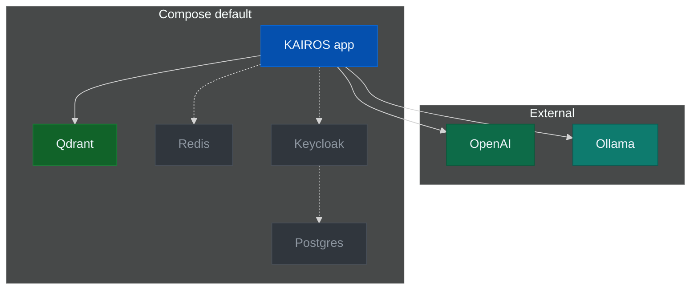

# Docker Compose — simple stack

**Default profile:** **Qdrant + app** only (no Redis / Postgres / Keycloak). Smallest runnable deploy.

Order: **`.env`** → **`docker compose up`** → **`curl /health`**. Do not `up` without `.env`.

## Topology

Muted = not in **default** profile (`--profile fullstack` adds them).



## Prerequisites

1. Docker + Compose v2  
2. [Repo](https://github.com/debian777/kairos-mcp) + `compose.yaml`  
3. Embeddings in `.env` → [prerequisites](prerequisites.md)

## 1. `mcp.json`

Match **`PORT`** (default **3000**). Auth / widgets: [install README](README.md#cursor-and-mcp).

```json
{
  "mcpServers": {
    "KAIROS": {
      "type": "streamable-http",
      "url": "http://localhost:3000/mcp",
      "alwaysAllow": [
        "activate",
        "forward",
        "train",
        "reward",
        "tune",
        "delete",
        "export",
        "spaces"
      ]
    }
  }
}
```

## 2. Install

Repo root (or any dir with this `compose.yaml`). **No `up` until step 4.**

## 3. Environment file

**`.env`** next to `compose.yaml`. **`AUTH_ENABLED=false`**. Pick **one** block.

### OpenAI

```sh
OPENAI_API_KEY=sk-proj-xxxxxxxx
QDRANT_API_KEY=change-me
AUTH_ENABLED=false
```

### Ollama (Compose app + Ollama on host; no `/v1` in URL)

```sh
OPENAI_API_URL=http://host.docker.internal:11434
OPENAI_EMBEDDING_MODEL=nomic-embed-text
OPENAI_API_KEY=ollama
QDRANT_API_KEY=change-me
AUTH_ENABLED=false
```

App on **host** (not container): `OPENAI_API_URL=http://127.0.0.1:11434`

### Ports to free

| Service | Port |
|---------|------|
| App | `PORT` → 3000 |
| Qdrant | 6333, 6344 |
| Metrics | `METRICS_PORT` → 9090 |

## 4. Start

```sh
docker compose -p kairos-mcp up -d
curl -sS "http://localhost:${PORT:-3000}/health"
```

| Path | URL pattern |
|------|-------------|
| UI | `http://localhost:3000/ui` |
| MCP | `http://localhost:3000/mcp` |
| Metrics | `http://localhost:9090/metrics` |

## Services (default profile)

- **qdrant**
- **app-prod** (`debian777/kairos-mcp` image from `compose.yaml`)

## Related

- [env-and-secrets](env-and-secrets.md)
- [Full stack](docker-compose-full-stack.md) — Redis, Keycloak, auth

## Troubleshooting

| Issue | Fix |
|-------|-----|
| `QDRANT_API_KEY must be set` | Set in `.env`, `up` again |
| Port in use | Change `PORT` / `METRICS_PORT` or stop conflict |
| App unhealthy | `docker compose -p kairos-mcp logs app-prod` |
| Embeddings | [env-and-secrets](env-and-secrets.md), `npm run dev:test-embedding-key` |
