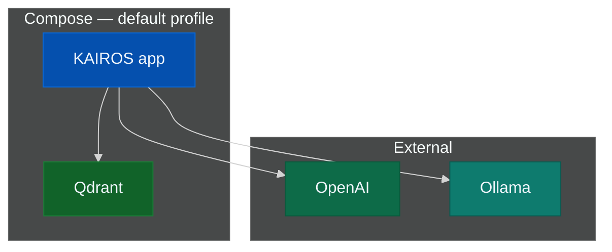

# Docker Compose — simple stack

The default Compose profile starts only the KAIROS application and Qdrant. This
is the recommended installation path for local use and first-time setup.
It does not provision an identity provider or other auxiliary services.

Choose the [embedding backend](prerequisites.md#embedding-backend) before you
populate `.env`, and do not run `docker compose up` until section 3 is
complete.

---

## Stack topology

The simple profile runs two containers in Compose. The application reaches
the selected embedding backend outside Compose.



---

## Installation sequence

Follow these steps in order.

1. Confirm the [prerequisites](prerequisites.md#prerequisites).
2. Choose the [embedding backend](prerequisites.md#embedding-backend).
3. Create the `.env` file (section 3 below) with `QDRANT_API_KEY` plus the
   variables for your chosen backend.
4. Start the stack and verify `/health`.
5. Use the [CLI](../CLI.md). Configure `mcp.json` only if a host needs MCP
   over HTTP.

---

## 3. Environment file

Create `.env` next to `compose.yaml`. Set `AUTH_ENABLED=false`, then choose one
embedding block.

### OpenAI

```ini
OPENAI_API_KEY=sk-proj-xxxxxxxx
QDRANT_API_KEY=change-me
AUTH_ENABLED=false
```

### Ollama (app in Compose, Ollama on host)

```ini
OPENAI_API_URL=http://host.docker.internal:11434
OPENAI_EMBEDDING_MODEL=nomic-embed-text
OPENAI_API_KEY=ollama
QDRANT_API_KEY=change-me
AUTH_ENABLED=false
```

App on **host** (not container): use `OPENAI_API_URL=http://127.0.0.1:11434`.

### Ports

| Service | Port |
|---------|------|
| App | `PORT` (default 3000) |
| Qdrant | 6333, 6344 |
| Metrics | `METRICS_PORT` (default 9090) |

---

## 4. Start

```sh
docker compose -p kairos-mcp up -d
curl -sS "http://localhost:${PORT:-3000}/health"
```

Use `kairos --url ...` for checks and operations once the
[CLI](../CLI.md) is installed.

| Path | URL |
|------|-----|
| UI | `http://localhost:3000/ui` |
| MCP | `http://localhost:3000/mcp` |
| Metrics | `http://localhost:9090/metrics` |

---

## 5. MCP client (`mcp.json`)

Configure this only when an IDE or host needs MCP over HTTP. Match `PORT`, and
use the CLI for authentication and operational checks.

```json
{
  "mcpServers": {
    "KAIROS": {
      "type": "streamable-http",
      "url": "http://localhost:3000/mcp",
      "alwaysAllow": [
        "activate",
        "forward",
        "train",
        "reward",
        "tune",
        "delete",
        "export",
        "spaces"
      ]
    }
  }
}
```

---

## Services (default profile)

| Service | Purpose |
|---------|---------|
| `qdrant` | Vector database |
| `app-prod` | KAIROS application (`debian777/kairos-mcp` image) |

---

## Troubleshooting

| Issue | Fix |
|-------|-----|
| `QDRANT_API_KEY must be set` | Add it to `.env`, then restart |
| Port in use | Change `PORT` or `METRICS_PORT`, or stop the conflicting process |
| App unhealthy | Run `docker compose -p kairos-mcp logs app-prod` |
| Embedding errors | Re-check [embedding backend](prerequisites.md#embedding-backend); check server logs |

---

## Related

| Resource | Use for |
|----------|---------|
| [Install index](README.md) | Overview of all installation paths |
| [Full stack (advanced)](docker-compose-full-stack.md) | Additional services for broader local topology |
| [Helm chart](helm.md) | Kubernetes production deployment |
| [CLI](../CLI.md) | Primary interface for operations |
