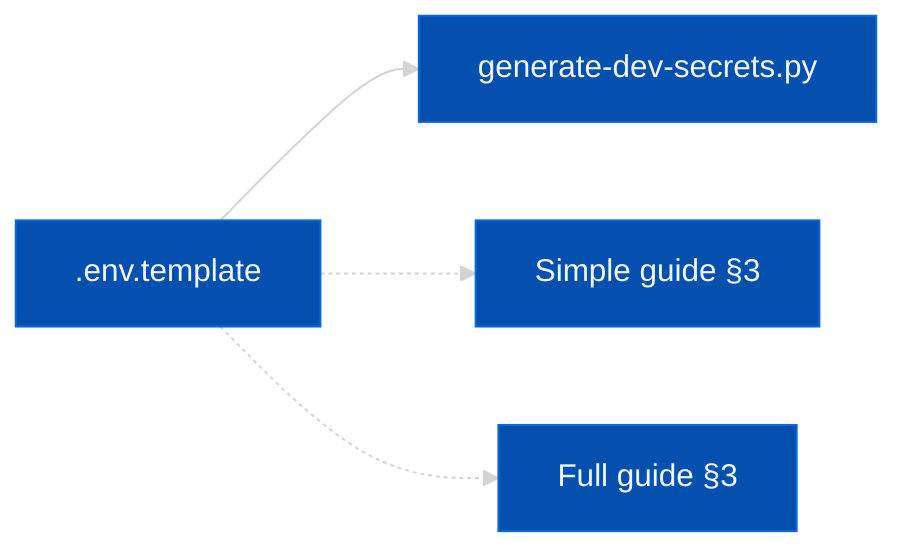

# Environment variables and secrets

Config = **environment variables**. Docker: repo-root **`.env`** next to `compose.yaml`.

## Where templates live



| Stack | Copy from |
|-------|-----------|
| Minimal | [docker-compose-simple — §3](docker-compose-simple.md#3-environment-file) |
| Full | [docker-compose-full-stack — §3](docker-compose-full-stack.md#3-environment-file) |

**Generate secrets (dev):**

```sh
python3 scripts/deploy-generate-dev-secrets.py
```

**Compose:**

```sh
docker compose -p kairos-mcp up -d
# fullstack:
docker compose -p kairos-mcp --profile fullstack up -d
```

## Before `up`

| Profile | Set |
|---------|-----|
| Minimal | `QDRANT_API_KEY` + embeddings ([prerequisites](prerequisites.md)) |
| Fullstack | + `REDIS_PASSWORD`, `SESSION_SECRET`, Keycloak passwords, `REDIS_URL` (see [full stack](docker-compose-full-stack.md)) |

**`REDIS_URL`**

```sh
# app inside Compose
redis://:PASSWORD@redis:6379
# app on host
redis://:PASSWORD@127.0.0.1:6379
```

## Embeddings

OpenAI vs Ollama: [prerequisites](prerequisites.md).

### TEI

```sh
TEI_BASE_URL=http://tei-host:8080
TEI_MODEL=optional-model-id
```

## Common variables

| Variable | Role |
|----------|------|
| `PORT` | HTTP |
| `METRICS_PORT` | Metrics |
| `QDRANT_URL` / `QDRANT_API_KEY` / `QDRANT_COLLECTION` | Vector DB |
| `REDIS_URL` | Cache / PoW state |
| `AUTH_ENABLED` | Lock `/api`, `/mcp`, `/ui` |
| `KEYCLOAK_URL` | Browser OIDC |
| `KEYCLOAK_INTERNAL_URL` | Server → Keycloak inside Docker |
| `AUTH_CALLBACK_BASE_URL` | `/auth/callback` base |

Google IdP: [google-auth-dev](google-auth-dev.md).
