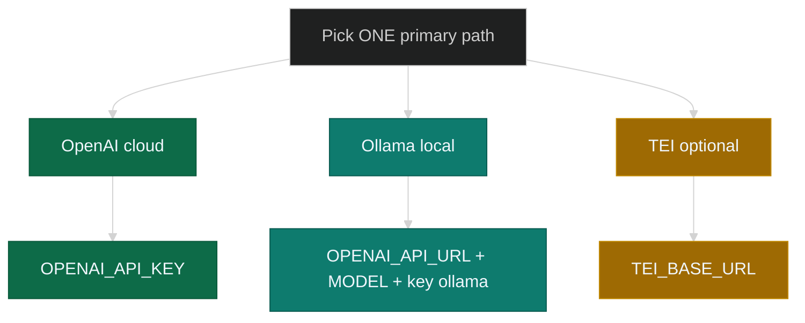

# Install prerequisites

Before [simple](docker-compose-simple.md) or [full stack](docker-compose-full-stack.md) **Environment file**: pick **one** embedding path. Stack secrets come from those guides.

## Every install

- Docker + Compose v2
- This [repo](https://github.com/debian777/kairos-mcp) + `compose.yaml` (root recommended)
- Full stack + `npm run infra:up` → **Python 3**
- Qdrant = Compose (no separate install)

## Embedding paths



---

## OpenAI

- Key must allow **`POST /v1/embeddings`** ([platform.openai.com](https://platform.openai.com/))
- **Restricted** key → enable **Embeddings**; turn other capabilities **None** if possible (UI changes over time)


**.env** (with `QDRANT_API_KEY` from [simple](docker-compose-simple.md#3-environment-file) / [full](docker-compose-full-stack.md#3-environment-file)):

```sh
OPENAI_API_KEY=sk-...
# optional:
# OPENAI_EMBEDDING_MODEL=text-embedding-3-small
```

More keys: [env-and-secrets](env-and-secrets.md).

**Check:**

```sh
npm run dev:test-embedding-key
```

---

## Ollama

```sh
ollama pull nomic-embed-text
```

- **`OPENAI_API_URL`** = base only, **no** `/v1`
- **`OPENAI_EMBEDDING_MODEL`** = e.g. `nomic-embed-text`
- **`OPENAI_API_KEY=ollama`**

| App | Ollama on host | `OPENAI_API_URL` |
|-----|----------------|------------------|
| Compose (Mac/Win) | yes | `http://host.docker.internal:11434` |
| Compose (Linux) | yes | host IP / published port |
| `npm run dev:*` | same machine | `http://127.0.0.1:11434` |

**.env:** use Ollama block in [simple stack](docker-compose-simple.md#3-environment-file) or same vars in full stack.

Switching OpenAI ↔ Ollama can change **vector size** → Qdrant may migrate on restart.

---

## TEI

```sh
TEI_BASE_URL=http://your-tei:8080
# TEI_MODEL=...
```

→ [env-and-secrets — TEI](env-and-secrets.md#embedding-backends)

---

## Next

1. Copy `.env` from [simple](docker-compose-simple.md#3-environment-file) or [full](docker-compose-full-stack.md#3-environment-file)
2. Set `QDRANT_API_KEY` + OpenAI **or** Ollama vars
3. OpenAI: run `npm run dev:test-embedding-key`
4. Continue Docker guide (`mcp.json`, `docker compose up`, …)
