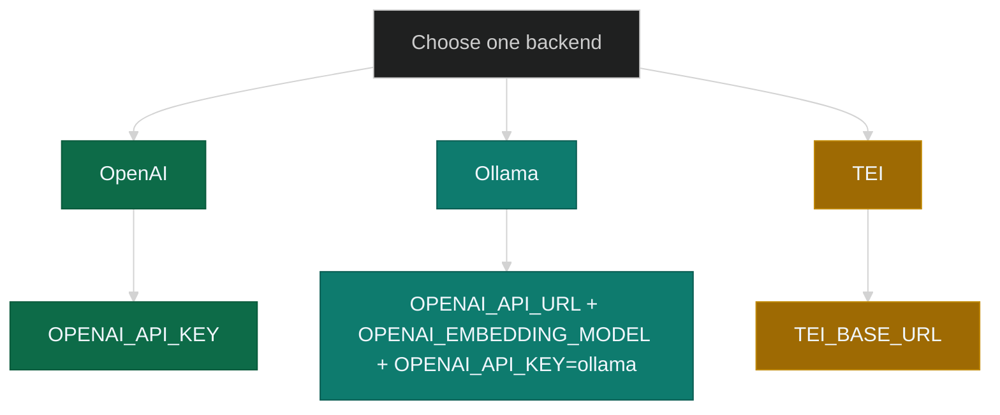

# Installation prerequisites

Use this page before you create `.env` or start the stack. First confirm the
local requirements. Then choose the embedding backend that determines which
variables you place in `.env` or Helm values.

---

## Prerequisites

### All installation paths

| Requirement | Details |
|-------------|---------|
| **Node.js 25+** + **[KAIROS CLI](../CLI.md)** | Required. Primary interface for auth, bulk management, and verification. Enables KAIROS usage without MCP. |

```sh
npm install -g @debian777/kairos-mcp
kairos --help
```

### Docker Compose path

| Requirement | Details |
|-------------|---------|
| **Docker Engine** + **Docker Compose v2** | Required for all Compose-based setups |
| Working directory with **`compose.yaml`** and writable **`.env`** | Required; a local `git clone` is optional |
| Source for **`compose.yaml`** | Use the file from the repository, a raw download, or another controlled copy |
| **Qdrant** | Started by Compose; no separate installation is required for the simple stack |
| **Identity provider** | Not part of the standard install path; manage it separately if your deployment needs one |
| **Node.js 24+** + **[KAIROS CLI](../CLI.md)** | Required; the CLI is the primary interface for install, authentication, and verification. Node 24 is the supported LTS baseline; CI runs one advisory lane on Node Current (pin in `.github/workflows/`) |
| **Python 3** | Required only for repository helper scripts or advanced operator workflows |

### Helm chart path (Kubernetes)

| Requirement | Details |
|-------------|---------|
| **Kubernetes** 1.28+ | Any conformant cluster |
| **Helm** v3.14+ | Package manager for Kubernetes |
| **kubectl** | Configured context targeting the cluster |
| **Operators** | Install per [Helm prerequisites](helm.md#operators) |
| **Gateway API CRDs** | Required when `gateway.enabled: true` |

If any requirement is missing, fix it before you continue.

---

## Embedding backend

Choose the embedding backend before you populate `.env` or configure Helm
values. The application needs a text-embedding service to convert text into
vectors for Qdrant, and each backend uses a different set of variables.

### Why an embedding model?

KAIROS stores adapter and workflow text in Qdrant as vectors. An embedding
model produces those vectors from plain text so the server can search and train
by meaning instead of exact keyword matching.

Use a **text embedding** model exposed through an OpenAI-style
`POST /v1/embeddings` interface. Do not use a chat model for this purpose. Each
embedding model has a fixed output dimension, so changing models on an existing
collection can require a vector migration.

These examples use OpenAI `text-embedding-3-small`, Ollama
`nomic-embed-text`, or a self-hosted TEI endpoint.

### Supported backends



---

### OpenAI

Use OpenAI when you want a managed cloud embedding service.

- Your key must allow `POST /v1/embeddings`
- If you use a restricted key, enable **Embeddings** and disable unrelated
  capabilities where possible


**Docker Compose `.env`:**

```ini
OPENAI_API_KEY=sk-...
# optional:
# OPENAI_EMBEDDING_MODEL=text-embedding-3-small
```

**Helm values:**

```yaml
app:
  embedding:
    openai:
      existingSecret: kairos-mcp-embedding
      secretKey: OPENAI_API_KEY
      model: text-embedding-3-small
```

If you use a local repository checkout, validate the key with
`npm run dev:test-embedding-key`.

---

### Ollama

Use Ollama when you want a local embedding service with no external API key.

```sh
ollama pull nomic-embed-text
```

- `OPENAI_API_URL` must be the base URL only, without `/v1`
- `OPENAI_EMBEDDING_MODEL` is typically `nomic-embed-text`
- `OPENAI_API_KEY` must be `ollama`

| App location | Ollama location | `OPENAI_API_URL` |
|--------------|-----------------|------------------|
| Compose on macOS or Windows | Host machine | `http://host.docker.internal:11434` |
| Compose on Linux | Host machine | Host IP or published port |
| `npm run dev:*` on the host | Same machine | `http://127.0.0.1:11434` |
| Helm (in-cluster Ollama) | Same namespace | `http://ollama:11434` |

**Docker Compose `.env`:**

```ini
OPENAI_API_URL=http://host.docker.internal:11434
OPENAI_EMBEDDING_MODEL=nomic-embed-text
OPENAI_API_KEY=ollama
```

**Helm values** (chart deploys Ollama StatefulSet):

```yaml
ollama:
  enabled: true
app:
  embedding:
    openai:
      model: nomic-embed-text
  extraEnv:
    - name: OPENAI_API_URL
      value: http://ollama:11434
    - name: OPENAI_API_KEY
      value: "ollama"
```

Switching between OpenAI and Ollama can change vector size, which may require a
Qdrant migration.

---

### TEI

Use TEI when you already operate a text-embedding inference service.

**Docker Compose `.env`:**

```ini
TEI_BASE_URL=http://your-tei:8080
# TEI_MODEL=...
```

**Helm values:**

```yaml
app:
  extraEnv:
    - name: TEI_BASE_URL
      value: http://your-tei:8080
```

---

## Next steps

After you choose the backend, continue with your deployment path:

| Path | Next page |
|------|-----------|
| Docker Compose | [Simple stack §3](docker-compose-simple.md#3-environment-file) |
| Helm chart | [Helm installation](helm.md#3-create-a-values-file) |
