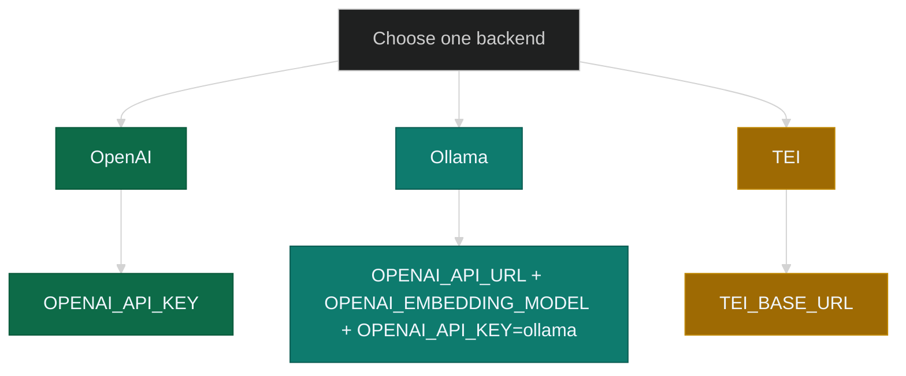
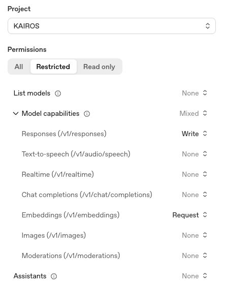

# Installation prerequisites

Use this page before you create `.env` or start the stack. First confirm the
local requirements. Then choose the embedding backend that determines which
variables you place in `.env`.

The standard installation path in this directory is
[Docker Compose — simple stack](docker-compose-simple.md). The repository also
includes [Docker Compose — full stack (advanced)](docker-compose-full-stack.md)
for operator-managed deployments, but identity-provider configuration is
outside the scope of `docs/install/`.

## Prerequisites

Confirm these requirements before you run `docker compose up`.

| Requirement | Details |
|-------------|---------|
| **Docker Engine** + **Docker Compose v2** | Required for all Compose-based setups in this directory |
| Working directory with **`compose.yaml`** and writable **`.env`** | Required; a local `git clone` is optional |
| Source for **`compose.yaml`** | Use the file from the repository, a raw download, or another controlled copy |
| **Qdrant** | Started by Compose; no separate installation is required for the simple stack |
| **Identity provider** | Not part of the standard install path; manage it separately if your deployment needs one |
| **Node.js 25+** + **[KAIROS CLI](../CLI.md)** | Required; the CLI is the primary interface for install, authentication, and verification |
| **Python 3** | Required only for repository helper scripts or advanced operator workflows |

If any requirement is missing, fix it before you continue.

## Embedding backend

Choose the embedding backend before you populate `.env`. The application needs
a text-embedding service to convert text into vectors for Qdrant, and each
backend uses a different set of variables.

### Why an embedding model?

KAIROS stores adapter and workflow text in Qdrant as vectors. An embedding
model produces those vectors from plain text so the server can search and train
by meaning instead of exact keyword matching.

Use a **text embedding** model exposed through an OpenAI-style
`POST /v1/embeddings` interface. Do not use a chat model for this purpose. Each
embedding model has a fixed output dimension, so changing models on an existing
collection can require a vector migration.

These examples use OpenAI `text-embedding-3-small`, Ollama
`nomic-embed-text`, or a self-hosted TEI endpoint.

### Supported backends

This diagram shows the supported backend options and the primary variables each
one introduces.



### OpenAI

Use OpenAI when you want a managed cloud embedding service.

- Your key must allow `POST /v1/embeddings`
- If you use a restricted key, enable **Embeddings** and disable unrelated
  capabilities where possible



Add these variables to the `.env` block in your stack guide:

```ini
OPENAI_API_KEY=sk-...
# optional:
# OPENAI_EMBEDDING_MODEL=text-embedding-3-small
```

If you use a local repository checkout, you can also validate the key with
`npm run dev:test-embedding-key`.

### Ollama

Use Ollama when you want a local embedding service.

```sh
ollama pull nomic-embed-text
```

- `OPENAI_API_URL` must be the base URL only, without `/v1`
- `OPENAI_EMBEDDING_MODEL` is typically `nomic-embed-text`
- `OPENAI_API_KEY` must be `ollama`

| App location | Ollama location | `OPENAI_API_URL` |
|--------------|-----------------|------------------|
| Compose on macOS or Windows | Host machine | `http://host.docker.internal:11434` |
| Compose on Linux | Host machine | Host IP or published port |
| `npm run dev:*` on the host | Same machine | `http://127.0.0.1:11434` |

Use the Ollama block in [simple stack §3](docker-compose-simple.md#3-environment-file).
For advanced deployments, carry the same embedding variables into your own
`.env`.

Switching between OpenAI and Ollama can change vector size, which may require a
Qdrant migration.

### TEI

Use TEI when you already operate a text-embedding inference service.

```ini
TEI_BASE_URL=http://your-tei:8080
# TEI_MODEL=...
```

## Next steps

After you choose the backend, continue with the stack guide.

1. Populate [simple stack §3](docker-compose-simple.md#3-environment-file) with
   `QDRANT_API_KEY` plus the variables for your chosen backend.
2. Start the stack and confirm `/health`.
3. Use [CLI](../CLI.md) against the running URL.
4. Add MCP only if your IDE or host requires a streamable HTTP endpoint.
