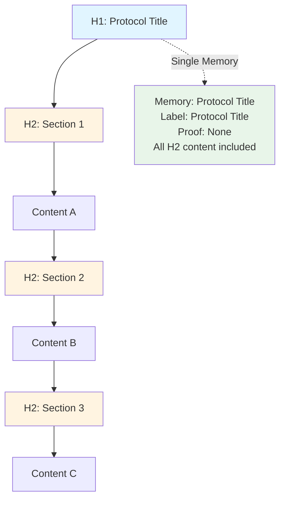
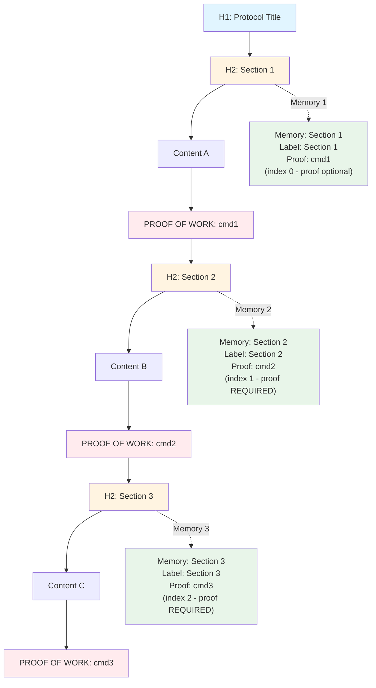
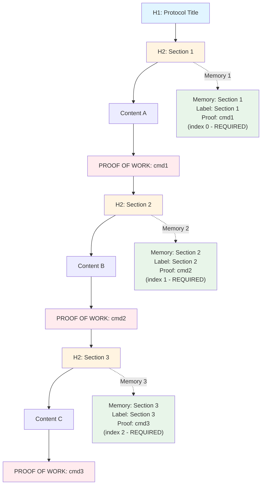
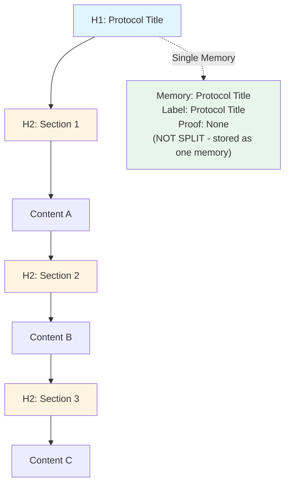
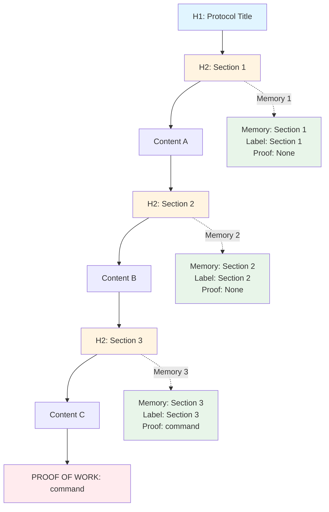
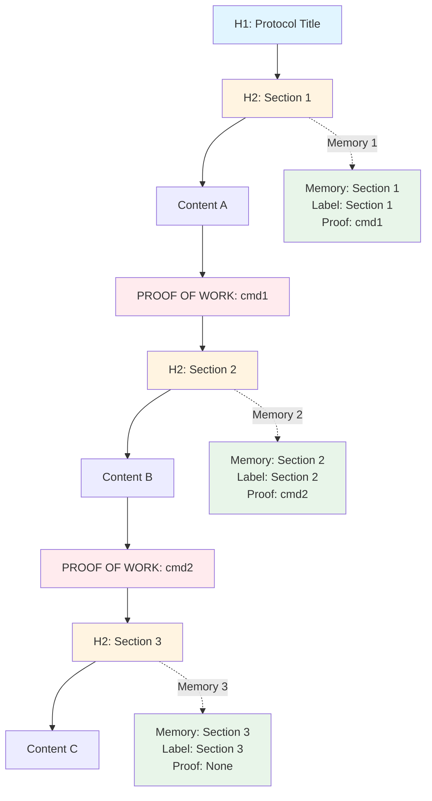
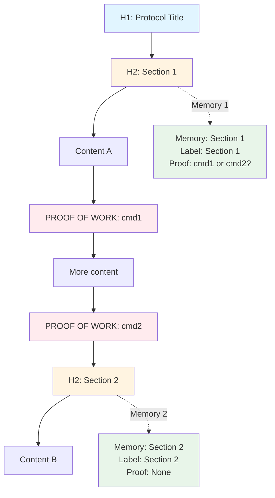
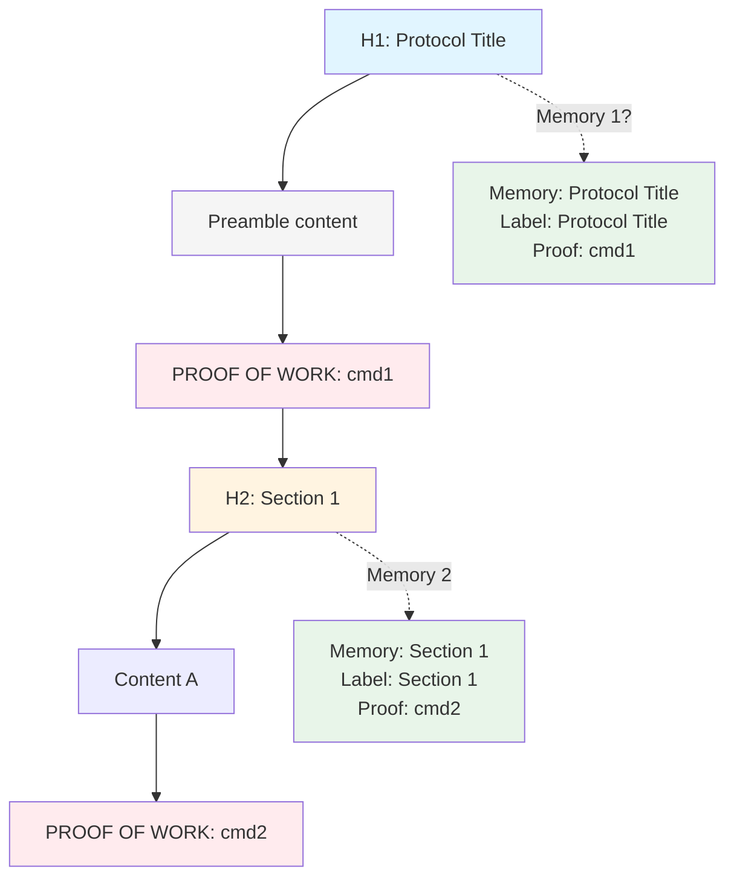
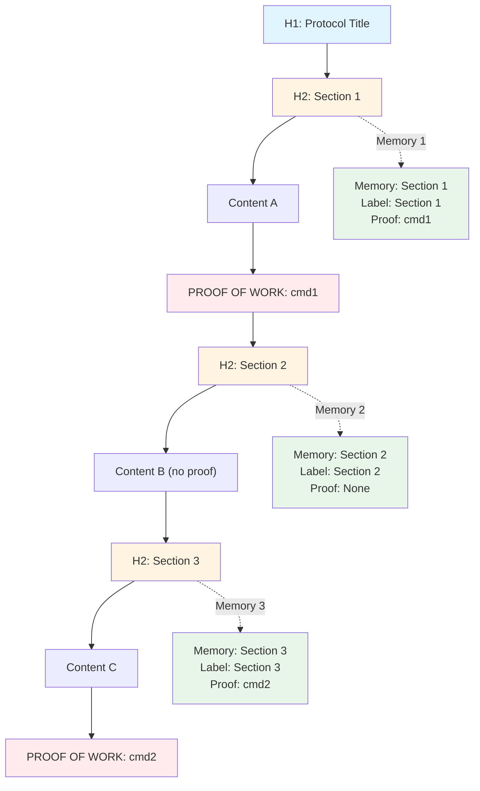

# Kairos Mint Document Slicing Scenarios

This document illustrates different scenarios for how `kairos_mint` should slice markdown documents into memory chains.

**Important**: Each H1 starts a full workflow again as a new doc/chain. H1 sections are processed as separate chains.

## Two Storage Modes

Kairos mint has **two distinct storage modes** based on whether proof-of-work is present in the document:

### Mode 1: No Proof-of-Work (Single Memory)

When a document has **NO proof-of-work lines**, it is stored as a **single memory** regardless of H2 structure.

**Current behavior**: Returns empty array (no memory created) if no proof-of-work found.

---

### Mode 2: With Proof-of-Work (Sliced by H2)

When a document has **ANY proof-of-work line**, it enters `proofMode=true`:
- Document is **sliced at each H2 header**
- Each H2 section becomes a separate memory
- **All sections except the first** (index >= 1) **MUST have proof-of-work**
- Missing proof-of-work in any section (except first) throws an error

**Key rule**: Once `proofMode=true`, ALL sections except the first must have proof-of-work or minting fails.

---

## Proposed Improvement: Option 1 (Minimum)

**Scope**: This improvement applies ONLY to `proofMode=true` (Mode 2). Mode 1 (single doc import) works perfectly and is NOT affected.

**Problem**: `kairos_next` for step N expects proof from step N-1 (the previous step), not from step N itself. When moving from Step 1 to Step 2, we need proof that Step 1 was completed, but Step 1 currently has no proof requirement.

**Solution**: Require proof-of-work for **EACH H2 section** (including the first one).

**New rule**: Once `proofMode=true`, **ALL sections** (including the first) must have proof-of-work or minting fails.

See `docs/proof-of-work-option-1-minimum.md` for detailed analysis.

---

## Example: NATURAL LANGUAGE → KAIROS TRANSLATOR

The document `kairos://mem/00000000-0000-0000-0000-000000000001` has multiple H2 sections but NO proof-of-work lines, so it's correctly stored as a **single memory** (Mode 1).

## Scenarios to Consider

### Scenario 1: Document with No Proof-of-Work

**Current Behavior**: Documents with H2 headers but NO proof-of-work are stored as a SINGLE memory (not split). Currently returns empty array if no proof-of-work found anywhere in document.

**Question**: Should documents without proof-of-work still create a single memory? Currently returns empty array.

---

### Scenario 2: Document with Proof-of-Work Only at End

**Question**: Should the proof-of-work at the end apply to the last section only, or create a new section?

---

### Scenario 3: Document with Proof-of-Work in Middle Sections

**Question**: Should proof-of-work apply to the section it appears in, or the previous section?

---

### Scenario 4: Multiple Proof-of-Work Lines in One Section

**Question**: Should multiple proof-of-work lines in one H2 section:
- Use the first one?
- Use the last one?
- Create multiple memories?

---

### Scenario 5: Proof-of-Work Before Any H2

**Question**: Should proof-of-work before any H2 create a preamble memory with H1 as label?

---

### Scenario 6: H2 Without Proof-of-Work (Mixed Document)

**Question**: Should sections without proof-of-work still create memories? Currently throws error if `proofMode=true` and `index >= 1`.

---

## Proposed Behavior Questions

1. **No proof-of-work in document**: Should we still slice by H2 and create memories without proof-of-work?

2. **Proof-of-work at end**: Should it:
   - Apply to the last H2 section?
   - Create a new section with H1 label?
   - Be ignored?

3. **Proof-of-work in middle**: Should it:
   - Apply to the section it appears in?
   - Apply to the previous section (before the proof line)?
   - Create a new section boundary?

4. **Multiple proof-of-work in one H2**: Should we:
   - Use first occurrence?
   - Use last occurrence?
   - Split into multiple memories?

5. **Proof-of-work before any H2**: Should it create a preamble memory?

6. **Mixed (some sections with proof, some without)**: Should we:
   - Require proof for all sections?
   - Make proof optional?
   - Only require proof for sections that have it?

---

## Current Implementation Behavior

### Mode 1: No Proof-of-Work
- ❌ Returns empty array if no proof-of-work found (no memory created)
- 📝 Documents with H2 but no proof-of-work would be stored as single memory if processing was allowed

### Mode 2: With Proof-of-Work (`proofMode=true`)
- ✅ Slices at each `## H2` header
- ✅ Each H2 section becomes a separate memory
- ✅ First section (index 0) does NOT require proof-of-work
- ❌ All other sections (index >= 1) MUST have proof-of-work or minting fails
- ❌ Throws error: `Missing PROOF OF WORK line in step "..."` if any section (except first) lacks proof

**Proposed Change (Option 1)**: Require proof-of-work for **ALL sections** (including first) to fix `kairos_next` behavior.

---

## Edge Cases to Clarify

1. What if proof-of-work appears between H2 sections (not inside any section)?
2. What if there are multiple H1 sections, some with proof, some without?
3. What if proof-of-work line is malformed or empty?
4. Should proof-of-work be required, optional, or conditional based on document structure?

