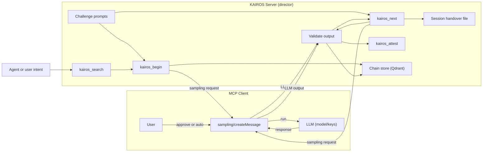

# Target architecture (goal state)

This document describes the architecture **after** kairos-mcp is extended with MCP client sampling.

## Goal

**Replace client-side challenges with server-side sampling.** Today the client (agent) must figure out how to satisfy each challenge and submit a solution. In the goal state the **server** sends a fixed prompt to the client, the client runs the LLM and returns the output, and the **server verifies on its own** (e.g. JSON shape, required fields). The server no longer depends on the agent to “guess” the right solution; it receives the LLM output and validates it before advancing. Optionally the server can also verify **output files** using [MCP client roots](https://modelcontextprotocol.io/specification/2025-11-25/client/roots) (see below).

The KAIROS server acts as a **director**: it defines exact challenge prompts, requests LLM execution through the client via sampling, and validates structured output (and optionally file outcomes) before advancing. The client keeps control of models and API keys; the server never calls an LLM directly.

---

## Roles

| Role | Responsibility |
|------|----------------|
| **KAIROS server (director)** | Stores protocol chains, issues challenges, builds sampling requests with fixed prompts, validates LLM output (e.g. JSON), advances state (begin/next/attest), optional session handover. |
| **MCP client** | Receives sampling requests from the server, runs the LLM (user approves or auto), returns the LLM response to the server. Owns model choice and API keys. |
| **User** | Approves or edits prompts when approval is required; can allow auto-sampling for trusted servers (e.g. kairos-mcp) so most steps run without attention. |

---

## High-level flow

1. User (or agent) starts a protocol run via **kairos_search** and **kairos_begin** as today.
2. For each step, the server holds a **challenge** (e.g. resolve participants, find slot, create event). Instead of the agent guessing how to satisfy it, the server:
   - Builds a **sampling request**: `sampling/createMessage(messages, temperature, top_p, approvalMode?)` with a **fixed system/user prompt** that tells the LLM exactly what to do (e.g. "Call MCP-Calendar.find_user_by_name() for each name; return JSON").
   - Sends that request to the **client** (over MCP).
3. The client runs the LLM (after user approval or automatically if policy allows), and returns the LLM output to the server.
4. The server **validates** the output (e.g. JSON shape, required fields), then treats it as the **solution** for that step and advances (e.g. returns next step via kairos_next semantics or internal state).
5. When all steps are done, the run is finalized with **kairos_attest** as today.

Optional: the server can write a **session handover file** (e.g. `kairos-session-handover.txt`) so the run can be resumed after a client restart or switch.

---

## Component diagram

- **Agent or user intent** triggers search and begin; the agent still calls kairos_begin / kairos_next with URIs and (when not using sampling for the step) solutions. In the target model, for “sampling” steps the server issues the sampling request and the client returns LLM output; the server then validates and advances. So the server may respond to kairos_begin / kairos_next with “I requested sampling; when the client returns the result, I will validate and give you the next_action.” The exact protocol (whether the agent invokes a “solve via sampling” tool or the server blocks on sampling inside begin/next) is left to the implementation plan; this diagram shows the logical flow: server builds prompt → client runs LLM → server validates → advance.
- **Challenge prompts** are the fixed system/user messages the server sends in the sampling request so the LLM does not “guess” how to solve the step.
- **Session handover file** is optional and written by the server for resumability.

---

## Data flow (sampling step)

1. **Server** has current step and challenge (e.g. “resolve_participants”). It builds:
   - `messages`: e.g. `[{ role: "system", content: "Challenge 1: Call MCP-Calendar.find_user_by_name() for each. Return JSON." }, { role: "user", content: "Resolve: Adam, Betty, Candy" }]`
   - `temperature`, `top_p`, optional `approvalMode: "auto"`.
2. **Server** sends to **client**: `sampling/createMessage(messages, temperature=0.2, top_p=0.9, approvalMode?)`.
3. **Client** shows prompt to user (or skips if auto), runs LLM, returns response (e.g. JSON string or structured content).
4. **Server** parses and validates (e.g. required keys, types). On success: use as solution, advance to next step, return next_action (and optional proof_hash) to agent. On failure: return error and retry instructions (no advance).

---

## What stays the same

- **Protocol chain model:** H1 protocol, H2 steps, stored in Qdrant; kairos_mint, kairos_update, kairos_delete unchanged.
- **Search:** kairos_search returns choices and per-choice next_action; agent picks one and calls kairos_begin with the chosen URI.
- **Attestation:** kairos_attest finalizes the run; quality updates can remain as today (e.g. in kairos_next).
- **Challenge types:** shell, mcp, user_input, comment remain valid; for steps that use sampling, the server translates the challenge into a sampling prompt and validates the LLM output instead of the agent submitting a free-form solution.

---

## What is new

- **Sampling integration:** Server can request LLM execution via client using `sampling/createMessage` with server-defined prompts.
- **Server-side validation:** Server validates LLM output (e.g. JSON) before advancing; no advance on validation failure.
- **Approval modes:** Per-step or per-request `approvalMode`: user approval vs `"auto"` when client policy allows (e.g. `allowAutoSampling: ["kairos-mcp"]`).
- **Session handover:** Optional file (e.g. `kairos-session-handover.txt`) with SESSION_ID, current_challenge, partial state for resumability across restarts or client switches.
- **Optional: verifying output files via MCP roots:** For steps that produce or change files (e.g. “create project”, “write config”), the server can use [MCP client roots](https://modelcontextprotocol.io/specification/2025-11-25/client/roots) to check outcomes. The client exposes filesystem roots via `roots/list` (`file://` URIs); the server can then read or list paths within those roots (via MCP resources or tools the client provides) to verify that expected files exist, have expected content, or match a schema. This keeps verification server-driven instead of relying on the agent to report file results.

---

## Future possibilities

- **AI verification of output on the server:** Beyond schema/structural validation, the server could use an LLM to verify sampling output (e.g. “does this response satisfy the challenge?”, semantic or quality checks). The stack already uses OpenAI and Qdrant; the same or a dedicated model could be invoked server-side for verification. This would remain optional and configurable so that simple steps keep fast, deterministic checks only.
- **Second model:** The current model may be limiting for verification or sampling-related workloads. A second model could be added later, e.g. a new OpenAI key/model or a local model such as Qwen 3.5. Exact choice (cloud vs local) is left for future implementation.

---

## Out of scope for this doc

- Implementation details (which tool or RPC triggers sampling, how kairos_begin/kairos_next responses change at the wire level).
- Migration path from current behaviour.
- Exact schema of `sampling/createMessage` (assumed to follow MCP client sampling spec; details in [02-workflow-sampling.md](02-workflow-sampling.md)).
